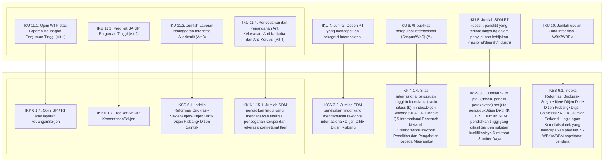
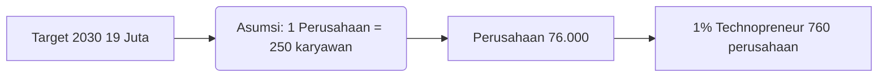
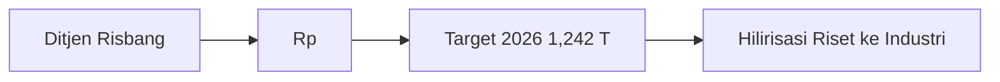
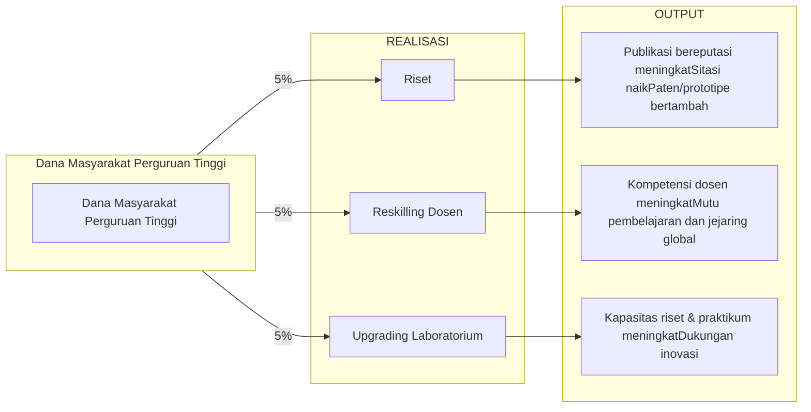

# **INDIKATOR KINERJA UTAMA**
# **PENDIDIKAN TINGGI, SAINS DAN**
# **TEKNOLOGI BERDAMPAK**

## **2026**


Jalan Jenderal sudirman,
Gedung D, Senayan,
Jakarta 10270

Email:
ult@kemdiktisaintek.go.id

Pusat Panggilan:
126


**ii**

# **DAFTAR ISI**

<table>
        <tr>
            <td><strong>BAB I</strong></td>
            <td colspan="2"><strong>Pendahuluan</strong></td>
        </tr>
        <tr>
            <td></td>
            <td>1.1. Landasan Kebijakan Nasional</td>
            <td>1</td>
        </tr>
        <tr>
            <td></td>
            <td>1.2. Visi Kemdiktisaintek</td>
            <td>1</td>
        </tr>
        <tr>
            <td></td>
            <td>1.3. Latar Belakang Iku Diktisaintek Berdampak</td>
            <td>2</td>
        </tr>
        <tr>
            <td></td>
            <td>1.4. Tujuan Iku Diktisaintek Kampus Berdampak</td>
            <td>2</td>
        </tr>
        <tr>
            <td><strong>BAB II</strong></td>
            <td colspan="2"><strong>Kerangka Strategis Pendidikan Tinggi Indonesia</strong></td>
        </tr>
        <tr>
            <td></td>
            <td>2.1. <i>Strategy Focus</i>: Implementasi Strategic Focus Organization Di Diktisaintek</td>
            <td>5</td>
        </tr>
        <tr>
            <td></td>
            <td>2.2. Peta Strategi Diktisaintek Berdampak</td>
            <td>7</td>
        </tr>
        <tr>
            <td></td>
            <td>2.3. Kerangka Strategis Kemdiktisaintek Dalam Pencapaian Talenta Unggul Dan Berdampak</td>
            <td>8</td>
        </tr>
        <tr>
            <td></td>
            <td>2.4. Kontrak Kinerja Perguruan Tinggi</td>
            <td>10</td>
        </tr>
        <tr>
            <td><strong><u>BAB III</u></strong></td>
            <td colspan="2"><strong>Kinerja dan Dampak Pendidikan Tinggi</strong></td>
        </tr>
        <tr>
            <td></td>
            <td>3.1. Kinerja Saat Ini – 2025</td>
            <td>13</td>
        </tr>
        <tr>
            <td></td>
            <td>3.2. Kinerja Universiti Malaya Dan Universiti Teknologi Malaysia</td>
            <td>16</td>
        </tr>
        <tr>
            <td></td>
            <td>3.3. <i>The Wur (Asean Top 20) Indicators</i></td>
            <td>17</td>
        </tr>
        <tr>
            <td></td>
            <td>3.4. <i>Publication The Wur (Asean Top 20) : 2020-2024</i></td>
            <td>18</td>
        </tr>
        <tr>
            <td></td>
            <td>3.5. Riset Kolaborasi</td>
            <td>19</td>
        </tr>
        <tr>
            <td></td>
            <td>3.6. Indikator <i>Input Output</i> – Diktisaintek Berdampak</td>
            <td>20</td>
        </tr>
        <tr>
            <td></td>
            <td>3.7. Keterkaitan Iku Diktisaintek Berdampak Dengan Iku Kementerian</td>
            <td>21</td>
        </tr>
        <tr>
            <td></td>
            <td>3.8. Profil Dan Dampak Pt Indonesia</td>
            <td>24</td>
        </tr>
        <tr>
            <td><strong><u>BAB IV</u></strong></td>
            <td colspan="2"><strong>Rasionalisasi Indikator Kinerja</strong></td>
        </tr>
        <tr>
            <td></td>
            <td>4.1. Mahasiswa Pascasarjana</td>
            <td>26</td>
        </tr>
        <tr>
            <td></td>
            <td>4.2. <i>Tertiary Inbound Mobility</i></td>
            <td>28</td>
        </tr>
        <tr>
            <td></td>
            <td>4.3. Proyeksi Pertumbuhan Mahasiswa Asing 2030</td>
            <td>29</td>
        </tr>
        <tr>
            <td></td>
            <td>4.4. Peningkatan Dosen Berkualifikasi Doktor</td>
            <td>30</td>
        </tr>
        <tr>
            <td></td>
            <td>4.5. Publikas</td>
            <td>32</td>
        </tr>
        <tr>
            <td></td>
            <td>4.6. Sitasi Publikasi</td>
            <td>34</td>
        </tr>
        <tr>
            <td></td>
            <td>4.7. <i>Postdoctoral Program</i></td>
            <td>34</td>
        </tr>
        <tr>
            <td></td>
            <td>4.8. <i>Qs World Universiy Ranking</i></td>
            <td>37</td>
        </tr>
        <tr>
            <td></td>
            <td>4.9. Hilirisasi Riset</td>
            <td>38</td>
        </tr>
        <tr>
            <td></td>
            <td>4.10. Dana Abadi</td>
            <td>39</td>
        </tr>
        <tr>
            <td></td>
            <td>4.11. Alokasi Pendapatan Dana Masyarakat</td>
            <td>40</td>
        </tr>
        <tr>
            <td><strong>BAB V</strong></td>
            <td colspan="2"><strong>Indikator Kinerja Utama Diktisaintek Berdampak</strong></td>
        </tr>
        <tr>
            <td></td>
            <td>5.1. Ruang Lingkup Dampak Sosial, Ekonomi, Dan Lingkungan Perguruan Tinggi</td>
            <td>42</td>
        </tr>
        <tr>
            <td></td>
            <td>5.2. Ruang Lingkup Indikator Kinerja Utama Diktisaintek Berdampak</td>
            <td>43</td>
        </tr>
        <tr>
            <td></td>
            <td>5.3. Indikator Kinerja Utama (IKU) Diktisaintek Berdampak</td>
            <td>44</td>
        </tr>
        <tr>
            <td></td>
            <td>5.4. Sub Indikator Kinerja Utama (IKU)</td>
            <td>66</td>
        </tr>
        <tr>
            <td><strong><u>BAB VI</u></strong></td>
            <td colspan="2"><strong>Indikator Kinerja Utama LLDIKTI</strong></td>
        </tr>
        <tr>
            <td></td>
            <td>6.1. Indikator Kinerja Utama (IKU) Lembaga Layanan Pendidikan Tinggi</td>
            <td>82</td>
        </tr>
        <tr>
            <td colspan="3"><strong><b>Daftar Pustaka</b></strong></td>
        </tr>
        <tr>
            <td colspan="3"><strong><b>Lampiran</b></strong></td>
        </tr>
</table>

Keputusan Menteri Pendidikan Tinggi, Sains, dan Teknologi tentang Indikator Kinerja Utama (IKU) Perguruan Tinggi dan Lembaga Layanan Pendidikan Tinggi.

Indikator Kinerja Utama (IKU) Diktisaintek Berdampak

KEMENTERIAN PENDIDIKAN TINGGI,
SAINS DAN TEKNOLOGI
REPUBLIK INDONESIA


## INDIKATOR KINERJA UTAMA (IKU) DIKTISAINTEK BERDAMPAK

# **BAB - I**
# **PENDAHULUAN**


* ▶ Landasan Kebijakan Nasional
* ▶ Visi dan Misi Kemdiktisaintek
* ▶ Latar Belakang dan Tujuan IKU Diktisaintek Berdampak


**BAB I**

## 1.1. LANDASAN KEBIJAKAN NASIONAL

Transformasi pendidikan tinggi, sains, dan teknologi dalam periode 2025–2029 berlandaskan pada kerangka regulatif nasional yang menjadi acuan seluruh kementerian dan lembaga.

Landasan utama kebijakan tersebut adalah:

**1. **Peraturan Presiden Republik Indonesia Nomor 12 Tahun 2025 tentang Rencana** Pembangunan Jangka Menengah Nasional (RPJMN) Tahun 2025–2029**
   RPJMN 2025–2029 menetapkan arah pembangunan nasional lima tahunan, termasuk prioritas penguatan sumber daya manusia unggul, peningkatan produktivitas riset dan inovasi, serta transformasi ekonomi berbasis pengetahuan. Pendidikan tinggi ditempatkan sebagai instrumen strategis dalam pencapaian daya saing global dan pertumbuhan ekonomi berkelanjutan.

**2. **Peraturan Menteri Pendidikan Tinggi, Sains, dan Teknologi Nomor 40 Tahun 2025** **tentang Rencana Strategis Kementerian Pendidikan Tinggi, Sains, dan Teknologi Tahun** 2025–2029**
   Renstra Kemdiktisaintek 2025–2029 merupakan turunan langsung dari RPJMN yang memuat visi, misi, sasaran strategis, indikator kinerja, serta arah kebijakan di bidang pendidikan tinggi, sains, dan teknologi.

Keterkaitan antara kedua regulasi tersebut bersifat hierarkis dan sistemik. RPJMN menjadi rujukan makro pembangunan nasional, sementara Renstra Kemdiktisaintek menerjemahkan target nasional ke dalam sasaran sektoral yang lebih operasional. Dalam kerangka inilah Indikator Kinerja Utama (IKU) Diktisaintek Kampus Berdampak disusun sebagai instrumen untuk memastikan keselarasan antara:

*   Arah pembangunan nasional,
*   Sasaran strategis kementerian,
*   Kinerja perguruan tinggi,
*   dan capaian pembangunan.

Dengan demikian, desain IKU bukan kebijakan yang berdiri sendiri, melainkan bagian dari sistem perencanaan nasional yang terintegrasi.

## 1.2. VISI KEMDIKTISAINTEK

Sebagaimana ditetapkan dalam Rencana Strategis Kementerian Pendidikan Tinggi, Sains, dan Teknologi Tahun 2025–2029, visi Kemdiktisaintek adalah:

> *“Pendidikan Tinggi, Sains, dan Teknologi yang inklusif, adaptif, dan berdampak dalam mewujudkan transformasi bangsa menuju Indonesia Emas 2045.”*

Visi ini menegaskan bahwa pendidikan tinggi tidak hanya berfungsi sebagai penyelenggara pendidikan formal, tetapi sebagai kekuatan transformasional yang mendorong kemajuan bangsa. Dimensi inklusif menekankan pemerataan akses dan kesempatan. Dimensi adaptif menunjukkan kemampuan merespons dinamika global dan disrupsi teknologi. Sementara dimensi berdampak menegaskan orientasi pada hasil nyata bagi masyarakat dan pembangunan nasional.

Indikator Kinerja Utama (IKU) Diktisaintek Berdampak
1


**BAB I**

## **MISI KEMDIKTISAINTEK 2025 -2029**

1.  **Untuk mewujudkan visi tersebut, ditetapkan tiga misi utama:**
2.  **Mewujudkan pemerataan akses pendidikan tinggi berkualitas;**
3.  **Mewujudkan riset, pengembangan, sains, teknologi, dan inovasi yang berdampak dan menjawab kebutuhan masyarakat;**
4.  **Mewujudkan tata kelola pendidikan tinggi, sains, dan teknologi yang berintegritas.**

Ketiga misi tersebut menjadi landasan dalam perumusan kebijakan, program strategis, dan sistem pengukuran kinerja nasional.

## **1.3. LATAR BELAKANG IKU DIKTISAINTEK BERDAMPAK**

Perguruan tinggi sebagai lembaga ilmiah memiliki peran sentral dalam pengembangan ilmu pengetahuan, teknologi, dan inovasi. Namun dalam praktiknya, pengukuran kinerja perguruan tinggi selama ini cenderung berfokus pada kuantitas output administratif, seperti jumlah kegiatan atau jumlah laporan, tanpa selalu mengukur dampak nyata yang dihasilkan.

Dalam konteks transformasi nasional, pendekatan tersebut dinilai belum memadai. Diperlukan sistem yang mampu mendorong perguruan tinggi untuk menghasilkan kontribusi yang lebih substantif.

IKU Diktisaintek Kampus Berdampak lahir sebagai respons atas kebutuhan tersebut. Konsep ini menekankan pentingnya sinergi antara:

1.  Talenta unggul,
2.  Riset dan inovasi yang relevan,
3.  Pengabdian kepada masyarakat yang berdampak,
4.  Tata kelola yang berintegritas.

Pendekatan ini menempatkan dampak sebagai orientasi utama, bukan sekadar pencapaian administratif.

## **1.4. TUJUAN IKU DIKTISAINTEK KAMPUS BERDAMPAK**

IKU Diktisaintek Kampus Berdampak bertujuan untuk:

1.  Mendorong perguruan tinggi menghasilkan kontribusi nyata dan berkelanjutan;
2.  Meningkatkan kualitas talenta serta relevansi lulusan dengan kebutuhan pembangunan;
3.  Memperkuat produktivitas dan mutu riset serta inovasi;
4.  Meningkatkan keterlibatan perguruan tinggi dalam penyelesaian masalah masyarakat dan pencapaian SDGs;
5.  **Memperkuat tata kelola yang transparan, akuntabel, dan berintegritas.**

Dengan demikian, IKU tidak hanya berfungsi sebagai alat evaluasi, tetapi sebagai instrumen transformasi sistem pendidikan tinggi nasional.

Dalam rangka memperkuat keselarasan antara arah kebijakan, sasaran strategis, dan pelaksanaan program, Kementerian Pendidikan Tinggi, Sains, dan Teknologi menerapkan pendekatan berbasis **Strategic Focus Organization (SFO)**. Pendekatan ini digunakan untuk memastikan bahwa setiap unsur di lingkungan kementerian memiliki fokus yang jelas, terintegrasi, dan berorientasi pada hasil.

SFO menempatkan strategi sebagai pusat pengelolaan organisasi. Strategi tidak berhenti pada pernyataan visi dan misi, tetapi diterjemahkan secara operasional ke dalam indikator kinerja, program kerja, serta pengalokasian anggaran. Dengan demikian, seluruh proses perencanaan dan pelaksanaan kebijakan bergerak dalam satu kerangka strategis yang sama.

Indikator Kinerja Utama (IKU) Diktisaintek Berdampak
2

**BAB I**


Melalui kerangka ini, hubungan antara misi kementerian, indikator kinerja utama (IKU), program kerja, alokasi anggaran, dan rincian tugas unit pelaksana dijalankan secara terstruktur agar mendukung pencapaian tujuan nasional di bidang pendidikan tinggi, riset, sains, dan teknologi. Setiap program yang disusun tidak berdiri sendiri, melainkan memiliki kontribusi langsung terhadap sasaran strategis yang telah ditetapkan.


Pendekatan ini sejalan dengan prinsip manajemen strategi berbasis *Balanced Scorecard,* yang memandang strategi sebagai sistem pengelolaan kinerja organisasi. *Balanced Scorecard* menekankan pentingnya menerjemahkan strategi ke dalam ukuran operasional, menyelaraskan organisasi terhadap strategi, menjadikan strategi sebagai bagian dari pekerjaan sehari-hari, mengelolanya sebagai proses berkelanjutan, serta memastikan kepemimpinan sebagai penggerak perubahan.

Dalam konteks Diktisaintek, penerapan prinsip tersebut bertujuan untuk memastikan bahwa reformasi tata kelola pendidikan tinggi tidak hanya menghasilkan peningkatan administratif, tetapi menciptakan nilai publik melalui tata kelola yang efektif, kolaboratif, dan berintegritas.

Dengan demikian, pendekatan SFO dan *Balanced Scorecard* menjadi landasan konseptual dalam penyusunan dan implementasi IKU Diktisaintek Kampus Berdampak, yang dirancang untuk mendorong kinerja perguruan tinggi agar selaras dengan agenda pembangunan nasional.

Indikator Kinerja Utama (IKU) Diktisaintek Berdampak
3


---

INDIKATOR KINERJA UTAMA (IKU)

DIKTISAINTEK BERDAMPAK

# BAB - II
## **KERANGKA STRATEGIS**
## **PENDIDIKAN TINGGI**
## **INDONESIA**


* Strategy Focus
* Peta Strategi Diktisaintek Berdampak
* Kerangka Strategis Kemdiktisaintek
* Kontrak Kinerja Perguruan Tinggi


**BAB II**

# 2.1. ***STRATEGY FOCUS*: IMPLEMENTASI *STRATEGIC FOCUS ORGANIZATION* DI DIKTISAINTEK**

Pendekatan *Strategic Focus Organization* (SFO) di lingkungan Kementerian Pendidikan Tinggi, Sains, dan Teknologi diimplementasikan melalui lima tahapan utama yang saling terintegrasi. Tahapan ini memastikan bahwa strategi tidak berhenti pada perencanaan, tetapi dijalankan secara operasional dan berkelanjutan.

### ***STRATEGY FOCUS***


### Strategy Focus Organization Process

| Step | Title | Implemented Actions (✔) | Pending Actions (✘) | Rencana Pelaksanaan |
| :--- | :--- | :--- | :--- | :--- |
| 1 | Translate strategy into operating terms | Penjabaran visi dan misi Presiden ke dalam visi misi Kementerian, IKU Kementerian, dan IKU unit pelaksana. Integrasi perencanaan kinerja dan anggaran. | 1. IKU Kampus Berdampak<br>2. Kontrak kinerja Kampus<br>3. Kontrak kinerja unit pelaksana | 1. Nov 2025 - April 2026<br>2. April 2026<br>3. Februari 2026 |
| 2 | Align organization with strategy | Struktur organisasi dan tata laksana. | 1. Pengkinian Rincian Tugas Ditjen, Sekjen, Irjen, & Pusat | 1. Minggu II - Nov 2025 |
| 3 | Make strategy everyone's job | Penguatan kapasitas SDM Kementerian. Internalisasi nilai ASN BerAKHLAK (Surat Edaran Menteri PANRB Nomor 20 Tahun 2021) | 1. Indikator Kinerja Individu - Level Eselon I & II<br>2. Indikator Kinerja Individu - Level Eselon III & IV<br>3. Indikator Kinerja Individu - Fungsional & Pelaksana<br>4. Penghargaan dan insentif berbasis 3P (Person, Position, & Performance) | 1. November 2025<br>2. Desember 2025<br>3. Januari 2026<br>4. 2026 |
| 4 | Make formulating strategy a continual process | Evaluasi pelaksanaan program dan anggaran secara berkala. | 1. Review Program Kerja & Anggaran 2025<br>2. Pengembangan dashboard kinerja berbasis data | 1. Minggu IV - Nov 2025<br>2. 2026 |
| 5 | Mobilize change through executive leadership | Komunikasi visi strategis melalui rapat koordinasi, forum pimpinan, dan dashboard kinerja strategis. | 1. Pembentukan Komite Anggaran (Menteri, Wamen, Sekjen, Dirjen, SKM & TAM). | 1. Minggu IV - Nov 2025 |

**Keterangan:**
*   ✔ Program/kebijakan yang sudah dilaksanakan.
*   ✘ Program/kebijakan yang belum dilaksanakan.

Pendekatan *Strategy Focus Organization* (SFO) diterapkan untuk memastikan bahwa strategi kementerian tidak hanya bersifat normatif, tetapi benar-benar terimplementasi secara sistematis dalam seluruh proses organisasi. Kerangka ini menekankan lima prinsip utama yang menjadi fondasi dalam penguatan IKU Kampus Berdampak.

Dalam implementasinya, terdapat sejumlah aspek yang telah dilaksanakan serta beberapa komponen yang masih memerlukan penyempurnaan.

### 1. **Menerjemahkan Strategi ke dalam Operasional** *(Translate Strategy into Operating Terms)*

Pada tahap ini, kementerian telah melakukan penjabaran visi dan misi ke dalam IKU kementerian dan IKU unit pelaksana. Integrasi antara perencanaan dan penganggaran juga telah dilakukan sehingga setiap program memiliki keterkaitan langsung dengan sasaran strategis. Namun demikian, penguatan masih diperlukan pada aspek kontrak kinerja kampus dan unit pelaksana. Standarisasi dan konsistensi kontrak kinerja belum sepenuhnya terintegrasi secara menyeluruh. Oleh karena itu, penyempurnaan mekanisme ini menjadi agenda lanjutan agar keterhubungan antara strategi dan implementasi semakin kuat.

### 2. **Menyelaraskan Organisasi dengan Strategi** *(Align Organization with Strategy)*

Penyesuaian struktur organisasi dan tata laksana telah dilaksanakan untuk mendukung arah strategis kementerian. Struktur yang ada saat ini telah mengakomodasi kebutuhan pencapaian IKU.

**Indikator Kinerja Utama (IKU) Diktisaintek Berdampak**
5


**BAB II**

secara lebih terarah. Akan tetapi, proses cascading tujuan dan indikator hingga level pimpinan tinggi dan unit pusat masih memerlukan pendalaman. Pengisian rincian tujuan pada level Sekretaris Jenderal, Direktur Jenderal, serta unit-unit teknis belum sepenuhnya optimal. Penguatan pada aspek ini penting agar seluruh jenjang organisasi memiliki kontribusi yang terukur dan selaras.

## **3. Menjadikan Strategi sebagai Tanggung Jawab Setiap Individu** *(Make Strategy Everyone’s Job)*

Upaya penguatan kapasitas SDM telah dilakukan melalui internalisasi nilai-nilai ASN BerAKHLAK serta berbagai program peningkatan kompetensi. Langkah ini menunjukkan komitmen dalam membangun budaya organisasi yang mendukung strategi.

Namun, sistem pengukuran kinerja individu berbasis pendekatan 3P (*Person, Position, Performance*) masih dalam tahap pengembangan. Indikator kinerja individu yang terintegrasi dengan IKU organisasi belum sepenuhnya terimplementasi secara komprehensif. Penyempurnaan sistem ini menjadi krusial agar setiap pegawai memahami kontribusi strategisnya secara konkret.

## **4. Menjadikan Strategi sebagai Proses Berkelanjutan** *(Make Strategy a Continual Process)*

Evaluasi pelaksanaan program dan anggaran telah dilakukan secara berkala sebagai bentuk pengendalian kinerja. Mekanisme monitoring ini menunjukkan bahwa strategi telah diposisikan sebagai proses yang dinamis dan adaptif.

Meski demikian, review program kerja dan anggaran secara lebih komprehensif masih perlu diperkuat, termasuk pengembangan dashboard kinerja berbasis data. Sistem pemantauan digital yang terintegrasi belum sepenuhnya optimal. Penguatan pada aspek ini diharapkan mampu meningkatkan akurasi pengambilan keputusan dan transparansi kinerja.

## **5. Menggerakkan Perubahan melalui Kepemimpinan Eksekutif** *(Mobilize Change through Executive Leadership)*

Komunikasi visi strategis telah dilaksanakan melalui rapat koordinasi, forum pimpinan, serta pemanfaatan media dashboard kinerja. Kepemimpinan telah memainkan peran penting dalam mengarahkan perubahan dan memastikan konsistensi implementasi strategi.

Namun, pembentukan komite anggaran lintas pimpinan sebagai instrumen penguatan tata kelola belum sepenuhnya terealisasi. Kelembagaan yang lebih terstruktur diperlukan untuk memastikan integrasi yang lebih kuat antara perencanaan strategis dan kebijakan anggaran.

Secara umum, implementasi *Strategy Focus Organization* menunjukkan bahwa fondasi manajemen strategis telah terbentuk dengan cukup kuat. Aspek konseptual, struktur organisasi, serta mekanisme evaluasi dasar telah berjalan.

Fase penguatan saat ini berfokus pada penyempurnaan integrasi vertikal (cascading kinerja), digitalisasi sistem pemantauan, serta konsolidasi tata kelola anggaran. Dengan penyempurnaan tersebut, IKU Kampus Berdampak diharapkan tidak hanya berfungsi sebagai alat evaluasi, tetapi menjadi instrumen manajemen strategis yang mendorong efektivitas, akuntabilitas, dan penciptaan nilai publik secara berkelanjutan.

**Indikator Kinerja Utama (IKU) Diktisaintek Berdampak**
6


BAB II

## 2.2. PETA STRATEGI DIKTISAINTEK BERDAMPAK

<table>
  <thead>
    <tr>
      <th colspan="2">VISI</th>
      <th colspan="5">Pendidikan Tinggi, Sains, dan Teknologi yang Inklusif, Adaptif, dan Berdampak dalam Mewujudkan Transformasi Bangsa Mewujudkan Indonesia Emas 2045</th>
    </tr>
    <tr>
      <th rowspan="2" colspan="2">MISI</th>
      <th>Talenta</th>
      <th>Penelitian</th>
      <th colspan="2">Masyarakat</th>
      <th>Tata Kelola</th>
    </tr>
    <tr>
      <td>Mengembangkan SDM Unggul masa depan yang berkontribusi dalam pembangunan nasional</td>
      <td>Mengembangkan riset pendidikan tinggi yang berdampak bagi pembangunan nasional</td>
      <td colspan="2">Mewujudkan masyarakat yang maju dan berkelanjutan dalam pembangunan nasional</td>
      <td>Mewujudkan tata kelola pendidikan tinggi, sains, dan teknologi yang berintegritas dalam pembangunan nasional</td>
    </tr>
    <tr>
      <th colspan="4">Tujuan Kementerian &#x26; Peta Strategi</th>
      <th>Ukuran</th>
      <th>Target</th>
      <th>Pengampu</th>
    </tr>
  </thead>
  <tbody>
    <tr>
      <td rowspan="3"><b>Pemangku Kepentingan</b></td>
      <td rowspan="3" colspan="3">SS.3. Meningkatnya talenta berkualitas di bidang sains dan teknologi.<br /><br />SS.6. Meningkatnya kontribusi perguruan tinggi dalam mendukung tujuan pembangunan berkelanjutan.</td>
      <td>IKSS 3.1. Jumlah SDM Iptek (dosen, peneliti, perekayasa) per juta penduduk</td>
      <td>1.371 (2029)</td>
      <td>Direktorat Jenderal Pendidikan Tinggi</td>
    </tr>
    <tr>
      <td>IKSS 3.2. Jumlah SDM pendidikan tinggi yang mendapatkan rekognisi</td>
      <td>116 orang (2029)</td>
      <td>Direktorat Jenderal Riset dan Pengembangan; Direktorat Jenderal</td>
    </tr>
    <tr>
      <td>IKSS 6.1. Jumlah perguruan tinggi yang masuk ke dalam peringkat THE Impact SDGs Ranking<br />(a) Top 300<br />(b) Top 600<br />(c) Top 1000</td>
      <td>13 PT (2029)</td>
      <td>Direktorat Jenderal Pendidikan Tinggi; Direktorat Jenderal Sains dan Teknologi</td>
    </tr>
    <tr>
      <td rowspan="4"><b>Proses Internal</b></td>
      <td rowspan="4" colspan="3">SS.1. Meningkatnya partisipasi pendidikan tinggi berkualitas.<br /><br />SS.2. Meningkatnya mutu dan relevansi pendidikan tinggi.<br /><br />SS.5. Meningkatnya kualitas kebijakan nasional bidang pendidikan tinggi, sains dan teknologi yang berbasis riset.<br /><br />SS.7. Meningkatnya tata kelola Kementerian yang partisipatif, transparan, dan akuntabel</td>
      <td>IKSS.1.1. Angka Partisipasi Kasar Pendidikan Tinggi (APK PT)</td>
      <td>38,04% (2029)</td>
      <td>Sekretariat Jenderal; Direktorat Jenderal Pendidikan Tinggi</td>
    </tr>
    <tr>
      <td>IKSS.2.1. % lulusan pendidikan tinggi yang langsung bekerja/melanjutkan jenjang pendidikan berikutnya dalam jangka waktu 1 tahun setelah kelulusan<br />(a) total;<br />(b) karyawan atau wirausaha</td>
      <td>(a) 65.37% (2029)<br />(b) 86.31% (2029)</td>
      <td>Direktorat Jenderal Pendidikan Tinggi; Direktorat Jenderal Sains dan Teknologi</td>
    </tr>
    <tr>
      <td>IKSS.2.2. % lulusan pendidikan tinggi vokasi yang bekerja di bidang sesuai pendidikan dalam jangka waktu 1 tahun setelah kelulusan</td>
      <td>(a) 75,5% (2029)<br />(b) 5,5% (2029)</td>
      <td>Direktorat Jenderal Pendidikan Tinggi; Direktorat Jenderal Sains dan Teknologi</td>
    </tr>
    <tr>
      <td>IKSS.5.1. Jumlah perumusan kebijakan nasional bidang pendidikan tinggi, sains, dan teknologi yang berbasis riset (%)</td>
      <td>100% (2029)</td>
      <td>Direktorat Jenderal Pendidikan Tinggi; Direktorat Jenderal Riset dan Pengembangan; Direktorat Jenderal Sains dan Teknologi</td>
    </tr>
    <tr>
      <td></td>
      <td colspan="3"></td>
      <td>IKSS.7.1. Indeks Reformasi Birokrasi</td>
      <td>90,1 (2029)</td>
      <td>Sekretariat Jenderal; Inspektorat Jenderal</td>
    </tr>
    <tr>
      <td rowspan="4"><b>Pembelajaran &#x26; Pertumbuhan</b></td>
      <td colspan="3"><b>Keuangan</b></td>
      <td rowspan="2">IKSS.4.1. Jumlah institusi pengguna terkait fungsi intermediasi dan layanan pemanfaatan iptek dan inovasi di perguruan tinggi.</td>
      <td rowspan="2">166 institusi (2029)</td>
      <td rowspan="2">Direktorat Jenderal Riset dan Pengembangan; Direktorat Jenderal Sains dan Teknologi</td>
    </tr>
    <tr>
      <td colspan="3">SS.4. Meningkatnya produktivitas kelembagaan iptek dan inovasi</td>
    </tr>
    <tr>
      <td colspan="3"></td>
      <td>K.1. % pendapatan non SPP</td>
      <td>> 60% (2029)</td>
      <td>Direktorat Jenderal Pendidikan Tinggi</td>
    </tr>
    <tr>
      <td colspan="3"></td>
      <td>K.2. Rasio dana abadi terhadap total aset perguruan tinggi.</td>
      <td>10% (2029)</td>
      <td>Direktorat Jenderal Pendidikan Tinggi</td>
    </tr>
    <tr>
      <td></td>
      <td colspan="3"></td>
      <td>K.3. Efektivitas Serapan Anggaran</td>
      <td>95% (2029)</td>
      <td>Sekretariat Jenderal</td>
    </tr>
  </tbody>
</table>

Indikator Kinerja Utama (IKU) Diktisaintek Berdampak
7

 
**BAB II**

## 2.3. KERANGKA STRATEGIS KEMDIKTISAINTEK DALAM PENCAPAIAN TALENTA UNGGUL DAN BERDAMPAK

Kerangka strategis Kemdiktisaintek disusun untuk memastikan bahwa seluruh kebijakan, program, dan sumber daya diarahkan pada satu tujuan utama, yaitu terwujudnya **Talenta Unggul dan Berdampak**. Kerangka ini menggambarkan hubungan hierarkis antara tujuan strategis, kinerja perguruan tinggi, tata kelola, serta dukungan anggaran dan kebijakan sebagai faktor pengungkit (*enabler*).


# TALENTA UNGGUL DAN BERDAMPAK

## KINERJA PERGURUAN TINGGI

*   **1 TALENTA**
*   **2a INOVASI**
*   **2b KONTRIBUSI**
*   **3 TATA KELOLA BERINTEGRITAS**

*(Central Diagram: DIKTISAINTEK BERDAMPAK connected to Talenta, Inovasi, and Kontribusi via "3. TATA KELOLA BERINTEGRITAS" arrows)*

## TATA KELOLA DAN KEBERLANJUTAN PERGURUAN TINGGI

*    **AKUNTABILITAS**
*    **INTEGRITAS**
*    **KEBERLANJUTAN**

## ENABLER

### ANGGARAN KEMDIKTISAINTEK
*    Bantuan Operasional PT
*   Dana Riset
*   Gaji ASN
*   Dana Sarana & Prasarana PTN
*   Tunjangan Guru Besar di PTS

### DUKUNGAN KEBIJAKAN
*    Kebijakan Regulatif (Permendiktisaintek/Kepmen/PerDirjen)
*   Kebijakan Insentif Berbasis Kinerja (Contoh: Insentif Akreditasi Unggul)
*   Kebijakan Tata Kelola & Otonomi

Kerangka strategis Kemdiktisaintek disusun untuk memastikan bahwa seluruh kebijakan, program, dan sumber daya diarahkan pada satu tujuan utama, yaitu terwujudnya **Talenta Unggul dan Berdampak**. Kerangka ini menggambarkan hubungan hierarkis antara tujuan strategis, kinerja perguruan tinggi, tata kelola, serta dukungan anggaran dan kebijakan sebagai faktor pengungkit (*enabler*).

### 1. Enabler: Fondasi Penggerak Sistem

Alur dimulai dari bagian paling dasar, yaitu dukungan anggaran dan kebijakan sebagai faktor pengungkit.

Pertama, anggaran Kemdiktisaintek menyediakan sumber daya finansial untuk mendukung operasional perguruan tinggi, pendanaan riset, pengembangan sarana-prasarana, serta kesejahteraan dosen dan tenaga kependidikan.

Kedua, dukungan kebijakan memberikan kerangka regulatif dan insentif yang mendorong transformasi, termasuk kebijakan berbasis kinerja, penguatan tata kelola, dan otonomi perguruan tinggi.

Tanpa dua komponen ini, strategi tidak dapat berjalan secara efektif karena tidak memiliki sumber daya dan legitimasi regulatif.

### 2. Tata Kelola dan Keberlanjutan: Mekanisme Pengendali

Dukungan anggaran dan kebijakan kemudian diterjemahkan ke dalam sistem tata kelola perguruan tinggi yang berlandaskan:
1) Akuntabilitas
2) Integritas
3) Keberlanjutan

Tahap ini berfungsi sebagai mekanisme pengendali agar penggunaan anggaran dan implementasi kebijakan berjalan transparan, terukur, serta konsisten.

8

 

**BAB II**

dalam jangka panjang. Tata kelola memastikan bahwa sumber daya yang diberikan benar-benar menghasilkan kinerja yang diharapkan.

### 3. **Kinerja Perguruan Tinggi: Mesin Utama Transformasi**

Dengan tata kelola yang kuat, perguruan tinggi dapat mengoptimalkan kinerjanya melalui tiga pilar utama:

1.  **Talenta** – peningkatan kualitas lulusan, dosen, dan tenaga kependidikan.
2.  **Inovasi (2a)** – penguatan riset dan pengembangan teknologi yang relevan dan aplikatif.
3.  **Kontribusi (2b)** – dampak nyata perguruan tinggi bagi masyarakat, industri, dan pembangunan nasional.

Ketiga pilar ini saling berinteraksi. Talenta yang unggul mendorong inovasi, inovasi menghasilkan kontribusi, dan kontribusi memperkuat relevansi pendidikan tinggi.

### 4. **Output Strategis: Talenta Unggul dan Berdampak**

Seluruh proses tersebut bermuara pada pencapaian Talenta Unggul dan Berdampak sebagai tujuan strategis nasional.

Talenta yang dihasilkan tidak hanya kompeten secara akademik, tetapi juga memiliki daya saing global, kemampuan adaptif, serta kontribusi nyata terhadap kemajuan sosial dan ekonomi. Dengan demikian, hasil akhir dari kerangka ini bukan sekadar capaian indikator administratif, melainkan penciptaan nilai publik yang berkelanjutan.


Kerangka Strategis Kemdiktisaintek menunjukkan bahwa pencapaian Talenta Unggul dan Berdampak bukanlah hasil dari satu program tunggal, melainkan keluaran dari sistem yang terintegrasi secara menyeluruh. Proses tersebut dimulai dari dukungan kebijakan dan anggaran sebagai *enabler*, yang kemudian dikelola melalui tata kelola yang akuntabel, berintegritas, dan berkelanjutan.

Kerangka Strategis Kemdiktisaintek menunjukkan bahwa pencapaian Talenta Unggul dan Berdampak bukanlah hasil dari satu program tunggal, melainkan keluaran dari sistem yang terintegrasi secara menyeluruh. Proses tersebut dimulai dari dukungan kebijakan dan anggaran sebagai *enabler*, yang kemudian dikelola melalui tata kelola yang akuntabel, berintegritas, dan berkelanjutan.

Fondasi tersebut memungkinkan perguruan tinggi mengoptimalkan kinerjanya melalui penguatan talenta, inovasi, dan kontribusi. Ketiga pilar ini saling memperkuat dan menjadi mesin utama transformasi pendidikan tinggi.

Dengan demikian, kerangka ini menegaskan bahwa keberhasilan menghasilkan talenta unggul sangat ditentukan oleh konsistensi integrasi antara perencanaan, pendanaan, tata kelola, dan implementasi kinerja. Pendekatan sistemik ini memastikan bahwa capaian tidak bersifat administratif semata, melainkan menghasilkan dampak nyata bagi pembangunan nasional dan peningkatan daya saing bangsa.

**Indikator Kinerja Utama (IKU) Diktisaintek Berdampak** 9


BAB II

# 2.4. KONTRAK KINERJA PERGURUAN TINGGI


### ARAH NASIONAL
 **RPJMN** |  **Target Daya Saing Global** |  **SDGs** |  **Human Capital Index**

---

### KEMDIKTISAINTEK


**Performance Based-Budgeting (Money Follows Program)**


---

### PERGURUAN TINGGI & LLDIKTI

 **Akuntabilitas atas Dampak**
**Dana APBN yang diterima PT**

*    **PTN-BH**: Kontrak kinerja bersifat **strategis**, fokus pada **dampak**.
*    **PTN-BLU**: Kontrak kinerja bersifat **wajib tetapi adaptif**.
*    **PTN-SATKER**: Kontrak kinerja bersifat wajib dan hierarkis.
*    **PTS**: Kontrak kinerja bersifat **bersyarat** untuk **akuntabilitas dana negara**, serta sebagai **instrumen peningkatan mutu dan inklusi**.
*    **LLDIKTI**: Kontrak kinerja bersifat **wajib** yang menghubungkan **kebijakan Kemdiktisaintek** dengan **capaian PTS**, serta sebagai **instrumen pengendalian sistem (*system steward*)**.

### Menetapkan Arah dan Dampak Nasional

*   PP No. 17/2017 tentang Sinkronisasi Proses Perencanaan dan Penganggaran Pembangunan Nasional
*   Permen PPN/Kepala Bappenas No. 5 Tahun 2023 tentang penyusunan RPJMN 2025-2029.
*   Permen PPN/Kepala Bappenas No. 3 Tahun 2025 tentang RKP tahunan
*   PermenPANRB No. 88 Tahun 2021 tentang Evaluasi SAKIP
*   PermenPANRB No. 22 Tahun 2024 tentang Penilaian Kinerja Organisasi

---

### ANGGARAN KEMDIKTISAINTEK


*   Bantuan Operasional PT
*   Dana Sarana & Prasarana PTN
*   Dana Riset
*   Tunjangan Guru Besar di PTS
*   Gaji ASN

---

### DUKUNGAN KEBIJAKAN


*   Kebijakan Regulatif (Permendiktisaintek/Kepmen/PerDirjen)
*   Kebijakan Insentif Berbasis Kinerja (Contoh: Insentif Akreditasi Unggul)
*   Kebijakan Tata Kelola & Otonomi

---

### Ilustrasi:

| Kategori                                            | Entitas                                  | Nilai 1               | Nilai 2                 |
| :-------------------------------------------------- | :--------------------------------------- | :-------------------- | :---------------------- |
|  Pagu Dana Equity WCU | 7 PTN-BH                                 | 70 Miliar Per Tahun   | 1,4 Triliun Per Tahun   |
|                                                     | 16 PTN-BH                                | 12,5 Miliar Per Tahun | 263,15 Miliar Per Tahun |
|  Dana APBN                  | Program Pembinaan PTS                    | 536,19 Juta Per Tahun | 11,29 Miliar Per Tahun  |
|                                                     | Fasilitasi Pembinaan Kelembagaan LLDIKTI | 5,8 Miliar Per Tahun  | 122,10 Miliar Per Tahun |

**Asumsi:**
*   Tarif BI Rate 4,75%

Indikator Kinerja Utama (IKU) Diktisaintek Berdampak
10


**BAB II**

# **Kontrak kinerja Mengapa Kontrak Kinerja Perguruan Tinggi?**

Perguruan tinggi disusun sebagai instrumen penghubung antara arah pembangunan nasional, kebijakan kementerian, dan implementasi kinerja di tingkat perguruan tinggi. Keberadaannya tidak berdiri sendiri, melainkan menjadi bagian dari sistem manajemen kinerja yang terintegrasi.

## **1. Berangkat dari Arah Nasional**

Kontrak kinerja berakar pada arah pembangunan nasional yang tertuang dalam RPJMN, target daya saing global, pencapaian SDGs, serta peningkatan Human Capital Index. Dokumen-dokumen tersebut menetapkan target makro pembangunan yang harus diterjemahkan ke dalam program sektoral, termasuk sektor pendidikan tinggi.

Artinya, perguruan tinggi tidak bekerja dalam ruang terpisah, tetapi menjadi bagian dari strategi besar pembangunan nasional. Kontrak kinerja menjadi alat untuk memastikan kontribusi konkret perguruan tinggi terhadap agenda tersebut.

## **2. Diterjemahkan dalam Kebijakan Kemdiktisaintek**

Pada tingkat kementerian, arah nasional tersebut dikonversi menjadi kebijakan, program, serta indikator kinerja. Kontrak kinerja disusun berbasis *outcome*, sehingga tidak hanya mengukur aktivitas, tetapi hasil dan dampak yang dihasilkan.

Dalam kerangka ini diterapkan prinsip *performance-based budgeting*, yaitu pendekatan penganggaran yang menautkan alokasi dana dengan capaian kinerja (*money follows program*). Dengan demikian, anggaran tidak semata didistribusikan berdasarkan rutinitas, tetapi berdasarkan target strategis yang harus dicapai.

## **3. Menghubungkan Anggaran dan Akuntabilitas**

Kontrak kinerja juga menjadi mekanisme pengendali penggunaan anggaran Kemdiktisaintek, yang meliputi bantuan operasional perguruan tinggi, dana riset, dana sarana dan prasarana, serta berbagai bentuk dukungan lainnya.

Karena sumber pembiayaan berasal dari APBN, maka diperlukan sistem yang menjamin akuntabilitas. Kontrak kinerja memastikan bahwa dana yang diterima perguruan tinggi memiliki target yang jelas, terukur, dan dapat dievaluasi.

Dengan demikian, hubungan antara anggaran dan kinerja menjadi eksplisit dan transparan.

## **4. Implementasi di Tingkat Perguruan Tinggi dan LLDIKTI**

Di tingkat implementasi, kontrak kinerja memiliki karakteristik yang berbeda sesuai peran institusi:
4) Bagi PTN-BH dan PTN-BLU, kontrak kinerja bersifat strategis dengan fokus pada dampak.
5) Bagi PTN-Satker, kontrak kinerja bersifat wajib dan hierarkis.
6) Bagi PTS, kontrak kinerja menjadi instrumen akuntabilitas atas dana bantuan yang diterima.
7) Bagi LLDIKTI, kontrak kinerja menjadi alat pengendalian sistem dan pembinaan perguruan tinggi.

Perbedaan karakteristik ini menunjukkan bahwa kontrak kinerja dirancang adaptif, tetapi tetap berada dalam kerangka sistem pengendalian yang terintegrasi.

## **5. Fungsi Strategis Kontrak Kinerja**

Secara substantif, kontrak kinerja memiliki tiga fungsi utama:
8) Instrumen penyelarasan antara arah nasional dan kinerja institusi.
9) Instrumen akuntabilitas atas penggunaan dana negara.
10) Instrumen peningkatan mutu dan penguatan sistem tata kelola.

Dengan kata lain, kontrak kinerja bukan sekadar kewajiban administratif, tetapi mekanisme strategis untuk memastikan bahwa kebijakan, anggaran, dan implementasi bergerak dalam satu arah yang sama.

**Indikator Kinerja Utama (IKU) Diktisaintek Berdampak** **11**


INDIKATOR KINERJA UTAMA (IKU) DIKTISAINTEK BERDAMPAK

# **BAB - III**
# **KINERJA DAN DAMPAK PENDIDIKAN TINGGI**


* Kinerja Saat ini - 2025
* Kinerja UM dan UTM (Perbandingan Regional)
* THE WUR (ASEAN TOP 20) Indicators
* Publication THE WUR 2020–2024
* Riset Kolaborasi
* Indikator Input Output – Diktisaintek Berdampak
* Keterkaitan Iku Diktisaintek Berdampak Dengan Iku Kementerian
* Profil dan Dampak PT Indonesia
* Ruang Lingkup Dampak Sosial, Ekonomi, Dan Lingkungan Perguruan Tinggi
* Ruang Lingkup Indikator Kinerja Utama Diktisaintek Berdampak


**BAB III**

# **3.1. KINERJA SAAT INI – 2025**

## **Kinerja Saat Ini – 2025 (1/2)**

Gambaran kinerja tahun 2025 menunjukkan dinamika pada tiga aspek utama, yaitu mahasiswa, lulusan, dan riset. Data ini memberikan potret capaian sekaligus tantangan yang dihadapi dalam upaya menghasilkan talenta unggul dan berdampak.

### **Aspek Mahasiswa**

Dalam dua tahun terakhir (2024–2025), terjadi penurunan total jumlah mahasiswa sebesar 23,67 persen. Penurunan ini terutama terjadi pada jenjang *undergraduate* yang mengalami penurunan sebesar 26,36 persen.

Sebaliknya, jumlah mahasiswa pada jenjang *post graduate* justru meningkat signifikan sebesar 30,89 persen.

Tren ini menunjukkan pergeseran komposisi ke jenjang pascasarjana sebagai indikasi penguatan pendidikan lanjut, namun penurunan pada jenjang sarjana tetap perlu menjadi perhatian karena berpotensi memengaruhi basis talenta nasional dalam jangka panjang.

# MAHASISWA

2 TAHUN

*    **-23,67%** Penurunan total mahasiswa dari 2024-2025
*    **-26,36%** Penurunan jumlah mahasiswa *undergraduated* dari tahun 2024-2025
*    **30,89%** Peningkatan jumlah mahasiswa *post graduated* dari tahun 2024-2025

Sumber: Statistik PDDikti, 2024-2025

### **Aspek Lulusan**

Pada periode yang sama, total lulusan mengalami peningkatan sebesar 11,02 persen. Peningkatan ini terutama didorong oleh lonjakan lulusan *post graduate* yang meningkat hingga 2,8 kali lipat dibanding tahun sebelumnya.

Tren ini menegaskan konsentrasi pertumbuhan pada jenjang pascasarjana yang berpotensi memperkuat kualitas SDM berbasis riset dan inovasi, namun keseimbangan antarjenjang tetap perlu dijaga.

# 2 TAHUN LULUSAN

|                                           |            |                                                                |
| :---------------------------------------- | :--------- | :------------------------------------------------------------- |
|              | **11,02%** | Peningkatan total lulusan dari 2024-2025                       |
|             | **-3,82%** | Penurunan jumlah lulusan *undergraduated* dari tahun 2024-2025 |
|  | **2,8 x**  | Peningkatan lulusan *post graduated* dari tahun 2024-2025      |

Sumber: Statistik PDDikti, 2024-2025

### **Aspek Riset**

Pada aspek riset dalam kurun waktu 2020–2025, terjadi peningkatan bertahap pada beberapa indikator:
*   Rata-rata peningkatan jumlah publikasi: 1,43 persen per tahun
*   Rata-rata peningkatan jumlah sitasi: 4,7 persen per tahun
*   Rata-rata peningkatan publikasi top tier: 1,83 persen per tahun
*   Rata-rata peningkatan publikasi Q1: 25,20 persen

Data ini menunjukkan bahwa kualitas publikasi mengalami penguatan, terutama pada kategori Q1 yang mencerminkan reputasi dan dampak ilmiah yang lebih tinggi. Peningkatan sitasi juga menunjukkan bahwa karya ilmiah Indonesia semakin mendapat pengakuan dalam komunitas akademik global.

# RISET


| Ikon                    | Persentase | Deskripsi                                                            |
| :---------------------- | :--------- | :------------------------------------------------------------------- |
|   | 1,43%      | Rata-rata peningkatan jumlah publikasi dari tahun 2020-2025          |
|    | 4,7%       | Rata-rata peningkatan jumlah sitasi dari tahun 2020-2025             |
|  | 1,83%      | Rata-rata peningkatan jumlah publikasi top tier dari tahun 2020-2025 |
|        | 25,20%     | Rata-rata peningkatan jumlah publikasi Q1 dari tahun 2020-2025       |

Sumber: SciVal

Indikator Kinerja Utama (IKU) Diktisaintek Berdampak
**13**

**BAB III**


### **QS Global Ranking – Top 7 Indonesian PTN-BH**

<table>
  <caption>QS Global Ranking Top 7 PTN -BH and QS Asia Ranking</caption>
  <thead>
    <tr>
      <th>University</th>
      <th>QS Global Ranking</th>
      <th>QS Asia Ranking</th>
    </tr>
  </thead>
  <tbody>
    <tr>
      <th>UI</th>
      <td>189</td>
      <td>47</td>
    </tr>
    <tr>
      <th>UGM</th>
      <td>224</td>
      <td>55</td>
    </tr>
    <tr>
      <th>ITB</th>
      <td>255</td>
      <td>62</td>
    </tr>
    <tr>
      <th>UNAIR</th>
      <td>287</td>
      <td>54</td>
    </tr>
    <tr>
      <th>IPB</th>
      <td>399</td>
      <td>82</td>
    </tr>
    <tr>
      <th>ITS</th>
      <td>509</td>
      <td>97</td>
    </tr>
    <tr>
      <th>UNPAD</th>
      <td>515</td>
      <td>96</td>
    </tr>
  </tbody>
</table>

Sumber: QS WUR, 2026

### **Posisi Daya Saing Global (QS Ranking)**

Dari tujuh PTN-BH, terdapat variasi posisi dalam QS World University Ranking 2026:
*   1 perguruan tinggi berada pada peringkat 100–200 (Universitas Indonesia).
*   3 perguruan tinggi berada pada peringkat 200–300 (UGM, ITB, UNAIR).
*   1 perguruan tinggi berada pada peringkat 300–400 (IPB).
*   2 perguruan tinggi berada pada peringkat 500–600 (ITS dan UNPAD).

Distribusi ini menunjukkan bahwa sebagian perguruan tinggi telah menembus klaster kompetitif global, namun masih terdapat ruang peningkatan agar lebih banyak institusi dapat masuk ke peringkat yang lebih tinggi.

Secara keseluruhan, kinerja tahun 2025 menunjukkan:

a) Transformasi struktur mahasiswa dan lulusan yang cenderung menguat pada jenjang pascasarjana.
b) Peningkatan kualitas riset, khususnya pada publikasi bereputasi tinggi.
c) Peningkatan daya saing global yang mulai terlihat, meskipun masih terkonsentrasi pada beberapa perguruan tinggi.

Temuan ini menegaskan bahwa sistem pendidikan tinggi bergerak ke arah penguatan kualitas dan dampak, namun tetap memerlukan strategi penyeimbangan pada jenjang sarjana serta pemerataan daya saing antarperguruan tinggi.

Indikator Kinerja Utama (IKU) Diktisaintek Berdampak

**14**


**BAB III**

# **Kinerja Saat Ini – 2025 (2/2)**

Berdasarkan data RI2 (Research Integrity Risk Index) bahwa dari **10** perguruan tinggi yang dipertanyakan integritasnya **5 (lima)** diantaranya adalah **perguruan tinggi di Indonesia** yaitu UNY, UNP, UM, UNS dan UPI.

<table>
  <caption>Showing 1 to 50 of 2,000 entries</caption>
  <thead>
    <tr>
      <th></th>
      <th>Institution Name</th>
      <th>Country</th>
      <th>Field</th>
      <th>Articles</th>
      <th>D</th>
      <th>R</th>
      <th>S</th>
      <th>Norm D</th>
      <th>Norm R</th>
      <th>Norm S</th>
      <th>RI<sup>2</sup> score</th>
      <th>Skala</th>
    </tr>
  </thead>
  <tbody>
    <tr>
      <td></td>
      <td>Yogyakarta State University</td>
      <td>Indonesia</td>
      <td>Multidisciplinary</td>
      <td>1,448</td>
      <td>25.345</td>
      <td>54.558</td>
      <td>33.646</td>
      <td>1.000</td>
      <td>1.000</td>
      <td>1.000</td>
      <td>1.000</td>
      <td rowspan="2">Red Flag: extreme anomalies;<br />systemic integrity risks</td>
    </tr>
    <tr>
      <td></td>
      <td>State University of Padang</td>
      <td>Indonesia</td>
      <td>Multidisciplinary</td>
      <td>1,341</td>
      <td>16.927</td>
      <td>49.217</td>
      <td>22.932</td>
      <td>1.000</td>
      <td>1.000</td>
      <td>1.000</td>
      <td>1.000</td>
    </tr>
    <tr>
      <td></td>
      <td>Saveetha Institute of Medical and Technical Sciences (Deemed to be University)</td>
      <td>India</td>
      <td>Multidisciplinary</td>
      <td>11,831</td>
      <td>18.679</td>
      <td>12.932</td>
      <td>16.955</td>
      <td>1.000</td>
      <td>1.000</td>
      <td>0.955</td>
      <td>0.985</td>
      <td>High Risk: significant deviation from<br />global norms</td>
    </tr>
    <tr>
      <td></td>
      <td>State University of Malang</td>
      <td>Indonesia</td>
      <td>Multidisciplinary</td>
      <td>1,678</td>
      <td>17.163</td>
      <td>18.474</td>
      <td>16.143</td>
      <td>1.000</td>
      <td>1.000</td>
      <td>0.894</td>
      <td>0.964</td>
      <td rowspan="3">Watch List: moderately elevated risk;<br />emerging concerns</td>
    </tr>
    <tr>
      <td></td>
      <td>Universitas Sebelas Maret</td>
      <td>Indonesia</td>
      <td>Multidisciplinary</td>
      <td>2,777</td>
      <td>12.279</td>
      <td>13.323</td>
      <td>16.754</td>
      <td>0.859</td>
      <td>1.000</td>
      <td>0.940</td>
      <td>0.933</td>
    </tr>
    <tr>
      <td></td>
      <td>Indonesia University of Education</td>
      <td>Indonesia</td>
      <td>Multidisciplinary</td>
      <td>1,347</td>
      <td>14.847</td>
      <td>8.166</td>
      <td>13.357</td>
      <td>1.000</td>
      <td>1.000</td>
      <td>0.682</td>
      <td>0.894</td>
    </tr>
    <tr>
      <td></td>
      <td>Jawaharlal Nehru Technological University Anantapur</td>
      <td>India</td>
      <td>STEM</td>
      <td>1,942</td>
      <td>12.924</td>
      <td>9.783</td>
      <td>14.540</td>
      <td>1.000</td>
      <td>1.000</td>
      <td>0.520</td>
      <td>0.840</td>
      <td rowspan="2">Normal Variation: within expected<br />global variance</td>
    </tr>
    <tr>
      <td></td>
      <td>University of Calabar</td>
      <td>Nigeria</td>
      <td>Multidisciplinary</td>
      <td>1,328</td>
      <td>6.927</td>
      <td>13.554</td>
      <td>21.308</td>
      <td>0.474</td>
      <td>1.000</td>
      <td>1.000</td>
      <td>0.824</td>
    </tr>
    <tr>
      <td></td>
      <td>Jazan University</td>
      <td>Saudi Arabia</td>
      <td>Multidisciplinary</td>
      <td>4,619</td>
      <td>14.267</td>
      <td>5.195</td>
      <td>10.749</td>
      <td>1.000</td>
      <td>0.950</td>
      <td>0.484</td>
      <td>0.811</td>
      <td rowspan="2">Low Risk: strong adherence to publishing<br />integrity norms</td>
    </tr>
    <tr>
      <td></td>
      <td>Guilan University of Medical Sciences</td>
      <td>Iran</td>
      <td>Medical &#x26; Health Sciences</td>
      <td>1,537</td>
      <td>6.506</td>
      <td>19.518</td>
      <td>12.394</td>
      <td>0.432</td>
      <td>1.000</td>
      <td>1.000</td>
      <td>0.810</td>
    </tr>
  </tbody>
</table>

Sumber: RI2, 2025

**Catatan:**

*   **Articles** = Articles and Reviews published during 2023-2024. Excludes articles with more than 100 co-authors.
*   **D** = Percentage of 2023-2024 articles and reviews that appeared in journals delisted by Scopus or Web of Science between January 2023 and the date RI² is published (November 4, 2025).
*   **R** = Retraction rate per 1,000: retractions among 2023-2024 articles and reviews, identified, as of October 31, 2025, via the Retraction Watch Database and supplemented with MEDLINE, Scopus, and Web of Science (see Methodology section).
*   **S** = Institutional self-citation share (%), as reported by InCites as of October 2025: percentage of citations to an institution's 2023-2024 articles and reviews that originate from the same institution.
*   **Norm** = Normalized by rate and field.

Indikator Kinerja Utama (IKU) Diktisaintek Berdampak
**15**


**BAB III**

## **3.2. KINERJA UNIVERSITI MALAYA DAN UNIVERSITI TEKNOLOGI MALAYSIA**

<table>
  <caption>Universiti Malaya Profile and Productivity Metrics — QS World University Rankings: #=58</caption>
  <thead>
    <tr>
      <th>Metric Category</th>
      <th>Metric</th>
      <th>Value</th>
      <th>Percentage</th>
      <th>Notes</th>
    </tr>
  </thead>
  <tbody>
    <tr>
      <th rowspan="2">Students</th>
      <th>Undergraduate</th>
      <td>13.182</td>
      <td>70</td>
      <td></td>
    </tr>
    <tr>
      <th>Postgraduate</th>
      <td>5.649</td>
      <td>30</td>
      <td></td>
    </tr>
    <tr>
      <th rowspan="3">Staff &#x26; Research</th>
      <th>Dosen</th>
      <td>2.370</td>
      <td></td>
      <td></td>
    </tr>
    <tr>
      <th>Publikasi</th>
      <td>5.470</td>
      <td></td>
      <td>Scival Tahun 2024</td>
    </tr>
    <tr>
      <th>Publikasi per Dosen</th>
      <td>±2</td>
      <td></td>
      <td>Per Tahun</td>
    </tr>
  </tbody>
</table>

<table>
  <caption>Universiti Teknologi Malaysia Profile and Performance Metrics</caption>
  <thead>
    <tr>
      <th>Metric Category</th>
      <th>Metric Detail</th>
      <th>Value</th>
      <th>Percentage</th>
      <th>Notes</th>
    </tr>
  </thead>
  <tbody>
    <tr>
      <th>Ranking</th>
      <td>QS World University Rankings</td>
      <td>153</td>
      <td></td>
      <td></td>
    </tr>
    <tr>
      <th rowspan="2">Students</th>
      <td>Undergraduate</td>
      <td>11.134</td>
      <td>66</td>
      <td></td>
    </tr>
    <tr>
      <td>Postgraduate</td>
      <td>5.736</td>
      <td>34</td>
      <td></td>
    </tr>
    <tr>
      <th rowspan="2">Staff &#x26; Output</th>
      <td>Dosen</td>
      <td>2.015</td>
      <td></td>
      <td></td>
    </tr>
    <tr>
      <td>Publikasi</td>
      <td>4.472</td>
      <td></td>
      <td>Scival Tahun 2024</td>
    </tr>
    <tr>
      <th>Productivity</th>
      <td>Publikasi per Dosen per Tahun</td>
      <td>2</td>
      <td></td>
      <td>±2 Publikasi/Tahun per 1 Dosen</td>
    </tr>
  </tbody>
</table>

Sebagai bagian dari analisis daya saing pendidikan tinggi di kawasan Asia Tenggara, Universiti Malaya (UM) dan Universiti Teknologi Malaysia (UTM) dapat dijadikan pembanding strategis. Dalam QS World University Rankings, Universiti Malaya menempati peringkat 58, sedangkan Universiti Teknologi Malaysia berada pada peringkat 153. Posisi ini menunjukkan konsistensi kedua institusi dalam mempertahankan reputasi akademik di tingkat global.

Dari sisi komposisi mahasiswa, Universiti Malaya memiliki proporsi 70 persen mahasiswa jenjang undergraduate dan 30 persen postgraduate. Sementara itu, Universiti Teknologi Malaysia memiliki komposisi 66 persen undergraduate dan 34 persen postgraduate. Struktur ini menunjukkan keseimbangan yang relatif proporsional antara pendidikan dasar sarjana dan penguatan kapasitas pascasarjana sebagai basis riset.

Dalam aspek sumber daya manusia akademik, Universiti Malaya didukung oleh 2.370 dosen dengan total 5.470 publikasi pada tahun 2024. Universiti Teknologi Malaysia memiliki 2.015 dosen dengan 4.472 publikasi pada periode yang sama. Jika dilihat dari rasio produktivitas, kedua universitas menunjukkan capaian lebih dari dua publikasi per dosen per tahun.

Kondisi tersebut mengindikasikan bahwa kekuatan daya saing tidak hanya ditentukan oleh jumlah mahasiswa, tetapi juga oleh kapasitas dosen dan konsistensi output riset. Proporsi mahasiswa pascasarjana yang memadai turut memperkuat ekosistem akademik berbasis penelitian, sehingga mendorong peningkatan kualitas publikasi dan reputasi internasional.

Secara keseluruhan, pengalaman UM dan UTM menunjukkan bahwa kombinasi antara struktur mahasiswa yang seimbang, produktivitas riset yang tinggi, dan dukungan SDM akademik yang kuat menjadi faktor kunci dalam membangun posisi global perguruan tinggi. Hal ini memberikan pembelajaran penting dalam merumuskan strategi peningkatan daya saing pendidikan tinggi di tingkat nasional.

Pembandingan dengan UM dan UTM menunjukkan bahwa peningkatan daya saing PTN di Indonesia perlu difokuskan pada tiga hal utama: menjaga keseimbangan komposisi sarjana dan pascasarjana, meningkatkan produktivitas riset dosen secara konsisten, serta memperkuat kebijakan dan insentif berbasis kinerja.

Strategi tersebut menegaskan bahwa reputasi global tidak hanya ditentukan oleh skala institusi, tetapi oleh kualitas ekosistem riset, efektivitas tata kelola, dan konsistensi capaian berbasis *outcome*.

Indikator Kinerja Utama (IKU) Diktisaintek Berdampak **16**


**BAB III**

## 3.3. **THE WUR (ASEAN TOP 20) INDICATORS**

<table>
  <thead>
    <tr>
      <th>No</th>
      <th>Rank</th>
      <th>Country</th>
      <th>Name</th>
      <th>Overall</th>
      <th>Teaching</th>
      <th>Research Environment</th>
      <th>Research Quality</th>
      <th>Industry</th>
      <th>International Outlook</th>
    </tr>
  </thead>
  <tbody>
    <tr>
      <td>1</td>
      <td>17</td>
      <td>Singapore</td>
      <td>National University of Singapore</td>
      <td>89.7</td>
      <td>78.6</td>
      <td>93.1</td>
      <td>95.1</td>
      <td>99.9</td>
      <td>92.8</td>
    </tr>
    <tr>
      <td>2</td>
      <td>31</td>
      <td>Singapore</td>
      <td>Nanyang Technological University, Singapore</td>
      <td>81.6</td>
      <td>65.8</td>
      <td>78.1</td>
      <td>95.2</td>
      <td>100</td>
      <td>93.6</td>
    </tr>
    <tr>
      <td>3</td>
      <td>201–250</td>
      <td>Malaysia</td>
      <td>Universiti Teknologi Petronas</td>
      <td>56.4-58.6</td>
      <td>41.6</td>
      <td>40.3</td>
      <td>82.4</td>
      <td>94.5</td>
      <td>78.9</td>
    </tr>
    <tr>
      <td>4</td>
      <td>201-250</td>
      <td>Malaysia</td>
      <td>University of Malaya</td>
      <td>56.4-58.6</td>
      <td>47.8</td>
      <td>38.8</td>
      <td>72.8</td>
      <td>65.2</td>
      <td>91.4</td>
    </tr>
    <tr>
      <td>5</td>
      <td>301-350</td>
      <td>Malaysia</td>
      <td>Sunway University</td>
      <td>51.6-54.2</td>
      <td>27.2</td>
      <td>34.2</td>
      <td>60.1</td>
      <td>58.4</td>
      <td>89.3</td>
    </tr>
    <tr>
      <td>6</td>
      <td>301-350</td>
      <td>Malaysia</td>
      <td>Universiti Kebangsaan Malaysia</td>
      <td>51.6-54.2</td>
      <td>47.5</td>
      <td>32.4</td>
      <td>65.7</td>
      <td>61.8</td>
      <td>82.6</td>
    </tr>
    <tr>
      <td>7</td>
      <td>351-400</td>
      <td>Brunei</td>
      <td>Universiti Brunei Darussalam</td>
      <td>49.5-51.5</td>
      <td>33.1</td>
      <td>34.7</td>
      <td>80.5</td>
      <td>31.4</td>
      <td>72.1</td>
    </tr>
    <tr>
      <td>8</td>
      <td>401-500</td>
      <td>Malaysia</td>
      <td>Universiti Sains Malaysia</td>
      <td>46.2-49.8</td>
      <td>42.9</td>
      <td>30.3</td>
      <td>65.8</td>
      <td>64.5</td>
      <td>76.5</td>
    </tr>
    <tr>
      <td>9</td>
      <td>401-500</td>
      <td>Malaysia</td>
      <td>Universiti Teknologi Malaysia</td>
      <td>46.2-49.8</td>
      <td>44.5</td>
      <td>29.5</td>
      <td>62</td>
      <td>71.1</td>
      <td>70.7</td>
    </tr>
    <tr>
      <td>10</td>
      <td>401-500</td>
      <td>Malaysia</td>
      <td>Universiti Utara Malaysia</td>
      <td>46.2-49.8</td>
      <td>41.1</td>
      <td>30.2</td>
      <td>66.2</td>
      <td>30.1</td>
      <td>82.1</td>
    </tr>
    <tr>
      <td>11</td>
      <td>501-600</td>
      <td>Thailand</td>
      <td>Chulalongkorn University</td>
      <td>43.6-46.1</td>
      <td>39.5</td>
      <td>31.3</td>
      <td>56.1</td>
      <td>82</td>
      <td>46.8</td>
    </tr>
    <tr>
      <td>12</td>
      <td>501-600</td>
      <td>Vietnam</td>
      <td>UEH University</td>
      <td>43.6-46.1</td>
      <td>13</td>
      <td>21.8</td>
      <td>62.1</td>
      <td>50.1</td>
      <td>53.6</td>
    </tr>
    <tr>
      <td>13</td>
      <td>501-600</td>
      <td>Malaysia</td>
      <td>Universiti Putra Malaysia</td>
      <td>43.6-46.1</td>
      <td>40.7</td>
      <td>31.6</td>
      <td>51.7</td>
      <td>57.1</td>
      <td>82.5</td>
    </tr>
    <tr>
      <td>14</td>
      <td>601-800</td>
      <td>Brunei</td>
      <td>Universiti Teknologi Brunei</td>
      <td>39.0-43.5</td>
      <td>29.9</td>
      <td>14</td>
      <td>68.5</td>
      <td>33.5</td>
      <td>68.5</td>
    </tr>
    <tr>
      <td>15</td>
      <td>601-800</td>
      <td>Vietnam</td>
      <td>Duy Tan University</td>
      <td>39.0-43.5</td>
      <td>12.8</td>
      <td>17</td>
      <td>61.6</td>
      <td>27.9</td>
      <td>55.2</td>
    </tr>
    <tr>
      <td>16</td>
      <td>601-800</td>
      <td>Thailand</td>
      <td>Mahidol University</td>
      <td>39.0-43.5</td>
      <td>38.6</td>
      <td>28.4</td>
      <td>53.1</td>
      <td>88.1</td>
      <td>49.6</td>
    </tr>
    <tr>
      <td>17</td>
      <td>601-800</td>
      <td>Malaysia</td>
      <td>Management &#x26; Science University (MSU)</td>
      <td>39.0-43.5</td>
      <td>33.2</td>
      <td>15</td>
      <td>65.8</td>
      <td>33.4</td>
      <td>92.1</td>
    </tr>
    <tr>
      <td>18</td>
      <td>601-800</td>
      <td>Vietnam</td>
      <td>Ton Duc Thang University</td>
      <td>39.0-43.5</td>
      <td>15.8</td>
      <td>12.2</td>
      <td>85.9</td>
      <td>27.2</td>
      <td>63</td>
    </tr>
    <tr>
      <td>19</td>
      <td>601-800</td>
      <td>Malaysia</td>
      <td>Universiti Malaysia Pahang Al-Sultan Abdullah (UMPSA)</td>
      <td>39.0-43.5</td>
      <td>37.9</td>
      <td>23.9</td>
      <td>59</td>
      <td>52.8</td>
      <td>58.7</td>
    </tr>
    <tr>
      <td>20</td>
      <td>601-800</td>
      <td>Malaysia</td>
      <td>Universiti Pendidikan Sultan Idris</td>
      <td>39.0-43.5</td>
      <td>39.4</td>
      <td>27.6</td>
      <td>48.4</td>
      <td>56.2</td>
      <td>81.4</td>
    </tr>
    <tr>
      <td>...</td>
      <td></td>
      <td></td>
      <td></td>
      <td></td>
      <td></td>
      <td></td>
      <td></td>
      <td></td>
      <td></td>
    </tr>
    <tr>
      <td>25</td>
      <td>801-1000</td>
      <td>Indonesia</td>
      <td>University of Indonesia</td>
      <td>35.5-38.9</td>
      <td>45</td>
      <td>22</td>
      <td>37.2</td>
      <td>60.4</td>
      <td>63.9</td>
    </tr>
  </tbody>
</table>

### **Posisi Indonesia dalam THE WUR (ASEAN Top 20)**

Data THE *World University Rankings* menunjukkan dominasi Singapura dan Malaysia di kawasan ASEAN, dengan skor kuat pada *research quality*, *research environment*, dan internasionalisasi. Beberapa universitas Malaysia telah menembus peringkat 200–400 dunia dengan kualitas riset yang kompetitif.

Sementara itu, University of Indonesia masih berada pada rentang 801–1000 dunia. Tantangan utama terlihat pada indikator research quality yang relatif lebih rendah dibandingkan universitas ASEAN lainnya. Hal ini menegaskan bahwa peningkatan daya saing global perguruan tinggi Indonesia perlu difokuskan pada penguatan kualitas dan dampak riset, khususnya publikasi bereputasi dan sitasi internasional.

Indikator Kinerja Utama (IKU) Diktisaintek Berdampak
17


**BAB III**

## **3.4. PUBLICATION THE WUR (ASEAN TOP 20) : 2020-2024**

<table>
  <thead>
    <tr>
      <th rowspan="2">No</th>
      <th rowspan="2">Rank</th>
      <th rowspan="2">Country</th>
      <th rowspan="2">Name</th>
      <th rowspan="2">Top Tier<br />Publication</th>
      <th rowspan="2">Top Tier<br />Publication Share<br />(%)</th>
      <th colspan="2">Q1</th>
    </tr>
    <tr>
      <th>Publication</th>
      <th>Publication Share<br />(%)</th>
    </tr>
  </thead>
  <tbody>
    <tr>
      <td>1</td>
      <td>17</td>
      <td>Singapore</td>
      <td>National University of Singapore</td>
      <td>35,377</td>
      <td>50.0</td>
      <td>53,702</td>
      <td>75.8</td>
    </tr>
    <tr>
      <td>2</td>
      <td>31</td>
      <td>Singapore</td>
      <td>Nanyang Technological University, Singapore</td>
      <td>383</td>
      <td>22.5</td>
      <td>36,918</td>
      <td>78.0</td>
    </tr>
    <tr>
      <td>3</td>
      <td>201–250</td>
      <td>Malaysia</td>
      <td>Universiti Teknologi Petronas</td>
      <td>2,038</td>
      <td>24.1</td>
      <td>4,329</td>
      <td>51.2</td>
    </tr>
    <tr>
      <td>4</td>
      <td>201–250</td>
      <td>Malaysia</td>
      <td>University of Malaya</td>
      <td>6,385</td>
      <td>23.4</td>
      <td>14,042</td>
      <td>51.4</td>
    </tr>
    <tr>
      <td>5</td>
      <td>301–350</td>
      <td>Malaysia</td>
      <td>Sunway University</td>
      <td>1,976</td>
      <td><strong>29.6</strong></td>
      <td>3,976</td>
      <td>59.6</td>
    </tr>
    <tr>
      <td>6</td>
      <td>301–350</td>
      <td>Malaysia</td>
      <td>Universiti Kebangsaan Malaysia</td>
      <td>5,111</td>
      <td>20.0</td>
      <td>12,027</td>
      <td>46.6</td>
    </tr>
    <tr>
      <td>7</td>
      <td>351–400</td>
      <td>Brunei</td>
      <td>Universiti Brunei Darussalam</td>
      <td>759</td>
      <td>21.0</td>
      <td>1,888</td>
      <td>52.5</td>
    </tr>
    <tr>
      <td>8</td>
      <td>401–500</td>
      <td>Malaysia</td>
      <td>Universiti Sains Malaysia</td>
      <td>4,873</td>
      <td>17.0</td>
      <td>12,164</td>
      <td>41.4</td>
    </tr>
    <tr>
      <td>9</td>
      <td>401–500</td>
      <td>Malaysia</td>
      <td>Universiti Teknologi Malaysia</td>
      <td>3,904</td>
      <td>18.0</td>
      <td>8,767</td>
      <td>41.0</td>
    </tr>
    <tr>
      <td>10</td>
      <td>401–500</td>
      <td>Malaysia</td>
      <td>Universiti Utara Malaysia</td>
      <td>656</td>
      <td>14.0</td>
      <td>1,643</td>
      <td>35.0</td>
    </tr>
    <tr>
      <td>11</td>
      <td>501–600</td>
      <td>Thailand</td>
      <td>Chulalongkorn University</td>
      <td>6,984</td>
      <td>30.0</td>
      <td>14,157</td>
      <td>61.4</td>
    </tr>
    <tr>
      <td>12</td>
      <td>501–600</td>
      <td>Vietnam</td>
      <td>UEH University</td>
      <td>935</td>
      <td><strong>34.0</strong></td>
      <td>1,719</td>
      <td>63.2</td>
    </tr>
    <tr>
      <td>13</td>
      <td>501–600</td>
      <td>Malaysia</td>
      <td>Universiti Putra Malaysia</td>
      <td>3,895</td>
      <td>17.0</td>
      <td>10,005</td>
      <td>42.6</td>
    </tr>
    <tr>
      <td>14</td>
      <td>601–800</td>
      <td>Brunei</td>
      <td>Universiti Teknologi Brunei</td>
      <td>357</td>
      <td>25.0</td>
      <td>667</td>
      <td>45.7</td>
    </tr>
    <tr>
      <td>15</td>
      <td>601–800</td>
      <td>Vietnam</td>
      <td>Duy Tan University</td>
      <td>3,130</td>
      <td><strong>36.0</strong></td>
      <td>6,218</td>
      <td>72.0</td>
    </tr>
    <tr>
      <td>16</td>
      <td>601–800</td>
      <td>Thailand</td>
      <td>Mahidol University</td>
      <td>5,802</td>
      <td>24.0</td>
      <td>13,497</td>
      <td>55.2</td>
    </tr>
    <tr>
      <td>17</td>
      <td>601–800</td>
      <td>Malaysia</td>
      <td>Management &#x26; Science University (MSU)</td>
      <td>169</td>
      <td>10.8</td>
      <td>504</td>
      <td>32.1</td>
    </tr>
    <tr>
      <td>18</td>
      <td>601–800</td>
      <td>Vietnam</td>
      <td>Ton Duc Thang University</td>
      <td>2,532</td>
      <td>32.0</td>
      <td>5,134</td>
      <td>64.3</td>
    </tr>
    <tr>
      <td>19</td>
      <td>601–800</td>
      <td>Malaysia</td>
      <td>Universiti Malaysia Pahang Al-Sultan Abdullah (UMPSA)</td>
      <td>1,116</td>
      <td>13.0</td>
      <td>2,434</td>
      <td>29.1</td>
    </tr>
    <tr>
      <td>20</td>
      <td>601–800</td>
      <td>Malaysia</td>
      <td>Universiti Pendidikan Sultan Idris</td>
      <td>397</td>
      <td>11.9</td>
      <td>919</td>
      <td>27.5</td>
    </tr>
    <tr>
      <td>...</td>
      <td></td>
      <td></td>
      <td></td>
      <td></td>
      <td></td>
      <td></td>
      <td></td>
    </tr>
    <tr>
      <td>25</td>
      <td>801-1000</td>
      <td>Indonesia</td>
      <td>University of Indonesia</td>
      <td>1,987</td>
      <td><strong>10.0</strong></td>
      <td>5,339</td>
      <td>26.2</td>
    </tr>
  </tbody>
</table>

Data publikasi periode 2020–2024 menunjukkan kesenjangan kualitas riset antara perguruan tinggi Indonesia dan institusi unggulan ASEAN. Universitas di Singapura dan Malaysia tidak hanya memiliki jumlah publikasi tinggi, tetapi juga proporsi Top Tier Publication dan Q1 yang signifikan. Beberapa universitas Malaysia bahkan mencatat Top Tier Publication Share di atas 30 persen.

Sebaliknya, University of Indonesia mencatat proporsi Top Tier Publication sebesar 10 persen dengan Q1 sebesar 26,2 persen. Angka ini masih tertinggal dibandingkan universitas ASEAN lain yang berada pada klaster peringkat lebih tinggi.

Temuan ini menegaskan bahwa tantangan utama bukan sekadar peningkatan jumlah publikasi, melainkan peningkatan kualitas publikasi pada jurnal bereputasi tinggi. Penguatan strategi riset, kolaborasi internasional, serta insentif berbasis mutu menjadi faktor kunci untuk mempersempit kesenjangan dan meningkatkan daya saing global perguruan tinggi Indonesia

Indikator Kinerja Utama (IKU) Diktisaintek Berdampak
**18**


**BAB III**

# **3.5. RISET KOLABORASI**

### **UNIVERSITY OF ECONOMICS HO CHI MINH - VIETNAM**

<table>
  <thead>
    <tr>
      <th>Metric</th>
      <th>Publication share</th>
      <th>Scholarly Output</th>
      <th>Citations</th>
    </tr>
  </thead>
  <tbody>
    <tr>
      <td>■ International collaboration</td>
      <td>52.5%</td>
      <td>1,540</td>
      <td>43,516</td>
    </tr>
    <tr>
      <td>■ Only national collaboration</td>
      <td>22.4%</td>
      <td>656</td>
      <td>5,052</td>
    </tr>
    <tr>
      <td>■ Only institutional collaboration</td>
      <td>17.0%</td>
      <td>497</td>
      <td>4,341</td>
    </tr>
    <tr>
      <td>■ Single authorship (no collaboration)</td>
      <td>8.2%</td>
      <td>240</td>
      <td>3,320</td>
    </tr>
  </tbody>
</table>

# Lucey, Brian M.

<u>Trinity College Dublin</u>, Dublin, Ireland • Scopus ID: 57201834706 •  <u>0000-0002-4052-8235</u>

Show all information

| 19,636 | 300 | 66 |
| :--- | :--- | :--- |
| Citations by **12,315** documents | Documents | <u>h-index</u> |

### **SUNWAY UNIVERSITY - MALAYSIA**

<table>
  <thead>
    <tr>
      <th>Metric</th>
      <th>Publication share</th>
      <th>Scholarly Output</th>
      <th>Citations</th>
    </tr>
  </thead>
  <tbody>
    <tr>
      <td>■ International collaboration</td>
      <td>75.7%</td>
      <td>5,625</td>
      <td>95,878</td>
    </tr>
    <tr>
      <td>■ Only national collaboration</td>
      <td>15.8%</td>
      <td>1,170</td>
      <td>11,699</td>
    </tr>
    <tr>
      <td>■ Only institutional collaboration</td>
      <td>6.2%</td>
      <td>459</td>
      <td>3,652</td>
    </tr>
    <tr>
      <td>■ Single authorship (no collaboration)</td>
      <td>2.4%</td>
      <td>175</td>
      <td>2,497</td>
    </tr>
  </tbody>
</table>

# Bradley, David A.

<u>University of Surrey</u>, Guildford, United Kingdom • Scopus ID: 7403122642 •  <u>0000-0002-4007-5555</u>

Show all information

| | | |
| :--- | :--- | :--- |
| **12,664** | **755** | **50** |
| Citations by **7,680** documents | Documents | <u>h-index</u> |

### **UNIVERSITAS INDONESIA**

Universitas di kawasan menunjukkan proporsi kolaborasi internasional yang tinggi, seperti University of Economics Ho Chi Minh (52,5 persen) dan Sunway University (75,7 persen), yang sejalan dengan capaian sitasi yang kuat.

Sebaliknya, Universitas Indonesia mencatat kolaborasi internasional sebesar 24,6 persen, dengan dominasi kolaborasi institusional dan nasional. Hal ini menunjukkan bahwa penguatan jejaring riset global menjadi kunci untuk meningkatkan kualitas dan dampak publikasi serta daya saing internasional.

<table>
  <thead>
    <tr>
      <th>Metric</th>
      <th>Publication share</th>
      <th>Scholarly Output</th>
      <th>Citations</th>
    </tr>
  </thead>
  <tbody>
    <tr>
      <td>■ International collaboration</td>
      <td>24.6%</td>
      <td>5,789</td>
      <td>125,082</td>
    </tr>
    <tr>
      <td>■ Only national collaboration</td>
      <td>32.1%</td>
      <td>7,565</td>
      <td>30,499</td>
    </tr>
    <tr>
      <td>■ Only institutional collaboration</td>
      <td>40.7%</td>
      <td>9,603</td>
      <td>34,713</td>
    </tr>
    <tr>
      <td>■ Single authorship (no collaboration)</td>
      <td>2.6%</td>
      <td>614</td>
      <td>1,594</td>
    </tr>
  </tbody>
</table>

Indikator Kinerja Utama (IKU) Diktisaintek Berdampak
**19**


**BAB III**

## **3.6. INDIKATOR INPUT OUTPUT – DIKTISAINTEK BERDAMPAK**

```mermaid
graph TD
    Root[DIKTISAINTEK BERDAMPAK] --> Input[INPUT]
    Root --> Output[OUTPUT]

    Input --> Enable[ENABLE]
    Input --> Attract[ATTRACT]
    Input --> Grow[GROW]
    Input --> Retain[RETAIN]

    Output --> VTSkills[VT SKILLS]
    Output --> GKSkills[GK SKILLS]

    Enable --> IKU7["IKU 7. % Keterlibatan perguruan Tinggi dalam SDG 1 (Tanpa Kemiskinan) SDG 4 (Pendidikan Berkualitas), SDG 17 (Kemitraan), dan 2 (dua) SDGs lain sesuai keunggulan (*)"]
    Enable --> KU10["KU 10. Jumlah Usulan Zona Integritas - WBK/WBBM PT"]
    Enable --> IKU11_1["IKU 11.1. Opini WTP atas Laporan Keuangan Perguruan Tinggi"]
    Enable --> IKU11_2["IKU 11.2 Predikat SAKIP Perguruan Tinggi"]
    Enable --> KU11_3["KU 11.3. Jumlah Laporan Pelanggaran Integritas Akademik"]

    Attract --> IKU5["IKU 5. Rasio Luaran hasil kerjasama antara PT dan start-up/industri/lembaga (*)"]
    Attract --> IKU8["IKU 8. Jumlah SDM PT (dosen, peneliti) yang terlibat langsung dalam penyusunan kebijakan (nasional/daerah/industri)"]

    Grow --> IKU3["IKU 3. % Mahasiswa S1 dan D4/D3/D2/D1 berkegiatan/Meraih prestasi di luar program studi (*)"]

    Retain --> IKU1["IKU 1. Angka Efisiensi Edukas. PT (*)"]
    Retain --> IKU9["IKU 9. % Pendapatan Non Pendidikan/UKT (*)"]
    Retain --> KU11_4["KU 11.4. Pencegahan dan Penanganan Anti Kekerasan, Anti Narkoba, dan Anti Korupsi"]

    VTSkills --> IKU2["IKU 2. % Lulusan pendidikan tinggi & vokasi yang langsung bekerja/melanjutkan jenjang pendidikan berikutnya dalam jangka waktu 1 tahun setelah kelulusan (*)"]

    GKSkills --> IKU4["IKU 4. Jumlah Dosen PT yang mendapatkan rekognisi internasional"]
    GKSkills --> IKU6["IKU 6. % Publikasi bereputasi internasional (Scopus/WoS) (**)"]
```




**Catatan:**
* VT skills = vocational technical skills
* GK skills = global knowledge skills

Indikator Kinerja Utama (IKU) Diktisaintek Berdampak
**20**


**BAB III**

# 3.7. **KETERKAITAN IKU DIKTISAINTEK BERDAMPAK DENGAN IKU KEMENTERIAN**

 

# INDIKATOR KINERJA DIKTISAINTEK BERDAMPAK PERGURUAN TINGGI

| INDIKATOR KINERJA DIKTISAINTEK BERDAMPAK PERGURUAN TINGGI (Orange) | INDIKATOR KINERJA INTERNAL KEMDIKTISAINTEK (Blue) |
| :--- | :--- |
| **IKU 1. Angka Efisiensi Edukasi PT (AEE) (*)**  | **IKSS 1.1. Angka Partisipasi Kasar Pendidikan Tinggi (APK PT)**<br>• Sekretariat Jenderal<br>• Ditjen Dikti |
| **IKU 2. % lulusan pendidikan tinggi & vokasi yang langsung bekerja/melanjutkan jenjang pendidikan berikutnya dalam jangka waktu 1 tahun setelah kelulusan (*)**  | **IKSS 2.1. Persentase lulusan pendidikan tinggi yang langsung bekerja dalam jangka waktu 1 tahun setelah kelulusan (a) total; (b) karyawan atau wirausaha**<br>• Ditjen Dikti<br>• Ditjen Saintek |
| **IKU 3. Persentase mahasiswa S1/D4/D3/D2/D1 berkegiatan /meraih prestasi di luar program studi. (*)**  | **Direktorat Pembelajaran dan Kemahasiswaan**<br>**IKK 2.1.3.2. % mahasiswa yang berkegiatan di luar program studi**<br>**IKK 3.2.2.1 Jumlah mahasiswa yang berprestasi di tingkat; a. nasional b. internasional** |
| **IKU 5. Rasio luaran hasil kerja sama antara PT dan start-up/industri/Lembaga. (*)**  | **IKK 4.1.4.2 Jumlah produk riset hasil kerja sama antara perguruan tinggi dengan badan usaha/ kementerian/lembaga/ pemerintah daerah/ lembaga riset/perguruan tinggi lainnya**<br>Direktorat Hilirisasi & Kemitraan |
| **IKU 7. % keterlibatan Perguruan Tinggi dalam SDG 1 (Tanpa Kemiskinan), SDG 4 (Pendidikan Berkualitas), SDG 17 (Kemitraan) dan 2 (dua) SDGs lain sesuai keunggulan (*).**  | **IKSS 4.1. Jumlah perguruan tinggi yang masuk ke dalam peringkat THE Impact SDGs Ranking: (a) Top 300; (b) Top 600; (c) Top 1000.**<br>• Ditjen Dikti<br>• Ditjen Risbang<br>• Ditjen Saintek |
| **IKU 9. % Pendapatan Non Pendidikan/UKT* (*).**  | **IKSS 6.1. Indeks Reformasi Birokrasi**<br>• Sekjen<br>• Itjen<br>• Ditjen Dikti<br>• Ditjen Risbang<br>• Ditjen Saintek |

**CATATAN:**

 IKU wajib Diktisaintek Berdampak untuk Perguruan Tinggi

 IKSS, IKP, atau IKK Kemdiktisaintek yang termasuk dalam RPJMN 2024-2029.

 IKSS, IKP, atau IKK Kemdiktisaintek yang tidak termasuk dalam RPJMN 2024-2029.

 Pengampu atas indikator

Indikator Kinerja Utama (IKU) Diktisaintek Berdampak

**21**


**BAB III**

# **KETERKAITAN IKU DIKTISAINTEK BERDAMPAK DENGAN IKU KEMENTERIAN (2)**

## INDIKATOR KINERJA DIKTISAINTEK BERDAMPAK PERGURUAN TINGGI


# INDIKATOR KINERJA DIKTISAINTEK BERDAMPAK PERGURUAN TINGGI




## INDIKATOR KINERJA INTERNAL KEMDIKTISAINTEK

**CATATAN:**

<mark>  </mark> **IKU pilihan** Diktisaintek Berdampak untuk Perguruan Tinggi

<mark>  </mark> **IKSS, IKP, atau IKK** Kemdiktisaintek yang **termasuk** dalam **RPJMN 2024-2029.**

◯ **IKSS, IKP, atau IKK** Kemdiktisaintek yang **tidak termasuk** dalam **RPJMN 2024-2029.**

◌ Pengampu atas indikator

Indikator Kinerja Utama (IKU) Diktisaintek Berdampak
**22**


**BAB III**

# **KETERKAITAN IKU DIKTISAINTEK BERDAMPAK DENGAN IKU KEMENTERIAN (3)**


Indikator total publikasi internasional menunjukkan adanya keterkaitan langsung antara indikator internal Kemdiktisaintek dan IKU pada tingkat perguruan tinggi. Dalam kerangka ini, Ditjen Riset dan Pengembangan menetapkan target nasional publikasi internasional yang mencakup jumlah artikel serta proporsi mutu, khususnya publikasi Top Tier dan Q1.

Untuk tahun 2026, ditetapkan target 77.000 artikel, dengan komposisi mutu sebesar 9,35 persen publikasi Top Tier dan 27,5 persen publikasi Q1. Target nasional tersebut bukan merupakan capaian tunggal kementerian, melainkan hasil akumulasi kinerja seluruh perguruan tinggi.

Dengan demikian, capaian IKU kementerian sangat bergantung pada kontribusi masing-masing perguruan tinggi. Setiap institusi diukur menggunakan indikator internal dan standar mutu yang sama, sehingga terjadi keselarasan vertikal antara target nasional dan kinerja institusional.

Kerangka ini menegaskan bahwa peningkatan publikasi internasional bukan hanya tanggung jawab kementerian, tetapi merupakan komitmen bersama dalam membangun daya saing riset nasional secara terintegrasi.

Indikator Kinerja Utama (IKU) Diktisaintek Berdampak **23**

**BAB III**


# **3.8. PROFIL DAN DAMPAK PT INDONESIA**

PROFIL DAN DAMPAK PT INDONESIA


## **Dampak Perguruan Tinggi di Indonesia**

Perguruan tinggi di Indonesia memiliki skala yang sangat besar, dengan **4.614 institusi** yang menaungi **9.967.487 mahasiswa,** didukung oleh **303.067 dosen** dan **249.375 tenaga administrasi.** Besarnya jumlah tersebut menunjukkan bahwa pendidikan tinggi merupakan ekosistem strategis yang memiliki pengaruh luas terhadap pembangunan nasional.

Kontribusi perguruan tinggi di dalam negeri dapat dilihat dari tiga dimensi utama. Pertama, dimensi sosial, yang tercermin dari aktivitas akademik seperti publikasi ilmiah dan kolaborasi. Aktivitas ini menunjukkan peran perguruan tinggi dalam pengembangan ilmu pengetahuan serta kontribusinya terhadap penyelesaian berbagai persoalan masyarakat.

Kedua, dimensi ekonomi. Perputaran dana pendidikan yang bersumber dari pembiayaan mahasiswa, pengeluaran mahasiswa, serta gaji dosen dan tenaga kependidikan menghasilkan dampak ekonomi yang signifikan. Estimasi kontribusi ekonomi mencapai sekitar **Rp 390 triliun,** sementara **top lima PTN-BH** dengan pengeluaran terbesar mencatat sekitar **Rp 12,7 triliun.** Angka-angka ini menegaskan bahwa perguruan tinggi turut menjadi penggerak aktivitas ekonomi.

Ketiga, dimensi lingkungan dan tata kelola. Perguruan tinggi juga didorong untuk menerapkan prinsip integritas, transparansi, dan keberlanjutan dalam pengelolaannya. Hal ini menunjukkan bahwa peran kampus tidak hanya dalam menghasilkan lulusan dan penelitian, tetapi juga dalam membangun tata kelola yang akuntabel dan berorientasi jangka panjang.

## **Dampak Perguruan Tinggi di Internasional**

Di tingkat internasional, kontribusi perguruan tinggi Indonesia tercermin melalui capaian publikasi ilmiah dan kolaborasi global. Tercatat **328.006 publikasi **terindeks Scopus dan 1.456.448 publikasi terindeks** SINTA,** dengan **rata-rata sitasi sebesar 4,4 per **artikel. Tingkat kolaborasi internasional yang** mencapai 23,50 persen** menunjukkan adanya keterhubungan yang semakin kuat dengan jejaring akademik dunia.

Selain itu, sejumlah perguruan tinggi Indonesia telah masuk dalam kategori peringkat dunia **Top 100, Top 300, dan Top 600.** yaitu:

**Top 100: UNAIR, UI, dan UGM**
**Top 300: IPB, ITB, ITS, dan UNPAD**
**Top 600: BINUS, UNDIP, UNS, UNHAS, UTEL, UPH, dan UB**

Pencapaian ini mencerminkan peningkatan daya saing serta pengakuan terhadap kualitas pendidikan dan penelitian yang dihasilkan.

Secara keseluruhan, dampak perguruan tinggi tidak hanya dirasakan di dalam negeri melalui kontribusi sosial, ekonomi, dan tata kelola, tetapi juga di tingkat global melalui publikasi ilmiah, kolaborasi internasional, dan posisi dalam pemeringkatan dunia.

Indikator Kinerja Utama (IKU) Diktisaintek Berdampak
**24**


INDIKATOR KINERJA UTAMA (IKU) DIKTISAINTEK BERDAMPAK

# **BAB - IV**
# **RASIONALISASI**
# **INDIKATOR KINERJA**


* Mahasiswa Pascasarjana dan *Tertiary Inbound Mobility*
* Dosen Berkualifikasi S3
* Publikasi Internasional & Sitasi Publikasi
* Postdoctoral Program & Hilirisasi Riset
* Dana Abadi, QS WUR & Alokasi Pendapatan Dana Masyarakat


**BAB IV**

## **4.1. MAHASISWA PASCASARJANA**

**Profil Jumlah Mahasiswa *Postgraduate* 2024**

<table>
  <caption>Profil Jumlah Mahasiswa Postgraduate 2024 dan Target 2029</caption>
  <thead>
    <tr>
      <th>Kategori</th>
      <th>Negara / Status</th>
      <th>Persentase (%)</th>
      <th>Jumlah Mahasiswa Postgraduate</th>
      <th>Total Mahasiswa</th>
    </tr>
  </thead>
  <tbody>
    <tr>
      <th rowspan="2">Profil 2024</th>
      <th>Indonesia (Sumber: PDDIKTI 2024)</th>
      <td>4,64</td>
      <td>467.258</td>
      <td>9.967.401</td>
    </tr>
    <tr>
      <th>Malaysia (Sumber: MOHE Malaysia 2024)</th>
      <td>15,40</td>
      <td>192.773</td>
      <td>1.251.95</td>
    </tr>
    <tr>
      <th>Target 2029</th>
      <th>Indonesia (20% S2 + 10% S3)</th>
      <td>30</td>
      <td>2.990.220</td>
      <td></td>
    </tr>
    <tr>
      <th>Masih Kekurangan</th>
      <th>Indonesia (Target 2029 - Profil 2024)</th>
      <td></td>
      <td>2.522.962</td>
      <td></td>
    </tr>
  </tbody>
</table>

Pada tahun 2024, dari total 9.967.401 mahasiswa, hanya 4,64 persen atau 467.258 mahasiswa yang berada pada jenjang pascasarjana. Sebagai pembanding, Malaysia telah mencapai 15,40 persen mahasiswa pascasarjana dari total mahasiswanya. Pemerintah menargetkan pada tahun 2029 proporsi mahasiswa pascasarjana mencapai 30 persen atau sekitar 2.990.220 mahasiswa. Untuk mencapai angka tersebut, Indonesia masih membutuhkan tambahan sekitar 2.522.962 mahasiswa pascasarjana.

**% Perbandingan UG dan PG pada TOP 5 PT**

<table>
  <caption>% Perbandingan UG dan PG pada TOP 5 PT — Sumber: QS WUR 2026</caption>
  <thead>
    <tr>
      <th>Kategori</th>
      <th>Indonesia</th>
      <th>Malaysia</th>
      <th>Taiwan</th>
    </tr>
  </thead>
  <tbody>
    <tr>
      <th>UNDERGRADUATE</th>
      <td>69,46</td>
      <td>60,69</td>
      <td>60,84</td>
    </tr>
    <tr>
      <th>POSTGRADUATE</th>
      <td>30,54</td>
      <td>39,31</td>
      <td>39,16</td>
    </tr>
  </tbody>
</table>

*   Target yang ingin dicapai adalah 30% mahasiswa PG, atau 2.990.220, sehingga diperlukan penambahan 2.522.962 mahasiswa PG untuk memenuhi target.
*   Indonesia secara nasional masih sangat kekurangan mahasiswa PG. Namun, Top 7 perguruan tinggi sudah menunjukkan pola yang mendekati standar internasional, menunjukkan potensi untuk mengejar target nasional bila kapasitas diperluas ke seluruh PT.

<table>
    <thead>
        <tr>
            <th>Keterangan</th>
            <th>Total</th>
            <th>Pascasarjana</th>
            <th>% Pascasarjana</th>
            <th>Kekurangan</th>
            <th>Target % Pascasarjana</th>
        </tr>
    </thead>
    <tbody>
        <tr>
            <td>TOP 7 PTNBH *</td>
            <td>352.119</td>
            <td>96.250</td>
            <td>27,33%</td>
            <td>9.386</td>
            <td>35%</td>
        </tr>
        <tr>
            <td>16 PTNBH **</td>
            <td>1.455.913</td>
            <td>162.849</td>
            <td>11,19%</td>
            <td>201.129</td>
            <td>25%</td>
        </tr>
        <tr>
            <td>PTN-BLU</td>
            <td>1.394.791</td>
            <td>144.549</td>
            <td>10,36%</td>
            <td>64.670</td>
            <td>15%</td>
        </tr>
        <tr>
            <td>PTN-SATKER</td>
            <td>53.989</td>
            <td>960</td>
            <td>1,78%</td>
            <td>4.439</td>
            <td>10%</td>
        </tr>
    </tbody>
</table>

Proporsi mahasiswa pascasarjana pada Top 7 PTN-BH telah mencapai 27,33 persen dengan target 35 persen, sehingga masih diperlukan tambahan sekitar 9.386 mahasiswa. Pada 16 PTN-BH, proporsinya baru 11,19 persen dengan target 25 persen, sehingga kekurangannya mencapai sekitar 201.129 mahasiswa.

PTN-BLU berada pada 10,36 persen dengan target 15 persen (kekurangan sekitar 64.670 mahasiswa), sedangkan PTN-Satker baru 1,78 persen dengan target 10 persen (kekurangan sekitar 4.439 mahasiswa). Data ini menunjukkan bahwa sebagian besar kelompok perguruan tinggi masih berada di bawah target proporsi pascasarjana, sehingga perlu percepatan penguatan kapasitas magister dan doktoral.

Indikator Kinerja Utama (IKU) Diktisaintek Berdampak
**26**


**BAB IV**

## **Mahasiswa Pascasarjana (2)**

Saat ini belum ada indikator kinerja maupun program kerja yang mengukur jumlah mahasiswa Pascasarjana. Maka dari itu, perlu ditetapkan IKP pendukung yaitu "jumlah mahasiswa Pascasarjana atau persentase mahasiswa pascasarjana" dengan pengampu Ditjen Dikti.

Sebagai bentuk intervensi, disiapkan program dukungan, antara lain Program Beasiswa Garuda Pascasarjana dengan kuota 5.000 mahasiswa per tahun atau akumulasi 25.000 mahasiswa dalam lima tahun. Selain itu, perguruan tinggi didorong untuk memperluas program dual degree, *fast track*, dan program pascasarjana non-reguler.

 **Program Dukungan**


**Program Beasiswa Garuda Pascasarjana**

Kuota beasiswa ▶ 5.000 mahasiswa / tahun

Akumulasi Kuota beasiswa ▶ 25.000 mahasiswa / 5 tahun

 PT meningkatkan program Dual Degree/Fast Track dan program Pascasarjana Non- Regular

**DAMPAK LANGSUNG** 
a. Peningkatan rasio publikasi ilmiah bereputasi;
b. Peningkatan rekognisi dan kualitas dosen;
c. Peningkatan jumlah kerja sama riset & hilirisasi inovasi;
d. Peningkatan jumlah beasiswa, bantuan biaya pendidikan, dan hibah kompetitif S2/S3;
e. Peningkatan kegiatan fasilitasi program riset, laboratorium, dan pusat unggulan;
f. Peningkatan angka kerja sama PT dengan industri/lembaga riset untuk mahasiswa *postgraduate*.

**DAMPAK TIDAK LANGSUNG** 
a. Peningkatan Daya Saing Global Perguruan Tinggi;
b. Peningkatan kontribusi terhadap inovasi dan ekonomi berbasis pengetahuan (*knowledge economy*);
c. Keterlibatan PT dalam agenda nasional & SDGs;
d. Peningkatan kegiatan peningkatan kapasitas dosen.

Indikator Kinerja Utama (IKU) Diktisaintek Berdampak
**27**


**BAB IV**

## **4.2. TERTIARY INBOUND MOBILITY**

Tingkat mobilitas masuk mahasiswa asing (*tertiary inbound mobility*) Indonesia masih tergolong rendah. Proporsi mahasiswa internasional yang menempuh pendidikan tinggi di Indonesia baru mencapai sekitar 0,1 persen. Angka ini berada di bawah Vietnam (0,3 persen) dan jauh tertinggal dibandingkan Malaysia yang telah mencapai 9,6 persen. Posisi tersebut mencerminkan bahwa daya tarik global pendidikan tinggi Indonesia masih perlu diperkuat secara sistematis.

<table>
  <caption>Tertiary inbound mobility projections for Indonesia (2025-2030) and regional comparison. Note: Tertiary inbound mobility Indonesia (0,1%) berada di bawah Vietnam (0,3 %) dan Malaysia (9,6 %).</caption>
  <thead>
    <tr>
      <th>Year</th>
      <th>Projected Value (Count)</th>
      <th>Projected Value (Index/Percentage)</th>
    </tr>
  </thead>
  <tbody>
    <tr>
      <th>2025</th>
      <td>19.544</td>
      <td>0,20</td>
    </tr>
    <tr>
      <th>2026</th>
      <td>43.872</td>
      <td>0,44</td>
    </tr>
    <tr>
      <th>2027</th>
      <td>61.794</td>
      <td>0,62</td>
    </tr>
    <tr>
      <th>2028</th>
      <td>79.716</td>
      <td>0,80</td>
    </tr>
    <tr>
      <th>2029</th>
      <td>97.635</td>
      <td>0,98</td>
    </tr>
    <tr>
      <th>2030</th>
      <td>115.560</td>
      <td>1,16</td>
    </tr>
  </tbody>
</table>

<table>
    <thead>
        <tr>
            <th></th>
            <th>Tertiary Inbound Mobility</th>
            <th>%</th>
            <th>Rank</th>
        </tr>
    </thead>
    <tbody>
        <tr>
            <td></td>
            <td>Malaysia</td>
            <td>9,6</td>
            <td>31</td>
        </tr>
        <tr>
            <td></td>
            <td>Viet Nam</td>
            <td>0,3</td>
            <td>108</td>
        </tr>
        <tr>
            <td></td>
            <td>Indonesia</td>
            <td><strong>0,1</strong></td>
            <td><strong>114</strong></td>
        </tr>
    </tbody>
</table>
<em>Note: Data for tertiary inbound mobility are reported for observation year 2023, as compiled from the UNESCO Institute for Statistics (UIS) database and published in GII 2025.</em>

Rendahnya *inbound mobility* bukan semata persoalan promosi internasional, melainkan terkait dengan ekosistem kebijakan, kemudahan administrasi, ketersediaan program berstandar global, serta dukungan pendanaan dan visa.

Meskipun sejumlah perguruan tinggi telah mengembangkan program internasionalisasi secara mandiri seperti **summer course**, **inbound exchange**, dan **research mobility** upaya tersebut belum sepenuhnya terintegrasi dalam strategi nasional yang terpadu.

## **Langkah Strategis**

Renstra Kemdiktisaintek 2025-2029 sudah memuat program kerja pendukung IKK 2.1.3.1 Rasio *outbound* per *inbound* mahasiswa. Namun, perlu penajaman program seperti Pusat Pengelolaan Mahasiswa Asing dan membuka peluang kerjasama untuk mendukung pendanaan program.

 **Perguruan tinggi**
Berbagai program *inbound* telah dilakukan secara mandiri oleh perguruan tinggi seperti UI-GLOBES, Summer Course UGM, Inbound ITB, ADS UNAIR, dan Research Mobility IPB. Program ini perlu disinergikan dalam kebijakan nasional untuk memperkuat daya tarik mahasiswa internasional seperti:

 **_Fast-Track_ Visa Pelajar & Post-Study Visa**

 **LPDP- Pertukaran Pelajar / Exchange Scholarship**

 **Kemendiktisaintek dapat meluncurkan program pusat Pengelolaan Mahasiswa Asing**

Indikator Kinerja Utama (IKU) Diktisaintek Berdampak
**28**


**BAB IV**

## **4.3. PROYEKSI PERTUMBUHAN MAHASISWA ASING 2030**

### Proyeksi Pertumbuhan Mahasiswa Asing secara Keseluruhan di UGM

<table>
  <thead>
    <tr>
      <th>Tahun</th>
      <th>Proyeksi pertumbuhan</th>
      <th>S1 (IUP)</th>
      <th>S2</th>
      <th>S3</th>
    </tr>
  </thead>
  <tbody>
    <tr>
      <td><strong>2025</strong></td>
      <td>2.234</td>
      <td>1.452</td>
      <td>587</td>
      <td>196</td>
    </tr>
    <tr>
      <td><strong>2026</strong></td>
      <td>3.599</td>
      <td>2500</td>
      <td>923</td>
      <td>176</td>
    </tr>
    <tr>
      <td><strong>2027</strong></td>
      <td>4.964</td>
      <td>3448</td>
      <td>1273</td>
      <td>243</td>
    </tr>
    <tr>
      <td><strong>2028</strong></td>
      <td>6.329</td>
      <td>4396</td>
      <td>1623</td>
      <td>310</td>
    </tr>
    <tr>
      <td><strong>2029</strong></td>
      <td>7.693</td>
      <td>5343</td>
      <td>1973</td>
      <td>377</td>
    </tr>
    <tr>
      <td><strong>2030</strong></td>
      <td><strong>9.058</strong></td>
      <td><strong>6291</strong></td>
      <td><strong>2323</strong></td>
      <td><strong>444</strong></td>
    </tr>
  </tbody>
</table>

### Jumlah Total Mahasiswa UGM per Jenjang 2025

<table>
  <thead>
    <tr>
      <th>Prodi</th>
      <th>Jumlah<br />Mahasiswa</th>
    </tr>
  </thead>
  <tbody>
    <tr>
      <td>S1</td>
      <td>41.943</td>
    </tr>
    <tr>
      <td>S2</td>
      <td>15.488</td>
    </tr>
    <tr>
      <td>S3</td>
      <td>2.957</td>
    </tr>
  </tbody>
</table>

### Proyeksi Pertumbuhan Mahasiswa asing di UGM per Program Studi

<table>
  <thead>
    <tr>
      <th>Tahun</th>
      <th>Proyeksi<br />pertumbuhan</th>
      <th>S1 (IUP)</th>
      <th>S2</th>
      <th>S3</th>
    </tr>
  </thead>
  <tbody>
    <tr>
      <td><strong>2025</strong></td>
      <td>2.234</td>
      <td>47</td>
      <td>6</td>
      <td>4</td>
    </tr>
    <tr>
      <td><strong>2026</strong></td>
      <td>3.599</td>
      <td>81</td>
      <td>10</td>
      <td>4</td>
    </tr>
    <tr>
      <td><strong>2027</strong></td>
      <td>4.964</td>
      <td>112</td>
      <td>13</td>
      <td>5</td>
    </tr>
    <tr>
      <td><strong>2028</strong></td>
      <td>6.329</td>
      <td>142</td>
      <td>17</td>
      <td>6</td>
    </tr>
    <tr>
      <td><strong>2029</strong></td>
      <td>7.693</td>
      <td>173</td>
      <td>21</td>
      <td>8</td>
    </tr>
    <tr>
      <td><strong>2030</strong></td>
      <td><strong>9.058</strong></td>
      <td><strong>203</strong></td>
      <td><strong>24</strong></td>
      <td><strong>9</strong></td>
    </tr>
  </tbody>
</table>

Sebagai ilustrasi implementasi kebijakan peningkatan tertiary inbound mobility, Universitas Gadjah Mada (UGM) dapat dijadikan studi kasus proyeksi pertumbuhan mahasiswa asing hingga tahun 2030.

Pada tahun 2025, jumlah mahasiswa asing UGM tercatat sebanyak 2.234 orang. Dalam kerangka target nasional peningkatan mahasiswa asing hingga 115.560 pada tahun 2030, UGM ditargetkan mencapai sekitar 9.058 mahasiswa asing pada tahun yang sama, atau meningkat lebih dari empat kali lipat dalam lima tahun.

Proyeksi tersebut menunjukkan tren pertumbuhan yang konsisten, dari 2.234 mahasiswa pada 2025 menjadi 9.058 mahasiswa pada 2030. Peningkatan terbesar diproyeksikan terjadi pada jenjang sarjana internasional (International Undergraduate Program), diikuti oleh program magister dan doktor. Hal ini menunjukkan bahwa penguatan jalur internasional di jenjang sarjana menjadi pintu masuk strategis untuk meningkatkan daya tarik global.

Dilihat dari struktur akademik, UGM memiliki 252 program studi yang tersebar pada jenjang sarjana, magister, dan doktor. Dengan kapasitas tersebut, peluang ekspansi mahasiswa asing relatif terbuka, khususnya pada program studi yang memiliki daya tarik global seperti kedokteran, teknik, dan ilmu sosial.


# SKEMA 2


## Mahasiswa Asing Indonesia

**Tahun 2025**
**19.544**
Mahasiswa Asing

➔

**Target Tahun 2030**
**115.560**
Mahasiswa Asing

---

Ilustrasi target mahasiswa asing UGM sebesar **15%** pada tahun 2030 per perguruan tinggi (berdasarkan target IKU)


### Universitas Gadjah Mada

| Tahun 2025                | Target IKU UGM 15% | Target Tahun 2030         |
| :------------------------ | :----------------: | :------------------------ |
| **2.234** Mahasiswa Asing |          ➔         | **9.058** Mahasiswa Asing |

---

### UGM memiliki 252 Prodi:
*    Prodi IUP = 31
*    Prodi S1 = 71
*    Prodi S3 = 52
*    Prodi S2 = 98

### Strategi Rekomendasi:
*   Fokus pada Program Studi dengan daya tarik global (misal: Kedokteran umum, Kedokteran Gigi, Kedokteran hewan)
*   Kolaborasi Global yang Lebih Terarah
*   Pemasaran Internasional yang tersegmentasi dan konsisten

*\*Source: Data diolah dari pddikti.kemdiktisaintek.go.id*

Strategi yang direkomendasikan mencakup penguatan program studi berdaya saing global, kolaborasi internasional yang lebih terarah, serta pemasaran internasional yang tersegmentasi dan berkelanjutan. Tanpa strategi yang terintegrasi, peningkatan jumlah mahasiswa asing berisiko tidak mencapai target yang ditetapkan.

Dengan demikian, proyeksi ini menunjukkan bahwa pencapaian target inbound mobility tidak hanya memerlukan kebijakan nasional, tetapi juga kesiapan institusi dalam memperluas kapasitas, meningkatkan reputasi akademik, serta memperkuat jejaring global secara sistematis.

Indikator Kinerja Utama (IKU) Diktisaintek Berdampak
**29**

  **BAB IV**

**4.4. PENINGKATAN DOSEN BERKUALIFIKASI DOKTOR**

<table>
  <caption>Peningkatan Dosen Berkualifikasi Doktor — Realisasi 2024, Target 2029, dan Selisih</caption>
  <thead>
    <tr>
      <th>Kategori</th>
      <th>Status / Periode</th>
      <th>Persentase (%)</th>
      <th>Jumlah Dosen</th>
    </tr>
  </thead>
  <tbody>
    <tr>
      <th rowspan="2">Nasional / National</th>
      <td>Realisasi 2024 (Total Dosen)</td>
      <td>100</td>
      <td>303.067</td>
    </tr>
    <tr>
      <td>Realisasi 2024 (Lainnya)</td>
      <td>17,72</td>
      <td></td>
    </tr>
    <tr>
      <th rowspan="3">Dosen Lulusan S3</th>
      <td>Realisasi 2024</td>
      <td>24,89</td>
      <td>75.431</td>
    </tr>
    <tr>
      <td>Target 2029</td>
      <td>32</td>
      <td>96.981</td>
    </tr>
    <tr>
      <td>Selisih</td>
      <td></td>
      <td>21.550</td>
    </tr>
  </tbody>
</table>


<table>
  <caption>Top 5 University: Staff with PhD by QS AUR — percentage</caption>
  <thead>
    <tr>
      <th>Country</th>
      <th>Staff with PhD (%)</th>
    </tr>
  </thead>
  <tbody>
    <tr>
      <th>Indonesia</th>
      <td>63,70</td>
    </tr>
    <tr>
      <th>Malaysia</th>
      <td>94,50</td>
    </tr>
    <tr>
      <th>Thailand</th>
      <td>88,64</td>
    </tr>
  </tbody>
</table>


Kualitas dosen merupakan faktor kunci dalam penguatan ekosistem pendidikan tinggi dan riset. Pada tahun 2024, dari total 303.067 dosen di Indonesia, sebanyak 75.431 dosen atau 24,89 persen telah memiliki kualifikasi doktor (S3). Proporsi ini menunjukkan bahwa sebagian besar dosen nasional masih berada pada jenjang magister atau di bawahnya.

Pemerintah menargetkan peningkatan proporsi dosen berkualifikasi doktor menjadi 32 persen. Untuk mencapai target tersebut, diperlukan tambahan sekitar 21.550 dosen bergelar doktor. Kesenjangan ini menegaskan bahwa percepatan peningkatan kualifikasi akademik dosen menjadi agenda strategis nasional.


<table>
    <thead>
        <tr>
            <th>Keterangan</th>
            <th>Total Dosen</th>
            <th>Dosen S3</th>
            <th>% Dosen S3</th>
            <th>Kekurangan Dosen S3</th>
            <th>Target Dosen S3 2029</th>
        </tr>
    </thead>
    <tbody>
        <tr>
            <td><strong>Top 7 PTN-BH*</strong></td>
            <td>14.006</td>
            <td>9.039</td>
            <td>64,54%</td>
            <td>1.466</td>
            <td>75%</td>
        </tr>
        <tr>
            <td><strong>16 PTN-BH**</strong></td>
            <td>27.592</td>
            <td>12.461</td>
            <td>45,16%</td>
            <td>4.094</td>
            <td>60%</td>
        </tr>
        <tr>
            <td><strong>PTN-BLU</strong></td>
            <td>52.704</td>
            <td>14.674</td>
            <td><strong>27,84%</strong></td>
            <td><strong>11.678</strong></td>
            <td>50%</td>
        </tr>
        <tr>
            <td><strong>PTN-Satker</strong></td>
            <td>2.923</td>
            <td>451</td>
            <td><strong>15,43%</strong></td>
            <td><strong>1.011</strong></td>
            <td>50%</td>
        </tr>
        <tr>
            <td><strong>Top 5 PTS***</strong></td>
            <td>5.487</td>
            <td>1.919</td>
            <td>34,97%</td>
            <td><strong>825</strong></td>
            <td>50%</td>
        </tr>
    </tbody>
</table>

\* UI, UGM, ITB, IPB, ITS, UNAIR, UNPAD, UNDIP, UB, UNHAS, UNS, USU, USK, UNY, UM, UNP, UI, UNJ, UNESA, UT
\*\* UNDIP, UB, UNHAS, UNS, USU, USK, UNY, UM, UNP, UI
\*\*\* BINUS, UMS, UKI Atma Jaya, UII, Telkom University

Jika dilihat berdasarkan kelompok perguruan tinggi, terdapat variasi yang cukup signifikan. Pada Top 7 PTN-BH, proporsi dosen doktor telah mencapai 64,54 persen, dengan target 75 persen. Sementara itu, pada 16 PTN-BH, proporsinya 45,16 persen dengan target 60 persen. Pada PTN-BLU dan PTN-Satker, proporsi dosen doktor masih lebih rendah, masing-masing 27,84 persen dan 15,43 persen, dengan target 50 persen. Pada kelompok Top 5 PTS, proporsi dosen doktor berada pada 34,97 persen dengan target 50 persen.

Perbandingan internasional menunjukkan bahwa proporsi dosen doktor di Indonesia masih tertinggal dibandingkan Malaysia (94,50 persen pada universitas teratas) dan Thailand (88,64 persen). Kesenjangan ini berdampak langsung pada kualitas riset, produktivitas publikasi, serta reputasi global perguruan tinggi.

Dengan demikian, peningkatan jumlah dosen berkualifikasi doktor bukan hanya persoalan administratif, tetapi merupakan prasyarat untuk memperkuat kapasitas riset, meningkatkan mutu pembelajaran, dan mendorong daya saing pendidikan tinggi Indonesia di tingkat global.

Indikator Kinerja Utama (IKU) Diktisaintek Berdampak 30


**BAB IV**

# **PENINGKATAN DOSEN BERKUALIFIKASI DOKTOR (2)**

Untuk menutup kekurangan sekitar 21.550 dosen bergelar doktor, pemerintah menyiapkan intervensi melalui Ditjen Dikti dan LPDP.

Pada tahun 2026, Ditjen Dikti menargetkan pembiayaan 1.238 dosen melalui skema beasiswa gelar dengan pagu anggaran Rp236,80 miliar. Secara kumulatif hingga 2029, program peningkatan kualifikasi dosen ditargetkan menjangkau 10.284 dosen dengan total alokasi sekitar Rp2,24 triliun. LPDP turut berkontribusi dengan target pembiayaan 5.333 dosen hingga 2029 dan pagu anggaran sekitar Rp1,612 triliun. Dengan demikian, total dukungan dari Kemdiktisaintek dan LPDP diproyeksikan mencapai 16.855 dosen.

Meskipun demikian, masih terdapat kekurangan sekitar 4.695 dosen, dengan estimasi kebutuhan efektif sekitar 4.327 dosen untuk memenuhi target nasional.


### Selisih
**Dosen Lulusan S3**
**21.550**


**Ditjen Dikti**


*   Beasiswa Gelar Dosen 2026: **1.238 orang**
*   Pagu Anggaran 2026: **236,80 M**

**Program Peningkatan Kualifikasi Dosen**
*   Akumulasi Target 2029: **10.284**
*   Akumulasi Pagu Anggaran 2029: **2,24 T**

*   Target 2029: **5.333 orang**
*   Pagu Anggaran 2030: **1,612 T**

*   Total Kemendiktisaintek + LPDP: **16.855 orang**
*   Total Kekurangan: **4.695 orang**

## **Langkah Strategis**


**Perguruan Tinggi**
**Diketahui:**
Rata-Rata Dana Masyarakat **Top 5 PTNBH = Rp 1,04 Triliun**
*Sumber: Laporan Keuangan 5 PTNBH 2024*

**Asumsi:**
*   Apabila di alokasikan dana dari Dana Masyarakat untuk ***Upgrading upskilling SDM* 5% = Rp 1,04 T x 5% = ** **Rp 52 Miliar**
*   Apabila di alokasikan dana untuk dosen kuliah S3 dari dana ***Upgrading upskilling SDM* 40% = ** **Rp 20,8 Miliar**
*   Biaya kuliah level S3 rata-rata Rp 250 juta per orang (3 Tahun). Sehingga jumlah dosen yang dibiayai = Rp 20,8 M : 250 juta = **83 orang**
*   Sehingga rata-rata dosen yang dibiayai kuliah S3 per PT ± **16 orang.** Jika 23 PTN-BH, maka total 16 x 23 = 368 orang

**Masih Kekurangan**


**4.695 - 368 = **4.327** orang**

**Stakeholder Terkait**


* Program Kerjasama Beasiswa dan program pendukung lainnya

Indikator Kinerja Utama (IKU) Diktisaintek Berdampak
**31**

  **BAB IV**

# 4.5. PUBLIKASI

Data SciVal 2024 menunjukkan bahwa proporsi publikasi Top Tier Indonesia baru mencapai 9,80 persen dan publikasi Q1 sebesar 23,60 persen.

<table>
  <caption>SciVal Grafik Pertumbuhan Publikasi</caption>
  <thead>
    <tr>
      <th>Negara</th>
      <th>Total Publikasi</th>
      <th>Pertumbuhan (Grup 1) (%)</th>
      <th>Pertumbuhan (Grup 2) (%)</th>
    </tr>
  </thead>
  <tbody>
    <tr>
      <th>Indonesia</th>
      <td>68.454</td>
      <td>9,80</td>
      <td>23,60</td>
    </tr>
    <tr>
      <th>Malaysia</th>
      <td>52.861</td>
      <td>19,60</td>
      <td>41,60</td>
    </tr>
    <tr>
      <th>Vietnam</th>
      <td>22.603</td>
      <td>20,50</td>
      <td>44,10</td>
    </tr>
    <tr>
      <th>Thailand</th>
      <td>31.331</td>
      <td>23,90</td>
      <td>54,70</td>
    </tr>
  </tbody>
</table>

<table>
  <caption>Proyeksi Pertumbuhan Indonesia 2025-2030</caption>
  <thead>
    <tr>
      <th>Tahun</th>
      <th>Jumlah</th>
      <th>Indeks</th>
    </tr>
  </thead>
  <tbody>
    <tr>
      <th>2025</th>
      <td>19.544</td>
      <td>0,20</td>
    </tr>
    <tr>
      <th>2026</th>
      <td>43.872</td>
      <td>0,44</td>
    </tr>
    <tr>
      <th>2027</th>
      <td>61.794</td>
      <td>0,62</td>
    </tr>
    <tr>
      <th>2028</th>
      <td>79.716</td>
      <td>0,80</td>
    </tr>
    <tr>
      <th>2029</th>
      <td>97.635</td>
      <td>0,98</td>
    </tr>
    <tr>
      <th>2030</th>
      <td>115.560</td>
      <td>1,16</td>
    </tr>
  </tbody>
</table>

Secara absolut, pada tahun 2024 Indonesia menghasilkan 6.708 artikel Top Tier dan 16.155 artikel Q1. Target tahun 2026 ditetapkan sebesar 15 persen untuk Top Tier (10.268 artikel) and 45 persen untuk Q1 (30.804 artikel). Dengan demikian, masih terdapat kekurangan sekitar 3.560 artikel Top Tier dan 14.469 artikel Q1 untuk mencapai target tersebut.

<table>
  <caption>Realisasi 2024, Target 2026, dan Kekurangan Artikel untuk Top Tier dan Q1</caption>
  <thead>
    <tr>
      <th rowspan="2">Kategori</th>
      <th colspan="2">Realisasi 2024</th>
      <th colspan="2">Target 2026</th>
      <th rowspan="2">Kekurangan Artikel</th>
    </tr>
    <tr>
      <th>Persentase</th>
      <th>Jumlah Artikel</th>
      <th>Persentase</th>
      <th>Jumlah Artikel</th>
    </tr>
  </thead>
  <tbody>
    <tr>
      <th>Top Tier</th>
      <td>9,80</td>
      <td>6.708</td>
      <td>15</td>
      <td>10.268</td>
      <td>3.560</td>
    </tr>
    <tr>
      <th>Q1</th>
      <td>23,60</td>
      <td>16.155</td>
      <td>45</td>
      <td>30.804</td>
      <td>14.469</td>
    </tr>
  </tbody>
</table>

Kontribusi lima perguruan tinggi teratas menunjukkan variasi mutu. Institut Teknologi Bandung memiliki proporsi Q1 tertinggi (35,10 persen), disusul Universitas Indonesia (31,90 persen) dan Universitas Airlangga (30,90 persen). Namun secara keseluruhan, persentase Top Tier pada sebagian besar perguruan tinggi masih berada pada kisaran 10–15 persen.

**Tabel Publikasi Top 5 PT Indonesia**

<table>
    <caption><b>Tabel Publikasi Top 5 PT Indonesia</b></caption>
    <thead>
        <tr>
            <th rowspan="2">Nama Universitas</th>
            <th rowspan="2">Total</th>
            <th colspan="4">Baseline Publikasi PTN 2024</th>
        </tr>
        <tr>
            <th>Top Tier</th>
            <th>% TT</th>
            <th>Q1</th>
            <th>% Q1</th>
        </tr>
    </thead>
    <tbody>
        <tr>
            <td><b>Universitas Indonesia</b></td>
            <td>4.202</td>
            <td>513</td>
            <td>12,20%</td>
            <td>1.340</td>
            <td>31,90%</td>
        </tr>
        <tr>
            <td><b>Universitas Gadjah Mada</b></td>
            <td>4.189</td>
            <td>423</td>
            <td>10,10%</td>
            <td>1.085</td>
            <td>25,90%</td>
        </tr>
        <tr>
            <td><b>Institut Teknologi Bandung</b></td>
            <td>2.995</td>
            <td>458</td>
            <td>15,30%</td>
            <td>1.051</td>
            <td>35,10%</td>
        </tr>
        <tr>
            <td><b>Universitas Airlangga</b></td>
            <td>3.445</td>
            <td>348</td>
            <td>10,10%</td>
            <td>1.065</td>
            <td>30,90%</td>
        </tr>
        <tr>
            <td><b>Institut Pertanian Bogor</b></td>
            <td>2.643</td>
            <td>209</td>
            <td>7,90%</td>
            <td>531</td>
            <td>20,10%</td>
        </tr>
    </tbody>
</table>

Sumber: Scival

## LANGKAH STRATEGIS

a.  Mendorong peningkatan jumlah publikasi internasional bereputasi (Scopus/WoS) melalui program **“1 DOKTOR 1 SCOPUS”** dan **“POSTDOCTORAL PROGRAM”**.
b.  Pada IKP 4.1.6 *“Jumlah riset dan inovasi yang dimanfaatkan DUDI/Masyarakat”*, **namun** **belum ada** IKK, program kerja dan anggaran. **Maka dari itu**, dibutuhkan program kerja terkait IKP tersebut seperti **“1 DOKTOR 1 SCOPUS”** dan **”POSTDOCTORAL PROGRAM”**.
c.  Pencapaian IKK jumlah publikasi juga akan didukung sepenuhnya oleh penetapan IKU Perguruan Tinggi tahun 2026 yaitu **IKU 6 "Persentase publikasi bereputasi internasional (Scopus/WoS)”**

Indikator Kinerja Utama (IKU) Diktisaintek Berdampak
32


**BAB IV**

# **PUBLIKASI (2)**

d. Untuk mendukung pencapaian IKK Jumlah Publikasi diperlukan pengalokasian dana Ditjen Risbang untuk program kerja hibah penelitian sebesar Rp 1.190.667.665.000,-. (RO. 7737.QEI.002).

   Asumsi: Dana hibah riset = Rp 100 juta per riset
   Sehingga diperoleh penelitian sebanyak

   **= Rp. 1,19 T : 100 juta** ➔ **11.900 riset**

e. Pengalokasian Dana Masyarakat yang diterima sebesar 5% untuk riset.
   Contoh:
   Rata-Rata Dana Masyarakat Top 5 PTNBH = Rp 1,04 T
   (sumber: Laporan Keuangan 5 PTNBH 2024)

   Alokasi dana riset = 5% x Rp 1,04 T = 54 M

   **Asumsi:**
   **Dana hibah riset = Rp 100 juta per riset**
   **Sehingga diperoleh penelitian sebanyak = Rp. 54 M : Rp 100 JT** ➔ **540 riset**

<table>
  <thead>
    <tr>
      <th></th>
      <th>Kekurangan</th>
      <th>3.560</th>
      <th>14.649</th>
    </tr>
    <tr>
      <th></th>
      <th></th>
      <th>Top Tier</th>
      <th>Q1</th>
    </tr>
  </thead>
  <tbody>
    <tr>
      <td rowspan="3">11.900 riset</td>
      <td>Target Publikasi</td>
      <td>15%</td>
      <td>45%</td>
    </tr>
    <tr>
      <td></td>
      <td>▼</td>
      <td>▼</td>
    </tr>
    <tr>
      <td>Total Artikel Publikasi</td>
      <td>1.785</td>
      <td>5.355</td>
    </tr>
    <tr>
      <td rowspan="6">540 riset</td>
      <td>Target Publikasi</td>
      <td>15%</td>
      <td>45%</td>
    </tr>
    <tr>
      <td></td>
      <td>▼</td>
      <td>▼</td>
    </tr>
    <tr>
      <td>Target Total Artikel Publikasi</td>
      <td>81</td>
      <td>243</td>
    </tr>
    <tr>
      <td>Total Artikel Publikasi (d + e)</td>
      <td>1.866</td>
      <td>5.598</td>
    </tr>
    <tr>
      <td>Kekurangan</td>
      <td>1.694</td>
      <td>9.051</td>
    </tr>
    <tr>
      <td colspan="3">Program Kerja Lain yang Mendukung</td>
    </tr>
  </tbody>
</table>

Secara kumulatif, kedua skema tersebut berpotensi meningkatkan jumlah artikel publikasi. Dari target 15% untuk Top Tier dan 45% untuk Q1, kontribusi tambahan diproyeksikan menghasilkan sekitar 1.866 artikel Top Tier dan 5.598 artikel Q1. Meskipun demikian, masih tersisa kekurangan sekitar 1.694 artikel Top Tier dan 9.051 artikel Q1 untuk mencapai target nasional.

Data ini menunjukkan bahwa dukungan pendanaan saja belum sepenuhnya menutup kesenjangan. Oleh karena itu, diperlukan sinergi dengan program kerja lainnya, termasuk peningkatan kualitas riset, penguatan kolaborasi internasional, serta insentif berbasis mutu publikasi agar target peningkatan publikasi bereputasi dapat dicapai secara berkelanjutan.

Indikator Kinerja Utama (IKU) Diktisaintek Berdampak
33

  **BAB IV**

# 4.6. **SITASI PUBLIKASI**

Kinerja sitasi publikasi Indonesia dalam beberapa tahun terakhir menunjukkan tren penurunan, baik secara absolut maupun relatif dibandingkan negara kawasan. Data SciVal memperlihatkan bahwa jumlah sitasi Indonesia menurun dari sekitar 448 ribu pada 2020 menjadi sekitar 142 ribu pada 2024. Meskipun penurunan juga terjadi pada negara lain, posisi Indonesia masih tertinggal dibandingkan Malaysia dalam indikator rata-rata sitasi dan dampak riset.

Dalam Global Innovation Index 2025, indikator citable documents h-index Indonesia berada pada skor 14,8 dengan peringkat 58. Angka ini masih berada di bawah Malaysia yang mencapai skor 25,4 (peringkat 38), dan relatif sebanding dengan Vietnam. Kondisi ini menunjukkan bahwa tantangan Indonesia bukan hanya pada jumlah publikasi, tetapi pada kualitas dan dampak ilmiah yang tercermin dari sitasi dan h-index.

Peningkatan sitasi menjadi bagian penting dalam berbagai indikator kinerja kementerian, termasuk jumlah perguruan tinggi yang masuk peringkat internasional, rasio sitasi, serta indeks kolaborasi riset global. Oleh karena itu, penguatan sitasi berada dalam koordinasi Ditjen Risbang sebagai pengampu kebijakan riset.

<table>
  <caption>SciVal: Jumlah Sitasi, Rata Rata Sitasi, dan FWCI berdasarkan Negara (2020-2024)</caption>
  <thead>
    <tr>
      <th rowspan="2">Negara</th>
      <th colspan="5">Jumlah Sitasi</th>
      <th rowspan="2">Rata Rata Sitasi</th>
      <th rowspan="2">FWCI</th>
    </tr>
    <tr>
      <th>2020</th>
      <th>2021</th>
      <th>2022</th>
      <th>2023</th>
      <th>2024</th>
    </tr>
  </thead>
  <tbody>
    <tr>
      <th>Indonesia</th>
      <td>448445</td>
      <td>389115</td>
      <td>313403</td>
      <td>241615</td>
      <td>142603</td>
      <td>5,5</td>
      <td>0,82</td>
    </tr>
    <tr>
      <th>Malaysia</th>
      <td>829750</td>
      <td>780579</td>
      <td>631384</td>
      <td>418535</td>
      <td>238446</td>
      <td>12,9</td>
      <td>1,19</td>
    </tr>
    <tr>
      <th>Vietnam</th>
      <td>507356</td>
      <td>365635</td>
      <td>239820</td>
      <td>171874</td>
      <td>94430</td>
      <td>14,4</td>
      <td>1,26</td>
    </tr>
  </tbody>
</table>

### Citable documents H-Index

<table>
    <thead>
        <tr>
            <th rowspan="2">Global Innovation Index 2025<br />Innovation at a Crossroads<br />18<sup>th</sup> Edition<br /></th>
            <th colspan="3"><i>Citable documents</i> H-Index</th>
        </tr>
        <tr>
            <th>Negara</th>
            <th><i>Score/Value</i></th>
            <th>Rank</th>
        </tr>
    </thead>
    <tbody>
        <tr>
            <td></td>
            <td><b>Indonesia</b></td>
            <td><b>14,8</b></td>
            <td><b>58</b></td>
        </tr>
        <tr>
            <td></td>
            <td><b>Malaysia</b></td>
            <td>25,4</td>
            <td>38</td>
        </tr>
        <tr>
            <td></td>
            <td><b>Viet Nam</b></td>
            <td>14,9</td>
            <td>57</td>
        </tr>
    </tbody>
</table>
Sumber: Global Innovation Indeks 2025

## **Saat Ini**

### Kebutuhan peningkatan sitasi berada di bawah **Ditjen Risbang**

<table>
        <tr>
            <td><b>IKSS 4.1</b></td>
            <td>Jumlah perguruan tinggi yang masuk ke dalam peringkat THE Impact SDGs Ranking: Top 300; Top 600; Top 1000.</td>
        </tr>
        <tr>
            <td><b>IKP 4.1.4</b></td>
            <td>Sitasi internasional perguruan tinggi Indonesia: rasio sitasi; h-index.</td>
        </tr>
        <tr>
            <td><b>IKK 4.1.4.1</b></td>
            <td>Indeks QS International Research Network Collaboration</td>
        </tr>
</table>

## **Dukungan Program**

 **7737.PDB.002** Artikel Ilmiah dan Kekayaan Intelektual Perguruan Tinggi Vokasi yang difasilitasi untuk Publikasi dan didaftarkan (BOPTN Penelitian Vokasi)

<mark>Target 2026</mark> **1.400 produk = Rp 23,75 M**

 ### Program Hibah Riset Berbasis Sitasi & Dampak

a. Hibah **"Citation-Oriented Research Grant"** untuk bidang-bidang dengan potensi sitasi tinggi (AI, kesehatan masyarakat, energi, lingkungan, biotek, pendidikan, ekonomi digital).
b. Wajib membuat *research impact plan* (kolaborator internasional, target jurnal Q1 spesifik, strategi diseminasi).
c. **Insentif tambahan** jika artikel mencapai sitasi di atas benchmark tertentu dalam 2-3 tahun.

Indikator Kinerja Utama (IKU) Diktisaintek Berdampak **34**


**BAB IV**

Program *Postdoctoral* Nasional dirancang sebagai instrumen percepatan peningkatan kualitas dan kuantitas publikasi ilmiah bereputasi internasional, khususnya pada jurnal Q1 dan Top Tier. Program ini menyasar sekitar 1.000 peneliti *postdoctoral* yang ditempatkan pada lima perguruan tinggi negeri berbadan hukum dengan kapasitas riset kuat, masing-masing sekitar 200 orang.

### Target Penerima Postdoctoral program


*   **Total Target:** 1.000 Orang

**Breakdown by University:**

| Universitas | Target Penerima |
| :---------- | :-------------- |
| UI          | 200 orang       |
| UGM         | 200 orang       |
| ITB         | 200 orang       |
| UNAIR       | 200 orang       |
| IPB         | 200 orang       |

<table>
  <thead>
    <tr>
      <th>Tahun</th>
      <th>Akumulasi Target Luaran Artikel</th>
    </tr>
  </thead>
  <tbody>
    <tr>
      <td>2026</td>
      <td>2000 Q1 Publish</td>
    </tr>
    <tr>
      <td>2027</td>
      <td>1000 Top Tier I Submit</td>
    </tr>
    <tr>
      <td>2028</td>
      <td>1000 Top Tier I Publish &#x26; 1000 Top Tier II<br />Submit</td>
    </tr>
    <tr>
      <td>2029</td>
      <td>1000 Top Tier II Publish</td>
    </tr>
  </tbody>
</table>
<i>Total Output = <b>2.000 Q1 + 2.000 Top Tier</b> Publish</i>
 

Dari sisi luaran, program ini ditargetkan menghasilkan publikasi Q1 dan Top Tier secara bertahap hingga 2029. Pola target disusun berjenjang: pada tahap awal mendorong publikasi Q1, kemudian memperkuat kontribusi pada jurnal Top Tier melalui skema submit dan publish. Dengan pendekatan bertahap ini, program tidak hanya mengejar jumlah artikel, tetapi membangun pipeline publikasi yang berkelanjutan.

## Langkah Strategis

a. Saat ini pada Renstra Kemdiktisaintek 2025-2029 belum ada Indikator Kinerja Program yang secara spesifik mengukur kontribusi percepatan publikasi ilmiah internasional bereputasi melalui skema *postdoctoral*.

b. Kebutuhan tersebut didasarkan pada IKSS 3.1 mengenai Jumlah SDM Iptek (dosen, peneliti, perekayasa) per juta penduduk. Oleh karena itu, perlu penajaman IKP menjadi “Program *Postdoctoral* Nasional untuk meningkatkan luarannya dalam bentuk jumlah publikasi pada jurnal Q1 dan Top Tier” dengan penanggung jawab Ditjen Risbang.

Secara strategis, program *postdoctoral* diposisikan sebagai akselerator produktivitas riset. Kehadiran peneliti *postdoctoral* di kelompok riset unggulan diharapkan meningkatkan intensitas riset, memperkuat kolaborasi internasional, serta meningkatkan peluang publikasi pada jurnal bereputasi tinggi. Dengan demikian, program ini bukan sekadar bantuan individu, melainkan investasi sistemik untuk memperkuat kapasitas riset nasional dan mempercepat pencapaian target publikasi internasional Indonesia.

Skema ini memberikan dukungan dalam bentuk tunjangan *postdoctoral* sebesar Rp10 juta per bulan serta dana riset sekitar Rp150 juta per tahun. Total investasi per peserta mencapai Rp270 juta per tahun. Dukungan ini dimaksudkan agar peneliti dapat fokus pada produksi luaran riset berkualitas tinggi tanpa terbebani keterbatasan pendanaan operasional.

**Tunjangan *postdoctoral*:**
Rp10.000.000/bulan
(Rp120.000.000/tahun)

**Dana riset:**
Rp150.000.000/tahun

**Total investasi per orang:**
**Rp270.000.000/tahun**


**Investasi per-artikel**
**Q1 : 135 juta**
**Top Tier : 270 juta**

**Pendanaan**
**54 M/**tahun untuk 1 PTN-BH
**270 M/**Tahun untuk 5 PTN-BH
**810 M/**3 Tahun untuk 5 PTN-BH

Indikator Kinerja Utama (IKU) Diktisaintek Berdampak
**35**


**BAB IV**

# **POSTDOCTORAL PROGRAM (2)**

###  DAMPAK PROGRAM *POSTDOCTORAL* 2029
#### TERHADAP KINERJA PUBLIKASI 5 PTN-BH

<table>
  <caption> <b>DAMPAK PROGRAM <i>POSTDOCTORAL</i> 2029</b><br />TERHADAP KINERJA PUBLIKASI 5 PTN-BH</caption>
  <thead>
    <tr>
      <th rowspan="2">PTN-BH</th>
      <th rowspan="2">Baseline<br />2024</th>
      <th colspan="6">Proyeksi Pemenuhan target Publikasi 2026-2029<br />(Postdoctoral Program)</th>
    </tr>
    <tr>
      <th>Target<br />Q1 2026<br />(45%)</th>
      <th>% Q1<br />Postdoc<br />2026</th>
      <th>Target Top<br />Tier 2028<br />(17%)</th>
      <th>% Top Tier<br />Postdoc<br />2028</th>
      <th>Target Top<br />Tier 2029<br />(20%)</th>
      <th>% Top Tier<br />Postdoc<br />2029</th>
    </tr>
  </thead>
  <tbody>
    <tr>
      <td> <b>UI</b></td>
      <td><b>4.202</b></td>
      <td><b>2.080</b></td>
      <td>19,23%</td>
      <td><b>957</b></td>
      <td>20,89%</td>
      <td><b>1.219</b></td>
      <td>16,41%</td>
    </tr>
    <tr>
      <td> <b>UGM</b></td>
      <td>4.189</td>
      <td>2.074</td>
      <td>19,29%</td>
      <td>954</td>
      <td>20,96%</td>
      <td>1.215</td>
      <td>16,46%</td>
    </tr>
    <tr>
      <td> <b>ITB</b></td>
      <td>2.995</td>
      <td>1.483</td>
      <td>26,98%</td>
      <td>682</td>
      <td>29,31%</td>
      <td>869</td>
      <td>23,03%</td>
    </tr>
    <tr>
      <td> <b>UNAIR</b></td>
      <td>3.445</td>
      <td>1.705</td>
      <td>23,46%</td>
      <td>785</td>
      <td>25,49%</td>
      <td>999</td>
      <td>20,02%</td>
    </tr>
    <tr>
      <td> <b>IPB</b></td>
      <td>2.643</td>
      <td>1.308</td>
      <td><b>30,57%</b></td>
      <td>602</td>
      <td><b>33,22%</b></td>
      <td>766</td>
      <td><b>26,09%</b></td>
    </tr>
  </tbody>
</table>

Program Postdoctoral diproyeksikan memberikan kontribusi signifikan terhadap pencapaian target publikasi nasional pada periode 2026–2029, khususnya bagi lima PTN-BH utama.

Berdasarkan baseline 2024, capaian publikasi masing-masing perguruan tinggi masih berada di bawah target nasional 2029, yaitu 20 persen untuk Top Tier dan 50 persen untuk Q1. Melalui skema postdoctoral, terjadi peningkatan kontribusi publikasi bereputasi yang terukur.

Pada indikator Q1, kontribusi publikasi dari skema postdoctoral pada 2026 diproyeksikan berada pada kisaran 19–30 persen, tergantung pada kapasitas masing-masing perguruan tinggi. Sementara itu, pada indikator Top Tier, kontribusi pada 2028–2029 diperkirakan berada pada kisaran 16–32 persen.

Peningkatan ini berdampak pada penurunan kesenjangan menuju target nasional 15–20 persen Top Tier dan 45–50 persen Q1. Artinya, skema postdoctoral berfungsi sebagai akselerator untuk mempercepat pemenuhan target publikasi, terutama pada kelompok PTN-BH yang menjadi lokomotif riset nasional.

# Target Publikasi 2029

| Kategori | Target |
| :------- | :----- |
| Top Tier | 20%    |
| Q1       | 50%    |


Secara strategis, peningkatan publikasi bereputasi melalui program ini juga memperkuat posisi global perguruan tinggi Indonesia dalam indikator kualitas riset pada pemeringkatan internasional seperti QS World University Rankings dan Times Higher Education. Dengan demikian, program postdoctoral tidak hanya meningkatkan jumlah artikel, tetapi juga memperbaiki daya saing dan reputasi akademik Indonesia di tingkat global.

Indikator Kinerja Utama (IKU) Diktisaintek Berdampak
**36**


**BAB IV**

## **4.8. QS WORLD UNIVERSIY RANKING**

<table>
  <thead>
    <tr>
      <th></th>
      <th colspan="6"><i>QS World University Ranking: Ranked Indonesian Universities</i></th>
    </tr>
    <tr>
      <th>Perguruan Tinggi</th>
      <th>QS WUR 2025<br />(dipublikasikan 2024)</th>
      <th>QS WUR 2026<br />(dipublikasikan 2025)</th>
      <th>QS WUR 2027<br />(dipublikasikan 2026)</th>
      <th>QS WUR 2028<br />(dipublikasikan 2027)</th>
      <th>QS WUR 2029<br />(dipublikasikan 2028)</th>
      <th>QS WUR 2030<br />(dipublikasikan 2029)</th>
    </tr>
  </thead>
  <tbody>
    <tr>
      <td>Universitas Indonesia</td>
      <td>206</td>
      <td>189</td>
      <td>160</td>
      <td>140</td>
      <td>120</td>
      <td>100</td>
    </tr>
    <tr>
      <td>Universitas Gadjah Mada</td>
      <td>239</td>
      <td>224</td>
      <td>210</td>
      <td>195</td>
      <td>180</td>
      <td>170</td>
    </tr>
    <tr>
      <td>Institut Teknologi Bandung</td>
      <td>256</td>
      <td>255</td>
      <td>240</td>
      <td>220</td>
      <td>210</td>
      <td>200</td>
    </tr>
    <tr>
      <td>Universitas Airlangga</td>
      <td>308</td>
      <td>287</td>
      <td>270</td>
      <td>250</td>
      <td>230</td>
      <td>210</td>
    </tr>
    <tr>
      <td>Institut Pertanian Bogor</td>
      <td>426</td>
      <td>399</td>
      <td>370</td>
      <td>350</td>
      <td>330</td>
      <td>310</td>
    </tr>
    <tr>
      <td>Institut Teknologi Sepuluh Nopember</td>
      <td>585</td>
      <td>509</td>
      <td>490</td>
      <td>460</td>
      <td>430</td>
      <td>400</td>
    </tr>
    <tr>
      <td>Universitas Padjadjaran</td>
      <td>596</td>
      <td>515</td>
      <td>500</td>
      <td>470</td>
      <td>440</td>
      <td>410</td>
    </tr>
    <tr>
      <td>Universitas Diponegoro</td>
      <td>721-730</td>
      <td>624</td>
      <td>600</td>
      <td>570</td>
      <td>540</td>
      <td>500</td>
    </tr>
    <tr>
      <td>Universitas Brawijaya</td>
      <td>801-850</td>
      <td>680</td>
      <td>650</td>
      <td>620</td>
      <td>600</td>
      <td>580</td>
    </tr>
  </tbody>
</table>

Dalam QS World University Rankings 2026, posisi perguruan tinggi Indonesia masih tertinggal dibandingkan negara kawasan. Universitas Indonesia berada di peringkat 189, sementara Universiti Malaya di 58 dan National University of Singapore di 8. Kondisi ini menunjukkan tantangan besar untuk menembus kelompok universitas papan atas dunia.

Pemerintah menargetkan masuk Top 100 QS WUR pada 2030, yang memerlukan peningkatan signifikan pada indikator reputasi akademik, reputasi pemberi kerja, sitasi per fakultas, rasio dosen–mahasiswa, serta internasionalisasi. Universitas Indonesia diproyeksikan menjadi kandidat utama menuju Top 100, disertai kenaikan bertahap perguruan tinggi lainnya.

Untuk mendukung pencapaian ini, dikembangkan program dukungan berbasis *Equity WCU (World Class University)* yang menitikberatkan pada penguatan kolaborasi internasional, peningkatan kualitas riset dan publikasi, penguatan reputasi global, serta tata kelola institusi yang memenuhi standar internasional. Program ini didanai dan diarahkan untuk membangun fondasi akademik yang mampu meningkatkan daya saing global perguruan tinggi Indonesia. Dengan pendekatan yang terintegrasi antara peningkatan kualitas riset, internasionalisasi, dan penguatan reputasi, target Top 100 QS WUR pada 2030 menjadi agenda strategis nasional yang memerlukan konsistensi kebijakan dan dukungan sumber daya yang berkelanjutan.

<table>
  <caption>QS World University Rankings: Top University per Country and 2030 Target</caption>
  <thead>
    <tr>
      <th>Measure</th>
      <th>Universitas Indonesia</th>
      <th>Universiti Malaya (UM)</th>
      <th>Chulalongkorn University</th>
      <th>National University of Singapore</th>
    </tr>
  </thead>
  <tbody>
    <tr>
      <th>Ranking</th>
      <td>189</td>
      <td>58</td>
      <td>221</td>
      <td>8</td>
    </tr>
    <tr>
      <th>Target Ranking QS WUR 2030</th>
      <td>100</td>
      <td></td>
      <td></td>
      <td></td>
    </tr>
  </tbody>
</table>

### Program Dukungan
### EQUITY WCU

# Program Dukungan

# EQUITY WCU


Indikator Kinerja Utama (IKU) Diktisaintek Berdampak
**37**


**BAB IV**

## 4.9. HILIRISASI RISET

### Latar Belakang

<table>
  <caption>Proporsi Pendapatan Non SPP dan Non Negara — categories: UI, UGM, ITB, UNAIR, IPB; series: 2019, 2020, 2021, 2022, 2023, 2024; percentage</caption>
  <thead>
    <tr>
      <th>Universitas</th>
      <th>2019</th>
      <th>2020</th>
      <th>2021</th>
      <th>2022</th>
      <th>2023</th>
      <th>2024</th>
    </tr>
  </thead>
  <tbody>
    <tr>
      <th>UI</th>
      <td>40.69</td>
      <td>37.04</td>
      <td>39.92</td>
      <td>34.92</td>
      <td>39.95</td>
      <td>45.77</td>
    </tr>
    <tr>
      <th>UGM</th>
      <td>42.49</td>
      <td>33.97</td>
      <td>47.91</td>
      <td>37.80</td>
      <td>36.54</td>
      <td>40.92</td>
    </tr>
    <tr>
      <th>ITB</th>
      <td>46.43</td>
      <td>39.70</td>
      <td>37.40</td>
      <td>37.93</td>
      <td>44.12</td>
      <td>53.18</td>
    </tr>
    <tr>
      <th>UNAIR</th>
      <td>25.38</td>
      <td>27.19</td>
      <td>23.52</td>
      <td>28.48</td>
      <td>29.49</td>
      <td>29.47</td>
    </tr>
    <tr>
      <th>IPB</th>
      <td>39.55</td>
      <td>40.33</td>
      <td>34.52</td>
      <td>39.74</td>
      <td>40.64</td>
      <td></td>
    </tr>
  </tbody>
</table>

<table>
  <caption>Analisis (untuk Laporan Keuangan Tahun Terakhir)</caption>
  <thead>
    <tr>
      <th>Indikator</th>
      <th>Nilai / Rentang</th>
    </tr>
  </thead>
  <tbody>
    <tr>
      <th>Ketergantungan PT dari SPP</th>
      <td>28-42%</td>
    </tr>
    <tr>
      <th>Ketergantungan PT dari Anggaran Negara</th>
      <td>12-28%</td>
    </tr>
    <tr>
      <th>Pendapatan non-SPP dan non-Negara</th>
      <td>29-53%</td>
    </tr>
    <tr>
      <th>Skor Industry Income THE WUR</th>
      <td>27.9-59</td>
    </tr>
    <tr>
      <th>Rasio pendapatan terhadap total aset</th>
      <td>47-81%</td>
    </tr>
    <tr>
      <th>Dana Abadi</th>
      <td>Rp. 14-432 M</td>
    </tr>
  </tbody>
</table>

<table>
  <caption>Target Lapangan Pekerjaan</caption>
  <thead>
    <tr>
      <th>Konteks</th>
      <th>Target Tahun</th>
      <th>Jumlah (Orang)</th>
    </tr>
  </thead>
  <tbody>
    <tr>
      <th>LAPANGAN PEKERJAAN 19 JUTA ORANG MANAA?!</th>
      <td>2030</td>
      <td>19 Juta</td>
    </tr>
  </tbody>
</table>

### Langkah Strategis


### Langkah Strategis
**Cascading Target Penciptaan Pekerjaan Formal Baru**





**Tabel Data Industri Income dan Paten 10 PTN - 2025**

<table>
    <thead>
        <tr>
            <th>No.</th>
            <th>Ranking</th>
            <th>Perguruan Tinggi</th>
            <th>Industry (%)</th>
        </tr>
    </thead>
    <tbody>
        <tr>
            <td>1</td>
            <td>-</td>
            <td>ITB</td>
            <td>68,9</td>
        </tr>
        <tr>
            <td>2</td>
            <td>801-1000</td>
            <td>UI</td>
            <td>60,4</td>
        </tr>
        <tr>
            <td>3</td>
            <td>-</td>
            <td>UGM</td>
            <td>57,2</td>
        </tr>
        <tr>
            <td>4</td>
            <td>-</td>
            <td>IPB</td>
            <td>51,1</td>
        </tr>
        <tr>
            <td>5</td>
            <td>1001-1200</td>
            <td>UNS</td>
            <td>51</td>
        </tr>
        <tr>
            <td>6</td>
            <td>1501</td>
            <td>UNDIP</td>
            <td>45,4</td>
        </tr>
        <tr>
            <td>7</td>
            <td>-</td>
            <td>ITS</td>
            <td>42</td>
        </tr>
        <tr>
            <td>8</td>
            <td>-</td>
            <td>UNHAS</td>
            <td>31,3</td>
        </tr>
        <tr>
            <td>9</td>
            <td>-</td>
            <td>UNPAD</td>
            <td>27,9</td>
        </tr>
        <tr>
            <td>10</td>
            <td>-</td>
            <td>UNAIR</td>
            <td>24,8</td>
        </tr>
    </tbody>
</table>

Sumber: THE WUR Methodology

Hilirisasi riset menjadi salah satu strategi kunci dalam meningkatkan kontribusi perguruan tinggi terhadap perekonomian nasional. Latar belakang kebijakan ini menunjukkan bahwa proporsi pendapatan non-SPP dan non-APBN perguruan tinggi masih bervariasi, dengan ketergantungan terhadap dana negara yang relatif tinggi. Padahal, indikator global seperti industry income dalam THE WUR menempatkan kolaborasi dan pendapatan dari industri sebagai ukuran penting kualitas dan relevansi riset.

Data menunjukkan ketergantungan perguruan tinggi terhadap SPP dan anggaran negara masih signifikan, sementara kontribusi dari pendapatan non-SPP, kerja sama industri, serta komersialisasi paten belum optimal. Oleh karena itu, peningkatan hilirisasi riset diarahkan untuk memperkuat pendapatan berbasis kolaborasi industri dan inovasi.

Secara strategis, hilirisasi riset dikaitkan langsung dengan target nasional penciptaan 19 juta pekerjaan formal baru pada 2030. Dengan asumsi satu perusahaan rata-rata menyerap 250 karyawan, maka dibutuhkan sekitar 76.000 perusahaan baru. Dari jumlah tersebut, ditargetkan 1 persen berasal dari technopreneur berbasis perguruan tinggi, atau sekitar 760 perusahaan berbasis inovasi kampus.

Untuk mendukung target tersebut, Ditjen Risbang menargetkan pendanaan riset pada 2026 sebesar Rp1,242 triliun yang diarahkan untuk memperkuat hilirisasi riset ke industri. Peningkatan kolaborasi ini diharapkan mendorong kenaikan pendapatan industri perguruan tinggi serta jumlah paten yang dihasilkan.

Dengan demikian, hilirisasi riset tidak hanya berorientasi pada publikasi, tetapi juga pada penciptaan nilai ekonomi nyata, peningkatan pendapatan industri perguruan tinggi, dan kontribusi langsung terhadap pertumbuhan lapangan kerja formal nasional pada 2030.

**Indikator Kinerja Utama (IKU) Diktisaintek Berdampak**
**38**

**BAB IV**


# **4.10. DANA ABADI**

## Latar Belakang

### Dana Abadi Top 7 PTN-BH 2024 (Dalam Miliar Rp)

<table>
    <thead>
        <tr>
            <th>PERGURUAN TINGGI</th>
            <th>DANA ABADI<br />2024<br />(A)</th>
            <th>BEBAN<br />OPERASIONAL<br />(B)</th>
            <th>%<br />(A / B )</th>
            <th>TOTAL<br />ASET<br />(C)</th>
            <th>%<br />(A/C)</th>
        </tr>
    </thead>
    <tbody>
        <tr>
            <td>Universitas Indonesia</td>
            <td>136</td>
            <td>3.100</td>
            <td>4,39%</td>
            <td>6.502</td>
            <td>2,09%</td>
        </tr>
        <tr>
            <td>Universitas Gadjah Mada</td>
            <td>432</td>
            <td>2.818</td>
            <td>15,31%</td>
            <td>5.133</td>
            <td>8,41%</td>
        </tr>
        <tr>
            <td>Institut Teknologi Bandung</td>
            <td>250</td>
            <td>2.281</td>
            <td>10,96%</td>
            <td>2.928</td>
            <td>8,54%</td>
        </tr>
        <tr>
            <td>Universitas Airlangga</td>
            <td>350</td>
            <td>2.047</td>
            <td>17,10%</td>
            <td>4.060</td>
            <td>8,62%</td>
        </tr>
        <tr>
            <td>Institut Pertanian Bogor</td>
            <td>379</td>
            <td>1.750</td>
            <td>21,63%</td>
            <td>3.525</td>
            <td>10,74%</td>
        </tr>
        <tr>
            <td>Institut Teknologi Sepuluh Nopember</td>
            <td>104</td>
            <td>1.381</td>
            <td>7,52%</td>
            <td>2.300</td>
            <td>4,51%</td>
        </tr>
        <tr>
            <td>Universitas Padjadjaran</td>
            <td>72</td>
            <td>1.626</td>
            <td>4,42%</td>
            <td>1.663</td>
            <td>4,32%</td>
        </tr>
    </tbody>
</table>
Sumber: Laporan Keuangan Audited 7 PTN-BH, 2024

## Analisis

### Skenario 1 (Dalam Miliar Rp)

<table>
    <thead>
        <tr>
            <th>PERGURUAN TINGGI</th>
            <th>DANA ABADI 2024<br />(A)</th>
            <th>PERKIRAAN BAGI HASIL<br />(B)</th>
            <th>BAGI HASIL YANG DIBUTUHKAN<br />(C)</th>
            <th>DANA ABADI YANG DIBUTUHKAN<br />(D)</th>
            <th>KEKURANGAN DANA ABADI<br />(D-A)</th>
        </tr>
    </thead>
    <tbody>
        <tr>
            <td>Universitas Indonesia</td>
            <td>136</td>
            <td>6</td>
            <td>155</td>
            <td>3.263</td>
            <td>3.127</td>
        </tr>
        <tr>
            <td>Universitas Gadjah Mada</td>
            <td>432</td>
            <td>20</td>
            <td>141</td>
            <td>2.966</td>
            <td>2.535</td>
        </tr>
        <tr>
            <td>Institut Teknologi Bandung</td>
            <td>250</td>
            <td>1</td>
            <td>114</td>
            <td>2.401</td>
            <td>2.151</td>
        </tr>
        <tr>
            <td>Universitas Airlangga</td>
            <td>350</td>
            <td>17</td>
            <td>102</td>
            <td>2.155</td>
            <td>1.805</td>
        </tr>
        <tr>
            <td>Institut Pertanian Bogor</td>
            <td>379</td>
            <td>18</td>
            <td>88</td>
            <td>1.842</td>
            <td>1.464</td>
        </tr>
        <tr>
            <td>Institut Teknologi Sepuluh Nopember</td>
            <td>104</td>
            <td>5</td>
            <td>69</td>
            <td>1.454</td>
            <td>1.350</td>
        </tr>
        <tr>
            <td>Universitas Padjadjaran</td>
            <td>72</td>
            <td>3</td>
            <td>81</td>
            <td>1.712</td>
            <td>1.640</td>
        </tr>
    </tbody>
</table>
Catatan:
• Perkiraan bagi hasil diasumsikan menggunakan BI Rate Bulan November 2025 sebesar 4,75%
• Bagi hasil yang dibutuhkan diasumsikan 5% dari biaya operasional

## Analisis (Lanjutan)

### Skenario 2 (Dalam Miliar Rp)

<table>
    <thead>
        <tr>
            <th>PERGURUAN TINGGI</th>
            <th>DANA ABADI<br />2024<br />(A)</th>
            <th>TOTAL ASET<br />(B)</th>
            <th>%<br />(C=A/B)</th>
            <th>DANA ABADI<br />DIBUTUHKAN<br />D</th>
            <th>KEKURANGAN<br />DANA ABADI<br />(E = D - A)</th>
        </tr>
    </thead>
    <tbody>
        <tr>
            <td>Universitas Indonesia</td>
            <td>136</td>
            <td>6.502</td>
            <td>2,09%</td>
            <td>975</td>
            <td>839</td>
        </tr>
        <tr>
            <td>Universitas Gadjah Mada</td>
            <td>432</td>
            <td>5.133</td>
            <td>8,41%</td>
            <td>770</td>
            <td>338</td>
        </tr>
        <tr>
            <td>Institut Teknologi Bandung</td>
            <td>250</td>
            <td>2.928</td>
            <td>8,54%</td>
            <td>439</td>
            <td>189</td>
        </tr>
        <tr>
            <td>Universitas Airlangga</td>
            <td>350</td>
            <td>4.060</td>
            <td>8,62%</td>
            <td>609</td>
            <td>259</td>
        </tr>
        <tr>
            <td>Institut Pertanian Bogor</td>
            <td>379</td>
            <td>3.525</td>
            <td>10,74%</td>
            <td>529</td>
            <td>150</td>
        </tr>
        <tr>
            <td>Institut Teknologi Sepuluh<br />Nopember</td>
            <td>104</td>
            <td>2.300</td>
            <td>4,51%</td>
            <td>345</td>
            <td>241</td>
        </tr>
        <tr>
            <td>Universitas Padjadjaran</td>
            <td>72</td>
            <td>1.663</td>
            <td>4,32%</td>
            <td>249</td>
            <td>178</td>
        </tr>
    </tbody>
</table>
Catatan:
• Bagi hasil dibutuhkan diasumsikan 15% dari total aset

## Hasil Perbandingan 2 Skenario

<table>
    <thead>
        <tr>
            <th rowspan="2">PERGURUAN TINGGI</th>
            <th colspan="2">KEKURANGAN DANA ABADI</th>
        </tr>
        <tr>
            <th>SKENARIO 1</th>
            <th>SKENARIO 2</th>
        </tr>
    </thead>
    <tbody>
        <tr>
            <td>Universitas Indonesia</td>
            <td>3.127</td>
            <td>836</td>
        </tr>
        <tr>
            <td>Universitas Gadjah Mada</td>
            <td>2.535</td>
            <td>338</td>
        </tr>
        <tr>
            <td>Institut Teknologi Bandung</td>
            <td>2.151</td>
            <td>186</td>
        </tr>
        <tr>
            <td>Universitas Airlangga</td>
            <td>1.805</td>
            <td>256</td>
        </tr>
        <tr>
            <td>Institut Pertanian Bogor</td>
            <td>1.464</td>
            <td>150</td>
        </tr>
        <tr>
            <td>Institut Teknologi Sepuluh Nopember</td>
            <td>1.350</td>
            <td>241</td>
        </tr>
        <tr>
            <td>Universitas Padjadjaran</td>
            <td>1.640</td>
            <td>178</td>
        </tr>
    </tbody>
</table>

Analisis dua skenario menunjukkan perbedaan kebutuhan dana abadi yang kontras.
*   Pada Skenario 1 (bagi hasil 5% biaya operasional, BI Rate 4,75%), kekurangan dana abadi masih sangat besar, misalnya UGM Rp2,535 triliun, Unair Rp1,805 triliun, dan ITS Rp1,350 triliun, sehingga mencerminkan target ideal jangka panjang.
*   Pada Skenario 2 (proporsi dana abadi terhadap total aset), kebutuhan tambahan lebih moderat dan realistis, yaitu sekitar UGM Rp338 miliar, Unair Rp259 miliar, dan ITS Rp241 miliar, sehingga lebih layak sebagai tahapan awal penguatan dana abadi.

Indikator Kinerja Utama (IKU) Diktisaintek Berdampak

**39**

 

**BAB IV**

# **4.11. ALOKASI PENDAPATAN DANA MASYARAKAT**




### Contoh Perhitungan

**Contoh:**
Rata-Rata Dana Masyarakat Top 5 PTNBH = Rp 1,04 T
(sumber: Laporan Keuangan 5 PTNBH 2024)
Alokasi dana riset = 5% x Rp 1,04 T = 54 M
Asumsi:
Dana hibah riset = Rp 100 jt/riset
Sehingga diperoleh penelitian sebanyak = Rp. 54 M : Rp 100 JT
**540 RISET**

**Contoh:**
Rata-Rata Dana Masyarakat Top 5 PTNBH = Rp 1,04 T
(sumber: Laporan Keuangan 5 PTNBH 2024)
Alokasi upskilling = 5% x Rp 1,04 T = 54 M
Asumsi:
Dana untuk dosen kuliah S3 dari dana upskilling SDM 40% = 20,8 M
Biaya kuliah S3 rata-rata Rp 250 jt/orang (3 Tahun) = Rp 20,8 M : 250 juta
**83 DOSEN**

**Contoh:**
Rata-Rata Dana Masyarakat Top 5 PTNBH = Rp 1,04 T
(sumber: Laporan Keuangan 5 PTNBH 2024)
Alokasi dana riset = 5% x Rp 1,04 T
**54 M**

Alokasi 5 persen Dana Masyarakat perguruan tinggi diarahkan sebagai instrumen strategis untuk memperkuat mutu akademik dan kapasitas inovasi melalui tiga intervensi utama: riset, peningkatan kompetensi dosen, dan penguatan laboratorium.

Pada aspek riset, dana digunakan untuk hibah riset internal, penguatan riset kolaboratif, serta dukungan publikasi dan hak kekayaan intelektual. Dengan asumsi rata-rata Dana Masyarakat Top 5 PTN-BH sebesar Rp1,04 triliun, maka 5 persen setara Rp54 miliar. Jika hibah riset diasumsikan Rp100 juta per penelitian, alokasi ini berpotensi menghasilkan sekitar 540 riset baru. Output yang diharapkan meliputi peningkatan publikasi bereputasi, kenaikan sitasi, serta bertambahnya paten dan prototipe yang siap dihilirisasikan.

Pada aspek peningkatan kompetensi dosen, dana dimanfaatkan untuk beasiswa doktor, pelatihan digital learning, sertifikasi, dan mobilitas akademik. Skema ini mempercepat peningkatan kualifikasi dosen dan memperkuat kualitas pembelajaran, sekaligus memperluas jejaring global yang berdampak pada reputasi institusi.

Sementara itu, pada aspek penguatan laboratorium, dana difokuskan pada upgrading fasilitas, pengadaan alat dan perangkat lunak mutakhir, serta pengembangan laboratorium kolaboratif. Intervensi ini meningkatkan kapasitas riset terapan, mendukung inovasi, dan memperkuat konektivitas dengan industri.

Dengan desain tersebut, Dana Masyarakat tidak sekadar menjadi sumber pendapatan institusi, melainkan instrumen leverage untuk meningkatkan produktivitas riset, kualitas sumber daya manusia, dan daya saing global perguruan tinggi secara terintegrasi.

**Indikator Kinerja Utama (IKU) Diktisaintek Berdampak** **40**


INDIKATOR KINERJA UTAMA (IKU)

DIKTISAINTEK BERDAMPAK

# BAB - V
## **INDIKATOR KINERJA UTAMA DIKTISAINTEK BERDAMPAK**


▶ **Indikator Kinerja Utama (IKU) Perguruan Tinggi**

▶ **Sub Indikator Kinerja Utama (IKU)**


BAB V

## 5.1. **Ruang Lingkup Dampak Sosial, Ekonomi, Dan Lingkungan Perguruan Tinggi**


### Central Framework
*   **DIKTISAINTEK BERDAMPAK** (Central Core)
    *   **Talenta** (Top)
    *   **Inovasi** (Bottom Left)
    *   **Kontribusi** (Bottom Right)
*   **TATA KELOLA BERINTEGRITAS** (Surrounding circular flow)

### Outer Categories
*   **Sosial** (Top Circle)
    1.  Pengajaran dan Pembelajaran
    2.  Penelitian dan Pertukaran Pengetahuan
    3.  Ekosistem Kewirausahaan
    4.  Kunjungan Akademik dan Pengeluaran Pengunjung
    5.  Pengeluaran Institusi
*   **Ekonomi** (Bottom Left Circle)
    1.  Energi
    2.  Transportasi
    3.  Konsumsi bertanggung jawab
    4.  Keanekaragaman Hayati
    5.  Pendidikan dan Penelitian
*   **Lingkungan** (Bottom Right Circle)
    1.  Pendidikan Inklusif
    2.  Penelitian dan Inovasi
    3.  Pengabdian dan Pengembangan Masyarakat
    4.  Kebijakan Publik


BAB V

## 5.2. Ruang Lingkup Indikator Kinerja Utama Diktisaintek Berdampak


```mermaid
graph TD
    subgraph Center
        D[DIKTISAINTEK BERDAMPAK]
        T[1Talenta]
        I[2aInovasi]
        K[2bKontribusi]
    end

    D --> T
    D --> I
    D --> K
    T <-->|3. TATA KELOLA BERINTEGRITAS| I
    I <-->|3. TATA KELOLA BERINTEGRITAS| K
    K <-->|3. TATA KELOLA BERINTEGRITAS| T

    1[1] --- A1[Angka Efisiensi Edukasi PT *]
    2[2] --- A2[% Lulusan pendidikan tinggi & vokasi yang langsung bekerja/melanjutkan jenjang pendidikan berikutnya dalam jangka waktu 1 tahun setelah kelulusan *]
    3[3] --- A3[% Mahasiswa S1 dan D4/D3/D2/D1 berkegiatan/Meraih prestasi di luar program studi *]
    4[4] --- A4[Persentase Dosen PT yang mendapatkan rekognisi internasional]
    5[5] --- A5[Rasio Luaran hasil kerjasama antara PT dan start-up/industri/lembaga *]
    6[6] --- A6[% Publikasi bereputasi internasional (Scopus/WoS)*]
    7[7] --- A7[% Keterlibatan Perguruan Tinggi dalam SDG 1 (Tanpa Kemiskinan) SDG 4 (Pendidikan Berkualitas), SDG 17 (Kemitraan), dan 2 (dua) SDGs lain sesuai keunggulan*]
    8[8] --- A8[% SDM PT (dosen, peneliti) yang terlibat langsung dalam penyusunan kebijakan (nasional/daerah/industri)]
    9[9] --- A9[% Pendapatan Non Pendidikan/UKT *]
    10[10] --- A10[Jumlah Usulan Zona Integritas - WBK/WBBM PT]
    11[11] --- A11[a. Opini WTP atas Laporan Keuangan Perguruan Tinggi (Alt 1)b. Predikit SAKIP Perguruan Tinggi (Alt 2),c. Jumlah Laporan Pelanggaran Integritas Akademik (Alt 3)d. Pencegahan dan Penanganan Anti Kekerasan, Anti Narkoba, dan Anti Korupsi]
    12[12] --- A12[Ketersediaan perencanaan strategis peningkatan kesejahteraan dosen(*)]
```

**Penjelasan Warna:**

● **Biru Toska**
Menggambarkan talenta yang bertumbuh, melakukan pembaruan, dan menciptakan

● **Oranye**
Menggambarkan energi, kreativitas, dan semangat perubahan untuk terus berinovasi

● **Kuning**
Melambangkan optimisme & harapan, mencerminkan semangat perguruan tinggi dalam membawa energi positif bagi

● **Abu-abu**
Melambangkan profesionalisme dan netralitas, mencerminkan tata kelola perguruan tinggi yang objektif dan

● **Biru Tua**
Melambangkan kepercayaan dan integritas, mencerminkan dampak kampus melalui talenta, riset, pengabdian, dan tata kelola

  **BAB V**

**Daftar Indikator Kinerja Utama (IKU) Diktisaintek Berdampak**

<table>
    <thead>
        <tr>
            <th>No</th>
            <th>Sasaran</th>
            <th>Indikator Kinerja Utama</th>
            <th>Wajib</th>
            <th>Pilihan</th>
        </tr>
    </thead>
    <tbody>
        <tr>
            <td rowspan="4"><b>1</b></td>
            <td rowspan="4"><b>Talenta</b></td>
            <td><b>1. Angka Efisiensi Edukasi Perguruan Tinggi. (*)</b></td>
            <td>✔</td>
            <td></td>
        </tr>
        <tr>
            <td><b>2. Persentase lulusan pendidikan tinggi &#x26; vokasi yang langsung bekerja/melanjutkan jenjang pendidikan berikutnya dalam jangka waktu 1 tahun setelah kelulusan. (*)</b></td>
            <td>✔</td>
            <td></td>
        </tr>
        <tr>
            <td><b>3. Persentase mahasiswa S1/D4/D3/D2/D1 berkegiatan /meraih prestasi di luar program studi. (*)</b></td>
            <td>✔</td>
            <td></td>
        </tr>
        <tr>
            <td>4. Persentase Dosen PT yang mendapatkan rekognisi internasional.</td>
            <td></td>
            <td>●</td>
        </tr>
        <tr>
            <td rowspan="2"><b>2b</b></td>
            <td rowspan="2"><b>Inovasi</b></td>
            <td><b>5. Rasio luaran hasil kerja sama antara PT dan start-up/industri/Lembaga. (*)</b></td>
            <td>✔</td>
            <td></td>
        </tr>
        <tr>
            <td>6. Persentase publikasi bereputasi internasional (Scopus/WoS).(**)</td>
            <td></td>
            <td>●</td>
        </tr>
        <tr>
            <td rowspan="2"><b>2a</b></td>
            <td rowspan="2"><b><b>Kontribusi</b> pada <b>Masyarakat</b></b></td>
            <td><b><b>7. Persentase keterlibatan Perguruan Tinggi dalam SDG 1 ((Tanpa Kemiskinan), SDG 4</b> (Pendidikan Berkualitas), SDG 17 (Kemitraan) dan 2 (dua) SDGs lain sesuai keunggulan.(*)</b></td>
            <td>✔</td>
            <td></td>
        </tr>
        <tr>
            <td>8. Jumlah SDM PT (dosen, peneliti) yang terlibat langsung dalam penyusunan kebijakan (nasional/daerah/industri)</td>
            <td></td>
            <td>●</td>
        </tr>
        <tr>
            <td rowspan="4"><b>3</b></td>
            <td rowspan="4"><b>Tata Kelola <b>Berintegritas</b></b></td>
            <td><b>9. Persentase Pendapatan Non Pendidikan/UKT*</b></td>
            <td>✔</td>
            <td></td>
        </tr>
        <tr>
            <td>10. Jumlah usulan Zona Integritas – WBK/WBBM</td>
            <td></td>
            <td>●</td>
        </tr>
        <tr>
            <td>11.1. Opini WTP atas Laporan Keuangan Perguruan Tinggi (Alt 1)<br />11.2. Predikat SAKIP Perguruan Tinggi (Alt 2)<br />11.3. Jumlah Laporan Pelanggaran Integritas Akademik (Alt 3)<br />11.4. Pencegahan dan Penanganan Anti Kekerasan, Anti Narkoba, dan Anti Korupsi (Alt 4)</td>
            <td></td>
            <td>●</td>
        </tr>
        <tr>
            <td><b>12. Ketersediaan perencanaan strategis peningkatan kesejahteraan dosen(*)</b></td>
            <td>✔</td>
            <td></td>
        </tr>
    </tbody>
</table>

a. **(*) IKU wajib bagi seluruh perguruan tinggi sebanyak 7 (tujuh).**
b. **(**) IKU Wajib bagi PTN-BH.**
c. IKU pilihan sebanyak 5 (lima), PT dapat memilih 2 (dua) IKU dari 5 (lima) IKU pilihan.
d. Perguruan tinggi harus mengusulkan 1 (satu) IKU partisipatif. **Contoh:** *Persentase alumni yang berkontribusi kembali (donasi, mentoring, kolaborasi penelitian, dsb.) pada kegiatan pengembangan kampus.*

**Indikator Kinerja Utama (IKU) Diktisaintek Berdampak**
44


BAB V

### 5.3.1. Indikator Kinerja Utama (IKU) Wajib

IKU Wajib merupakan indikator kinerja utama yang harus dipenuhi oleh seluruh perguruan tinggi. Jumlah IKU Wajib yang ditetapkan sebanyak 7 (tujuh) indikator.

 **IKU 1: Angka Efisiensi Edukasi Perguruan Tinggi (*)**

<table>
    <thead>
        <tr>
            <th>IKU 1</th>
            <th>DEFINISI, KRITERIA, KETENTUAN, DAN FORMULA</th>
        </tr>
    </thead>
    <tbody>
        <tr>
            <td><strong>Definisi</strong></td>
            <td>Merupakan indikator yang mengukur tingkat keberhasilan mahasiswa menyelesaikan studi tepat waktu sesuai masa studi standar, dibandingkan dengan total mahasiswa yang masuk pada periode tertentu. Indikator AEE perguruan tinggi dihitung berdasarkan nilai rata-rata dari tingkat pencapaian AEE dari setiap program pendidikan dalam perguruan tinggi.<br /><br />Sifat: IKU WAJIB</td>
        </tr>
        <tr>
            <td><strong>Kriteria</strong></td>
            <td>a. Mahasiswa lulus tepat waktu sesuai masa tempuh kurikulum standar.<br />b. Program pendidikan Diploma Satu (D1), Diploma Dua (D2), Diploma Tiga (D3), Diploma Empat (D4)/Sarjana Terapan, Sarjana, Magister, Magister Terapan, Doktor, Doktor Terapan, Profesi, Spesialis, dan Subspesialis. Program pendidikan ini dapat disesuaikan dengan jenjang pendidikan yang ada pada masing-masing perguruan tinggi.</td>
        </tr>
        <tr>
            <td><strong>Ketentuan</strong></td>
            <td>a. Jumlah mahasiswa tahun akademik yang lulus sesuai dengan masa tempuh kurikulum, yaitu:<br />
                    1) Diploma Satu=2 semester;<br />
                    2) Diploma Dua= 4 semester;<br />
                    3) Diploma Tiga=6 semester;<br />
                    4) Diploma Empat/Sarjana Terapan atau Sarjana= 8 semester;<br />
                    5) Magister atau Magister Terapan=paling sedikit 3 semester;<br />
                    6) Doktor atau Doktor Terapan= 6 semester; dan<br />
                    7) Profesi/Spesialis/Subspesialis ditetapkan oleh perguruan tinggi bersama organisasi profesi;<br />
                b. Jumlah mahasiswa tahun akademik yang masuk adalah jumlah seluruh mahasiswa yang terdaftar pada tahun akademik tersebut;<br />
                c. Tidak dimasukkan dalam perhitungan IKU ini adalah jumlah mahasiswa pindah, jumlah mahasiswa DO (<i>drop out</i>), jumlah mahasiswa yang cuti lebih dari ketentuan.<br />
                d. AEE Ideal:<br />
                    1) Diploma Satu : 100%<br />
                    2) Diploma Dua : 50%<br />
                    3) Diploma Tiga : 33%<br />
                    4) Sarjana/Sarjana Terapan : 25%<br />
                    5) Magister/Magister Terapan : 50%<br />
                    6) Doktor/Doktor Terapan : 33%<br />
                    7) Profesi/Spesialis/Subspesialis : Mengikuti masa tempuh kurikulum<br /><br />
                Contoh:<br />
                Profesi Akuntan masa studi = 1 tahun<br />
                Maka AEE ideal profesi Akuntan = 1/1 x 100% = 100%</td>
        </tr>
        <tr>
            <td><strong>Formula</strong></td>
            <td>a. AEE = <sup>Jumlah mahasiswa tahun akademik yang lulus sesuai masa tempuh kurikulum</sup> / <sub>Total mahasiwa tahun akdemik tersebut</sub> x 100%<br /><br />
                b. Tingkat Pencapaian AEE = <sup>AEE Realisasi</sup> / <sub>AEE Ideal</sub> x 100%<br /><br />
                c. AEE PT = ∑<sup>n</sup><sub>i=1</sub> <sup>Tingkat Pencapaian<sub>i</sub></sup> / <sub>n</sub><br /><br />
                Dimana:<br />
                <i>i</i> = program pendidikan (misalnya D3, D4, S1, S2, S3, dan seterusnya)<br />
                <i>n</i> = jumlah program pendidikan yang dihitung<br />
                Tingkat Pencapaian AEE <i>i</i>= hasil perbandingan antara AEE realisasi dan AEE ideal pada program pendidikan ( <i>i</i> )<br /><br />
                Contoh Perhitungan Capaian AEE dengan Basis Normalisasi<br />
                Diketahui:<br />
                a. AEE ideal D3 = 33%, AEE D3 realisasi = 30%</td>
        </tr>
    </tbody>
</table>

Indikator Kinerja Utama (IKU) Diktisaintek Berdampak
45


**BAB V**

<table>
    <thead>
        <tr>
            <th><b>IKU 1</b></th>
            <th><b>DEFINISI, KRITERIA, KETENTUAN, DAN FORMULA</b></th>
        </tr>
    </thead>
    <tbody>
        <tr>
            <td></td>
            <td>
                b. AEE ideal D4 = <sub>25%</sub>, AEE D4 realisasi = <sup>20%</sup><br />
                c. AEE ideal S1 = <sub>25%</sub>, AEE S1 realisasi = <sup>20%</sup><br />
                d. AEE ideal S2 = <sub>50%</sub>, AEE S2 realisasi = <sup>45%</sup><br />
                e. AEE ideal S3 = 33%, AEE S3 realisasi = 30%<br />
                <br />
                Tingkat pencapaian AEE D3 = \(\frac{30\%}{33\%}\) = 90,91%<br />
                Tingkat pencapaian AEE D4 = \(\frac{20\%}{25\%}\) = 80,00<br />
                Tingkat pencapaian AEE S1 = \(\frac{20\%}{25\%}\) = 80,00%<br />
                Tingkat pencapaian AEE S2 = \(\frac{45\%}{50\%}\) = 90%<br />
                Tingkat pencapaian AEE S3 = \(\frac{30\%}{33\%}\) = 90,91%<br />
                <br />
                AEE PT = \(\frac{90,91\%+80\%+80\%+90\%+90,91\%}{5}\) = 86,36%
            </td>
        </tr>
        <tr>
            <td><strong><b>Satuan</b></strong></td>
            <td>% (Persentase) Hasil Perhitungan Normalisasi</td>
        </tr>
    </tbody>
</table>

Indikator Kinerja Utama (IKU) Diktisaintek Berdampak
**46**


**BAB V**

##  **IKU 2: Persentase Lulusan Pendidikan Tinggi dan Vokasi yang Langsung Bekerja/Melanjutkan Jenjang Pendidikan Berikutnya/ Berwirausaha dalam Jangka Waktu 1 Tahun Setelah Kelulusan. (*)**

<table>
  <thead>
    <tr>
      <th>IKU 2</th>
      <th colspan="5"><b>DEFINISI, KRITERIA, KETENTUAN, DAN FORMULA</b></th>
    </tr>
  </thead>
  <tbody>
    <tr>
      <td><strong><b>Definisi</b></strong></td>
      <td colspan="5">Merupakan indikator yang mengukur proporsi lulusan yang:<br />a. setelah lulus kuliah langsung bekerja, berwirausaha, atau melanjutkan jenjang pendidikan yang lebih tinggi; atau<br />b. telah bekerja atau berwirausaha sebelum lulus kuliah dan tetap menjalankan pekerjaan atau usahanya tersebut pada saat lulus.<br /><br />Indikator ini dihitung sebagai persentase jumlah lulusan yang memenuhi kriteria pada huruf a dan/atau huruf b dibandingkan dengan jumlah seluruh lulusan yang ditelusuri pada periode pengukuran.<br /><br />Sifat: IKU WAJIB</td>
    </tr>
    <tr>
      <td rowspan="10"><strong>Kriteria</strong></td>
      <td colspan="5">a. Cakupan lulusan yang diukur adalah lulusan yang status bekerja, berwirausaha, atau melanjutkan studi diketahui dalam jangka waktu paling lama 1 (satu) tahun setelah kelulusan, termasuk lulusan yang telah bekerja atau berwirausaha sebelum lulus.<br />b. Kriteria bagi lulusan yang setelah lulus kuliah bekerja:<br />    1) masa tunggu, upah minimum provinsi (UMP), dan bobot penilaian:<br />        a) masa tunggu &#x3C; 6 bulan dan gaji > 1.2x UMP (Bobot = 1);<br />        b) masa tunggu &#x3C; 1 tahun dan gaji > 1.2x UMP (Bobot = 0,8); dan<br />        c) masa tunggu &#x3C; 1 tahun dan gaji &#x3C; 1.2x UMP (Bobot = 0,6).<br />    2) tempat bekerja sebagaimana dimaksud pada huruf b meliputi:<br />        a) perusahaan swasta (termasuk perusahaan nasional, multinasional, <i>startup</i>, UMKM, dst.);<br />        b) lembaga/organisasi nirlaba;<br />        c) institusi/organisasi multilateral (misal: PBB, UNICEF, dsb); atau<br />        d) instansi Pemerintah, BUMN, atau BUMD.<br />c. Kriteria bagi lulusan yang setelah lulus kuliah berwirausaha:</td>
    </tr>
    <tr>
      <td rowspan="2">Posisi</td>
      <td colspan="4">Kriteria dan Bobot</td>
    </tr>
    <tr>
      <td>&#x3C;6 bulan dan >1,2 UMP</td>
      <td>>6 bulan dan >1,2 UMP</td>
      <td>&#x3C;6 bulan dan &#x3C;1,2 UMP</td>
      <td>>6 bulan dan &#x3C;1,2 UMP</td>
    </tr>
    <tr>
      <td><i>Founder/ Co-Founder</i></td>
      <td>1,2</td>
      <td>1</td>
      <td>0,8</td>
      <td>0,6</td>
    </tr>
    <tr>
      <td><i>Freelancer</i></td>
      <td>0,5</td>
      <td>0,4</td>
      <td>0,3</td>
      <td>0,2</td>
    </tr>
    <tr>
      <td colspan="5">1) mulai berwirausaha sebagai pendiri (<i>founder</i>) atau ikut mendirikan (<i>co-founder</i>) perusahaan; atau<br />2) mulai bekerja sebagai pekerja lepas (<i>freelancer</i>).</td>
    </tr>
    <tr>
      <td colspan="5">d. Kriteria bagi lulusan yang setelah lulus kuliah melanjutkan studi:<br />mendapatkan surat penerimaan untuk melanjutkan studi dari perguruan tinggi dalam negeri atau luar negeri dalam jangka waktu &#x3C;12 bulan (kurang dari dua belas bulan) setelah lulus (setara dengan kriteria pada huruf b butir 1 (c), bobot = 0,6).</td>
    </tr>
    <tr>
      <td colspan="5">e. Kriteria lulusan yang mendapatkan pekerjaan sebelum lulus kuliah:<br />1) mahasiswa yang belum lulus namun sudah memperoleh pekerjaan dan berpenghasilan >1,2 x UMP sebelum lulus bekerja di perusahaan (setara dengan kriteria pada huruf b, yaitu bobot = 1);<br />2) tempat bekerja sebagaimana dimaksud pada huruf b meliputi:<br />    a) perusahaan swasta (termasuk nasional, multinasional, <i>startup</i>, UMKM, dst.);<br />    b) lembaga/organisasi nirlaba;<br />    c) institusi/organisasi multilateral (misal: PBB, UNICEF, dsb); atau<br />    d) instansi Pemerintah, BUMN, atau BUMD.</td>
    </tr>
    <tr>
      <td colspan="5">f. Kriteria lulusan yang sudah berwirausaha sebelum lulus:</td>
    </tr>
    <tr>
      <td colspan="5">1) memiliki penghasilan >1,2 x UMP sebagai pendiri (<i>founder</i>) atau ikut mendirikan (<i>co-founder</i>) perusahaan atau sebagai pekerja lepas (setara dengan kriteria pada huruf b butir 1 (a), bobot = 1).<br />2) memiliki penghasilan &#x3C;1,2 x UMP sebagai pendiri (<i>founder</i>) atau ikut mendirikan (<i>co-founder</i>) perusahaan atau sebagai pekerja lepas (setara dengan kriteria pada huruf b butir 1 (c), bobot = 0,6).</td>
    </tr>
    <tr>
      <td><strong><b>Ketentuan</b></strong></td>
      <td colspan="5">Data diperoleh melalui hasil <i>tracer study</i> yang dilakukan 1 (satu) tahun setelah kelulusan, dengan batas minimum responden menggunakan rumus Slovin dengan galat 2,3%.</td>
    </tr>
  </tbody>
</table>

Indikator Kinerja Utama (IKU) Diktisaintek Berdampak

47


BAB V

<table>
    <thead>
        <tr>
            <th>IKU 2</th>
            <th>DEFINISI, KRITERIA, KETENTUAN, DAN FORMULA</th>
        </tr>
    </thead>
    <tbody>
        <tr>
            <td><strong>Formula</strong></td>
            <td>
                $$\frac{\sum_{1}^{i} n_{i} k_{i}}{t} \times 100\%$$
                <br />
                n = responden yang merupakan lulusan D1, D2, D3, D4/Sarjana Terapan, dan/atau Sarjana yang berhasil mendapat pekerjaan, melanjutkan studi, atau menjadi wiraswasta.<br />
                t = total responden lulusan D1, D2, D3, D4/Sarjana Terapan, dan/atau Sarjana yang berhasil dikumpulkan (terdapat batas minimum persentase responden yang dikumpulkan sesuai dengan ketentuan diatas).<br />
                k = konstanta bobot dengan mengacu pada kriteria poin (b), (c), (d), (e), dan (f).<br />
                <br />
                Formula Responden Minimum<br />
                <br />
                $$n = \frac{N}{Nd^{2} + 1} \times 100\%$$
                <br />
                n = jumlah responden minimum.<br />
                N = jumlah lulusan.<br />
                d = Galat (2,3%).
            </td>
        </tr>
        <tr>
            <td><strong>Satuan</strong></td>
            <td>% (Persentase)</td>
        </tr>
    </tbody>
</table>

**Indikator Kinerja Utama (IKU) Diktisaintek Berdampak** 48


BAB V

#  IKU 3: Persentase Mahasiswa S1 dan D4/D3/D2/D1 Berkegiatan/Meraih Prestasi di Luar Program Studi (*)

<table>
    <thead>
        <tr>
            <th>IKU 3</th>
            <th>DEFINISI, KRITERIA, KETENTUAN, DAN FORMULA</th>
        </tr>
    </thead>
    <tbody>
        <tr>
            <td><strong>Definisi</strong></td>
            <td>Merupakan indikator yang mengukur proporsi mahasiswa Program Diploma dan Sarjana yang memperoleh pengalaman pembelajaran atau prestasi di luar program studinya, yang diakui secara resmi oleh perguruan tinggi.<br /><br />Sifat: IKU WAJIB</td>
        </tr>
        <tr>
            <td><strong>Kriteria</strong></td>
            <td>
                a. Kriteria kegiatan di luar program studi:<br />
                    1) dilaksanakan dengan pendampingan oleh dosen pembimbing;<br />
                    2) memperoleh pengakuan satuan kredit semester; dan<br />
                    3) meliputi kegiatan sebagai berikut:<br />
                        a) magang atau praktik kerja, yang dilaksanakan pada:<br />
                            • perusahaan swasta (termasuk perusahaan nasional, multinasional, <i>startup</i>, UMKM, dst.);<br />
                            • lembaga/organisasi nirlaba;<br />
                            • institusi/organisasi multilateral (misal: PBB, UNICEF, dsb); atau<br />
                            • instansi Pemerintah, BUMN, atau BUMD;<br />
                        b) program mahasiswa Berdampak, berupa program sosial/pengabdian kepada masyarakat untuk pemberdayaan masyarakat di daerah bencana, pedesaan atau daerah terpencil dalam membangun ekonomi rakyat, infrastruktur, dan lainnya;<br />
                        c) pertukaran mahasiswa, berupa mengambil kelas atau semester di perguruan tinggi luar negeri maupun dalam negeri, berdasarkan perjanjian kerja sama yang sudah diadakan antar perguruan tinggi atau pemerintah, dan mendapatkan rekognisi serta pengakuan dalam sistem kredit semester; dan/atau<br />
                        d) penelitian atau riset, berupa kegiatan penelitian ilmiah, baik sains maupun sosial humaniora, yang dilakukan di bawah pengawasan dosen atau peneliti.<br />
                b. Kriteria prestasi di luar program studi:<br />
                    1) berupa kompetisi atau lomba;<br />
                    2) pada tingkat provinsi, nasional, dan/atau internasional; dan<br />
                    3) keikutsertaannya dibuktikan dengan sertifikat penghargaan, paling rendah sebagai finalis yang divalidasi oleh dosen pembimbing atau kepala program studi.
            </td>
        </tr>
        <tr>
            <td><strong>Ketentuan</strong></td>
            <td>
                a. Kegiatan di luar program studi sebagaimana dimaksud di atas dapat dikombinasikan dan dihitung kumulatif.<br />
                b. Pelaksanaan kegiatan magang atau praktik kerja tidak dapat diperhitungkan bagi program studi pada pendidikan vokasi yang telah memiliki program magang atau praktik kerja wajib.<br />
                c. Pelaksanaan kegiatan pertukaran mahasiswa dapat dilaksanakan dengan mitra perguruan tinggi luar negeri dan/atau dalam negeri dengan tidak dibatasi ranking atau peringkat akreditasi.<br />
                d. Pelaksanaan kegiatan penelitian atau riset oleh mahasiswa dapat dilakukan bersama dengan:<br />
                    1) dosen tetap dari perguruan tinggi asal;<br />
                    2) dosen tetap dari perguruan tinggi lain;<br />
                    3) lembaga riset yang bereputasi;<br />
                    4) perusahaan multinasional (didampingi dosen pembimbing); dan/atau<br />
                    5) Pemerintah/BUMN/BUMD (didampingi dosen pembimbing).<br />
                e. Pelaksanaan kegiatan program mahasiswa berdampak dilakukan dengan ketentuan topik dan format proyek bebas, namun dosen menilai mutu dari aspek penetapan topik, perencanaan, pelaksanaan, dan hasil.<br />
                    Sebagai contoh, bentuk proyek bisa mencakup:<br />
                    1) tim lomba internasional (misal <i>formula race</i>, lomba robot, mobil hemat energi, cansat, dsb.);<br />
                    2) proyek untuk mewujudkan rancangan <i>engineering</i>, teknologi, maupun sosial; atau<br />
                    3) <i>capstone design project</i> (standar ABET).
            </td>
        </tr>
        <tr>
            <td><strong>Formula</strong></td>
            <td>
                $$\frac{\sum_{1}^{i} n_{i} k_{i}}{t} \times 100\%$$<br /><br />
                n = jumlah mahasiswa program Sarjana dan Diploma yang mendapatkan pengalaman dan pengakuan satuan kredit semester di luar kampus dan meraih prestasi minimal tingkat provinsi<br />
                t = total mahasiswa.
            </td>
        </tr>
    </tbody>
</table>

Indikator Kinerja Utama (IKU) Diktisaintek Berdampak 49


**BAB V**

<table>
    <thead>
        <tr>
            <th><b>IKU 3</b></th>
            <th><b>DEFINISI, KRITERIA, KETENTUAN, DAN FORMULA</b></th>
        </tr>
    </thead>
    <tbody>
        <tr>
            <td></td>
            <td>k = konstanta bobot<br /><br />Ketentuan Bobot Prestasi:<br />1. Tingkat internasional<br />    a. Juara 1, bobot = 1<br />    b. Juara 2, 3, atau favorit, bobot = 0,5<br />    c. Juara harapan, bobot = 0,3<br />    d. Finalis, bobot = 0,2<br />2. Tingkat nasional<br />    a. Juara 1, bobot = 0,6<br />    b. Juara 2, 3, atau favorit, bobot = 0,3<br />    c. Juara harapan, bobot = 0,20<br />    d. Finalis, bobot = 0,10<br />3. Tingkat provinsi<br />    a. Juara 1, bobot = 0,4<br />    b. Juara 2, 3, atau favorit, bobot = 0,2<br />    c. Juara harapan, bobot = 0,10<br />    d. Finalis, bobot = 0,05<br /><br />Ketentuan Bobot Pembelajaran di Luar Kampus:<br />1. Pembelajaran ≤ 5 SKS, bobot = 0,4<br />2. Pembelajaran 6 – 10 SKS, bobot = 0,6<br />3. Pembelajaran ≥ 10 SKS, bobot = 1</td>
        </tr>
        <tr>
            <td><strong><b>Satuan</b></strong></td>
            <td>% (Persentase)</td>
        </tr>
    </tbody>
</table>

Indikator Kinerja Utama (IKU) Diktisaintek Berdampak **50**


**BAB V**

#  **IKU 5: Rasio Luaran Hasil Kerjasama Antara Perguruan Tinggi dan Start-Up/Industri/Lembaga (*)**

<table>
    <thead>
        <tr>
            <th>IKU 5</th>
            <th><b>DEFINISI, KRITERIA, KETENTUAN, DAN FORMULA</b></th>
        </tr>
    </thead>
    <tbody>
        <tr>
            <td><strong><b>Definisi</b></strong></td>
            <td>Merupakan indikator yang mengukur proporsi luaran yang dihasilkan dari kerja sama dan hilirisasi antara perguruan tinggi dengan industri dan/atau lembaga mitra dalam periode tertentu.<br /><br />Sifat: IKU WAJIB</td>
        </tr>
        <tr>
            <td><strong>Kriteria</strong></td>
            <td>Kriteria Luaran Kerja Sama<br />a. Karya tulis ilmiah, dapat berupa:<br />1) jurnal ilmiah, buku akademik, dan chapter dalam buku akademik hasil karya kolaborasi memenuhi kriteria:<br />a) adanya keterlibatan aktif pihak mitra (<i>startup</i>/pemerintah/lembaga) sebagai penulis, kontributor data, atau penyandang dana riset;<br />b) terbit di jurnal bereputasi nasional/internasional (terindeks Sinta, Scopus, WoS, atau sejenis).<br />c) karya berfokus pada isu strategis atau kebutuhan praktis mitra, dengan kontribusi teoritis dan aplikatif;<br />d) memperoleh sitasi, penghargaan, atau menjadi rujukan dalam kebijakan atau inovasi mitra; dan/ atau<br />e) Ada dokumen pendukung seperti <i>MoU/MoA</i>, surat tugas, atau <i>acknowledgment</i> yang menunjukkan kolaborasi resmi.<br />2) karya rujukan hasil kolaborasi berupa <i>handbook</i>, <i>guidelines</i>, manual, <i>textbook</i>, monograf, ensiklopedia, kamus yang memenuhi kriteria:<br />a) mitra terlibat dalam penyusunan konten, validasi substansi, atau penggunaan hasil karya sebagai acuan operasional;<br />b) karya digunakan atau diimplementasikan dalam kebijakan, program, atau kegiatan mitra (dibuktikan dengan surat penerapan/penggunaan);<br />c) mengandung analisis berbasis riset dan metodologi ilmiah yang dapat dipertanggungjawabkan;<br />d) telah dipublikasikan melalui penerbit resmi, memiliki ISBN/ISSN, dan tersedia untuk publik/mitra; dan/ atau<br />e) menjadi referensi dalam pelatihan, pedoman kerja, atau kebijakan teknis di institusi mitra.<br />3) studi kasus kolaborasi memenuhi kriteria:<br />a) studi kasus menggambarkan isu nyata yang dihadapi mitra, serta kontribusi solusi dari perguruan tinggi;<br />b) disusun dengan pendekatan ilmiah (deskriptif, analitik, atau evaluatif) dan menggunakan data empiris hasil kerja sama;<br />c) ada bukti partisipasi mitra dalam perumusan masalah, pengumpulan data, dan validasi hasil;<br />d) hasil studi kasus menghasilkan perubahan kebijakan atau peningkatan kinerja, atau model praktik baik; dan/ atau<br />e) studi kasus dipublikasikan dalam prosiding, repositori institusi, atau laporan kerja sama resmi yang dapat diakses publik.<br />b. Karya terapan, dapat berupa:<br />1) produk fisik, digital, dan algoritme (termasuk prototipe) hasil kolaborasi memenuhi kriteria:<br />a) adanya <i>MoU/MoA</i> aktif dengan startup, pemerintah, atau lembaga;<br />b) mitra berkontribusi dalam pendanaan, uji coba, atau penyempurnaan desain;<br />c) produk memiliki potensi atau telah didaftarkan HKI (paten, desain industri, hak cipta <i>software</i>);<br />d) didaftarkan atas nama perguruan tinggi dan mitra kolaborator;<br />e) produk menjawab permasalahan aktual mitra / masyarakat;<br />f) ada potensi ekonomi, sosial, atau lingkungan yang terukur; dan<br />g) luaran mendapat pengakuan nasional/internasional (misal penghargaan inovasi, paten granted, pilot resmi); dan/atau<br />2) pengembangan invensi dengan mitra memenuhi kriteria:<br />a) adanya kegiatan penelitian dan pengembangan (<i>research and development</i>/R&#x26;D) bersama (<i>joint research, co-creation</i>);<br />b) mitra berperan dalam pengujian, pembiayaan, atau pengembangan;<br />c) ada peta jalan pengembangan menuju produk siap pasar;<br />d) invensi telah diajukan atau didaftarkan HKI bersama;<br />e) ada perjanjian kepemilikan hasil riset bersama mitra;</td>
        </tr>
    </tbody>
</table>

Indikator Kinerja Utama (IKU) Diktisaintek Berdampak
51


**BAB V**

<table>
    <thead>
        <tr>
            <th><b>IKU 5</b></th>
            <th><b>DEFINISI, KRITERIA, KETENTUAN, DAN FORMULA</b></th>
        </tr>
    </thead>
    <tbody>
        <tr>
            <td rowspan="2"></td>
            <td>
                f) invensi menunjukkan kebaruan (<i>novelty</i>) dan relevansi dengan kebutuhan mitra;<br />
                g) ada potensi penerapan lintas sektor; dan/ atau<br />
                h) luaran mendapat pengakuan nasional/internasional (misal penghargaan inovasi, paten granted, pilot resmi).<br />
                <br />
                c. Karya Seni<br />
                Karya seni hasil kolaborasi dapat berupa:<br />
                1) visual, audio;<br />
                2) audio-visual; atau<br />
                3) pertunjukan (<i>performance</i>)<br />
                yang memenuhi kriteria:<br />
                a) adanya MoU/MoA atau surat perjanjian kerja sama yang memuat kolaborasi seni;<br />
                b) mitra berperan dalam pembiayaan, kurasi, penyelenggaraan, atau diseminasi karya;<br />
                c) karya dapat berupa seni rupa, musik, teater, tari, film, desain, kriya, atau media baru;<br />
                d) dihasilkan dari proses kreatif bersama antara perguruan tinggi dan mitra;<br />
                e) karya menunjukkan keunikan artistik dan unsur kebaruan dalam tema, bentuk, atau media;<br />
                f) terdapat elemen riset artistik (<i>art-based research</i>) atau inovasi media digital;<br />
                g) karya memberi dampak sosial, budaya, atau edukatif bagi masyarakat;<br />
                h) terkait dengan isu lokal, kearifan budaya, atau pembangunan karakter bangsa;<br />
                i) mendapat pengakuan nasional/internasional dalam bentuk penghargaan, seleksi pameran, kurasi, atau publikasi; dan<br />
                j) terdaftar di lembaga seni/budaya atau sistem indeks karya kreatif (misal ISI, PDDikti, SINTA Karya Seni).<br />
                <br />
                Kriteria Luaran Hilirisasi (Pemanfaatan/Penerapan):<br />
                a. karya tulis ilmiah, dapat berupa:<br />
                1) jurnal ilmiah, buku akademik, dan chapter dalam buku akademik hasil karya kolaborasi, berupa:<br />
                a) artikel hasil riset bersama; atau<br />
                b) buku akademik kolaboratif;<br />
                2) karya rujukan kolaborasi berupa <i>handbook</i>, <i>guidelines</i>, manual, <i>textbook</i>, monograf, ensiklopedia, kamus yang dipakai oleh pemerintah, perusahaan, atau organisasi luar dan diterapkan dalam sebuah proyek atau kegiatan; dan/atau<br />
                3) studi kasus kolaborasi berupa <i>Case study</i> berbasis implementasi hasil kerja sama; dan/atau<br />
                b. karya terapan, dapat berupa:<br />
                1) produk fisik, digital, dan algoritme (termasuk prototipe) hasil kolaborasi memenuhi kriteria:<br />
                a) produk diterapkan, diuji, atau dikomersialisasikan melalui mitra;<br />
                b) ada rencana keberlanjutan (<i>maintenance</i>, <i>lisensi</i>, <i>scaling</i>);<br />
                c) hasil TTG (Teknologi Tepat Guna) sudah dimanfaatkan masyarakat; dan/ atau<br />
                d) pengembangan sistem model yang bisa dimanfaatkan oleh start-up/pemerintah/Lembaga; dan/atau<br />
                2) pengembangan invensi dengan mitra memenuhi kriteria:<br />
                1) ada bentuk nyata penerapan hasil invensi (pilot project, kebijakan baru, produk komersial); dan/ atau<br />
                2) meningkatkan kapasitas mitra atau menghasilkan nilai tambah ekonomi/sosial.<br />
                c. Karya seni<br />
                Karya seni hasil kolaborasi dapat berupa:<br />
                1. visual, audio;<br />
                2. audio-visual; atau<br />
                3. pertunjukan (<i>performance</i>)<br />
                yang memenuhi kriteria:<br />
                a) karya seni yang di-<i>expose</i> dan memiliki pemanfaatan nyata di masyarakat, baik melalui pameran, festival, pertunjukan, publikasi, platform digital, lisensi, atau bentuk komersialisasi lainnya; dan<br />
                b) ada rencana keberlanjutan (produksi lanjutan, replikasi, atau pengembangan pasar).
            </td>
        </tr>
        <tr>
            <td></td>
        </tr>
        <tr>
            <td><strong><b>Ketentuan</b></strong></td>
            <td>
                a. Indikator ini mengukur hasil kerja sama perguruan tinggi dengan mitra eksternal yang telah dimanfaatkan atau diterapkan oleh mitra.<br />
                b. Hasil kerja sama merupakan capaian kolaborasi aktif antara perguruan tinggi dan mitra, yang dibuktikan dengan dokumen kerja sama resmi.
            </td>
        </tr>
    </tbody>
</table>

Indikator Kinerja Utama (IKU) Diktisaintek Berdampak **52**


BAB V

<table>
    <thead>
        <tr>
            <th>IKU 5</th>
            <th>DEFINISI, KRITERIA, KETENTUAN, DAN FORMULA</th>
        </tr>
    </thead>
    <tbody>
        <tr>
            <td></td>
            <td>c. Capaian dapat berbentuk karya tulis ilmiah, karya terapan, dan/atau karya seni.<br />d. Capaian dinilai apabila telah dimanfaatkan, diterapkan, atau dihilirisasi melalui penggunaan dalam kebijakan, program, proses bisnis, pembelajaran, layanan, atau kegiatan komersial mitra.<br />e. Pemenuhan indikator dibuktikan dengan dokumen pemanfaatan, antara lain surat penerapan, laporan implementasi, bukti komersialisasi, lisensi, atau bentuk pengakuan lain yang sah.</td>
        </tr>
        <tr>
            <td><strong>Formula</strong></td>
            <td>
                <u><i>Jumlah luaran hasil kerjasama PT dan start - up/industri/lembaga</i></u> x 100%<br />
                <i>Total Kerjasama Perguruan Tinggi</i><br />
                <br />
                Keterangan:<br />
                Jumlah luaran hasil kerja nsama perguruan tinggi dan <i>start-up</i>/industri/lembaga adalah jumlah judul atau jumlah karya, bukan jumlah dosen yang terlibat.
            </td>
        </tr>
        <tr>
            <td><strong>Satuan</strong></td>
            <td>% (Persentase)</td>
        </tr>
    </tbody>
</table>

Indikator Kinerja Utama (IKU) Diktisaintek Berdampak 53


BAB V

#  IKU 7: Persentase Keterlibatan Perguruan Tinggi dalam SDG 1 (Tanpa Kemiskinan), SDG 4 (Pendidikan Berkualitas), SDG 17 (Kemitraan), dan 2 (dua) SDGs Lain Sesuai Keunggulan (*)

<table>
  <thead>
    <tr>
      <th>IKU 7</th>
      <th>DEFINISI, KRITERIA, KETENTUAN, DAN FORMULA</th>
    </tr>
  </thead>
  <tbody>
    <tr>
      <td><strong>Definisi</strong></td>
      <td>Merupakan indikator yang mengukur proporsi program, kegiatan, penelitian, pengabdian kepada masyarakat, kerja sama, atau inisiatif lain yang dilaksanakan perguruan tinggi dan secara langsung berkontribusi pada pencapaian <i>Sustainable Development Goals</i> (SDGs). Dengan ketentuan bahwa keterlibatan pada SDG 1 (<i>No Poverty</i>), SDG 4 (<i>Quality Education</i>), dan SDG 17 (<i>Partnership for the Goals</i>), serta ditambah dengan 2 (dua) SDGs lain yang dipilih sesuai keunggulan, spesialisasi, atau konteks strategis masing-masing perguruan tinggi.<br /><br />Sifat: IKU WAJIB</td>
    </tr>
    <tr>
      <td><strong>Kriteria</strong></td>
      <td>Luaran kegiatan yang dapat diakui sebagai kontribusi perguruan tinggi terhadap SDGs mencakup bidang:<br />a. pendidikan, berupa antara lain: kurikulum, mata kuliah, modul, atau program literasi yang terintegrasi dengan SDGs;<br />b. penelitian, berupa antara lain: proyek riset, publikasi, atau produk inovasi yang secara langsung mendukung target SDGs;<br />c. pengabdian kepada masyarakat, berupa antara lain: program pemberdayaan masyarakat, KKN tematik, pelatihan, atau layanan yang berkontribusi pada SDGs;<br />d. kerja sama dan kemitraan, berupa antara lain: kolaborasi dengan pemerintah, industri, lembaga internasional, atau komunitas yang mendukung pencapaian SDGs; dan<br />e. inisiatif institusional, berupa antara lain: kebijakan internal perguruan tinggi yang berorientasi pada SDGs.<br /><br />Penerapan kriteria kegiatan sebagaimana dimaksud dalam huruf a sampai dengan huruf e dilaksanakan, antara lain, dalam konteks tujuan SDGs wajib sebagai berikut:<br />a. SDG 1 – Tanpa Kemiskinan, misalnya program pemberdayaan masyarakat prasejahtera atau kelompok rentan, pendampingan UMKM atau komunitas berbasis desa/kawasan miskin, penerapan teknologi tepat guna atau inovasi sosial, serta kegiatan KKN tematik, pelatihan, atau layanan ekonomi yang mendukung pengentasan kemiskinan;<br />b. SDG 4 – Pendidikan Berkualitas, misalnya pengembangan dan penerapan kurikulum, mata kuliah, modul atau bahan ajar, pelatihan dan peningkatan kapasitas pendidik, tenaga kependidikan, dan masyarakat, serta penelitian dan inovasi pendidikan yang dimanfaatkan oleh satuan pendidikan atau masyarakat; dan<br />c. SDG 17 – Kemitraan untuk Mencapai Tujuan, misalnya pelaksanaan pendidikan, penelitian, dan pengabdian kepada masyarakat melalui kerja sama dengan pemerintah, industri, organisasi masyarakat, dan/itra internasional, termasuk riset kolaboratif, berbagi pengetahuan, penguatan jejaring, dan alih teknologi.</td>
    </tr>
    <tr>
      <td><strong>Ketentuan</strong></td>
      <td>Keterlibatan perguruan tinggi dalam SDGs bersifat wajib dan pilihan:<br />a. tema wajib:<br />    1) SDG 1 (<i>No Poverty</i> / Tanpa Kemiskinan).<br />    2) SDG 4 (<i>Quality Education</i> / Pendidikan Berkualitas);<br />    3) SDG 17 (<i>Partnerships for the Goals</i> / Kemitraan); dan<br />b. tema pilihan:<br />    a) perguruan tinggi wajib memilih 2 (dua) tujuan SDGs lain di luar SDG 1, SDG 4, dan SDG 17, yang ditetapkan berdasarkan keunggulan institusi, bidang spesialisasi, atau konteks lokal masing-masing perguruan tinggi; dan<br />    b) penetapan SDGs pilihan harus dituangkan dalam dokumen resmi (Renstra perguruan tinggi atau laporan kinerja tahunan).</td>
    </tr>
    <tr>
      <td><strong>Formula</strong></td>
      <td><i><u>Jumlah program atau kegiatan PT yang berkonstribusi pada SDGs 1, 4, 17 dan 2 dua SDGs lainya</u></i> × 100%<br /><i>Total program SDG's PT</i></td>
    </tr>
    <tr>
      <td><strong>Satuan</strong></td>
      <td>% (Persentase)</td>
    </tr>
  </tbody>
</table>

Indikator Kinerja Utama (IKU) Diktisaintek Berdampak 54


BAB V

#  IKU 9: Persentase Pendapatan Non Pendidikan/UKT (*)

<table>
    <thead>
        <tr>
            <th>IKU 9</th>
            <th>DEFINISI, KRITERIA, KETENTUAN, DAN FORMULA</th>
        </tr>
    </thead>
    <tbody>
        <tr>
            <td><strong>Definisi</strong></td>
            <td>Merupakan indikator yang mengukur proporsi pendapatan perguruan tinggi yang berasal dari sumber selain biaya pendidikan mahasiswa (SPP/UKT atau sejenisnya), meliputi pendapatan dari riset dan inovasi, kerja sama dan layanan, serta usaha dan unit bisnis perguruan tinggi, dibandingkan dengan total pendapatan perguruan tinggi pada periode tertentu.<br /><br />Sifat: IKU WAJIB</td>
        </tr>
        <tr>
            <td><strong>Kriteria</strong></td>
            <td>
                a. Kriteria pendapatan nonmahasiswa yang diakui:<br />
                1) pendapatan dari riset dan inovasi, yang meliputi hibah kompetitif riset nasional/internasional, kontrak riset dengan industri, royalti dari paten/hak cipta/teknologi tepat guna, hasil komersialisasi inovasi, pendapatan dari inkubasi bisnis/startup berbasis riset;<br />
                2) pendapatan dari kerja sama dan layanan, yang meliputi jasa konsultasi, pelatihan/sertifikasi profesi, kerja sama internasional (<i>joint program</i>, <i>double degree</i>), layanan profesional (laboratorium, rumah sakit pendidikan, klinik, dll.);<br />
                3) pendapatan dari usaha dan unit bisnis perguruan tinggi, yang meliputi hasil pengelolaan aset produktif (gedung, tanah, sarana olahraga), usaha komersial (koperasi, kantin, hotel, penerbitan, wisata edukasi), dan unit bisnis lain yang sah menurut regulasi; dan/atau<br />
                4) sumbangan/filantropi yang masuk dalam laporan keuangan resmi perguruan tinggi.<br />
                5) hasil pengembangan dana abadi/<i>endowment fund</i> (misalnya bunga, dividen, atau hasil investasi yang digunakan untuk kegiatan PT).<br />
                b. Tidak termasuk:<br />
                1) SPP/UKT/biaya kuliah mahasiswa;<br />
                2) iuran pengembangan institusi;<br />
                3) subsidi langsung dari pemerintah seperti belanja pegawai, belanja operasional, BOPTN, BPPTNBH, dan sejenisnya;<br />
                4) sumbangan/filantropi yang tidak masuk laporan keuangan resmi perguruan tinggi; dan<br />
                5) dana pokok dana abadi/<i>endownment fund</i> (yang disimpan permanen dan tidak dibelanjakan).
            </td>
        </tr>
        <tr>
            <td><strong>Ketentuan</strong></td>
            <td>
                a. Syarat validasi pemenuhan IKU:<br />
                1) tercatat dalam laporan keuangan perguruan tinggi yang telah diaudit (Badan Pemeriksa Keuangan untuk PTN atau auditor independen untuk PTS); dan<br />
                2) dikategorikan jelas berdasarkan pos pendapatan nonmahasiswa.<br />
                b. Periode pengukuran tahunan dalam 1 (satu) tahun anggaran.
            </td>
        </tr>
        <tr>
            <td><strong>Formula</strong></td>
            <td>$$\frac{Jumlah\ pendapatan\ non\ mahasiswa}{Total\ pendapatan\ PT\ dalam\ satu\ periode} \times 100\%$$</td>
        </tr>
        <tr>
            <td><strong>Satuan</strong></td>
            <td>% (Persentase)</td>
        </tr>
    </tbody>
</table>

55
Indikator Kinerja Utama (IKU) Diktisaintek Berdampak


**BAB V**

##   **IKU 12: Ketersediaan perencanaan strategis peningkatan kesejahteraan dosen (*)**

<table>
  <thead>
    <tr>
      <th>IKU 12</th>
      <th><b>DEFINISI, KRITERIA, KETENTUAN, DAN FORMULA</b></th>
    </tr>
  </thead>
  <tbody>
    <tr>
      <td><strong><b>Definisi</b></strong></td>
      <td>Merupakan indikator yang mengukur ketersediaan dokumen perencanaan strategis perguruan tinggi yang secara eksplisit memuat kebijakan, program, target, dan pendanaan untuk peningkatan kesejahteraan dosen, baik kesejahteraan finansial maupun non-finansial, dalam kerangka tata kelola perguruan tinggi yang berkelanjutan, sesuai dengan ketentuan Peraturan Menteri Pendidikan, Sains, dan Teknologi Nomor 52 Tahun 2025.<br /><br />Sifat: IKU WAJIB bagi Perguruan Tinggi</td>
    </tr>
    <tr>
      <td><strong><b>Kriteria</b></strong></td>
      <td>a. Terdapat dokumen perencanaan resmi (Renstra, Rencana Induk SDM, atau dokumen setara) yang ditetapkan oleh pimpinan perguruan tinggi.<br />b. Dokumen tersebut secara eksplisit memuat arah kebijakan dan program peningkatan kesejahteraan dosen, paling sedikit meliputi:<br />1) kesejahteraan finansial (penghasilan, insentif kinerja, tunjangan) dan/atau kesejahteraan non-finansial (pengembangan karier, beban kerja, kesehatan, perlindungan profesi, dan lingkungan kerja); dan<br />2) Penghasilan memenuhi standar berbasis jenjang jabatan akademik, sebagai berikut:<br />a) Asisten Ahli minimal ≥ 1,5 kali UMP;<br />b) Lektor minimal ≥ 3 kali UMP;<br />c) Lektor Kepala minimal ≥ 4 kali UMP; dan<br />d) Profesor minimal ≥ 6 kali UMP.<br />c. Perencanaan disertai indikator kinerja, target, dan horizon waktu yang jelas.</td>
    </tr>
    <tr>
      <td><strong><b>Ketentuan</b></strong></td>
      <td>a. Periode Penilaian dilakukan tahunan, berdasarkan dokumen perencanaan yang berlaku dan digunakan pada tahun pelaporan.<br />b. Syarat validasi Pemenuhan IKU meliputi:<br />1) dokumen perencanaan telah ditetapkan secara resmi oleh pimpinan perguruan tinggi; dan<br />2) dokumen tersebut tersedia dan dapat diverifikasi.<br />c. Perencanaan kesejahteraan dosen terintegrasi dengan dokumen perencanaan institusi (Renstra, RKAT/RKA, atau dokumen sejenis).</td>
    </tr>
    <tr>
      <td><strong><b>Formula</b></strong></td>
      <td><i>Dokumen Perencanaan Peningkatan Kesejahteraan Dosen</i></td>
    </tr>
    <tr>
      <td><strong><b>Satuan</b></strong></td>
      <td>Dokumen</td>
    </tr>
  </tbody>
</table>

Indikator Kinerja Utama (IKU) Diktisaintek Berdampak
**56**


**BAB V**

## **5.3.2. Indikator Kinerja Utama (IKU) Pilihan**

IKU Pilihan merupakan indikator kinerja yang dapat dipilih oleh perguruan tinggi. Jumlah IKU Pilihan yang tersedia sebanyak 5 (lima) indikator, dan perguruan tinggi dapat memilih 2 (dua) indikator dari 5 (lima) IKU Pilihan yang tersedia.

###  **IKU 4: Persentase Dosen Perguruan Tinggi yang Mendapatkan Rekognisi Internasional**

<table>
    <thead>
        <tr>
            <th>IKU 4</th>
            <th><b>DEFINISI, KRITERIA, KETENTUAN, DAN FORMULA</b></th>
        </tr>
    </thead>
    <tbody>
        <tr>
            <td><strong><mark><b>Definisi</b></mark></strong></td>
            <td>Merupakan indikator yang mengukur jumlah dosen perguruan tinggi yang memperoleh pengakuan (rekognisi) di tingkat internasional atas kinerja akademik, profesional, riset, inovasi, atau karya seni dan budaya yang dihasilkannya.<br /><br />Sifat: IKU PILIHAN</td>
        </tr>
        <tr>
            <td><strong><mark>Kriteria</mark></strong></td>
            <td>Kriteria rekognisi internasional dalam bidang Penelitian:<br />a. Karya tulis ilmiah berupa:<br />    1) jurnal ilmiah, buku akademik, dan <i>chapter</i> dalam buku akademik yang:<br />        a) terindeks oleh lembaga global yang bereputasi (urutan penulis tidak dibedakan bobotnya, untuk mendorong kolaborasi internasional);<br />        b) karya ilmiah/buah pemikiran didiseminasikan di konferensi atau seminar internasional;<br />        c) karya ilmiah/buah pemikiran didiseminasikan dalam bentuk artikel ilmiah populer yang diterbitkan di media dengan pembaca internasional; dan/atau<br />        d) penelitian di sitasi oleh peneliti lain dari berbagai negara dalam kurun waktu 1 (satu) tahun terakhir.<br />    2) karya rujukan berupa <i>handbook</i>, <i>guidelines</i>, manual, <i>textbook</i>, monograf, ensiklopedia, kamus yang:<br />        a. dipublikasikan oleh penerbit internasional;<br />        b. dipakai di komunitas akademik atau profesional skala internasional;<br />        c. disusun bersama penulis dengan latar belakang internasional; dan/atau<br />        d. terlibat dalam penyusunan <i>handbook</i> berisi pemikiran mutakhir dan orisinal dari peer akademisi internasional yang mempunyai spesialisasi di bidangnya.<br />    3) studi kasus yang digunakan sebagai bagian pembelajaran atau penelitian di perguruan tinggi luar negeri; dan/atau<br />    4) laporan penelitian untuk mitra yang memenuhi semua kriteria kesuksesan penerapan di masyarakat, pada skala multilateral atau internasional.<br />b. Karya terapan berupa:<br />    1) produk fisik, digital, dan algoritme (termasuk prototipe):<br />        a) mendapat penghargaan internasional;<br />        b) dipakai oleh perusahaan atau organisasi pemerintah/nonpemerintah berskala internasional; dan/atau<br />        c) terdapat kemitraan antara inventor dengan perusahaan/organisasi pemerintah-non pemerintah berskala internasional; dan/atau<br />    2) pengembangan invensi dengan mitra internasional atau multinasional.<br />c. Karya seni berupa:<br />    1) koleksi karya asli dari karya seni visual, audio, audio-visual, pertunjukan (<i>performance</i>) yang:<br />        a) mendapatkan <i>sponsorship</i>/pendanaan dari organisasi non-pemerintah internasional;<br />        b) tercantum pada katalog pameran terbitan internasional baik akademik maupun komersil;<br />        c) ditampilkan di festival, pameran, dan pertunjukkan berskala internasional dengan proses seleksi yang ketat (e.g. panel juri, tema, etc.); dan/atau<br />        d) mendapat penghargaan berskala internasional;<br />    2) desain konsep desain produk, desain komunikasi visual, desain arsitektur, desain kriya yang:<br />        a) tercantum pada katalog pameran terbitan internasional baik akademik maupun komersil;<br />        b) ditampilkan di festival, pameran, dan pertunjukkan berskala internasional; dan/atau<br />        c) mendapat penghargaan berskala internasional.<br />    3) karya tulis Novel, sajak, puisi, notasi musik yang:</td>
        </tr>
    </tbody>
</table>

Indikator Kinerja Utama (IKU) Diktisaintek Berdampak
**57**


BAB V

<table>
  <thead>
    <tr>
      <th>IKU 4</th>
      <th>DEFINISI, KRITERIA, KETENTUAN, DAN FORMULA</th>
    </tr>
  </thead>
  <tbody>
    <tr>
      <td></td>
      <td>
                    a) mendapat penghargaan (<i>award, shortlisting, prizes</i>) berskala internasional;<br />
                    b) ditampilkan di festival atau acara pertunjukkan berskala nasional; dan/atau<br />
                    c) ditinjau/di-<i>review</i> secara substansial oleh kalangan akademisi/praktisi internasional.<br />
              4) karya preservasi (misalnya: modernisasi seni tari daerah) yang:<br />
                    a) mendapatkan <i>sponsorship</i>/pendanaan dari organisasi non-pemerintah internasional;<br />
                    b) tercantum pada katalog pameran terbitan internasional baik akademik maupun komersil;<br />
                    c) ditampilkan di festival, pameran, dan pertunjukkan berskala internasional dengan proses seleksi yang ketat (misal panel juri, tema, dsb.); dan/atau<br />
                    d) mendapat penghargaan berskala internasional.<br />
        <br />
        Kriteria rekognisi internasional dalam bidang pengabdian kepada masyarakat:<br />
        a. Diseminasi hasil pengabdian kepada masyarakat dalam bentuk karya tulis ilmiah berupa:<br />
              1) jurnal ilmiah, buku akademik, dan chapter dalam buku akademik:<br />
                    a) adopsi ide di dalam jurnal, buku, atau <i>chapters</i> dipakai oleh pemerintah, perusahaan, atau organisasi luar negeri dan diterapkan dalam sebuah proyek atau kegiatan lintas negara;<br />
                    b) adopsi luaran dipakai sebagai bahan mengajar oleh dosen lain; dan/atau rujukan oleh institusi pendidikan luar negeri;<br />
                    c) buku berhasil dipublikasikan oleh media atau platform dengan pembaca internasional;<br />
              2) studi Kasus yang digunakan sebagai bahan pembelajaran <i>case method</i> dalam mata kuliah perguruan tinggi luar negeri atau program pendidikan yang diselenggarakan secara lintas negara; dan/atau<br />
              3) adopsi hasil pengabdian pada masyarakat bersama dengan mitra yang diterapkan atau diadopsi oleh mitra lain berskala internasional, meliputi lembaga pemerintah luar negeri, perusahaan multinasional, organisasi nirlaba internasional, atau organisasi multilateral;<br />
        b. Karya terapan berupa:<br />
              1) produk fisik, digital, dan algoritme (termasuk prototipe):<br />
                    a. memperoleh paten internasional atau paten nasional yang digunakan, dilisensikan, atau diakui oleh mitra internasional;<br />
                    b. pengakuan dari asosiasi profesi atau lembaga berskala internasional;<br />
                    c. dipakai atau diimplementasikan oleh industri, perusahaan, atau lembaga pemerintah/non pemerintah berskala internasional; dan/atau<br />
                    d. terdapat kemitraan antara inventor dengan perusahaan atau organisasi pemerintah/non pemerintah berskala internasional atau multinasional;<br />
              2) pengembangan invensi dengan mitra yang dikembangkan bersama, didanai, dan/atau digunakan oleh industri di lebih dari satu negara.
      </td>
    </tr>
    <tr>
      <td><strong>Ketentuan</strong></td>
      <td>
        a. Kegiatan yang diperhitungkan dalam IKU ini harus memiliki rekognisi berskala internasional, yang ditunjukkan melalui keterlibatan, pengakuan, penggunaan, atau dampak yang melibatkan institusi, organisasi, industri, asosiasi profesi, atau forum internasional.<br />
        b. Rekognisi sebagaimana dimaksud pada angka 1 wajib dapat diverifikasi dengan bukti pendukung yang sah dan dapat ditelusuri, antara lain publikasi, surat penerimaan, kontrak kerja sama, sertifikat, laporan penggunaan, katalog, atau dokumen resmi lainnya.<br />
        c. Kegiatan tersebut harus dihasilkan oleh dosen tetap perguruan tinggi, baik secara individu maupun kolaboratif, sesuai dengan ketentuan peraturan perundang-undangan.<br />
        d. Kegiatan yang dihitung harus relevan dengan pelaksanaan tridarma perguruan tinggi, meliputi bidang pendidikan, penelitian, pengabdian kepada masyarakat, atau karya terapan dan karya seni.<br />
        e. Kegiatan yang dinilai harus dihasilkan dalam periode penilaian IKU sesuai dengan tahun evaluasi yang ditetapkan dan bukan merupakan perhitungan kumulatif lintas tahun.<br />
        f. Kegiatan yang tidak memenuhi ketentuan sebagaimana dimaksud pada angka 1 sampai dengan angka 5 tidak dapat diperhitungkan dalam pencapaian IKU ini.
      </td>
    </tr>
    <tr>
      <td><strong>Formula</strong></td>
      <td>
        <u>            <i>Jumlah dosen dengan NUPTK yang mendapat rekognisi internasional</i>            </u> × 100%<br />
                            <i>Total dosen Perguruan Tinggi dalam satu tahun terakhir</i>
      </td>
    </tr>
    <tr>
      <td><strong>Satuan</strong></td>
      <td>% (Persentase)</td>
    </tr>
  </tbody>
</table>

Indikator Kinerja Utama (IKU) Diktisaintek Berdampak
58


BAB V

IKU 6 memiliki sifat indikator yang berbeda tergantung pada jenis perguruan tinggi. Indikator ini bersifat **IKU Wajib bagi Perguruan Tinggi Negeri Badan Hukum (PTN-BH)**.

##  IKU 6: Persentase Publikasi Bereputasi Internasional (Scopus/WoS)

<table>
    <thead>
        <tr>
            <th>IKU 6</th>
            <th>DEFINISI, KRITERIA, KETENTUAN, DAN FORMULA</th>
        </tr>
    </thead>
    <tbody>
        <tr>
            <td><strong>Definisi</strong></td>
            <td>
                Indikator ini mengukur proporsi publikasi hasil riset perguruan tinggi yang terindeks pada basis data internasional bereputasi (<i>Scopus</i> dan/atau <i>Web of Science</i>) dibandingkan dengan total publikasi yang dihasilkan perguruan tinggi dalam periode tertentu.<br />
                <br />
                Sifat: IKU WAJIB bagi PTN-BH<br />
                IKU PILIHAN bagi PTN selain PTN-BH dan PTS
            </td>
        </tr>
        <tr>
            <td><strong>Kriteria</strong></td>
            <td>
                Publikasi yang diperhitungkan meliputi:<br />
                a. publikasi pada jurnal internasional bereputasi yang terindeks <i>Scopus</i> atau <i>Web of Science (WoS)</i> diberi bobot sesuai dengan kuartil sebagai berikut:<br />
                    1) Jurnal Top Tier : bobot 1,2<br />
                    2) Jurnal Q1 : bobot 1,00<br />
                    3) Jurnal Q2 : bobot 0,75<br />
                    4) Jurnal Q3 : bobot 0,50<br />
                    5) Jurnal Q4 : bobot 0,25<br />
                b. publikasi pada prosiding internasional yang terindeks <i>Scopus</i> atau <i>WoS</i> bobot sebesar 0,25;<br />
                c. publikasi yang dihasilkan melalui kolaborasi internasional dengan penulis dari perguruan tinggi/lembaga luar negeri memperoleh tambahan bobot sebesar 0,25 dari bobot dasar publikasi;<br />
                d. artikel ilmiah dalam bidang humaniora, seni atau budaya yang terindeks <i>Scopus/WoS</i>;<br />
                e. artikel pada jurnal internasional bereputasi yang berfokus pada ilmu terapan (<i>applied science journals</i>);<br />
                f. publikasi karya seni atau budaya yang terdokumentasi dan diakui secara internasional (misalnya: katalog pameran, dokumentasi festival, atau publikasi seni di pangkalan data bereputasi internasional); dan/atau<br />
                g. karya seni atau budaya yang mendapatkan pengakuan lembaga Internasional (misalnya: UNESCO atau Asosiasi Seni Global).
            </td>
        </tr>
        <tr>
            <td><strong>Ketentuan</strong></td>
            <td>
                a. Yang diperhitungkan mencakup publikasi ilmiah serta publikasi atas karya seni dan budaya yang memperoleh pengakuan internasional.<br />
                b. Publikasi ilmiah meliputi artikel pada jurnal atau prosiding internasional yang terindeks <i>Scopus</i> atau <i>Web of Science (WoS)</i>, dengan pembobotan mengikuti kuartil jurnal dan ketentuan yang berlaku.<br />
                c. Publikasi yang dihasilkan melalui kolaborasi internasional dengan penulis dari perguruan tinggi atau lembaga luar negeri diberikan tambahan bobot sesuai ketentuan.<br />
                d. Publikasi atas karya seni dan budaya meliputi karya yang terdokumentasi, dipublikasikan, dan diakui secara internasional, antara lain melalui katalog pameran, dokumentasi festival, basis data bereputasi internasional, atau pengakuan lembaga internasional.<br />
                e. Perhitungan disesuaikan dengan karakteristik bentuk perguruan tinggi, dengan penekanan pada jurnal internasional bereputasi untuk Universitas, Institut, dan Sekolah Tinggi, serta pada publikasi terapan dan kerja sama industri untuk Politeknik, Akademi, dan Akademi Komunitas.<br />
                f. Publikasi pada jurnal yang diterbitkan oleh: <i>major publishers</i> dan/atau <i>academic associations</i>, termasuk <i>Elsevier, SAGE Publications, Oxford University Press, Nature Portfolio, Springer, Taylor &#x26; Francis, Cambridge University Press, Wiley, Wolters Kluwer, Blackwell Publishing, Academy of Management, American Psychological Association (APA), American Society for Public Administration (ASPA)</i>, serta <i>Emerald Publishing</i>, namun tidak termasuk penerbit seperti MDPI, Frontiers, dan Hindawi Publisher.
            </td>
        </tr>
        <tr>
            <td><strong>Formula</strong></td>
            <td>
                $$\frac{\sum_{i}^{n} n_i k_i}{t} \times 100\%$$<br />
                n = jumlah publikasi dari masing-masing kuartil<br />
                t = total publikasi Perguruan Tinggi<br />
                k = konstanta bobot masing-masing publikasi
            </td>
        </tr>
        <tr>
            <td><strong>Satuan</strong></td>
            <td>% (Persentase)</td>
        </tr>
    </tbody>
</table>

Indikator Kinerja Utama (IKU) Diktisaintek Berdampak 59


BAB V


# IKU 8: Persentase SDM Perguruan Tinggi (Dosen/Peneliti) yang Terlibat Langsung dalam Penyusunan Kebijakan (Nasional/Daerah/Industri)

<table>
    <thead>
        <tr>
            <th>IKU 8</th>
            <th>DEFINISI, KRITERIA, KETENTUAN, DAN FORMULA</th>
        </tr>
    </thead>
    <tbody>
        <tr>
            <td><strong>Definisi</strong></td>
            <td>Merupakan indikator yang mengukur jumlah dosen, peneliti, dan/atau perekayasa dari perguruan tinggi yang secara resmi ditugaskan atau diakui sebagai anggota tim, narasumber, ahli, atau kontributor dalam proses penyusunan kebijakan publik di tingkat nasional, daerah, maupun sektor industri, pada periode tertentu.<br /><br />Sifat: IKU PILIHAN</td>
        </tr>
        <tr>
            <td><strong>Kriteria</strong></td>
            <td>a. Kriteria sumber daya manusia:<br />1) dosen tetap perguruan tinggi; dan<br />2) peneliti atau perekayasa yang berafiliasi dengan perguruan tinggi.<br />b. Bentuk keterlibatan yang diakui:<br />1) anggota tim penyusun kebijakan nasional/daerah/industri;<br />2) narasumber resmi atau ahli yang diminta memberikan masukan tertulis dalam proses penyusunan kebijakan; dan/atau<br />3) kontributor yang hasil kajian/risetnya dimasukkan dalam dokumen kebijakan resmi.<br />c. Jenis kebijakan yang dimaksud:<br />1) kebijakan publik di tingkat nasional (misalnya undang-undang, peraturan pemerintah, kebijakan kementerian);<br />2) kebijakan publik di tingkat daerah (perda, peraturan kepala daerah, kebijakan strategis daerah); dan/atau<br />3) kebijakan atau regulasi di tingkat industri/sektor (standar industri, pedoman sektor, regulasi teknis).</td>
        </tr>
        <tr>
            <td><strong>Ketentuan</strong></td>
            <td>Syarat validasi pemenuhan IKU:<br />a. dibuktikan dengan dokumen resmi (SK penugasan, undangan resmi, laporan FGD, notulen, atau dokumen kebijakan yang mencantumkan nama SDM PT); dan<br />b. keterlibatan harus terjadi dalam periode pengukuran (misalnya tahun akademik atau tahun kalender berjalan).</td>
        </tr>
        <tr>
            <td><strong>Formula</strong></td>
            <td>$$\frac{\text{Jumlah SDM yang terlibat dalam penyusunan kebijakan (nasional atau daerah atau industri)}}{\text{Total SDM PT dalam satu periode}} \times 100\%$$</td>
        </tr>
        <tr>
            <td><strong>Satuan</strong></td>
            <td>% (Persentase)</td>
        </tr>
    </tbody>
</table>

Indikator Kinerja Utama (IKU) Diktisaintek Berdampak 60

  **BAB V**

##  **IKU 10: Jumlah Usulan Zona Integritas – WBK/WBBM**

<table>
  <thead>
    <tr>
      <th>IKU 10</th>
      <th><b>DEFINISI, KRITERIA, KETENTUAN, DAN FORMULA</b></th>
    </tr>
  </thead>
  <tbody>
    <tr>
      <td><strong><b>Definisi</b></strong></td>
      <td>Merupakan indikator yang mengukur jumlah unit kerja atau unit pengelola program studi/institusi di lingkungan perguruan tinggi yang secara resmi mengajukan usulan pembangunan Zona Integritas menuju predikat Wilayah Bebas dari Korupsi (WBK) dan/atau Wilayah Birokrasi Bersih Melayani (WBBM) kepada Kementerian yang berwenang dalam periode tertentu.<br /><br />Sifat: IKU PILIHAN bagi PTN</td>
    </tr>
    <tr>
      <td><strong>Kriteria</strong></td>
      <td>
        a. Kriteria unit dalam perguruan tinggi yang diakui dalam pengajuan usulan pembangunan Zona Integritas:<br />
            1) tingkat fakultas/departemen/sekolah pada universitas/institut, unit pengelola program studi pada sekolah tinggi/akademi/akademi komunitas, jurusan pada politeknik/akademi/akademi komunitas, sekolah, pascasarjana, lembaga, biro, atau unit kerja setara di lingkungan perguruan tinggi; ata<br />
            2) tingkat institusi pada universitas/institut/sekolah tinggi/politeknik/akademi/ akademi komunitas secara keseluruhan dapat dihitung apabila mengajukan usulan.<br />
        b. Syarat usulan yang diakui:<br />
            1) memenuhi dokumen persyaratan pembangunan Zona Integritas sesuai ketentuan KemenPAN-RB;<br />
            2) disertai bukti pengajuan resmi (surat usulan, dokumen pembangunan Zona Integritas, berita acara); dan<br />
            3) usulan dilakukan dalam tahun akademik atau tahun kalender berjalan.<br />
        c. Kualifikasi usulan yang diakui:<br />
            1) WBK (Wilayah Bebas dari Korupsi): unit kerja yang berkomitmen mewujudkan lingkungan bebas korupsi;<br />
            2) WBBM (Wilayah Birokrasi Bersih Melayani): unit kerja dengan kualitas pelayanan publik prima dan berintegritas; dan<br />
            3) kedua kategori dihitung sebagai usulan sah.
      </td>
    </tr>
    <tr>
      <td><strong><b>Ketentuan</b></strong></td>
      <td>
        Syarat validasi pemenuhan IKU:<br />
        a. usulan tercatat di sistem monitoring Zona Integritas Kementerian atau memiliki tanda terima resmi dari KemenPAN-RB;<br />
        b. bukan sekadar rencana internal, tetapi sudah diajukan ke tingkat kementerian/otoritas terkait; dan<br />
        c. usulan Zona Integritas harus memenuhi komponen pengungkit utama, dilengkapi dokumen dan eviden pelaksanaan, telah diverifikasi oleh Tim Penilai Internal, serta diajukan secara resmi melalui sistem KemenPANRB.
      </td>
    </tr>
    <tr>
      <td><strong><b>Formula</b></strong></td>
      <td><i>Jumlah Unit Kerja yang Pengajuan Zona Integritas PT dalam satu periode</i></td>
    </tr>
    <tr>
      <td><strong><b>Satuan</b></strong></td>
      <td>Unit kerja</td>
    </tr>
  </tbody>
</table>

Indikator Kinerja Utama (IKU) Diktisaintek Berdampak **61**


**BAB V**

 ## **IKU 11: (a) Hasil audit atas Laporan Keuangan perguruan tinggi**

<table>
    <thead>
        <tr>
            <th><b>IKU 11 a</b></th>
            <th>DEFINISI, KRITERIA, KETENTUAN, DAN FORMULA</th>
        </tr>
    </thead>
    <tbody>
        <tr>
            <td><strong>Definisi</strong></td>
            <td>Merupakan indikator yang mengukur hasil audit atas laporan keuangan perguruan tinggi oleh Badan Pemeriksa Keuangan (BPK) atau auditor independen yang berwenang, yang menunjukkan bahwa laporan keuangan tersebut telah disajikan secara wajar sesuai dengan standar akuntansi pemerintahan atau standar akuntansi keuangan yang berlaku.<br /><br />Sifat: IKU PILIHAN</td>
        </tr>
        <tr>
            <td><strong>Kriteria</strong></td>
            <td>a. Auditor yang diakui:<br />
                    1) untuk perguruan tinggi negeri (PTN) adalah BPK, auditor independen terdaftar, atau lembaga berwenang lainnya, misalnya Inspektorat Jenderal Kementerian Pendidikan Tinggi, Sains dan Teknologi.<br />
                    2) untuk perguruan tinggi swasta (PTS) adalah auditor independen terdaftar.<br />
                b. Hasil audit yang diakui:<br />
                    1) Wajar Tanpa Pengecualian (WTP) atau sebutan lain yang setara; atau<br />
                    2) Wajar Dengan Pengecualian (WDP) atau sebutan lain yang setara.</td>
        </tr>
        <tr>
            <td><strong>Ketentuan</strong></td>
            <td>a. Periode penilaian yaitu 1 (satu) tahun kalender atau tahun anggaran sesuai siklus pelaporan keuangan perguruan tinggi.<br />
                b. Syarat validasi pemenuhan IKU:<br />
                    1) adanya laporan audit resmi dari BPK, auditor independen, atau Inspektorat Jenderal Kementerian Pendidikan, Sains, dan Teknologi; dan<br />
                    2) opini yang digunakan adalah opini terakhir pada periode pelaporan.<br />
                c. Hasil audit WTP atau WDP.</td>
        </tr>
        <tr>
            <td><strong>Formula</strong></td>
            <td><i>Opini atas laporan Keuangan Perguruan Tinggi</i></td>
        </tr>
        <tr>
            <td><strong>Satuan</strong></td>
            <td>Opini</td>
        </tr>
    </tbody>
</table>

 ## **IKU 11: (b) Predikat Sistem Akuntabilitas Kinerja Instansi Pemerintah (SAKIP) Perguruan Tinggi**

<table>
  <thead>
    <tr>
      <th><b>IKU 11 b</b></th>
      <th colspan="3">DEFINISI, KRITERIA, KETENTUAN, DAN FORMULA</th>
    </tr>
  </thead>
  <tbody>
    <tr>
      <td><strong>Definisi</strong></td>
      <td colspan="3">Merupakan indikator ini mengukur tingkat efektivitas dan akuntabilitas kinerja perguruan tinggi melalui hasil evaluasi pelaksanaan Sistem Akuntabilitas Kinerja Instansi Pemerintah (SAKIP) oleh Kementerian PANRB atau Inspektorat Jenderal. Penilaian mencakup perencanaan, pelaksanaan, pengukuran, pelaporan, dan evaluasi kinerja perguruan tinggi yang berorientasi hasil (<i>outcome</i>).<br /><br />Sifat: IKU PILIHAN bagi PTN</td>
    </tr>
    <tr>
      <td rowspan="7"><strong>Kriteria</strong></td>
      <td colspan="3">Skala dan Predikat Penilaian;</td>
    </tr>
    <tr>
      <td>Nilai Akhir</td>
      <td>Predikat SAKIP</td>
      <td>Makna</td>
    </tr>
    <tr>
      <td>90 – 100</td>
      <td>AA (memuaskan</td>
      <td>Sistem kinerja terintegrasi dan berdampak signifikan</td>
    </tr>
    <tr>
      <td>80 – 89</td>
      <td>A (sangat baik)</td>
      <td>Efektif dan efisien, menghasilkan kinerja di atas target</td>
    </tr>
    <tr>
      <td>70 – 79</td>
      <td>BB (baik)</td>
      <td>Sistem kinerja efektif, masih terdapat ruang perbaikan</td>
    </tr>
    <tr>
      <td>60 – 69</td>
      <td>B (cukup baik)</td>
      <td>Dasar sistem kinerja ada, namun belum konsisten</td>
    </tr>
    <tr>
      <td>&#x3C;60</td>
      <td>CC-C (kurang)</td>
      <td>Sistem kinerja belum berjalan sesuai prinsip SAKIP</td>
    </tr>
    <tr>
      <td><strong>Ketentuan</strong></td>
      <td colspan="3">Periode penilaian adalah <strong><b>1 (satu) tahun anggaran</b></strong>, mengacu pada hasil evaluasi SAKIP terbaru yang berlaku pada periode pelaporan kinerja.<br /><br />Syarat Validasi pemenuhan IKU:<br />a. Penilaian menggunakan pedoman evaluasi SAKIP dari Kementerian PANRB;<br />b. Hasil dinyatakan sah apabila telah diverifikasi oleh Inspektorat Jenderal atau evaluator eksternal yang ditetapkan Kemdiktisaintek; dan<br />c. Perguruan tinggi wajib menyampaikan dokumen perencanaan, perjanjian kinerja, dan laporan kinerja sesuai ketentuan.</td>
    </tr>
    <tr>
      <td><strong>Formula</strong></td>
      <td colspan="3"><i>Nilai rata-rata predikat SAKIP perguruan tinggi yang dinilai pada tahun berjalan</i></td>
    </tr>
    <tr>
      <td><strong>Satuan</strong></td>
      <td colspan="3">Predikat</td>
    </tr>
  </tbody>
</table>

Indikator Kinerja Utama (IKU) Diktisaintek Berdampak **62**


**BAB V**

#  **IKU 11: (c) Pencegahan dan Penanganan Pelanggaran Integritas Akademik**

<table>
  <thead>
    <tr>
      <th><b>IKU 11 c</b></th>
      <th><b>DEFINISI, KRITERIA, KETENTUAN, DAN FORMULA</b></th>
    </tr>
  </thead>
  <tbody>
    <tr>
      <td><strong><b>Definisi</b></strong></td>
      <td>Merupakan indikator yang mengukur kinerja perguruan tinggi dalam pencegahan dan penanganan pelanggaran integritas akademik, yang tercermin dari laporan dugaan pelanggaran integritas akademik yang diterima, diverifikasi, dan ditangani secara resmi melalui mekanisme institusional perguruan tinggi dalam periode tertentu.<br /><br />Sifat: IKU PILIHAN</td>
    </tr>
    <tr>
      <td><strong>Kriteria</strong></td>
      <td>
        a. Kriteria kegiatan yang dilakukan oleh perguruan tinggi dalam pencegahan dan penanganan pelanggaran integritas akademik yang diakui dalam penilaian:<br />
            1) tersedianya mekanisme pencegahan dan penanganan pelanggaran integritas akademik di internal perguruan tinggi;<br />
            2) kepatuhan sivitas akademika terhadap integritas akademik (tidak adanya kasus pelanggaran integritas akademik); dan/atau<br />
            3) perbandingan jumlah laporan pelanggaran integritas akademik dengan jumlah laporan yang ditindaklanjuti.<br />
        b. Jenis pelanggaran integritas akademik meliputi fabrikasi, falsifikasi, plagiat, kepengarangan yang tidak sah, konflik kepentingan, dan pengajuan jamak.
      </td>
    </tr>
    <tr>
      <td><strong><b>Ketentuan</b></strong></td>
      <td>
        Syarat validasi pemenuhan IKU:<br />
        a. tersedianya pencegahan dan penanganan pelanggaran integritas akademik (dalam bentuk peraturan pemimpin perguruan tinggi, dan pembentukan majelis integritas akademik); dan<br />
        b. jumlah laporan pelanggaran integritas akademik dan jumlah laporan yang ditindaklanjuti dalam 1 (satu) periode tertentu.<br /><br />
        Arah Penilaian Indikator:<br />
        Semakin rendah semakin baik, dimana nilai nol (0) dapat mencerminkan kinerja yang baik, sepanjang perguruan tinggi memiliki dan menjalankan mekanisme pencegahan, pelaporan, verifikasi, dan penanganan pelanggaran integritas akademik secara institusional.
      </td>
    </tr>
    <tr>
      <td><strong><b>Formula</b></strong></td>
      <td><i>Jumlah Laporan Pelanggaran Integritas Akademik pada 1 (satu) periode</i></td>
    </tr>
    <tr>
      <td><strong><b>Satuan</b></strong></td>
      <td>Laporan</td>
    </tr>
  </tbody>
</table>

Indikator Kinerja Utama (IKU) Diktisaintek Berdampak
63

BAB V


## IKU 11: (d) Pencegahan dan Penanganan: (1) Anti Kekerasan; (2) Anti Narkotika, Psikotropika dan Bahan Adiktif berbahaya lainnya (narkoba); dan (3) Anti Korupsi

<table>
  <thead>
    <tr>
      <th>IKU 11 d</th>
      <th>DEFINISI, KRITERIA, KETENTUAN, DAN FORMULA</th>
    </tr>
  </thead>
  <tbody>
    <tr>
      <td><strong>Definisi</strong></td>
      <td>Merupakan indikator yang mengukur komitmen, kapasitas, dan efektivitas perguruan tinggi dalam mencegah dan menangani tiga bentuk pelanggaran integritas utama kekerasan, penyalahgunaan Narkotika, Psikotropika dan Bahan Adiktif berbahaya lainnya (narkoba), dan tindak korupsi melalui sistem tata kelola, kebijakan, dan mekanisme penanganan yang terukur dan terdokumentasi.<br /><br />Sifat: IKU PILIHAN</td>
    </tr>
    <tr>
      <td><strong>Kriteria</strong></td>
      <td>a. Kriteria kebijakan anti kekerasan di lingkungan perguruan tinggi yang diakui dan dinilai berdasarkan Permendikbudristek No. 55 Tahun 2024 tentang Pencegahan dan Penanganan Kekerasan di Lingkungan Perguruan Tinggi, meliputi:<br />
            1) Mahasiswa untuk mengikuti modul pembelajaran tentang kekerasan, intoleransi, dan perundungan yang ditetapkan oleh Kemdiktisaintek misal melalui <i>platform Learning Management System</i>, atau opsi pengajaran lainnya, dan<br />
            2) Membuat paling sedikit 1 (satu) bentuk kebijakan anti kekerasan berupa:<br />
                a) memasukkan materi tentang moderasi beragama/kebhinekaan pada mata kuliah wajib kurikulum agama atau program yang diikuti oleh seluruh mahasiswa;<br />
                b) memiliki satuan tugas Pencegahan dan Penanganan Kekerasan di Perguruan Tinggi (PPKPT) sesuai dengan Permendikbudristek No. 55 Tahun 2024 tentang Pencegahan dan Penanganan Kekerasan di Lingkungan Perguruan Tinggi (Permendikbudristek PPKPT);<br />
                c) melakukan sosialisasi terkait PPKPT;<br />
                d) memiliki regulasi yang mengatur pencegahan dan penanganan kekerasan di lingkungan kampus secara menyeluruh;<br />
                e) memiliki program pencegahan kekerasan di lingkungan kampus yang ditujukan ke seluruh warga kampus; dan/ atau<br />
                f) memiliki Peraturan spesifik yang melarang adanya perpeloncoan dalam kegiatan mahasiswa yang ada di perguruan tinggi.<br />
        b) Kriteria kebijakan anti narkoba di lingkungan Perguruan Tinggi yang diakui dan dinilai meliputi:<br />
            1) memasukkan materi tentang anti narkoba pada program atau mata kuliah yang diikuti oleh seluruh mahasiswa; dan/atau<br />
            2) melakukan sosialisasi anti narkoba.<br />
        c) Kriteria kebijakan anti korupsi di lingkungan perguruan tinggi yang diakui dan dinilai meliputi:<br />
            1) menyelenggarakan mata kuliah pendidikan anti korupsi;<br />
            2) memiliki mekanisme pengendalian gratifikasi;<br />
            3) memiliki mekanisme penanganan pengadual masyarakat;<br />
            4) mengimplementasikan <i>Whistle Blowing System</i>; dan/atau<br />
            5) memiliki mekanisme penanganan benturan kepentingan (<i>conflict of interest</i>).<br />
        d) Kriteria implementasi kebijakan pencegahan dan penanganan meliputi pelaksanaan tindak lanjut terhadap kasus kekerasan, narkoba, dan/atau korupsi oleh Perguruan Tinggi dalam periode penilaian.</td>
    </tr>
    <tr>
      <td><strong>Ketentuan</strong></td>
      <td>a. Periode penilaian adalah 1 (satu) tahun kalender atau tahun akademik, sesuai dengan siklus pelaporan kinerja perguruan tinggi.<br />
        b. Syarat validasi Pemenuhan IKU<br />
            Pemenuhan IKU dinyatakan sah apabila perguruan tinggi memenuhi seluruh ketentuan berikut:<br />
            1) memiliki kebijakan, regulasi, atau mekanisme resmi pencegahan dan penanganan kekerasan yang ditetapkan oleh pimpinan perguruan tinggi;<br />
            2) kebijakan dan mekanisme tersebut sesuai dan/atau mengacu pada Permendikbudristek Nomor 55 Tahun 2024 tentang Pencegahan dan Penanganan Kekerasan di Lingkungan Perguruan Tinggi; dan<br />
            3) tersedia bukti implementasi berupa dokumen, laporan kegiatan, atau eviden sosialisasi dan edukasi pencegahan kekerasan.</td>
    </tr>
    <tr>
      <td><strong>Formula</strong></td>
      <td><u><i>Jumlah kegiatan pencegahan dan penanganan yang terlaksana</i></u><br /><i>Total kegiatan yang direncanakan</i>     <i>x 100%</i></td>
    </tr>
    <tr>
      <td><strong>Satuan</strong></td>
      <td>% (Persentase)</td>
    </tr>
  </tbody>
</table>

Indikator Kinerja Utama (IKU) Diktisaintek Berdampak

64


**BAB V**

### **5.3.3. Indikator Kinerja Utama (IKU) Partisipatif**

KU partisipatif merupakan indikator yang menggambarkan keunggulan, kekhasan, atau fokus pengembangan masing-masing perguruan tinggi, sehingga indikator ini dapat berbeda antar PT. IKU partisipatif tidak ditetapkan secara seragam oleh Kementerian, tetapi dipilih oleh perguruan tinggi sesuai dengan karakteristik, mandat, dan arah pengembangan institusi. Oleh karena itu, indikator yang digunakan pada IKU partisipatif dapat berbeda antara satu perguruan tinggi dengan perguruan tinggi lainnya.

Dalam Perjanjian Kinerja, IKU partisipatif tetap dicantumkan sebagai bagian dari indikator yang dipantau, namun fokus utama pemantauan tetap pada IKU wajib, IKU pilihan yang dipilih, dan IKU partisipatif yang ditetapkan oleh perguruan tinggi. Indikator lain yang tercantum dalam PK di luar ketiga kelompok tersebut digunakan sebagai data proyeksi dan informasi pendukung bagi Kementerian, bukan sebagai indikator pantauan utama capaian kinerja perguruan tinggi dan Perguruan tinggi diwajibkan mengusulkan 1 (satu) IKU Partisipatif.

Contoh IKU partisipatif antara lain:
▪ Jumlah inovasi teknologi kelautan yang diterapkan di masyarakat pesisir;
▪ Jumlah inovasi pertanian yang diterapkan pada petani / desa binaan;
▪ Jumlah program pelestarian budaya daerah yang dilakukan PT;
▪ Jumlah kerja sama *teaching factory* / industri aktif;
▪ Jumlah desa binaan aktif;
▪ Jumlah program pemberdayaan masyarakat berbasis riset.

Indikator Kinerja Utama (IKU) Diktisaintek Berdampak **65**

 
BAB V

## 5.4. Sub Indikator Kinerja Utama (IKU)

### 5.4.1. Sub Indikator (IKU 1): Angka Efisiensi Edukasi Perguruan Tinggi (*)

#### a. Persentase Mahasiswa Pascasarjana terhadap Total Mahasiswa

<table>
    <thead>
        <tr>
            <th colspan="2">DEFINISI, KRITERIA, KETENTUAN, DAN FORMULA</th>
        </tr>
    </thead>
    <tbody>
        <tr>
            <td><strong>Definisi</strong></td>
            <td>Indikator ini mengukur persentase jumlah mahasiswa aktif pada jenjang pascasarjana, yang mencakup program Magister (S2) dan program Doktor (S3), yang tercatat dalam Pangkalan Data Pendidikan Tinggi (PDDikti) pada tahun berjalan, dibandingkan dengan total keseluruhan mahasiswa aktif.</td>
        </tr>
        <tr>
            <td><strong>Kriteria dan Ketentuan</strong></td>
            <td>
                <strong>Latar belakang</strong><br />
                Perguruan tinggi dengan proporsi pascasarjana yang tinggi akan mengarahkan perguruan tingginya lebih riset—intensif dan lebih dekat dengan standar <i>research university</i> internasional. Selain itu, Indonesia memiliki kekurangan tenaga ahli, peneliti, dan akademisi dengan pendidikan tinggi. Peningkatan mahasiswa pascasarjana juga meningkatkan difersifikasi sumber pendapatan.<br />
                <strong>Kriteria dan Ketentuan</strong>
                <ol>
                    <li>Terdaftar sebagai Mahasiswa Program Magister (S2) dan Program Doktor (S3)</li>
                    <li>Memiliki status aktif dalam PDDikti pada semester berjalan.</li>
                    <li>Berada pada program studi berjenjang Magister dan Doktor yang terakreditasi.</li>
                    <li>Mahasiswa harus memiliki Nomor Induk Mahasiswa (NIM) atau nomor registrasi resmi PT. dan Status akademik <i>aktif</i> dalam kegiatan akademik (registrasi mata kuliah/kegiatan akademik lainnya).</li>
                    <li>Mahasiswa tercatat dalam sistem akademik perguruan tinggi, PDDikti (status aktif), dan memenuhi persyaratan akademik program magister.</li>
                </ol>
            </td>
        </tr>
        <tr>
            <td><strong>Formula</strong></td>
            <td>$$\frac{Jumlah\ Mahasiswa\ Aktif\ S2 + Jumlah\ Mahasiswa\ Aktif\ S3}{Total\ Mahasiswa\ Aktif} \times 100\%$$</td>
        </tr>
        <tr>
            <td><strong>Satuan</strong></td>
            <td>% (Persentase) Hasil Perhitungan</td>
        </tr>
    </tbody>
</table>

#### b. Persentase Mahasiswa Magister

<table>
    <thead>
        <tr>
            <th colspan="2">DEFINISI, KRITERIA, KETENTUAN, DAN FORMULA</th>
        </tr>
    </thead>
    <tbody>
        <tr>
            <td><strong>Definisi</strong></td>
            <td>Indikator ini mengukur persentase jumlah mahasiswa yang terdaftar pada program pendidikan Magister (S2) dan berstatus mahasiswa aktif pada perguruan tinggi di Indonesia, dalam suatu program studi atau kegiatan akademik terstruktur, dengan status registrasi resmi dan tercatat dalam Pangkalan Data Pendidikan Tinggi (PDDikti) pada tahun berjalan, dibandingkan dengan total mahasiswa aktif di perguruan tinggi tersebut.</td>
        </tr>
        <tr>
            <td><strong>Kriteria dan Ketentuan</strong></td>
            <td><strong>Latar belakang</strong><br />Perguruan tinggi dengan proporsi pascasarjana yang tinggi akan mengarahkan perguruan tingginya lebih riset—intensif dan lebih dekat dengan standar <i>research university</i> internasional. Selain itu, Indonesia memiliki kekurangan tenaga ahli, peneliti, dan akademisi dengan pendidikan tinggi. Peningkatan mahasiswa pascasarjana juga meningkatkan difersifikasi sumber pendapatan.<br /><strong>Kriteria dan Ketentuan</strong><br />1. Terdaftar sebagai Mahasiswa Program Magister (S2) dan Program Doktor (S3)<br />2. Memiliki status aktif dalam PDDikti pada semester berjalan.<br />3. Berada pada program studi berjenjang Magister dan Doktor yang terakreditasi.<br />4. Mahasiswa harus memiliki Nomor Induk Mahasiswa (NIM) atau nomor registrasi resmi PT. dan Status akademik <i>aktif</i> dalam kegiatan akademik (registrasi mata kuliah/kegiatan akademik lainnya).<br />5. Mahasiswa tercatat dalam sistem akademik perguruan tinggi, PDDikti (status aktif), dan memenuhi persyaratan akademik program magister.</td>
        </tr>
    </tbody>
</table>

19


BAB V

<table>
    <thead>
        <tr>
            <th colspan="2">DEFINISI, KRITERIA, KETENTUAN, DAN FORMULA</th>
        </tr>
    </thead>
    <tbody>
        <tr>
            <td><strong>Formula</strong></td>
            <td><u><i>Jumlah Mahasiswa Master (S2)</i></u><br /><i>Total Mahasiswa Aktif</i> x 100%</td>
        </tr>
        <tr>
            <td><strong>Satuan</strong></td>
            <td>% (Persentase) Hasil Perhitungan</td>
        </tr>
    </tbody>
</table>

## c. Persentase Mahasiswa Internasional

<table>
  <thead>
    <tr>
      <th colspan="2">DEFINISI, KRITERIA, KETENTUAN, DAN FORMULA</th>
    </tr>
  </thead>
  <tbody>
    <tr>
      <td><strong>Definisi</strong></td>
      <td>Indikator ini mengukur persentase jumlah mahasiswa warga negara asing (non-WNI) yang terdaftar sebagai mahasiswa aktif pada perguruan tinggi Indonesia dalam program pendidikan akademik atau vokasi, dengan status registrasi resmi dan tercatat dalam Pangkalan Data Pendidikan Tinggi (PDDikti) pada tahun berjalan dibandingkan dengan total seluruh mahasiswa aktif di perguruan tinggi tersebut pada periode yang sama.</td>
    </tr>
    <tr>
      <td><strong>Kriteria dan Ketentuan</strong></td>
      <td>
        a. Warga Negara Asing (Non-WNI)<br />
            1) Pemegang paspor asing<br />
        b. Terdaftar secara resmi sebagai mahasiswa di Perguruan Tinggi Indonesia dan Pangkalan Data Pendidikan Tinggi (PDDikti) Harus melalui salah satu jalur resmi penerimaan mahasiswa internasional, seperti:<br />
            1) Kantor Urusan Internasional (International Office) PT,<br />
            2) Program kerja sama internasional,<br />
            3) Beasiswa internasional (Kemdiktisaintek, LPDP, dll.),<br />
            4) Program pertukaran pelajar dengan MoU/MoA yang sah.<br />
            Status akademik yang diakui:<br />
            - Aktif penuh (<i>degree seeker</i>) → S3/S2/S1/D4/D3/D2/D1<br />
            - <i>Non-degree student (mobility)</i> → <i>exchange, credit transfer, joint course, research internship, summer school, short program</i><br />
        c. Memiliki Nomor Induk Mahasiswa (NIM) atau nomor registrasi resmi PT<br />
        d. Tercatat dalam Memiliki izin tinggal pendidikan yang sah (administratif imigrasi)
      </td>
    </tr>
    <tr>
      <td><strong>Formula</strong></td>
      <td>
        <u>Jumlah Mahasiswa Internasional yang Terdaftar</u> x 100%<br />
                                Total Mahasiswa Aktif
      </td>
    </tr>
    <tr>
      <td><strong>Satuan</strong></td>
      <td>% (Persentase) Hasil Perhitungan</td>
    </tr>
  </tbody>
</table>

Indikator Kinerja Utama (IKU) Diktisaintek Berdampak 67


BAB V

## 5.4.2. Sub Indikator (IKU 4): Jumlah Dosen Perguruan Tinggi yang Mendapatkan Rekognisi Internasional

### a. Persentase Dosen Berpendidikan S3

<table>
  <thead>
    <tr>
      <th colspan="2">DEFINISI, KRITERIA, KETENTUAN, DAN FORMULA</th>
    </tr>
  </thead>
  <tbody>
    <tr>
      <td><strong>Definisi</strong></td>
      <td>Indikator ini mengukur persentase jumlah dosen tetap yang memiliki kualifikasi akademik Doktor (S3) dan tercatat aktif dalam Pangkalan Data Pendidikan Tinggi (PDDikti) pada tahun berjalan dibandingkan dengan total keseluruhan dosen tetap aktif pada perguruan tinggi tersebut pada periode yang sama.</td>
    </tr>
    <tr>
      <td><strong>Kriteria dan Ketentuan</strong></td>
      <td>
        <strong>Latar belakang</strong><br />
        Dosen dengan kualifikasi S3 memiliki kapasitas akademik lebih kuat dalam metodologi, riset, dan pengembangan ilmu, sehingga meningkatkan mutu kurikulum dan proses pembelajaran. Dosen S3 merupakan motor utama dalam menghasilkan publikasi, paten, kolaborasi riset, dan inovasi yang diperlukan untuk penguatan reputasi perguruan tinggi.<br />
        <strong>Kriteria dan Ketentuan</strong><br />
        1) Status Dosen Tetap:<br />
            a) Terdaftar sebagai dosen tetap dalam PDDikti.<br />
            b) Memiliki NIDN atau NIDK sesuai regulasi yang berlaku.<br />
        2) Jenjang Pendidikan Terakhir:<br />
            a) Memiliki kualifikasi Magister (S2) sebagai pendidikan terakhir.<br />
            b) Bidang studi S3 yang diambil <strong>relevan</strong> dengan bidang ilmu, prodi, atau kelompok keilmuan tempat dosen mengajar.<br />
        3) Masa Kerja Minimal: Telah mengabdi sebagai dosen tetap minimal 2 tahun (atau sesuai ketentuan perguruan tinggi).<br />
        4) Komitmen Penugasan Setelah Lulus: Bersedia menjalankan kewajiban kembali mengajar/meneliti di perguruan tinggi pengirim sesuai masa kontrak atau peraturan.
      </td>
    </tr>
    <tr>
      <td><strong>Formula</strong></td>
      <td>$$\frac{Jumlah\ Dosen\ Berpendidikan\ S3}{Total\ Dosen\ Tetap\ PT} \times 100\%$$</td>
    </tr>
    <tr>
      <td><strong>Satuan</strong></td>
      <td>% (Persentase) Hasil Perhitungan</td>
    </tr>
  </tbody>
</table>

Indikator Kinerja Utama (IKU) Diktisaintek Berdampak

68


**BAB V**

## **5.4.3. Sub Indikator (IKU 6): Persentase Publikasi Bereputasi Internasional (Scopus/WoS)**

### **a. Total Publikasi Internasional**

<table>
  <thead>
    <tr>
      <th colspan="2"><b>DEFINISI, KRITERIA, KETENTUAN, DAN FORMULA</b></th>
    </tr>
  </thead>
  <tbody>
    <tr>
      <td><strong><b>Definisi</b></strong></td>
      <td>Indikator yang mengukur jumlah keseluruhan publikasi ilmiah perguruan tinggi yang diterbitkan dalam jurnal internasional terindeks bereputasi (Scopus atau <i>Web of Science</i>) dalam satu tahun pelaporan.</td>
    </tr>
    <tr>
      <td><strong><b>Kriteria dan Ketentuan</b></strong></td>
      <td>
        1. Ruang Lingkup Publikasi yang Diakui:<br />
            a) Artikel ilmiah yang terbit pada jurnal internasional yang terindeks Scopus atau Web of Science (WoS) .<br />
            b) Artikel dengan afiliasi institusi perguruan tinggi yang tercantum secara resmi pada publikasi.<br />
            c) Artikel hasil penelitian dosen dan peneliti tetap perguruan tinggi.<br />
            d) Publikasi internasional hasil kerja sama internasional sepanjang afiliasi perguruan tinggi tercantum.<br />
            e) Publikasi pada jurnal Q1 atau Top Tier yang diterbitkan oleh major publishers dan academic associations, termasuk Elsevier, SAGE Publications, Oxford University Press, Nature Portfolio, Springer, Taylor &#x26; Francis, Cambridge University Press, Wiley, Wolters Kluwer, Blackwell Publishing, Academy of Management, American Psychological Association (APA), American Society for Public Administration (ASPA), serta Emerald Publishing<br />
        <br />
        2. Tidak Termasuk:<br />
            a) Prosiding konferensi tanpa status jurnal.<br />
            b) Artikel pada jurnal predator atau jurnal yang telah dikeluarkan dari indeks Scopus/WoS pada saat pelaporan.<br />
            c) Publikasi dengan afiliasi yang tidak mencantumkan perguruan tinggi.<br />
            d) Karya ilmiah popular, opini, atau artikel non-riset.<br />
            e) Ketentuan publikasi Q1/top tier harus sesuai dengan major publisher, namun tidak termasuk penerbit seperti MDPI, Frontiers. dan Hindawi Publisher.<br />
        <br />
        3. Periode Pengukuran:<br />
            Tahunan (1 tahun kalender).<br />
        <br />
        4. Syarat Validasi:<br />
            a) Terverifikasi melalui database resmi Scopus atau i (WoS).<br />
            b) Tercantum dalam sistem pelaporan riset perguruan tinggi.<br />
            c) Memiliki DOI.<br />
            d) Data diverifikasi oleh unit pengelola riset.
      </td>
    </tr>
    <tr>
      <td><strong><b>Output</b></strong></td>
      <td>Jumlah Publikasi Internasional</td>
    </tr>
  </tbody>
</table>

Indikator Kinerja Utama (IKU) Diktisaintek Berdampak
**69**


BAB V

## b. Persentase Publikasi Bereputasi Top Tier

<table>
  <thead>
    <tr>
      <th colspan="2">DEFINISI, KRITERIA, KETENTUAN, DAN FORMULA</th>
    </tr>
  </thead>
  <tbody>
    <tr>
      <td><strong>Definisi</strong></td>
      <td>Indikator yang mengukur proporsi publikasi ilmiah perguruan tinggi yang diterbitkan pada jurnal internasional bereputasi yang ditetapkan berdasarkan standar dengan posisi pada persentil teratas (Top 10%) dalam bidang ilmunya, dibandingkan dengan total publikasi perguruan tinggi pada periode tertentu.Indikator Top Tier dihitung berdasarkan nilai proporsi publikasi Top Tier terhadap total publikasi internasional perguruan tinggi dalam satu tahun pelaporan.</td>
    </tr>
    <tr>
      <td><strong>Kriteria dan Ketentuan</strong></td>
      <td>
        a. Ruang Lingkup Publikasi Top Tier yang Diakui:<br />
        1) Publikasi yang diterbitkan pada jurnal internasional dengan Sub Subject di Scopus dengan Percentile ≥ 90 (Top 10%) dalam bidang keilmuannya berdasarkan Scopus atau Web of Science (WoS) pada tahun pelaporan.<br />
        2) Publikasi pada jurnal dengan peringkat tertinggi dalam klaster subjeknya.<br />
        3) Publikasi di jurnal Ql/Top Tier yang diterbitkan oleh major Publisher and Academic Associations termasuk Elsevier, Sage, Oxford University Press, Nature Portofolio, Springer, Taylor and Frarck, Cambridge University Press, Wiley, Wolters Klu,ver, Blackwell Publishing, Acodemy of Management, American Psychological Association, American Society for Public Administration (ASPA), dar, Emerald Publishing<br />
        <br />
        b. Tidak Termasuk:<br />
        1) Publikasi Q1 yang berada di bawah persentil 90.<br />
        2) Jurnal yang hanya berstatus Q1 tanpa memenuhi ambang Top 10%.<br />
        3) Publikasi di jurnal yang tidak menyediakan data persentil cite rank.<br />
        4) Ketentuan publikasi Q1/top tier harus sesuai dengan major publisher, namun tidak termasuk penerbit seperti MDPI, Frontiers. dan Hindawi Publisher.<br />
        5) Periode Pengukuran:<br />
        Tahunan (1 tahun kalender).<br />
        <br />
        c. Syarat Validasi:<br />
        1) Status percentile diverifikasi melalui Scopus atau <i>Web of Science</i> (WoS).<br />
        2) Nilai <i>CiteScore Percentile</i> sesuai tahun artikel terbit.<br />
        3) Afiliasi perguruan tinggi tercantum.
      </td>
    </tr>
    <tr>
      <td><strong>Formula</strong></td>
      <td>
        $\frac{Jumlah Artikel Top Tier Publikasi Internasional}{Total Artikel Publikasi Internasional} \times 100\%$
      </td>
    </tr>
  </tbody>
</table>

Indikator Kinerja Utama (IKU) Diktisaintek Berdampak 70


BAB V

## C. Persentase Publikasi Bereputasi Quartile 1

<table>
  <thead>
    <tr>
      <th colspan="2">DEFINISI, KRITERIA, KETENTUAN, DAN FORMULA</th>
    </tr>
  </thead>
  <tbody>
    <tr>
      <td><strong>Definisi</strong></td>
      <td>Indikator yang mengukur proporsi publikasi ilmiah perguruan tinggi yang diterbitkan pada jurnal internasional bereputasi Q1 dibandingkan dengan total publikasi internasional perguruan tinggi pada periode tertentu. Indikator Q1 dihitung berdasarkan nilai proporsi publikasi Q1 terhadap total publikasi internasional perguruan tinggi dalam satu tahun pelaporan.</td>
    </tr>
    <tr>
      <td><strong>Kriteria dan Ketentuan</strong></td>
      <td>
        1. Ruang Lingkup Publikasi Q1 yang Diakui:<br />
            a) Publikasi yang diterbitkan pada jurnal internasional dengan Sub Subject di Scopus dengan Percentile ≥ 75 dan &#x3C; 90 berdasarkan Scopus atau Web of Science (WoS) pada tahun penerbitan artikel.<br />
            b) Publikasi di jurnal Ql/Top Tier yang diterbitkan oleh major Publisher and Academic Associations termasuk Elsevier, Sage, Oxford University Press, Nature Portofolio, Springer, Taylor and Frarck, Cambridge University Press, Wiley, Wolters Klu,ver, Blackwell Publishing, <i>Acodemy of Management, American Psychological Association, American Society for Public Administration (ASPA)</i>, dar, Emerald Publishing<br />
        <br />
        2. Tidak Termasuk:<br />
            a) Artikel pada jurnal Q2, Q3, atau Q4.<br />
            b) Jurnal yang status Q1-nya tidak berlaku pada tahun terbit artikel.<br />
            c) Publikasi pada jurnal yang hanya Q1 secara historis tetapi tidak pada tahun berjalan.<br />
            d) Ketentuan publikasi Q1/top tier harus sesuai dengan major publisher, namun <b>tidak termasuk</b> penerbit seperti MDPI, Frontiers. dan Hindawi Publisher.<br />
        <br />
        3. Periode Pengukuran:<br />
           Tahunan (1 tahun kalender).<br />
        <br />
        4. Syarat Validasi:<br />
            • Status Q1 diverifikasi melalui Scopus atau Web of Science (WoS) Sources List.<br />
            • Nilai CiteScore Percentile mengacu pada tahun terbit artikel.<br />
            • Afiliasi perguruan tinggi tercantum.
      </td>
    </tr>
    <tr>
      <td><strong>Formula</strong></td>
      <td>
        $$\frac{Jumlah\ Artikel\ Q1\ Publikasi\ Internasional}{Total\ Artikel\ Publikasi\ Internasional} \times 100\%$$
      </td>
    </tr>
  </tbody>
</table>

Indikator Kinerja Utama (IKU) Diktisaintek Berdampak

71


BAB V

## d. Persentase Penelitian Berkolaborasi Internasional

<table>
    <thead>
        <tr>
            <th colspan="2">DEFINISI, KRITERIA, KETENTUAN, DAN FORMULA</th>
        </tr>
    </thead>
    <tbody>
        <tr>
            <td><strong>Definisi</strong></td>
            <td>Kolaborasi Riset Internasional adalah kegiatan penelitian yang melibatkan kerja sama formal antara peneliti atau dosen dari perguruan tinggi di Indonesia dengan mitra lembaga luar negeri, yang dibuktikan dengan adanya joint activities seperti perumusan proposal, pelaksanaan riset, analisis data, publikasi bersama, atau luaran riset lain yang diakui secara akademik.</td>
        </tr>
    </tbody>
</table>

<table>
    <thead>
        <tr>
            <th colspan="2">Kategori Luaran Penelitian</th>
            <th>Kriteria Inti</th>
            <th>Kriteria Kualitas Mitra Internasional</th>
        </tr>
    </thead>
    <tbody>
        <tr>
            <td rowspan="2"><strong>Karya Tulis Ilmiah</strong></td>
            <td rowspan="2">Artikel jurnal Top Tier, Q1–Q4 (Scopus/ WoS), proceeding internasional bereputasi, atau book chapter internasional</td>
            <td>i. Dilaksanakan di Indonesia<br />Seluruh atau sebagian besar aktivitas riset berlangsung secara fisik di Indonesia, meliputi:<br />1. pengambilan atau pengolahan data,<br />2. eksperimen di laboratorium Indonesia,<br />3. workshop riset,<br />4. penulisan dan finalisasi luaran riset.<br />ii. Keterlibatan aktif peneliti luar negeri<br />• Peneliti asing berperan dalam desain riset, metodologi, analisis data, atau penulisan luaran.<br />• Keterlibatan dibuktikan melalui: grant agreement, MoU/MoA, LoI, kontrak riset, atau dokumen kerja sama formal.</td>
            <td>i. Melibatkan institusi atau peneliti dari luar negeri Institusi mitra merupakan perguruan tinggi Top 100 dunia (QS World University Rankings, Times Higher Education (THE) World University Rankings)<br />ii. Peneliti mitra memenuhi standar minimum reputasi ilmiah<br />4) Bidang STEM: H-index ≥ 30<br />5) Bidang non-STEM: H-index ≥ 15</td>
        </tr>
        <tr>
            <td><strong>Formula</strong></td>
            <td colspan="1"><i><u>Jumlah Publikasi yang memenuhi kriteria kolaborasi internasional</u><br />Total Publikasi PT pada tahun berjalan</i> x 100%</td>
        </tr>
    </tbody>
</table>

Indikator Kinerja Utama (IKU) Diktisaintek Berdampak

72


**BAB V**

## **5.4.4. Sub Indikator (IKU 7): Persentase Keterlibatan Perguruan Tinggi dalam SDG 1 (Tanpa Kemiskinan), SDG4 (Pendidikan Berkualitas), SDG17 (Kemitraan), dan 2 (dua) SDGs Lain Sesuai Keunggulan.(*)**

### **a. Peringkat Perguruan Tinggi pada QS World University Ranking**

<table>
    <thead>
        <tr>
            <th colspan="2"><b>DEFINISI, KRITERIA, KETENTUAN, DAN FORMULA</b></th>
        </tr>
    </thead>
    <tbody>
        <tr>
            <td><strong><b>Definisi</b></strong></td>
            <td>Indikator QS WUR diukur untuk menilai daya saing global perguruan tinggi Indonesia berdasarkan standar internasional, serta menjadi dasar perumusan kebijakan peningkatan mutu akademik, riset, dan internasionalisasi yang berdampak. Komponen pengukuran berdasarkan reputasi akademik, reputasi lulusan di mata pemberi kerja, kualitas sumber daya manusia, dampak riset, dan tingkat internasionalisasi institusi.<br /><br />Pengukuran dilakukan secara periodik oleh lembaga pemeringkat <i>Quacquarelli Symonds (QS)</i> dengan menggunakan kombinasi survei global, data bibliometrik, dan data institusional yang dilaporkan oleh perguruan tinggi.</td>
        </tr>
        <tr>
            <td><strong><b>Kriteria dan</b> Ketentuan</strong></td>
            <td>Kriteria:<br />
                1) Academic Reputation (AR) = 30%<br />
                2) Employer Reputation (ER) = 15%<br />
                3) Faculty/Student Ratio (FSR) = 10%<br />
                4) Citations per Faculty (CPF) = 20%<br />
                5) International Faculty Ratio (IFR) = 5%<br />
                6) International Student Ratio (ISR) = 5%<br />
                7) International Research Network (IRN) = 5%<br />
                8) Employment Outcomes (EO) = 5%<br /><br />Ketentuan Umum:<br />
                a. Peringkat yang digunakan adalah peringkat QS WUR edisi terbaru yang diterbitkan QS setiap tahun.<br />
                b. Jika universitas tidak masuk dalam peringkat global, maka indikator menggunakan peringkat regional atau peringkat by subject sebagai alternatif.<br />
                c. Data yang digunakan harus merujuk pada release resmi QS yang tersedia pada situs QS atau laporan resmi QS.</td>
        </tr>
        <tr>
            <td><strong><b>Formula</b></strong></td>
            <td>QS Score = 0.30 AR + 0.15 ER + 0.10 FSR + 0.20 CPF + 0.05 IFR + 0.05 ISR + 0.05 IRN + 0.05 EO</td>
        </tr>
    </tbody>
</table>

Indikator Kinerja Utama (IKU) Diktisaintek Berdampak **73**


**BAB V**

## **b. Peringkat Perguruan Tinggi pada THE Impact**

<table>
    <thead>
        <tr>
            <th colspan="2"><b>DEFINISI, KRITERIA, KETENTUAN, DAN FORMULA</b></th>
        </tr>
    </thead>
    <tbody>
        <tr>
            <td><strong><b>Definisi</b></strong></td>
            <td>Peringkat Perguruan Tinggi pada <i>THE Impact Rankings</i> adalah posisi atau capaian perguruan tinggi dalam pemeringkatan global yang mengukur kontribusi nyata institusi terhadap pencapaian Tujuan Pembangunan Berkelanjutan (SDGs), yang ditetapkan oleh <i>Times Higher Education</i> berdasarkan kinerja kebijakan, tata kelola, pengajaran, riset, dan pengabdian kepada masyarakat yang berdampak.</td>
        </tr>
        <tr>
            <td><strong><b>Kriteria dan Ketentuan</b></strong></td>
            <td>
                <strong>**Kriteria:**</strong><br />
                a. Terdaftar dan dinilai resmi dalam THE Impact Rankings pada tahun berjalan; dan<br />
                b. Memiliki:<br />
                    1) Peringkat overall, dan/atau<br />
                    2) Peringkat pada minimal 1 SDG utama (misalnya SDG 4, SDG 9, SDG 17).<br />
                Ketentuan:<br />
                1) Data bersumber dari hasil resmi THE Impact Rankings.<br />
                2) Peringkat yang diakui berupa:<br />
                    a) Peringkat numerik (mis. Top 100, Top 400, Top 1000), atau<br />
                    b) Kelompok peringkat (band) yang ditetapkan THE.<br />
                    c) Pengukuran dilakukan tahunan.<br />
                    d) Perguruan tinggi yang tidak berpartisipasi atau tidak lolos penilaian dicatat sebagai tidak memenuhi.
            </td>
        </tr>
        <tr>
            <td><strong><b>Formula</b></strong></td>
            <td>Peringkat PT pada THE Impact</td>
        </tr>
    </tbody>
</table>

Indikator Kinerja Utama (IKU) Diktisaintek Berdampak **74**

 


BAB V

## 5.4.5. Sub Indikator (IKU 9): Persentase Pendapatan Non Pendidikan/UKT (*)

### 1. Persentase Pendapatan terhadap Total Aset Perguruan Tinggi

<table>
    <thead>
        <tr>
            <th colspan="2">DEFINISI, KRITERIA, KETENTUAN, DAN FORMULA</th>
        </tr>
    </thead>
    <tbody>
        <tr>
            <td><strong>Definisi</strong></td>
            <td>Indikator ini mengukur tingkat produktivitas aset perguruan tinggi dalam menghasilkan pendapatan tahunan. Rasio ini menunjukkan seberapa efektif aset yang dimiliki baik aset tanah, bangunan, laboratorium, sarana prasarana, maupun aset non-fisik bernilai ekonomi digunakan untuk menghasilkan pendapatan operasional dan non-operasional.<br /><br />Semakin tinggi rasio, semakin produktif penggunaan aset perguruan tinggi dalam mendukung kemandirian keuangan dan keberlanjutan institusi.</td>
        </tr>
        <tr>
            <td><strong>Kriteria dan Ketentuan</strong></td>
            <td>
                a. Ruang Lingkup :<br />
                    1) Pendapatan yang digunakan adalah pendapatan yang dibukukan secara resmi dalam satu tahun anggaran.<br />
                    2) Aset yang dihitung adalah aset perguruan tinggi yang tercatat dalam laporan keuangan audited, termasuk aset yang dikelola BLU/BH/PTS.<br />
                    3) Aset hibah barang boleh dihitung jika telah dinilai dan tercatat dalam laporan keuangan.<br />
                    4) Jika PT memiliki satker/unit usaha, seluruh pendapatannya digabungkan dalam total pendapatan institusi.<br />
                b. Tidak termasuk:<br />
                    1) Pendapatan tidak dibukukan, hibah barang tanpa nilai, dana lewat kampus tanpa pelaporan resmi.<br />
                c. Periode Pengukuran:<br />
                    1) Tahunan (1 tahun anggaran).<br />
                d. Syarat Validasi:<br />
                    1) Tercatat dalam laporan keuangan perguruan tinggi yang telah diaudit BPK atau auditor independen untuk PTN, serta auditor independen untuk PTS.
            </td>
        </tr>
        <tr>
            <td><strong>Formula</strong></td>
            <td>
                
                    <u>Total Pendapatan Tahunan</u> × 100%<br />
                    Total Aset
                
            </td>
        </tr>
    </tbody>
</table>

### a) Persentase DIPA/APBN Pemerintah terhadap Total Pendapatan Perguruan Tinggi

<table>
    <thead>
        <tr>
            <th colspan="2">DEFINISI, KRITERIA, KETENTUAN, DAN FORMULA</th>
        </tr>
    </thead>
    <tbody>
        <tr>
            <td><strong>Definisi</strong></td>
            <td>Jumlah DIPA/APBN merupakan total pendanaan yang diterima PTN-BH dari pemerintah pusat pada tahun anggaran berjalan sebagaimana tercantum dalam Dokumen Pelaksanaan Anggaran (DIPA), yang mencerminkan dukungan negara terhadap penyelenggaraan tri dharma dan pengembangan institusi. Nilai ini digunakan PTN-BH sebagai dasar perencanaan program, pengelolaan anggaran, serta penetapan target kinerja yang terkait dengan efektivitas, efisiensi, dan capaian prioritas institusi.</td>
        </tr>
        <tr>
            <td><strong>Kriteria dan Ketentuan</strong></td>
            <td>
                a. Ruang Lingkup Total Pendapatan yang Diakui:<br />
                1) Ruang lingkup indikator ini dari sisi universitas mencakup seluruh penerimaan anggaran APBN yang diterima melalui DIPA pada tahun berjalan, termasuk pagu awal, revisi, serta alokasi untuk kegiatan akademik, riset, layanan kemahasiswaan, operasional kelembagaan, dan pengembangan sarana prasarana. Selain itu, ruang lingkup ini mencakup perencanaan internal universitas dalam memanfaatkan alokasi DIPA untuk mendukung program prioritas, pengelolaan anggaran sesuai ketentuan, serta penyesuaian kapasitas institusi terhadap besaran dana yang diberikan oleh pemerintah.<br />
                <br />
                b. Periode Pengukuran:<br />
                Tahunan (1 tahun anggaran).
            </td>
        </tr>
    </tbody>
</table>

Indikator Kinerja Utama (IKU) Diktisaintek Berdampak

75


BAB V

<table>
    <thead>
        <tr>
            <th colspan="2">DEFINISI, KRITERIA, KETENTUAN, DAN FORMULA</th>
        </tr>
    </thead>
    <tbody>
        <tr>
            <td></td>
            <td>c. Syarat Validasi:<br />Tercatat dalam laporan keuangan perguruan tinggi yang telah diaudit (BPK dan auditor independen untuk PTN, serta auditor independen untuk PTS)</td>
        </tr>
        <tr>
            <td><strong>Formula</strong></td>
            <td>$$\frac{Total\ Pendapatan\ DIPA/APBN}{Total\ Pendapatan\ PT\ pada\ Periode\ Tersebut} \times 100\%$$</td>
        </tr>
    </tbody>
</table>

### b) Persentase Pendapatan Industri dari Total Pendapatan Perguruan Tinggi

<table>
    <thead>
        <tr>
            <th colspan="2">DEFINISI, KRITERIA, KETENTUAN, DAN FORMULA</th>
        </tr>
    </thead>
    <tbody>
        <tr>
            <td><strong>Definisi</strong></td>
            <td>Indikator ini mengukur pendapatan perguruan tinggi yang bersumber dari kerja sama dengan dunia industri, termasuk kontrak riset dan pengembangan teknologi, komersialisasi kekayaan intelektual, jasa konsultansi profesional, pendanaan bersama riset, program pelatihan berbasis industri, serta dukungan industri dalam inkubasi bisnis dan pengembangan startup.</td>
        </tr>
        <tr>
            <td><strong>Kriteria dan Ketentuan</strong></td>
            <td>
                a. Ruang Lingkup Penerimaan Industri yang Diakui:<br />
                1) Penerimaan dari kontrak riset dan pengembangan (R&#x26;D) dengan perusahaan, termasuk penelitian terapan, uji coba produk, dan pengembangan teknologi.<br />
                2) Penerimaan dari lisensi dan komersialisasi kekayaan intelektual kepada industri, mencakup paten, desain industri, hak cipta, dan teknologi tepat guna.<br />
                3) Penerimaan dari jasa konsultansi profesional kepada perusahaan, termasuk kajian bisnis, kajian teknologi, kajian kebijakan, dan audit teknis.<br />
                4) Penerimaan dari pendanaan bersama riset (<i>joint research, co-funded project</i>) dengan mitra industri.<br />
                5) Penerimaan dari program pendidikan berbasis industri yang bersifat kontraktual, seperti <i>customized training, corporate university partnership</i>, dan sertifikasi industri.<br />
                6) Penerimaan dari keterlibatan industri dalam inkubasi bisnis dan pengembangan startup berbasis teknologi universitas.<br />
                b. Tidak Termasuk:<br />
                1) Dana sumbangan industri yang bersifat sosial dan tidak berbasis kontrak kerja sama komersial atau riset.<br />
                2) Transfer dana antar unit internal universitas tanpa transaksi eksternal dengan mitra industri.<br /><br />
                c. Periode Pengukuran:<br />
                Tahunan (1 tahun anggaran).<br /><br />
                d. Syarat Validasi:<br />
                1) Tercatat dalam laporan keuangan perguruan tinggi yang telah diaudit secara formal (BPK dan auditor independen untuk PTN, dan auditor independen untuk PTS), serta diklasifikasikan sebagai penerimaan kerja sama dan penelitian atau pendapatan lain yang bersumber dari kontrak industri.<br />
                2) Didukung dokumen perjanjian kerja sama atau kontrak resmi dengan mitra industri.
            </td>
        </tr>
        <tr>
            <td><strong>Formula</strong></td>
            <td>$$\frac{Total\ Pendapatan\ dari\ Industri}{Total\ Pendapatan\ Perguruan\ Tinggi\ dalam\ satu\ Periode} \times 100\%$$</td>
        </tr>
    </tbody>
</table>

Indikator Kinerja Utama (IKU) Diktisaintek Berdampak

76


BAB V

## c) Persentase Dana Abadi Terhadap Total Aset Perguruan Tinggi

<table>
    <thead>
        <tr>
            <th colspan="2">DEFINISI, KRITERIA, KETENTUAN, DAN FORMULA</th>
        </tr>
    </thead>
    <tbody>
        <tr>
            <td><strong>Definisi</strong></td>
            <td>Indikator yang mengukur proporsi atau pertumbuhan dana abadi perguruan tinggi yang dikelola dan diinvestasikan secara berkelanjutan untuk mendukung pembiayaan pendidikan, riset, beasiswa, dan penguatan kelembagaan, dibandingkan dengan total aset perguruan tinggi pada periode tertentu</td>
        </tr>
        <tr>
            <td><strong>Kriteria dan Ketentuan</strong></td>
            <td>
                a. Ruang Lingkup Dana Abadi yang Diakui:<br />
                1) Dana pokok <i>endowment</i> yang dihimpun dari filantropi, hibah jangka panjang, wakaf pendidikan, dana perwalian, dan sumber legal lain yang ditetapkan sebagai dana permanen.<br />
                2) Hasil investasi dana abadi berupa bunga, dividen, dan <i>capital gain</i> yang direalisasikan.<br />
                3) Cadangan reinvestasi yang berasal dari hasil pengelolaan dana abadi sesuai kebijakan universitas.<br />
                4) Dana abadi tematik yang dialokasikan untuk tujuan khusus seperti beasiswa, riset strategis, pengembangan dosen, dan penguatan infrastruktur akademik.<br />
                b. Aset yang dihitung dalam indikator kinerja adalah seluruh aset perguruan tinggi yang sah, tercatat dalam laporan keuangan <i>audited</i>, memiliki nilai buku yang jelas, legalitas lengkap, kondisi layak pakai, serta dapat dimanfaatkan untuk mendukung pendidikan, riset, layanan, dan pendapatan institusi.<br />
                c. Tidak Termasuk:<br />
                1) Dana operasional tahunan yang tidak ditetapkan sebagai <i>endowment</i>.<br />
                2) Hibah jangka pendek yang tidak memiliki mandat pengelolaan jangka panjang.<br />
                3) <i>Block grant</i>, dan subsidi pemerintah rutin.<br />
                4) Dana filantropi yang langsung dibelanjakan tanpa melalui mekanisme dana abadi.<br />
                5) Aset non-buku, hibah tanpa penilaian, aset sengketa, dan aset <i>idle</i> tidak dimasukkan.<br />
                d. Periode Pengukuran:<br />
                1) Tahunan (1 tahun anggaran) untuk nilai akumulasi dana abadi, tingkat pertumbuhan, dan hasil investasi.<br />
                e. Syarat Validasi:<br />
                1) Tercatat dalam laporan keuangan perguruan tinggi yang telah diaudit.<br />
                2) Didukung kebijakan resmi tata kelola dana abadi (<i>investment policy statement</i>).<br />
                3) Memiliki laporan kinerja investasi yang terpisah dari dana operasional.<br />
                4) Dipantau oleh unit pengelola dana abadi yang ditetapkan secara struktural.
            </td>
        </tr>
        <tr>
            <td><strong>Formula</strong></td>
            <td>$$\frac{Total\ Dana\ Abadi}{Total\ Aset\ Perguruan\ Tinggi} \times 100\%$$</td>
        </tr>
    </tbody>
</table>

Indikator Kinerja Utama (IKU) Diktisaintek Berdampak

77


BAB V

## 2. **Alokasi Pendapatan Dana Masyarakat untuk Penguatan Riset, Kemampuan dan Kompetensi Dosen, dan Laboratorium**

<table>
    <thead>
        <tr>
            <th colspan="2">DEFINISI, KRITERIA, KETENTUAN, DAN FORMULA</th>
        </tr>
    </thead>
    <tbody>
        <tr>
            <td><strong>Definisi</strong></td>
            <td>Indikator ini mengukur komitmen dan kapasitas pendanaan perguruan tinggi dalam meningkatkan kualitas riset, peningkatan kompetensi dosen, dan penguatan laboratorium melalui alokasi pendapatan yang berasal dari dana masyarakat (non APBN).<br /><br />Dana masyarakat yang dimaksud meliputi penerimaan non-pemerintah (misal industri, alumni, filantropi, masyarakat umum), yang dialokasikan secara nyata untuk:<br />a. Penguatan Riset; Pendanaan penelitian, hibah internal, kolaborasi industri, penyiapan prototipe, paten, publikasi.<br />b. Peningkatan Kompetensi Dosen; Pelatihan, sertifikasi, micro-credential, magang industri, konferensi, fellowship, pengembangan profesional.<br />c. Penguatan Laboratorium; Pengadaan/peremajaan alat laboratorium, perawatan fasilitas sains/teknologi, digital lab, <i>teaching factory</i>.<br /><br />Indikator ini menilai persentase dari total pendapatan masyarakat yang benar-benar dialokasikan untuk tiga area strategis tersebut.</td>
        </tr>
        <tr>
            <td><strong>Kriteria</strong></td>
            <td>Penggunaan dana;<br />a. Untuk Penguatan Riset sebesar 5%; mendanai penelitian internal/kolaborasi, mendukung publikasi ilmiah, mendukung paten &#x26; HKI, mendukung prototipe, inkubasi, dan pengembangan teknologi.<br />b. Untuk Penguatan Kompetensi Dosen sebesar 5%; <i>short course</i>, workshop, pelatihan, micro-credential, magang industri, <i>fellowship</i>, Sertifikasi profesional &#x26; kompetensi<br />c. Untuk Penguatan Laboratorium sebesar 5%; Upgrade alat lab, fabrikasi alat, software akademik, Perawatan fasilitas lab, <i>teaching factory/teaching industry</i>.</td>
        </tr>
        <tr>
            <td><strong>Ketentuan</strong></td>
            <td>1) Pendapatan Dana Masyarakat; Meliputi semua penerimaan non-pemerintah: industri (<i>contract research, training</i>, kerja sama), masyarakat umum, filantropi, alumni, <i>endowment return</i> (jika berasal dari donasi masyarakat), lembaga donor swasta, CSR Perusahaan. Tidak termasuk APBN, APBD, PNBP yang berasal dari layanan pendidikan/UKT.<br />2) Alokasi yang dihitung harus tercatat dalam RKA/PT atau laporan keuangan resmi, dibuktikan melalui output kegiatan (misalnya: riset, workshop dosen, alat laboratorium), memiliki bukti penggunaan dana (invoice, kontrak, SPJ).<br />3) Periode pengukuran: tahunan<br />4) Jika dana digunakan untuk lebih dari satu tujuan, pemisahan dilakukan berdasarkan nilai anggaran yang disahkan.</td>
        </tr>
        <tr>
            <td><strong>Formula</strong></td>
            <td>$$\frac{\begin{array}{c} Total\ Alokasi\ Pendapatan\ dana\ Masyarakat\ untuk\ riset + kompetensi \\ dosen \\ + Laboratorium \end{array}}{Total\ Aset\ Perguruan\ Tinggi} \times 100\%$$</td>
        </tr>
    </tbody>
</table>

Indikator Kinerja Utama (IKU) Diktisaintek Berdampak 78


**BAB V**

## **a) Alokasi Dana Penguatan Riset**

<table>
    <thead>
        <tr>
            <th colspan="2">DEFINISI, KRITERIA, KETENTUAN, DAN FORMULA</th>
        </tr>
    </thead>
    <tbody>
        <tr>
            <td><strong>Definisi</strong></td>
            <td>Indikator yang mengukur pembiayaan kegiatan penelitian dan pengembangan yang dibiayai dari dana masyarakat sebesar 5%, meliputi penelitian internal, penelitian kolaboratif dengan industri, dukungan publikasi, pengajuan/pengelolaan HKI, prototipe, dan kegiatan hilirisasi riset.</td>
        </tr>
        <tr>
            <td><strong>Kriteria dan ketentuan</strong></td>
            <td>
                a. Ketentuan Pendanaan<br />
                1) Pendanaan digunakan untuk kegiatan yang secara langsung menunjang: penelitian dasar, terapan, dan pengembangan, penelitian kolaboratif (nasional maupun internasional), hibah riset internal kompetitif, dukungan penulisan artikel ilmiah, <i>conference fee</i>, atau publikasi, hibah percepatan tesis/disertasi terkait riset institusi, penguatan pusat riset, <i>core lab</i>, atau <i>research group</i>.<br />
                2) Dana yang dicatat adalah realisasi keuangan (dana benar-benar dikeluarkan), bukan sekadar rencana, pengajuan, atau DPA/RBA.<br />
                3) Dana wajib berasal dari: pendapatan masyarakat (SPP/UKT, non-SPP, penugasan fakultas, layanan masyarakat, dsb.). Bukan dana APBN, BOPTN, atau hibah eksternal.<br />
                4)<br />
                b. Bukti &#x26; Validasi<br />
                Proposal riset, kontrak/MoU, laporan kegiatan, jurnal/paten yang dihasilkan, invoice &#x26; bukti pembayaran, laporan keuangan program. Validasi via unit LP3 (Lembaga Penelitian dan Pengabdian) atau unit keuangan PT.
            </td>
        </tr>
        <tr>
            <td><strong>Formula</strong></td>
            <td>Alokasi Dana Penguatan Riset = Total Pendapatan Dana Masyarakat x 5%</td>
        </tr>
    </tbody>
</table>

## **b) Alokasi Dana Upskilling dan Upgrading Dosen**

<table>
  <thead>
    <tr>
      <th colspan="2">DEFINISI, KRITERIA, KETENTUAN, DAN FORMULA</th>
    </tr>
  </thead>
  <tbody>
    <tr>
      <td><strong>Definisi</strong></td>
      <td>Indikator untuk mengukur pembiayaan kegiatan yang memperkuat kapasitas dosen (kompetensi pedagogik, riset, profesional, sertifikasi, fellowship, micro- credential, short course, magang industri) dibiayai dari dana masyarakat.</td>
    </tr>
    <tr>
      <td><strong>Kriteria dan ketentuan</strong></td>
      <td>
        a. Ruang Lingkup Penggunaan yang Diakui<br />
        1) Pembiayaan pelatihan dan pendidikan peningkatan kompetensi.<br />
        2) Pembiayaan sertifikasi keahlian dan kompetensi.<br />
        3) Pengembangan profesional dosen dan tenaga kependidikan.<br />
        4) Kegiatan peningkatan kapasitas yang relevan dengan tugas dan fungsi.<br />
        b. Tidak Termasuk<br />
        1) Kegiatan non-pengembangan kompetensi.<br />
        2) Pembiayaan perjalanan dinas tanpa unsur pelatihan.<br />
        3) Kegiatan yang tidak berkaitan dengan peningkatan kualifikasi atau keterampilan.<br />
        c. Periode Pengukuran<br />
        1) Tahunan (1 tahun anggaran).<br />
        d. Syarat Validasi<br />
        1) Tercatat dalam laporan keuangan perguruan tinggi yang telah diaudit.<br />
        2) Dialokasikan dalam pos anggaran khusus peningkatan kompetensi.<br />
        3) Didukung dokumen realisasi belanja.
      </td>
    </tr>
    <tr>
      <td><strong>Formula</strong></td>
      <td>Alokasi Dana Upskilling dan Upgrading Dosen = Total Dana Masyarakat x 5%</td>
    </tr>
  </tbody>
</table>

Indikator Kinerja Utama (IKU) Diktisaintek Berdampak **79**


**BAB V**

## **c) Alokasi Dana Updating Laboratorium**

<table>
    <thead>
        <tr>
            <th colspan="2"><b>DEFINISI, KRITERIA, KETENTUAN, DAN FORMULA</b></th>
        </tr>
    </thead>
    <tbody>
        <tr>
            <td><strong><b>Definisi</b></strong></td>
            <td>Indikator yang mengukur persentase alokasi Dana Masyarakat (DAMAS) yang digunakan untuk peningkatan sarana dan prasarana laboratorium perguruan tinggi, termasuk pengadaan peralatan, perbaikan fasilitas, dan pemeliharaan laboratorium yang mendukung kegiatan pendidikan dan penelitian, dibandingkan dengan total penerimaan DAMAS pada periode tertentu</td>
        </tr>
        <tr>
            <td><strong><b>Kriteria dan</b> <b>ketentuan</b></strong></td>
            <td>
                a. Ruang Lingkup Penggunaan yang Diakui<br />
                1) Pengadaan peralatan laboratorium.<br />
                2) Perbaikan dan penataan fasilitas laboratorium.<br />
                3) Pemeliharaan peralatan dan fasilitas laboratorium.<br />
                4) Peningkatan kelayakan sarana laboratorium untuk pembelajaran dan penelitian.<br />
                <br />
                b. Tidak Termasuk<br />
                1) Pembiayaan kegiatan administratif.<br />
                2) Pengeluaran yang tidak berkaitan langsung dengan fungsi laboratorium.<br />
                3) Biaya operasional umum di luar kegiatan laboratorium.<br />
                <br />
                c. Periode Pengukuran<br />
                1) Tahunan (1 tahun anggaran).<br />
                <br />
                d. Syarat Validasi<br />
                1) Tercatat dalam laporan keuangan perguruan tinggi yang telah diaudit.<br />
                2) Dialokasikan dalam pos anggaran khusus peningkatan laboratorium.<br />
                3) Didukung dokumen realisasi belanja
            </td>
        </tr>
        <tr>
            <td><strong><b>Formula</b></strong></td>
            <td>Alokasi Dana Updating Laboratorium = Total Dana Masyarakat x 5%</td>
        </tr>
    </tbody>
</table>

Indikator Kinerja Utama (IKU) Diktisaintek Berdampak **80**


INDIKATOR KINERJA UTAMA (IKU) ^DIKTISAINTEK BERDAMPAK^

# BAB - VI
# **INDIKATOR KINERJA UTAMA**
# **LEMBAGA LAYANAN**
# **PENDIDIKAN TINGGI**


▶ Indikator Kinerja Utama (IKU) Lembaga Layanan Pendidikan Tinggi


BAB VI

## 5.5. Indikator Kinerja Utama (IKU) Lembaga Layanan Pendidikan Tinggi

<table>
    <thead>
        <tr>
            <th>No.</th>
            <th>Sasaran</th>
            <th>Indikator Kinerja</th>
        </tr>
    </thead>
    <tbody>
        <tr>
            <td rowspan="3">1.</td>
            <td rowspan="3">Meningkatnya kualitas layanan Lembaga Layanan Pendidikan Tinggi (LLDIKTI).</td>
            <td>1. Keunggulan Layanan</td>
        </tr>
        <tr>
            <td>2. Arsitektur Perguruan Tinggi Swasta</td>
        </tr>
        <tr>
            <td>3. Predikat SAKIP dan Zona Integritas (WBK/WBBM) LLDIKTI</td>
        </tr>
        <tr>
            <td rowspan="2">2.</td>
            <td rowspan="2">Meningkatnya efektivitas sosialisasi kebijakan pendidikan tinggi.</td>
            <td>4. Fasilitasi Peningkatan Mutu Perguruan Tinggi Swasta oleh LLDIKTI</td>
        </tr>
        <tr>
            <td>5. Pencegahan dan Penanganan Anti Kekerasan, Anti Narkoba, dan Anti Korupsi</td>
        </tr>
        <tr>
            <td rowspan="3">3.</td>
            <td rowspan="3">Meningkatnya inovasi perguruan tinggi dalam rangka meningkatkan mutu pendidikan.</td>
            <td>6. Fasilitasi Pengembangan Kemahasiswaan dan Prestasi oleh LLDIKTI.</td>
        </tr>
        <tr>
            <td>7. Jumlah Dosen PTS yang Meningkat Jabatan Fungsionalnya</td>
        </tr>
        <tr>
            <td>8. Fasilitasi Peningkatan Kinerja Penelitian, Publikasi, dan Kemitraan PTS</td>
        </tr>
    </tbody>
</table>

###  IKU 1: Keunggulan layanan LLDIKTI

<table>
    <thead>
        <tr>
            <th>IKU 1</th>
            <th>DEFINISI, KRITERIA, KETENTUAN, DAN FORMULA</th>
        </tr>
    </thead>
    <tbody>
        <tr>
            <td><strong>Definisi</strong></td>
            <td>Merupakan indikator yang mengukur tingkat kepuasan pengguna terhadap layanan utama LLDIKTI.</td>
        </tr>
        <tr>
            <td><strong>Kriteria</strong></td>
            <td>Kriteria layanan yang keunggulannya diukur adalah layanan di dalam kategori:<br />a. layanan akademik (Contoh: penomoran ijazah dan sertifikat profesi nasional (PISN), akreditasi, penjaminan mutu);<br />b. layanan terkait dosen dan tenaga kependidikan;<br />c. layanan terkait data dan informasi; dan/atau<br />d. layanan kelembagaan (Contoh: pembukaan program studi baru, pendirian PTS baru, pindah lokasi, penyatuan dan penggabungan, dan penutupan).</td>
        </tr>
        <tr>
            <td><strong>Formula</strong></td>
            <td>$$\frac{n}{t} \times 100\%$$<br />n = responden pengguna layanan LLDIKTI yang puas terhadap hasil layanan<br />t = total responden pengguna layanan LLDIKTI (terdapat batas minimum persentase responden yang dikumpulkan)</td>
        </tr>
        <tr>
            <td><strong>Satuan</strong></td>
            <td>% (Persentase)</td>
        </tr>
    </tbody>
</table>

Indikator Kinerja Utama (IKU) Diktisaintek Berdampak

82


BAB VI

##  IKU 2: Arsitektur Perguruan Tinggi Swasta (PTS)

<table>
  <thead>
    <tr>
      <th colspan="2">IKU 2</th>
      <th colspan="3">DEFINISI, KRITERIA, KETENTUAN, DAN FORMULA</th>
    </tr>
  </thead>
  <tbody>
    <tr>
      <td colspan="2"><strong>Definisi</strong></td>
      <td colspan="3">Merupakan indikator yang mengukur persentase PTS yang terakreditasi atau meningkatkan mutu PTS dengan cara penyatuan dan/atau penggabungan PTS.</td>
    </tr>
    <tr>
      <td rowspan="6"><strong>Kriteria</strong></td>
      <td colspan="4">Untuk laporan dan evaluasi, LLDIKTI dapat menggunakan acuan skala sebagai berikut:</td>
    </tr>
    <tr>
      <td></td>
      <th>% Capaian</th>
      <th>Kriteria</th>
      <th>Keterangan</th>
    </tr>
    <tr>
      <td></td>
      <td>90 - 100</td>
      <td>Sangat Baik</td>
      <td>Hampir semua PTS telah terakreditasi atau melakukan penyatuan/penggabungan sesuai target LLDIKTI</td>
    </tr>
    <tr>
      <td></td>
      <td>75 - &#x3C;90</td>
      <td>Baik</td>
      <td>Sebagian besar PTS telah terakreditasi atau melakukan penyatuan/penggabungan.</td>
    </tr>
    <tr>
      <td></td>
      <td>50 - &#x3C;75</td>
      <td>Cukup</td>
      <td>Sebagian PTS terakreditasi atau melakukan penyatuan/penggabungan, masih perlu perbaikan.</td>
    </tr>
    <tr>
      <td></td>
      <td>25 - &#x3C;50</td>
      <td>Kurang</td>
      <td>Hanya sebagian kecil PTS yang terakreditasi atau melakukan penyatuan/penggabungan.</td>
    </tr>
    <tr>
      <td></td>
      <td></td>
      <td>&#x3C;25</td>
      <td>Sangat Kurang</td>
      <td>Hampir semua PTS belum terakreditasi.</td>
    </tr>
    <tr>
      <td colspan="2"><strong>Formula</strong></td>
      <td colspan="3">
        $$\frac{a + b}{t} \times 100\%$$<br />
        a = jumlah PTS yang terakreditasi.<br />
        b = jumlah PTS yang melakukan penyatuan atau penggabungan.<br />
        t = total PTS di wilayah kerja LLDIKTI tersebut.
      </td>
    </tr>
    <tr>
      <td colspan="2"><strong>Satuan</strong></td>
      <td colspan="3">% (Persentase)</td>
    </tr>
  </tbody>
</table>

##  IKU 3: Tata kelola LLDIKTI yang berkualitas dan berintegritas

<table>
    <thead>
        <tr>
            <th>IKU 3</th>
            <th colspan="3">DEFINISI, KRITERIA, KETENTUAN, DAN FORMULA</th>
        </tr>
    </thead>
    <tbody>
        <tr>
            <td><strong>Definisi</strong></td>
            <td colspan="3">Indikator ini mengukur pencapaian predikat kinerja akuntabilitas (SAKIP) serta pencapaian predikat Zona Integritas (WBK/WBBM) oleh LLDIKTI pada tahun penilaian, sebagaimana hasil evaluasi resmi dari KemenPANRB atau Inspektorat Jenderal Kemdiktisaintek dengan memperhatikan indikator pendukung tata kelola berupa Indikator Kinerja Pelaksanaan Anggaran.</td>
        </tr>
        <tr>
            <td rowspan="8"><strong>Kriteria</strong></td>
            <td colspan="3">Skala dan Predikat Penilaian SAKIP:</td>
        </tr>
        <tr>
            <td>Nilai Akhir</td>
            <td>Predikat SAKIP</td>
            <td>Makna</td>
        </tr>
        <tr>
            <td>90 - 100</td>
            <td>AA (Memuaskan)</td>
            <td>Sistem kinerja terintegrasi dan berdampak signifikan.</td>
        </tr>
        <tr>
            <td>80 – 89</td>
            <td>A (Sangat Baik)</td>
            <td>Efektif dan efisien, menghasilkan kinerja di atas target</td>
        </tr>
        <tr>
            <td>70 – 79</td>
            <td>BB (Baik)</td>
            <td>Sistem kinerja efektif, masih terdapat ruang perbaikan.</td>
        </tr>
        <tr>
            <td>60 – 69</td>
            <td>B (Cukup Baik)</td>
            <td>Dasar sistem kinerja ada, namun belum konsisten.</td>
        </tr>
        <tr>
            <td>&#x3C; 60</td>
            <td>CC–C (Kurang)</td>
            <td>Sistem kinerja belum berjalan sesuai prinsip SAKIP.</td>
        </tr>
        <tr>
            <td colspan="3">Kriteria Zona Integritas (ZI):<br />Zona Integritas dianggap memenuhi indikator apabila LLDIKTI berpredikat:<br />a. WBBM (nilai tertinggi) = 100<br />b. WBK = 90<br />c. Menuju WBK = 80</td>
        </tr>
        <tr>
            <td><strong>Ketentuan</strong></td>
            <td colspan="3">a. Predikat SAKIP dan ZI yang dinilai merupakan hasil penilaian resmi KemenPANRB pada tahun berjalan.</td>
        </tr>
    </tbody>
</table>

Indikator Kinerja Utama (IKU) Diktisaintek Berdampak
83


BAB VI

<table>
    <thead>
        <tr>
            <th>IKU 3</th>
            <th>DEFINISI, KRITERIA, KETENTUAN, DAN FORMULA</th>
        </tr>
    </thead>
    <tbody>
        <tr>
            <td></td>
            <td>
                b. Predikat yang digunakan hanya yang diumumkan secara formal melalui laporan atau surat keputusan evaluasi KemenPANRB.<br />
                c. Indikator dapat berbentuk pencapaian predikat (A/B/BB/BBB/CC) atau status ZI (menuju WBK/WBK/WBBM).<br />
                <br />
                Untuk <i>output</i>, predikat dinyatakan sah apabila terdapat bukti:<br />
                a. SK Penetapan KemenPANRB atau Inspektorat Jenderal Kemdiktisaintek;<br />
                b. Laporan Evaluasi SAKIP; dan<br />
                c. pengumuman resmi hasil ZI KemenPANRB.
            </td>
        </tr>
        <tr>
            <td><strong>Formula</strong></td>
            <td>
                
                    <u><i>Nilai SAKIP + Nilai Zona Integritas</i></u><br />
                    2
                
                <br />
                Contoh perhitungan:<br />
                Diketahui Nilai SAKIP AA = 90, Nilai ZI WBK = 90<br />
                = <sup>90+90</sup>/<sub>2</sub> = 90
            </td>
        </tr>
        <tr>
            <td><strong>Satuan</strong></td>
            <td>Nilai</td>
        </tr>
    </tbody>
</table>

## 4 IKU 4: Fasilitasi peningkatan mutu pendidikan pada perguruan tinggi swasta oleh LLDIKTI

<table>
  <thead>
    <tr>
      <th>IKU 4</th>
      <th>DEFINISI, KRITERIA, KETENTUAN, DAN FORMULA</th>
    </tr>
  </thead>
  <tbody>
    <tr>
      <td><strong>Definisi</strong></td>
      <td>Merupakan indikator yang mengukur tingkat keterlibatan LLDIKTI dalam memberikan fasilitasi peningkatan mutu kepada PTS pada bidang pendidikan, dan Sistem Penjaminan Mutu Internal (SPMI).</td>
    </tr>
    <tr>
      <td><strong>Kriteria</strong></td>
      <td>Kegiatan yang termasuk dalam lingkup fasilitasi peningkatan mutu PTS oleh LLDIKTI mencakup pendampingan, bimbingan teknis, asistensi, evaluasi, serta layanan konsultasi yang terdokumentasi secara resmi. Adapun PTS yang hanya menjadi peserta pasif webinar tanpa asistensi tidak dihitung sebagai fasilitasi peningkatan mutu.</td>
    </tr>
    <tr>
      <td><strong>Ketentuan</strong></td>
      <td>a. Fasilitasi PTS dihitung 1 (satu) kali, meskipun menerima lebih dari satu jenis fasilitasi.<br />b. Fasilitasi harus memiliki bukti kegiatan, seperti undangan, daftar hadir, laporan, atau dokumen asistensi.<br />c. Perhitungan dilakukan berdasarkan tahun kalender.</td>
    </tr>
    <tr>
      <td><strong>Formula</strong></td>
      <td>
        $$\frac{n}{t} \times 100\%$$<br /><br />
        n = jumlah PTS yang menerima fasilitasi peningkatan mutu dari LLDIKTI pada tahun berjalan (pembelajaran, SPMI, atau kombinasi diantaranya)<br />
        t = total PTS di wilayah kerja LLDIKTI tersebut
      </td>
    </tr>
    <tr>
      <td><strong>Satuan</strong></td>
      <td>% (Persentase)</td>
    </tr>
  </tbody>
</table>

Indikator Kinerja Utama (IKU) Diktisaintek Berdampak

84


BAB VI

# 5 IKU 5: Pencegahan dan penanganan kekerasan, narkoba, dan korupsi

<table>
    <thead>
        <tr>
            <th>IKU 5</th>
            <th>DEFINISI, KRITERIA, KETENTUAN, DAN FORMULA</th>
        </tr>
    </thead>
    <tbody>
        <tr>
            <td><strong>Definisi</strong></td>
            <td>Merupakan indikator yang mengukur persentase PTS yang mengimplementasi kebijakan anti kekerasan, anti narkoba, dan anti korupsi.</td>
        </tr>
        <tr>
            <td><strong>Kriteria</strong></td>
            <td>
                a. Kriteria kebijakan anti kekerasan di lingkungan Perguruan Tinggi yang diakui dan dinilai berdasarkan Permendikbudristek No. 55 Tahun 2024 tentang Pencegahan dan Penanganan Kekerasan di Lingkungan Perguruan Tinggi (Permendikbudristek PPKPT), meliputi:<br />
                1) mahasiswa untuk mengikuti modul pembelajaran tentang kekerasan, intoleransi, dan perundungan yang ditetapkan oleh Kementerian Pendidikan, Sains, dan Teknologi misal melalui <i>platform Learning Management System</i> atau opsi pengajaran lainnya; dan<br />
                2) membuat paling sedikit 1 (satu) bentuk kebijakan anti kekerasan berupa:<br />
                a) memasukkan materi tentang moderasi beragama/kebhinekaan pada mata kuliah wajib kurikulum agama atau program yang diikuti oleh seluruh mahasiswa;<br />
                b) memiliki satuan tugas Pencegahan dan Penanganan Kekerasan di Perguruan Tinggi (PPKPT) sesuai dengan Permendikbudristek PPKPT;<br />
                c) melakukan sosialisasi terkait PPKPT;<br />
                d) memiliki regulasi yang mengatur pencegahan dan penanganan kekerasan di lingkungan kampus secara menyeluruh;<br />
                e) memiliki program pencegahan kekerasan di lingkungan kampus yang ditujukan ke seluruh warga kampus; dan/ atau<br />
                f) memiliki Peraturan spesifik yang melarang adanya perpeloncoan dalam kegiatan mahasiswa yang ada di perguruan tinggi.<br />
                b. Kriteria kebijakan anti narkoba di lingkungan PTS yang diakui dan dinilai meliputi:<br />
                1) memasukkan materi tentang anti narkoba pada program atau mata kuliah yang diikuti oleh seluruh mahasiswa; dan/atau<br />
                2) melakukan sosialisasi anti narkoba.<br />
                c. Kriteria kebijakan anti korupsi di lingkungan PTS yang diakui dan dinilai meliputi:<br />
                1) menyelenggarakan mata kuliah pendidikan anti korupsi;<br />
                2) memiliki mekanisme pengendalian gratifikasi;<br />
                3) memiliki mekanisme penanganan pengadual masyarakat;<br />
                4) mengimplementasikan <i>Whistle Blowing System</i>; dan/atau<br />
                5) memiliki mekanisme penanganan benturan kepentingan (<i>conflict of interest</i>).
            </td>
        </tr>
        <tr>
            <td><strong>Formula</strong></td>
            <td>
                $$\frac{n}{t} \times 100\%$$<br />
                n = jumlah PTS yang memiliki kebijakan anti kekerasan, anti narkoba, dan anti korupsi<br />
                t = total PTS di wilayah kerja LLDIKTI tersebut
            </td>
        </tr>
        <tr>
            <td><strong>Satuan</strong></td>
            <td>% (Persentase)</td>
        </tr>
    </tbody>
</table>

Indikator Kinerja Utama (IKU) Diktisaintek Berdampak

85


BAB VI

## 6 IKU 6: Fasilitasi pengembangan kemahasiswaan dan prestasi oleh LLDIKTI

<table>
  <thead>
    <tr>
      <th>IKU 6</th>
      <th colspan="2">DEFINISI, KRITERIA, KETENTUAN, DAN FORMULA</th>
    </tr>
  </thead>
  <tbody>
    <tr>
      <td><strong>Definisi</strong></td>
      <td colspan="2">Merupakan indikator yang mengukur tingkat keterlibatan LLDIKTI dalam memberikan fasilitasi, pendampingan, dan bimbingan teknis kepada perguruan tinggi swasta (PTS) untuk peningkatan mutu layanan kemahasiswaan, termasuk pengembangan minat bakat, karier, dan prestasi mahasiswa.</td>
    </tr>
    <tr>
      <td><strong>Kriteria</strong></td>
      <td colspan="2">Kegiatan yang termasuk fasilitasi pengembangan kemahasiswaan dan prestasi oleh LLDIKTI meliputi bimbingan teknis kemahasiswaan, pendampingan layanan karier, pembinaan minat, bakat, dan prestasi, penguatan organisasi mahasiswa dan PPKPT. Adapun kegiatan webinar umum tidak dihitung.</td>
    </tr>
    <tr>
      <td><strong>Ketentuan</strong></td>
      <td colspan="2">a. Fasilitasi PTS dihitung 1 (satu) kali, meskipun menerima lebih dari satu jenis fasilitasi.<br />b. Fasilitasi harus memiliki bukti kegiatan, seperti undangan, daftar hadir, laporan, atau dokumen asistensi.<br />c. Perhitungan dilakukan berdasarkan tahun kalender.</td>
    </tr>
    <tr>
      <td rowspan="3"><strong>Formula</strong></td>
      <td colspan="2">$$\frac{n}{t} \times 100\%$$</td>
    </tr>
    <tr>
      <td>n =</td>
      <td>jumlah PTS yang menerima fasilitasi peningkatan mutu layanan kemahasiswaan dari LLDIKTI pada tahun berjalan (workshop kemahasiswaan, pembinaan prestasi, pelayanan karier, PPKPT, minat bakat, atau pendampingan standar kemahasiswaan)</td>
    </tr>
    <tr>
      <td>t =</td>
      <td>total PTS di wilayah kerja LLDIKTI tersebut</td>
    </tr>
    <tr>
      <td><strong>Satuan</strong></td>
      <td colspan="2">% (Persentase)</td>
    </tr>
  </tbody>
</table>

## 7 IKU 7: Jumlah dosen PTS yang meningkat jabatan fungsionalnya

<table>
  <thead>
    <tr>
      <th>IKU 7</th>
      <th>DEFINISI, KRITERIA, KETENTUAN, DAN FORMULA</th>
    </tr>
  </thead>
  <tbody>
    <tr>
      <td><strong>Definisi</strong></td>
      <td>Merupakan indikator yang mengukur jumlah dosen perguruan tinggi swasta (PTS) yang mengalami peningkatan jabatan fungsional akademik (Asisten Ahli, Lektor, Lektor Kepala, atau Profesor) setelah mengikuti program pembinaan yang diselenggarakan oleh LLDIKTI, seperti bimbingan teknis (bimtek) jabatan fungsional, klinik penyusunan angka kredit, pendampingan penyusunan portofolio dan dokumen kepakaran, konsultasi percepatan jabatan fungsional, program pembinaan SDM lainnya terkait jabatan fungsional.</td>
    </tr>
    <tr>
      <td><strong>Kriteria</strong></td>
      <td>Kriteria Dosen yang dapat diperhitungkan dalam indikator ini yaitu:<br />a. dosen harus berasal dari PTS di wilayah kerja LLDIKTI;<br />b. mengikuti program pembinaan LLDIKTI (bimtek, pendampingan, dsb);<br />c. tercatat dalam daftar peserta dan diverifikasi oleh LLDIKTI;<br />d. mendapatkan Keputusan kenaikan jabatan fungsional setelah program pembinaan;<br />e. keputusan kenaikan jabatan fungsional diterbitkan pada tahun berjalan (tahun penilaian IKU); dan<br />f. peningkatan jabatan fungsional merupakan hasil dari proses yang didampingi atau difasilitasi LLDIKTI.</td>
    </tr>
    <tr>
      <td><strong>Ketentuan</strong></td>
      <td>a. Dosen harus mengikuti kegiatan pembinaan resmi LLDIKTI (daftar hadir dan dokumentasi tersedia).<br />b. Peningkatan jabatan fungsional harus dibuktikan dengan SK Kenaikan Jabatan Fungsional yang diterbitkan pada tahun penilaian.<br />c. Kenaikan jabatan fungsional dihitung untuk semua jenjang:<br />    1. dari Asisten Ahli ke Lektor;<br />    2. dari Lektor ke Lektor Kepala; dan<br />    3. dari Lektor Kepala ke Profesor.<br />d. Jika 1 (satu) dosen naik lebih dari 1 (satu) jenjang dalam tahun yang sama, hanya dihitung 1 (satu) kali.</td>
    </tr>
    <tr>
      <td><strong>Formula</strong></td>
      <td><i>Jumlah Dosen PTS Naik Jabatan Fungsional</i></td>
    </tr>
    <tr>
      <td><strong>Satuan</strong></td>
      <td>Orang</td>
    </tr>
  </tbody>
</table>

Indikator Kinerja Utama (IKU) Diktisaintek Berdampak

86


BAB VI

## **8** IKU 8: Fasilitasi Peningkatan Kinerja Penelitian, Publikasi, Pengabdian pada Masyarakat dan Kemitraan PTS

<table>
  <thead>
    <tr>
      <th>IKU 8</th>
      <th colspan="3">DEFINISI, KRITERIA, KETENTUAN, DAN FORMULA</th>
    </tr>
  </thead>
  <tbody>
    <tr>
      <td><strong>Definisi</strong></td>
      <td colspan="3">Indikator ini mengukur jumlah PTS yang menerima fasilitasi LLDIKTI dalam rangka peningkatan kinerja penelitian, publikasi ilmiah, atau kemitraan tridharma, melalui kegiatan pembinaan, pendampingan, bimbingan teknis, atau klinik peningkatan mutu yang dilaksanakan pada tahun penilaian.</td>
    </tr>
    <tr>
      <td><strong>Kriteria</strong></td>
      <td colspan="3">Kegiatan yang termasuk dalam fasilitasi peningkatan kinerja penelitian, publikasi, pengabdian pada masyarakat, dan kemitraan PTS yaitu pembinaan, pendampingan, bimbingan teknis, klinik peningkatan mutu, <i>coaching clinic</i>, klinik publikasi, pendampingan SINTA/Scopus/WoS, <i>workshop</i> HKI, fasilitasi kemitraan penelitian atau pengabdian, dan <i>workshop</i> penguatan kapasitas peneliti/dosen.</td>
    </tr>
    <tr>
      <td><strong>Ketentuan</strong></td>
      <td colspan="3">Fasilitasi penelitian dan publikasi PTS:<br />a. PTS mengikuti fasilitasi resmi LLDIKTI (bimtek, <i>coaching clinic</i>, klinik publikasi, pendampingan SINTA/Scopus/WoS, <i>workshop</i> HKI, fasilitasi kemitraan penelitian atau pengabdian, dan <i>workshop</i> penguatan kapasitas peneliti/dosen);<br />b. kegiatan dilakukan pada tahun penilaian; dan<br />c. terdapat bukti keikutsertaan atau dokumen resmi dari LLDIKTI (undangan, daftar hadir, sertifikat, laporan kegiatan, atau dokumentasi fasilitasi).<br /><br />Kriteria partisipasi PTS dalam fasilitasi LLDIKTI:<br />a. mengikuti minimal satu kegiatan fasilitasi penelitian, publikasi, pengabdian pada masyarakat, atau kemitraan dari LLDIKTI;<br />b. partisipasi diwakili oleh dosen tetap, bukan tenaga tidak tetap;<br />c. ada <i>output</i> minimal, seperti:<br />    1) proposal penelitian/kemitraan yang diverifikasi;<br />    2) outline artikel yang dibina; dan<br />    3) rencana aksi peningkatan kinerja penelitian atau kemitraan; dan<br />d. PTS tercatat dalam daftar penerima fasilitasi resmi LLDIKTI wilayah.</td>
    </tr>
    <tr>
      <td rowspan="3"><strong>Formula</strong></td>
      <td></td>
      <td><i>n</i></td>
      <td rowspan="2"><i>x 100%</i></td>
    </tr>
    <tr>
      <td></td>
      <td><i>t</i></td>
    </tr>
    <tr>
      <td colspan="3">n = jumlah PTS yang memperoleh fasilitasi peningkatan kinerja penelitian, publikasi, pengabdian pada masyarakat, atau kemitraan dari LLDIKTI pada tahun penilaian<br />t = total publikasi di seluruh PTS pada wilayah kerja LLDIKTI tersebut</td>
    </tr>
    <tr>
      <td><strong>Satuan</strong></td>
      <td colspan="3">% (Persentase)</td>
    </tr>
  </tbody>
</table>

Indikator Kinerja Utama (IKU) Diktisaintek Berdampak
87


INDIKATOR KINERJA UTAMA (IKU)

DIKTISAINTEK BERDAMPAK

# BAB - VII
## PENUTUP


# **PENUTUP**

Indikator Kinerja Utama (IKU) Diktisaintek Berdampak disusun sebagai instrumen strategis untuk memastikan bahwa transformasi pendidikan tinggi, sains, dan teknologi berjalan selaras dengan agenda pembangunan nasional 2025–2029 serta visi Indonesia Emas 2045.

Berdasarkan analisis kinerja, daya saing global, serta pembandingan dengan perguruan tinggi unggulan di kawasan ASEAN, terlihat bahwa sistem pendidikan tinggi Indonesia telah menunjukkan kemajuan yang signifikan, khususnya pada penguatan kualitas publikasi, peningkatan jenjang pascasarjana, dan perluasan kontribusi internasional. Namun demikian, tantangan tetap ada, terutama dalam pemerataan daya saing antarperguruan tinggi, penguatan kualitas riset bereputasi tinggi, serta peningkatan kolaborasi internasional yang berdampak.

Kerangka strategis yang dibangun melalui pendekatan *Strategic Focus Organization* (SFO) dan prinsip manajemen berbasis kinerja menegaskan bahwa IKU bukan sekadar alat evaluasi administratif, melainkan instrumen manajemen strategis yang menghubungkan arah kebijakan nasional, perencanaan anggaran, tata kelola institusi, dan capaian kinerja perguruan tinggi secara terintegrasi.

Melalui desain indikator yang berbasis *outcome* dan dampak, perguruan tinggi didorong untuk:

*   Menghasilkan talenta unggul yang adaptif dan berdaya saing global;
*   Meningkatkan produktivitas serta mutu riset dan inovasi;
*   Memperluas kontribusi sosial, ekonomi, dan lingkungan secara berkelanjutan;
*   Memperkuat tata kelola yang akuntabel dan berintegritas.

Keberhasilan implementasi IKU Diktisaintek Berdampak sangat ditentukan oleh konsistensi integrasi antara kebijakan, penganggaran, pengukuran kinerja, serta komitmen kepemimpinan di seluruh jenjang organisasi. Sinergi antara kementerian, perguruan tinggi, LLDIKTI, dan pemangku kepentingan lainnya menjadi faktor kunci dalam memastikan bahwa setiap capaian indikator benar-benar menghasilkan nilai publik yang nyata.

Pada akhirnya, IKU Diktisaintek Berdampak tidak hanya diarahkan untuk meningkatkan posisi pemeringkatan global, tetapi untuk membangun sistem pendidikan tinggi yang inklusif, adaptif, dan berorientasi pada dampak nyata bagi masyarakat dan pembangunan nasional. Transformasi yang diupayakan bukanlah transformasi administratif semata, melainkan transformasi substantif yang menghasilkan talenta unggul dan berdampak sebagai fondasi kemajuan bangsa.

**89**


## **DAFTAR PUSTAKA**

Elsevier. (2025). *Scopus Database*. Elsevier B.V.

Kaplan, R. S., & Norton, D. P. (1996). *The Balanced Scorecard: Translating Strategy into Action*. Boston: Harvard Business School Press.

Kaplan, R. S., & Norton, D. P. (2001). *The Strategy-Focused Organization: How Balanced Scorecard Companies Thrive in the New Business Environment*. Boston: Harvard Business School Press.

Kementerian Pendidikan, Kebudayaan, Riset, dan Teknologi. (2025). *Science and Technology Index (SINTA)*. Jakarta: Kemendikbudristek.

Kementerian Pendidikan Tinggi, Sains, dan Teknologi. (2025). *Rencana Strategis Kementerian Pendidikan Tinggi, Sains, dan Teknologi Tahun 2025–2029*. Jakarta: Kemdiktisaintek.

Kementerian Pendidikan Tinggi, Sains, dan Teknologi. (2026). *Indikator Kinerja Utama (IKU) Diktisaintek Berdampak*. Jakarta: Kementerian Pendidikan Tinggi, Sains, dan Teknologi.

Organisation for Economic Co-operation and Development (OECD). (2023). *Education at a Glance: OECD Indicators*. Paris: OECD Publishing.

Presiden Republik Indonesia. (2025). *Peraturan Presiden Republik Indonesia Nomor 12 Tahun 2025 tentang Rencana Pembangunan Jangka Menengah Nasional (RPJMN) Tahun 2025–2029*. Jakarta: Pemerintah Republik Indonesia.

Presiden Republik Indonesia. (2012). *Undang-Undang Republik Indonesia Nomor 12 Tahun 2012 tentang Pendidikan Tinggi*. Jakarta: Pemerintah Republik Indonesia.

QS Quacquarelli Symonds. (2026). *QS World University Rankings 2026*. London: QS.

Research Integrity Risk Index (RI²). (2025). *Global Research Integrity Risk Report*.

Times Higher Education. (2025). *Times Higher Education World University Rankings*. London: Times Higher Education.

UNESCO. (2022). *Global Education Monitoring Report*. Paris: UNESCO.

United Nations. (2015). *Transforming Our World: The 2030 Agenda for Sustainable Development*. New York: United Nations.

World Bank. (2020). *Human Capital Index Report*. Washington DC: World Bank.

World Bank. (2023). *World Development Report: Data for Better Lives*. Washington DC: World Bank.

**90**

**LAMPIRAN**

SALINAN

# KEPUTUSAN MENTERI PENDIDIKAN TINGGI, SAINS, DAN TEKNOLOGI
# REPUBLIK INDONESIA

## NOMOR 358/M/KEP/2025

## TENTANG

## INDIKATOR KINERJA UTAMA PERGURUAN TINGGI DAN LEMBAGA LAYANAN PENDIDIKAN TINGGI DI LINGKUNGAN KEMENTERIAN PENDIDIKAN TINGGI, SAINS, DAN TEKNOLOGI

## MENTERI PENDIDIKAN TINGGI, SAINS, DAN TEKNOLOGI
## REPUBLIK INDONESIA,

Menimbang : a. bahwa untuk membangun sinergi dan meningkatkan kualitas pelaksanaan Sistem Akuntabilitas Kinerja Instansi Pemerintah dalam rangka mendorong terwujudnya tata kelola pemerintahan yang berorientasi hasil di Kementerian Pendidikan Tinggi, Sains, dan Teknologi, perlu menyusun Indikator Kinerja Utama pada Perguruan Tinggi dan Lembaga Layanan Pendidikan Tinggi;
            b. bahwa Keputusan Menteri Pendidikan, Kebudayaan, Riset, dan Teknologi Nomor 210/M/2023 tentang Indikator Kinerja Utama Perguruan Tinggi Negeri dan Lembaga Layanan Pendidikan Tinggi di Kementerian Pendidikan, Kebudayaan, Riset, dan Teknologi sudah tidak sesuai dengan perkembangan dan kebutuhan hukum sehingga perlu diganti;
            c. bahwa berdasarkan pertimbangan sebagaimana dimaksud dalam huruf a dan huruf b, perlu menetapkan Keputusan Menteri Pendidikan Tinggi, Sains, dan Teknologi tentang Indikator Kinerja Utama Perguruan Tinggi dan Lembaga Layanan Pendidikan Tinggi di Lingkungan Kementerian Pendidikan Tinggi, Sains, dan Teknologi;

Mengingat  : 1. Undang-Undang Nomor 39 Tahun 2008 tentang Kementerian Negara (Lembaran Negara Republik Indonesia Tahun 2008 Nomor 166, Tambahan Lembaran Negara Republik Indonesia Nomor 4916) sebagaimana telah diubah dengan Undang-Undang Nomor 61 Tahun 2024 tentang Perubahan atas Undang-Undang Nomor 39 Tahun 2008 tentang Kementerian Negara (Lembaran Negara Republik Indonesia Tahun 2024 Nomor 225, Tambahan Lembaran Negara Republik Indonesia Nomor 6994);
             2. Undang-Undang Nomor 12 Tahun 2012 tentang Pendidikan Tinggi (Lembaran Negara Republik Indonesia

- 2 -

Tahun 2012 Nomor 158, Tambahan Lembaran Negara Republik Indonesia Nomor 5336);
3. Peraturan Pemerintah Nomor 4 Tahun 2014 tentang Penyelenggaraan Pendidikan Tinggi dan Pengelolaan Perguruan Tinggi (Lembaran Negara Republik Indonesia Tahun 2014 Nomor 16, Tambahan Lembaran Negara Republik Indonesia Nomor 5500);
4. Peraturan Presiden Nomor 189 Tahun 2024 tentang Kementerian Pendidikan Tinggi, Sains, dan Teknologi (Lembaran Negara Republik Indonesia Tahun 2024 Nomor 386);
5. Peraturan Presiden Nomor 12 Tahun 2025 tentang Rencana Pembangunan Jangka Menengah Nasional Tahun 2025 – 2029 (Lembaran Negara Republik Indonesia Tahun 2025 Nomor 19);
6. Peraturan Menteri Negara Pendayagunaan Aparatur Negara Nomor PER/9/M.PAN/5/2007 tentang Pedoman Umum Penetapan Indikator Kinerja Utama di Lingkungan Instansi Pemerintah;
7. Peraturan Menteri Pendidikan Tinggi, Sains, dan Teknologi Nomor 1 Tahun 2024 tentang Organisasi dan Tata Kerja Kementerian Pendidikan Tinggi, Sains, dan Teknologi (Berita Negara Republik Indonesia Tahun 2024 Nomor 1051);
8. Peraturan Menteri Pendidikan Tinggi, Sains, dan Teknologi Nomor 40 Tahun 2025 tentang Rencana Strategis Kementerian Pendidikan Tinggi, Sains, dan Teknologi Tahun 2025-2029 (Berita Negara Republik Indonesia Tahun 2025 Nomor 860);

**MEMUTUSKAN:**

**Menetapkan** : KEPUTUSAN MENTERI PENDIDIKAN TINGGI, SAINS, DAN TEKNOLOGI TENTANG INDIKATOR KINERJA UTAMA PERGURUAN TINGGI DAN LEMBAGA LAYANAN PENDIDIKAN TINGGI DI LINGKUNGAN KEMENTERIAN PENDIDIKAN TINGGI, SAINS, DAN TEKNOLOGI.

**KESATU** : Menetapkan Indikator Kinerja Utama Perguruan Tinggi dan Lembaga Layanan Pendidikan Tinggi di Lingkungan Kementerian Pendidikan Tinggi, Sains, dan Teknologi sebagaimana tercantum dalam Lampiran yang merupakan bagian tidak terpisahkan dari Keputusan Menteri ini.

**KEDUA** : Indikator Kinerja Utama sebagaimana dimaksud dalam Diktum KESATU menjadi pedoman perguruan tinggi dan Lembaga Layanan Pendidikan Tinggi dalam:
a. menyusun rencana kerja dan anggaran;
b. menetapkan rencana kinerja;
c. menyusun dokumen kontrak atau perjanjian kinerja;
d. menyusun laporan kinerja; dan
e. melakukan evaluasi pencapaian kinerja.

**KETIGA** : Periode penilaian Indikator Kinerja Utama terhitung mulai tanggal 1 Januari sampai dengan 31 Desember pada setiap tahun penilaian.

**KEEMPAT** : Sekretaris Jenderal menetapkan target capaian, tata cara pelaporan, dan jangka waktu pelaporan Indikator Kinerja Utama.

- 3 -

<table>
        <tr>
            <td>KELIMA</td>
            <td>:</td>
            <td>Perguruan tinggi dan Lembaga Layanan Pendidikan Tinggi melaporkan capaian kinerja dan pemenuhan Indikator Kinerja Utama kepada Menteri Pendidikan Tinggi, Sains, dan Teknologi melalui Sekretaris Jenderal.</td>
        </tr>
        <tr>
            <td>KEENAM</td>
            <td>:</td>
            <td>Sekretaris Jenderal melakukan penilaian capaian kinerja dan evaluasi pemenuhan Indikator Kinerja Utama perguruan tinggi dan Lembaga Layanan Pendidikan Tinggi.</td>
        </tr>
        <tr>
            <td>KETUJUH</td>
            <td>:</td>
            <td>Pada saat Keputusan Menteri ini mulai berlaku, Keputusan Menteri Pendidikan, Kebudayaan, Riset, dan Teknologi Nomor 210/M/2023 tentang Indikator Kinerja Utama Perguruan Tinggi Negeri dan Lembaga Layanan Pendidikan Tinggi di Kementerian Pendidikan, Kebudayaan, Riset, dan Teknologi dicabut dan dinyatakan tidak berlaku.</td>
        </tr>
        <tr>
            <td>KEDELAPAN</td>
            <td>:</td>
            <td>Keputusan Menteri ini mulai berlaku pada tanggal ditetapkan.</td>
        </tr>
</table>

Ditetapkan di Jakarta
pada tanggal 31 Desember 2025

**MENTERI PENDIDIKAN TINGGI,**
**SAINS, DAN TEKNOLOGI**
**REPUBLIK INDONESIA,**

TTD.

**BRIAN YULIARTO**

Salinan sesuai dengan aslinya
Kepala Biro Hukum
Kementerian Pendidikan Tinggi, Sains, dan Teknologi


Ineke Indraswati
NIP 197809262000122001

SALINAN LAMPIRAN
KEPUTUSAN MENTERI PENDIDIKAN TINGGI, SAINS, DAN TEKOLOGI
NOMOR 358/M/KEP/2025
TENTANG
INDIKATOR KINERJA UTAMA PERGURUAN TINGGI DAN LEMBAGA LAYANAN PENDIDIKAN TINGGI DI KEMENTERIAN PENDIDIKAN TINGGI, SAINS, DAN TEKNOLOGI

## A. LATAR BELAKANG

Perguruan tinggi memiliki peran strategis sebagai pusat pengembangan ilmu pengetahuan, riset, dan inovasi, serta pengabdian kepada masyarakat. Dalam konteks transformasi nasional menuju Indonesia Emas 2045, perguruan tinggi diharapkan tidak hanya menghasilkan lulusan yang kompeten, tetapi juga memberikan dampak nyata bagi kemajuan dan kesejahteraan masyarakat.

Sejalan dengan visi Kementerian Pendidikan Tinggi, Sains, dan Teknologi (Kemdiktisaintek) untuk mewujudkan pendidikan tinggi, sains, dan teknologi yang berdampak, diperlukan sebuah kerangka pengukuran kinerja yang mampu menangkap kontribusi nyata perguruan tinggi dan Lembaga Layanan Pendidikan Tinggi (LLDIKTI). Kerangka tersebut diwujudkan dalam bentuk Indikator Kinerja Utama (IKU) Diktisaintek Berdampak.

Melalui IKU ini, kinerja perguruan tinggi dan LLDIKTI diharapkan terukur secara lebih jelas, terarah pada *outcome*, serta mendorong budaya perbaikan berkelanjutan.

## B. MAKSUD DAN TUJUAN

Penetapan IKU Diktisaintek Berdampak dimaksudkan sebagai acuan dalam pengukuran kinerja perguruan tinggi dan LLDIKTI di lingkungan Kementerian Pendidikan Tinggi, Sains, dan Teknologi.

Tujuan penyusunan IKU ini adalah untuk:
1. menyelaraskan kinerja perguruan tinggi dan LLDIKTI dengan visi, misi, tujuan strategis, dan sasaran Kementerian;
2. mendorong orientasi pada hasil (*outcome*) yang berdampak langsung maupun tidak langsung kepada masyarakat, dunia kerja, dunia usaha, dan pemangku kepentingan lainnya;
3. memberikan instrumen monitoring dan evaluasi bagi Kementerian, perguruan tinggi, dan LLDIKTI dalam merencanakan, melaksanakan, serta memperbaiki program dan kegiatan; dan
4. mendukung pencapaian tujuan pembangunan berkelanjutan (SDGs) melalui peran aktif perguruan tinggi dan LLDIKTI dalam pendidikan, riset, inovasi, dan pengabdian kepada masyarakat.

## C. MISI, SASARAN, DAN PENGELOMPOKAN INDIKATOR KINERJA UTAMA

Kemdiktisaintek menetapkan dan mengelompokkan IKU bagi perguruan tinggi dan LLDIKTI berdasarkan misi dan/atau sasaran strategis

- 2 -

sebagaimana tercantum dalam matriks indikator kinerja utama dalam Lampiran ini. Adapun pengelompokan ini dimaksudkan agar terdapat garis hubungan yang jelas antara misi, sasaran strategis, dan besaran IKU yang digunakan untuk mengukur kinerja. Dengan demikian, setiap nilai IKU dapat ditafsirkan secara langsung sebagai kemajuan atau tantangan dalam pencapaian misi dan sasaran strategis Kementerian.

## D. FORMULA INDIKATOR KINERJA UTAMA

Untuk menjamin keseragaman pemahaman dan pelaksanaan IKU di seluruh perguruan tinggi dan LLDIKTI, setiap IKU dijabarkan lebih lanjut ke dalam definisi, kriteria, ketentuan, dan formula perhitungan.

Definisi memberikan batasan makna dan ruang lingkup setiap indikator agar tidak menimbulkan multitafsir. Kriteria memuat syarat-syarat minimal yang harus dipenuhi suatu kegiatan atau capaian agar dapat dihitung sebagai bagian dari indikator. Ketentuan menjelaskan pengaturan teknis, antara lain sumber data, periode pengukuran, dan tata cara pelaporan. Formula perhitungan menetapkan cara menghitung besaran indikator secara kuantitatif dan konsisten dari waktu ke waktu.

Uraian rinci mengenai keempat hal dimaksud untuk masing-masing IKU sebagai berikut:

- 3 -

## 1. IKU BAGI PERGURUAN TINGGI

<table>
    <thead>
        <tr>
            <th>NO.</th>
            <th>IKU</th>
            <th></th>
            <th>DEFINISI, KRITERIA, KETENTUAN, DAN FORMULA</th>
        </tr>
    </thead>
    <tbody>
        <tr>
            <td colspan="2">MISI</td>
            <td colspan="2">Mewujudkan pemerataan akses pendidikan tinggi berkualitas</td>
        </tr>
        <tr>
            <td colspan="2">SASARAN</td>
            <td colspan="2">Talenta</td>
        </tr>
        <tr>
            <td rowspan="3">1.</td>
            <td rowspan="3">Angka Efisiensi Edukasi perguruan tinggi (AEE PT)</td>
            <td>Definisi</td>
            <td>Merupakan indikator yang mengukur tingkat keberhasilan mahasiswa menyelesaikan studi tepat waktu sesuai masa studi standar, dibandingkan dengan total mahasiswa yang masuk pada periode tertentu. Indikator AEE perguruan tinggi dihitung berdasarkan nilai rata-rata dari tingkat pencapaian AEE dari setiap program pendidikan dalam perguruan tinggi.<br /><br />Sifat: IKU WAJIB</td>
        </tr>
        <tr>
            <td>Kriteria</td>
            <td>a. Mahasiswa lulus tepat waktu sesuai masa tempuh kurikulum standar.<br />b. Program pendidikan Diploma Satu (D1), Diploma Dua (D2), Diploma Tiga (D3), Diploma Empat (D4)/Sarjana Terapan, Sarjana, Magister, Magister Terapan, Doktor, Doktor Terapan, Profesi, Spesialis, dan Subspesialis. Program pendidikan ini dapat disesuaikan dengan jenjang pendidikan yang ada pada masing-masing perguruan tinggi.</td>
        </tr>
        <tr>
            <td>Ketentuan</td>
            <td>a. Jumlah mahasiswa tahun akademik yang lulus sesuai dengan masa tempuh kurikulum, yaitu:<br />1) Diploma Satu= 2 semester;<br />2) Diploma Dua= 4 semester;<br />3) Diploma Tiga= 6 semester;<br />4) Diploma Empat/Sarjana Terapan atau Sarjana= 8 semester;<br />5) Magister atau Magister Terapan= paling sedikit 3 semester;<br />6) Doktor atau Doktor Terapan= 6 semester; dan<br />7) Profesi/Spesialis/Subspesialis ditetapkan oleh perguruan tinggi bersama organisasi profesi.<br />b. Jumlah mahasiswa tahun akademik yang masuk adalah jumlah seluruh mahasiswa yang terdaftar pada tahun akademik tersebut;</td>
        </tr>
    </tbody>
</table>

- 4 -

<table>
    <thead>
        <tr>
            <th>NO.</th>
            <th>IKU</th>
            <th colspan="2">DEFINISI, KRITERIA, KETENTUAN, DAN FORMULA</th>
        </tr>
    </thead>
    <tbody>
        <tr>
            <td rowspan="2"></td>
            <td rowspan="2"></td>
            <td></td>
            <td>
                c. Tidak dimasukkan dalam perhitungan IKU ini adalah jumlah mahasiswa pindah, jumlah mahasiswa DO (<i>drop out</i>), jumlah mahasiswa yang cuti lebih dari ketentuan.<br />
                d. AEE Ideal:<br />
                    1) Diploma Satu : 100%<br />
                    2) Diploma Dua : 50%<br />
                    3) Diploma Tiga : 33%<br />
                    4) Sarjana/Sarjana Terapan : 25%<br />
                    5) Magister/Magister Terapan : 50%<br />
                    6) Doktor/Doktor Terapan : 33%<br />
                    7) Profesi/Spesialis/Subspesialis : Mengikuti masa tempuh kurikulum<br />
                <br />
                Contoh:<br />
                Profesi Akuntan masa studi = 1 tahun<br />
                Maka AEE ideal profesi Akuntan = 1/1 x 100% = 100%
            </td>
        </tr>
        <tr>
            <td>Formula</td>
            <td>
                a. AEE = \(\frac{Jumlah\ mahasiswa\ tahun\ akademik\ yang\ lulus\ sesuai\ masa\ tempuh\ kurikulum}{Total\ mahasiwa\ tahun\ akdemik\ tersebut}\) x 100%<br />
                <br />
                b. Tingkat Pencapaian AEE = \(\frac{AEE\ Realisasi}{AEE\ Ideal}\) x 100%<br />
                <br />
                c. AEE PT = \(\sum_{i=1}^{n} \frac{Tingkat\ Pencapaian\ i}{n}\)<br />
                <br />
                Dimana:<br />
                <i>i</i> = program pendidikan (misalnya D3, D4, S1, S2, S3, dan seterusnya)<br />
                <i>n</i> = jumlah program pendidikan yang dihitung<br />
                Tingkat Pencapaian AEE <i>i</i> = hasil perbandingan antara AEE realisasi dan AEE ideal pada program pendidikan ( <i>i</i> )<br />
                <br />
                Contoh Perhitungan Capaian AEE dengan Basis Normalisasi<br />
                Diketahui:<br />
                a. AEE ideal D3 = 33%, AEE D3 realisasi = 30%
            </td>
        </tr>
    </tbody>
</table>

- 5 -

<table>
    <thead>
        <tr>
            <th>NO.</th>
            <th>IKU</th>
            <th></th>
            <th>DEFINISI, KRITERIA, KETENTUAN, DAN FORMULA</th>
        </tr>
    </thead>
    <tbody>
        <tr>
            <td></td>
            <td></td>
            <td></td>
            <td>b. AEE ideal D4 = 25%, AEE D4 realisasi = 20%<br />c. AEE ideal S1 = 25%, AEE S1 realisasi = 20%<br />d. AEE ideal S2 = 50%, AEE S2 realisasi = 45%<br />e. AEE ideal S3 = 33%, AEE S3 realisasi = 30%<br /><br />Tingkat pencapaian AEE D3 = 30% / 33% = 90,91%<br />Tingkat pencapaian AEE D4 = 20% / 25% = 80,00<br />Tingkat pencapaian AEE S1 = 20% / 25% = 80,00%<br />Tingkat pencapaian AEE S2 = 45% / 50% = 90%<br />Tingkat pencapaian AEE S3 = 30% / 33% = 90,91%<br /><br />AEE PT = (90,91% + 80% + 80% + 90% + 90,91%) / 5 = 86,36%</td>
        </tr>
        <tr>
            <td></td>
            <td></td>
            <td>Satuan</td>
            <td>% (Persentase) Hasil Perhitungan Normalisasi</td>
        </tr>
        <tr>
            <td>2.</td>
            <td>Persentase lulusan pendidikan tinggi program diploma satu, diploma dua, diploma tiga, diploma empat/sarjana terapan, dan sarjana yang langsung bekerja, berwirausaha, atau</td>
            <td>Definisi</td>
            <td>Merupakan indikator yang mengukur proporsi lulusan yang:<br />a. setelah lulus kuliah langsung bekerja, berwirausaha, atau melanjutkan jenjang pendidikan yang lebih tinggi; atau<br />b. telah bekerja atau berwirausaha sebelum lulus kuliah dan tetap menjalankan pekerjaan atau usahanya tersebut pada saat lulus.<br /><br />Indikator ini dihitung sebagai persentase jumlah lulusan yang memenuhi kriteria pada huruf a dan/atau huruf b dibandingkan dengan jumlah seluruh lulusan yang ditelusuri pada periode pengukuran.<br /><br />Sifat: IKU WAJIB</td>
        </tr>
    </tbody>
</table>

- 6 -

<table>
    <thead>
        <tr>
            <th>NO.</th>
            <th>IKU</th>
            <th colspan="2"></th>
            <th colspan="4">DEFINISI, KRITERIA, KETENTUAN, DAN FORMULA</th>
        </tr>
    </thead>
    <tbody>
        <tr>
            <td rowspan="19"></td>
            <td rowspan="19">melanjutkan studi dalam jangka waktu 1 (satu) tahun setelah kelulusan, serta sudah bekerja, atau berwirausaha sebelum lulus kuliah.</td>
            <td rowspan="19">Kriteria</td>
            <td colspan="5">a. Cakupan lulusan yang diukur adalah lulusan yang status bekerja, berwirausaha, atau melanjutkan studi diketahui dalam jangka waktu paling lama 1 (satu) tahun setelah kelulusan, termasuk lulusan yang telah bekerja atau berwirausaha sebelum lulus.</td>
        </tr>
        <tr>
            <td colspan="5">b. Kriteria bagi lulusan yang setelah lulus kuliah bekerja:</td>
        </tr>
        <tr>
            <td colspan="5">    1) masa tunggu, upah minimum provinsi (UMP), dan bobot penilaian:</td>
        </tr>
        <tr>
            <td colspan="5">        a) masa tunggu &#x3C; 6 bulan dan gaji > 1.2x UMP (Bobot = 1);</td>
        </tr>
        <tr>
            <td colspan="5">        b) masa tunggu &#x3C; 1 tahun dan gaji > 1.2x UMP (Bobot = 0,8); dan</td>
        </tr>
        <tr>
            <td colspan="5">        c) masa tunggu &#x3C; 1 tahun dan gaji &#x3C; 1.2x UMP (Bobot = 0,6).</td>
        </tr>
        <tr>
            <td colspan="5">    2) tempat bekerja sebagaimana dimaksud pada huruf b meliputi:</td>
        </tr>
        <tr>
            <td colspan="5">        a) perusahaan swasta (termasuk perusahaan nasional, multinasional, <i>startup</i>, UMKM, dst.);</td>
        </tr>
        <tr>
            <td colspan="5">        b) lembaga/organisasi nirlaba;</td>
        </tr>
        <tr>
            <td colspan="5">        c) institusi/organisasi multilateral (misal: PBB, UNICEF, dsb); atau</td>
        </tr>
        <tr>
            <td colspan="5">        d) instansi Pemerintah, BUMN, atau BUMD.</td>
        </tr>
        <tr>
            <td colspan="5">c. Kriteria bagi lulusan yang setelah lulus kuliah berwirausaha:</td>
        </tr>
        <tr>
            <td rowspan="2"></td>
            <td rowspan="2">Posisi</td>
            <th colspan="4">Kriteria dan Bobot</th>
        </tr>
        <tr>
            <th>&#x3C;6 bulan dan >1,2 UMP</th>
            <th>>6 bulan dan >1,2 UMP</th>
            <th>&#x3C;6 bulan dan &#x3C;1,2 UMP</th>
            <th>>6 bulan dan &#x3C;1,2 UMP</th>
        </tr>
        <tr>
            <td></td>
            <td><i>Founder/ Co-Founder</i></td>
            <td>1,2</td>
            <td>1</td>
            <td>0,8</td>
            <td>0,6</td>
        </tr>
        <tr>
            <td></td>
            <td><i>Freelancer</i></td>
            <td>0,5</td>
            <td>0,4</td>
            <td>0,3</td>
            <td>0,2</td>
        </tr>
        <tr>
            <td colspan="5">    1) mulai berwirausaha sebagai pendiri (<i>founder</i>) atau ikut mendirikan (<i>co-founder</i>) perusahaan; atau</td>
        </tr>
        <tr>
            <td colspan="5">    2) mulai bekerja sebagai pekerja lepas (<i>freelancer</i>).</td>
        </tr>
        <tr>
            <td colspan="5">d. Kriteria bagi lulusan yang setelah lulus kuliah melanjutkan studi:</td>
        </tr>
    </tbody>
</table>

- 7 -

<table>
    <thead>
        <tr>
            <th>NO.</th>
            <th>IKU</th>
            <th colspan="2">DEFINISI, KRITERIA, KETENTUAN, DAN FORMULA</th>
        </tr>
    </thead>
    <tbody>
        <tr>
            <td rowspan="3"></td>
            <td rowspan="3"></td>
            <td></td>
            <td>mendapatkan surat penerimaan untuk melanjutkan studi dari perguruan tinggi dalam negeri atau luar negeri dalam jangka waktu &#x3C;12 bulan (kurang dari dua belas bulan) setelah lulus (setara dengan kriteria pada huruf b yaitu bobot = 0,6).<br />e. Kriteria lulusan yang mendapatkan pekerjaan sebelum lulus kuliah:<br />    1) mahasiswa yang belum lulus namun sudah memperoleh pekerjaan dan berpenghasilan >1,2 x UMP sebelum lulus bekerja di perusahaan (setara dengan kriteria pada huruf b yaitu bobot = 1);<br />    2) tempat bekerja sebagaimana dimaksud pada huruf b meliputi:<br />        a) perusahaan swasta (termasuk nasional, multinasional, <i>startup</i>, UMKM, dst.);<br />        b) lembaga/organisasi nirlaba;<br />        c) institusi/organisasi multilateral (misal: PBB, UNICEF, dsb); atau<br />        d) instansi Pemerintah, BUMN, atau BUMD.<br />f. Kriteria lulusan yang sudah berwirausaha sebelum lulus:<br />    1) memiliki penghasilan >1,2 x UMP sebagai pendiri (<i>founder</i>) atau ikut mendirikan (<i>co-founder</i>) perusahaan atau sebagai pekerja lepas (setara dengan kriteria pada huruf b, yaitu bobot = 1).<br />    2) memiliki penghasilan &#x3C;1,2 x UMP sebagai pendiri (<i>founder</i>) atau ikut mendirikan (<i>co-founder</i>) perusahaan atau sebagai pekerja lepas (setara dengan kriteria pada huruf b, yaitu bobot = 0,6).</td>
        </tr>
        <tr>
            <td>Ketentuan</td>
            <td>Ketentuan Data:<br />Data diperoleh melalui hasil <i>tracer study</i> yang dilakukan 1 (satu) tahun setelah kelulusan, dengan batas minimum responden menggunakan rumus Slovin dengan galat 2,3%.</td>
        </tr>
        <tr>
            <td>Formula</td>
            <td>
                $$\frac{\sum_{1}^{i} n_{i} k_{i}}{t} \times 100\%$$
                <br />
                n = responden yang merupakan lulusan D1, D2, D3, D4/Sarjana Terapan, dan/atau Sarjana yang berhasil mendapat pekerjaan, melanjutkan studi, atau menjadi wiraswasta.
            </td>
        </tr>
    </tbody>
</table>

- 8 -

<table>
    <thead>
        <tr>
            <th>NO.</th>
            <th>IKU</th>
            <th></th>
            <th>DEFINISI, KRITERIA, KETENTUAN, DAN FORMULA</th>
        </tr>
    </thead>
    <tbody>
        <tr>
            <td></td>
            <td></td>
            <td></td>
            <td>
                t = total responden lulusan D1, D2, D3, D4/Sarjana Terapan, dan/atau Sarjana yang berhasil dikumpulkan (terdapat batas minimum persentase responden yang dikumpulkan sesuai dengan ketentuan diatas).<br />
                k = konstanta bobot dengan mengacu pada kriteria poin (b), (c), (d), (e), dan (f).<br />
                <br />
                Formula Responden Minimum<br />
                <br />
                <strong><em>n</em> = <em>N</em> / (<em>Nd</em><sup>2</sup> + 1) × 100%</strong><br />
                <br />
                n = jumlah responden minimum.<br />
                N = jumlah lulusan.<br />
                d = Galat (2,3%).
            </td>
        </tr>
        <tr>
            <td></td>
            <td></td>
            <td>Satuan</td>
            <td>% (Persentase)</td>
        </tr>
        <tr>
            <td rowspan="2">3.</td>
            <td rowspan="2">Persentase mahasiswa program Diploma dan Sarjana yang berkegiatan/meraih prestasi di luar program studi</td>
            <td>Definisi</td>
            <td>
                Merupakan indikator yang mengukur proporsi mahasiswa Program Diploma dan Sarjana yang memperoleh pengalaman pembelajaran atau prestasi di luar program studinya, yang diakui secara resmi oleh perguruan tinggi.<br />
                <br />
                Sifat: IKU WAJIB
            </td>
        </tr>
        <tr>
            <td>Kriteria</td>
            <td>
                a. Kriteria kegiatan di luar program studi:<br />
                    1) dilaksanakan dengan pendampingan oleh dosen pembimbing;<br />
                    2) memperoleh pengakuan satuan kredit semester; dan<br />
                    3) meliputi kegiatan sebagai berikut:<br />
                        a) magang atau praktik kerja, yang dilaksanakan pada:<br />
                            • perusahaan swasta (termasuk perusahaan nasional, multinasional, <i>startup</i>, UMKM, dst.);<br />
                            • lembaga/organisasi nirlaba;<br />
                            • institusi/organisasi multilateral (misal: PBB, UNICEF, dsb); atau
            </td>
        </tr>
    </tbody>
</table>

- 9 -

<table>
    <thead>
        <tr>
            <th>NO.</th>
            <th>IKU</th>
            <th colspan="2">DEFINISI, KRITERIA, KETENTUAN, DAN FORMULA</th>
        </tr>
    </thead>
    <tbody>
        <tr>
            <td rowspan="2"></td>
            <td rowspan="2"></td>
            <td></td>
            <td>
                • instansi Pemerintah, BUMN, atau BUMD;<br />
                b) program mahasiswa Berdampak, berupa program sosial/pengabdian kepada masyarakat untuk pemberdayaan masyarakat di daerah bencana, pedesaan atau daerah terpencil dalam membangun ekonomi rakyat, infrastruktur, dan lainnya;<br />
                c) pertukaran mahasiswa, berupa mengambil kelas atau semester di perguruan tinggi luar negeri maupun dalam negeri, berdasarkan perjanjian kerja sama yang sudah diadakan antar perguruan tinggi atau pemerintah, dan mendapatkan rekognisi serta pengakuan dalam sistem kredit semester; dan/atau<br />
                d) penelitian atau riset, berupa kegiatan penelitian ilmiah, baik sains maupun sosial humaniora, yang dilakukan di bawah pengawasan dosen atau peneliti.<br />
                b. Kriteria prestasi di luar program studi:<br />
                1) berupa kompetisi atau lomba;<br />
                2) pada tingkat provinsi, nasional, dan/atau internasional; dan<br />
                3) keikutsertaannya dibuktikan dengan sertifikat penghargaan, paling rendah sebagai finalis yang divalidasi oleh dosen pembimbing atau kepala program studi.
            </td>
        </tr>
        <tr>
            <td>Ketentuan</td>
            <td>
                a. Kegiatan di luar program studi sebagaimana dimaksud di atas dapat dikombinasikan dan dihitung kumulatif.<br />
                b. Pelaksanaan kegiatan magang atau praktik kerja tidak dapat diperhitungkan bagi program studi pada pendidikan vokasi yang telah memiliki program magang atau praktik kerja wajib.<br />
                c. Pelaksanaan kegiatan pertukaran mahasiswa dapat dilaksanakan dengan mitra perguruan tinggi luar negeri dan/atau dalam negeri dengan tidak dibatasi ranking atau peringkat akreditasi.<br />
                d. Pelaksanaan kegiatan penelitian atau riset oleh mahasiswa dapat dilakukan bersama dengan:<br />
                1) dosen tetap dari perguruan tinggi asal;<br />
                2) dosen tetap dari perguruan tinggi lain;<br />
                3) lembaga riset yang bereputasi;<br />
                4) perusahaan multinasional (didampingi dosen pembimbing); dan/atau
            </td>
        </tr>
    </tbody>
</table>

- 10 -

<table>
    <thead>
        <tr>
            <th>NO.</th>
            <th>IKU</th>
            <th colspan="2">DEFINISI, KRITERIA, KETENTUAN, DAN FORMULA</th>
        </tr>
    </thead>
    <tbody>
        <tr>
            <td rowspan="2"></td>
            <td rowspan="2"></td>
            <td></td>
            <td>5) Pemerintah/BUMN/BUMD (didampingi dosen pembimbing).<br />e. Pelaksanaan kegiatan program mahasiswa berdampak dilakukan dengan ketentuan topik dan format proyek bebas, namun dosen menilai mutu dari aspek penetapan topik, perencanaan, pelaksanaan, dan hasil.<br />Sebagai contoh, bentuk proyek bisa mencakup:<br />1) tim lomba internasional (misal <i>formula race</i>, lomba robot, mobil hemat energi, cansat, dsb.);<br />2) proyek untuk mewujudkan rancangan <i>engineering</i>, teknologi, maupun sosial; atau<br />3) <i>capstone design project</i> (standar ABET).</td>
        </tr>
        <tr>
            <td>Formula</td>
            <td>$$\frac{\sum_{1}^{i} n_{i} k_{i}}{t} \times 100\%$$<br /><br />n = jumlah mahasiswa program Sarjana dan Diploma yang mendapatkan pengalaman dan pengakuan satuan kredit semester di luar kampus dan meraih prestasi minimal tingkat provinsi<br />t = total mahasiswa k<br />= konstanta bobot<br /><br />Ketentuan Bobot Prestasi:<br />1. Tingkat internasional<br />    a. Juara 1, bobot = 1<br />    b. Juara 2, 3, atau favorit, bobot = 0,5<br />    c. Juara harapan, bobot = 0,3<br />    d. Finalis, bobot = 0,2<br />2. Tingkat nasional<br />    a. Juara 1, bobot = 0,6<br />    b. Juara 2, 3, atau favorit, bobot = 0,3<br />    c. Juara harapan, bobot = 0,20<br />    d. Finalis, bobot = 0,10</td>
        </tr>
    </tbody>
</table>

- 11 -

<table>
    <thead>
        <tr>
            <th>NO.</th>
            <th>IKU</th>
            <th></th>
            <th>DEFINISI, KRITERIA, KETENTUAN, DAN FORMULA</th>
        </tr>
    </thead>
    <tbody>
        <tr>
            <td></td>
            <td></td>
            <td></td>
            <td>3. Tingkat provinsi<br />a. Juara 1, bobot = 0,4<br />b. Juara 2, 3, atau favorit, bobot = 0,2<br />c. Juara harapan, bobot = 0,10<br />d. Finalis, bobot = 0,05<br /><br />Ketentuan Bobot Pembelajaran di Luar Kampus:<br />1. Pembelajaran ≤ 5 SKS, bobot = 0,4<br />2. Pembelajaran 6 – 10 SKS, bobot = 0,6<br />3. Pembelajaran ≥ 10 SKS, bobot = 1</td>
        </tr>
        <tr>
            <td></td>
            <td></td>
            <td>Satuan</td>
            <td>% (Persentase)</td>
        </tr>
        <tr>
            <td colspan="2">MISI</td>
            <td colspan="2">Mewujudkan riset, pengembangan, sains, teknologi, dan inovasi yang berdampak dan menjawab kebutuhan masyarakat</td>
        </tr>
        <tr>
            <td colspan="2">SASARAN</td>
            <td colspan="2">Inovasi</td>
        </tr>
        <tr>
            <td rowspan="2">4.</td>
            <td rowspan="2">Jumlah Dosen perguruan tinggi yang mendapatkan rekognisi internasional atau hasil penelitiannya diterapkan oleh masyarakat.</td>
            <td>Definisi</td>
            <td>Merupakan indikator yang mengukur jumlah dosen perguruan tinggi yang memperoleh pengakuan (rekognisi) di tingkat internasional atas kinerja akademik, profesional, riset, inovasi, atau karya seni dan budaya yang dihasilkannya.<br /><br />Sifat: IKU PILIHAN</td>
        </tr>
        <tr>
            <td>Kriteria</td>
            <td>Kriteria rekognisi internasional dalam bidang Penelitian<br />a. Karya tulis ilmiah berupa:<br />1) jurnal ilmiah, buku akademik, dan <i>chapter</i> dalam buku akademik yang:<br />a) terindeks oleh lembaga global yang bereputasi (urutan penulis tidak dibedakan bobotnya, untuk mendorong kolaborasi internasional);<br />b) karya ilmiah/buah pemikiran didiseminasikan di konferensi atau seminar internasional;<br />c) karya ilmiah/buah pemikiran didiseminasikan dalam bentuk artikel ilmiah populer yang diterbitkan di media dengan pembaca internasional; dan/atau</td>
        </tr>
    </tbody>
</table>

- 12 -

<table>
<thead>
<tr>
<th>NO.</th>
<th>IKU</th>
<th>DEFINISI, KRITERIA, KETENTUAN, DAN FORMULA</th>
</tr>
</thead>
<tbody>
<tr>
<td></td>
<td></td>
<td>d) penelitian di sitasi oleh peneliti lain dari berbagai negara dalam kurun waktu 1 (satu) tahun terakhir.<br />2) karya rujukan berupa <i>handbook, guidelines, manual, textbook</i>, monograf, ensiklopedia, kamus yang:<br />a) dipublikasikan oleh penerbit internasional;<br />b) dipakai di komunitas akademik atau profesional skala internasional;<br />c) disusun bersama penulis dengan latar belakang internasional; dan/atau<br />d) terlibat dalam penyusunan <i>handbook</i> berisi pemikiran mutakhir dan orisinal dari peer akademisi internasional yang mempunyai spesialisasi di bidangnya.<br />3) studi kasus yang digunakan sebagai bagian pembelajaran atau penelitian di perguruan tinggi luar negeri; dan/atau<br />4) laporan penelitian untuk mitra yang memenuhi semua kriteria kesuksesan penerapan di masyarakat, pada skala multilateral atau internasional.<br />b. Karya terapan berupa:<br />1) produk fisik, digital, dan algoritme (termasuk prototipe):<br />a) mendapat penghargaan internasional;<br />b) dipakai oleh perusahaan atau organisasi pemerintah/nonpemerintah berskala internasional; dan/atau<br />c) terdapat kemitraan antara inventor dengan perusahaan/organisasi pemerintah-nonpemerintah berskala internasional; dan/atau<br />2) pengembangan invensi dengan mitra internasional atau multinasional.<br />c. Karya seni berupa:<br />1) koleksi karya asli dari karya seni visual, audio, audio-visual, pertunjukan (<i>performance</i>) yang:<br />a) mendapatkan <i>sponsorship</i>/pendanaan dari organisasi nonpemerintah internasional;<br />b) tercantum pada katalog pameran terbitan internasional baik akademik maupun komersil;<br />c) ditampilkan di festival, pameran, dan pertunjukkan berskala internasional dengan proses seleksi yang ketat (e.g. panel juri, tema, etc.); dan/atau</td>
</tr>
</tbody>
</table>

- 13 -

<table>
    <thead>
        <tr>
            <th>NO.</th>
            <th>IKU</th>
            <th>DEFINISI, KRITERIA, KETENTUAN, DAN FORMULA</th>
        </tr>
    </thead>
    <tbody>
        <tr>
            <td rowspan="1"></td>
            <td rowspan="1"></td>
            <td>
                d) mendapat penghargaan berskala internasional.<br />
                2) desain konsep desain produk, desain komunikasi visual, desain arsitektur, desain kriya yang:<br />
                    a) tercantum pada katalog pameran terbitan internasional baik akademik maupun komersil;<br />
                    b) ditampilkan di festival, pameran, dan pertunjukkan berskala internasional; dan/atau<br />
                    c) mendapat penghargaan berskala internasional.<br />
                3) karya tulis Novel, sajak, puisi, notasi musik yang:<br />
                    a) mendapat penghargaan (<i>award, shortlisting, prizes</i>) berskala internasional;<br />
                    b) ditampilkan di festival atau acara pertunjukkan berskala nasional; dan/atau<br />
                    c) ditinjau/di-<i>review</i> secara substansial oleh kalangan akademisi/praktisi internasional.<br />
                4) karya preservasi (misalnya modernisasi seni tari daerah) yang:<br />
                    a) mendapatkan <i>sponsorship</i> atau pendanaan dari organisasi nonpemerintah internasional;<br />
                    b) tercantum pada katalog pameran terbitan internasional baik akademik maupun komersil;<br />
                    c) ditampilkan di festival, pameran, dan pertunjukkan berskala internasional dengan proses seleksi yang ketat (misal panel juri, tema, dsb.); dan/atau<br />
                    d) mendapat penghargaan berskala internasional.<br />
                <br />
                Kriteria rekognisi internasional dalam bidang pengabdian kepada masyarakat<br />
                a. Diseminasi hasil pengabdian kepada masyarakat dalam bentuk karya tulis ilmiah berupa:<br />
                    1) jurnal ilmiah, buku akademik, dan <i>chapter</i> dalam buku akademik:<br />
                        a) adopsi ide di dalam jurnal, buku, atau <i>chapters</i> dipakai oleh pemerintah, perusahaan, atau organisasi luar negeri dan diterapkan dalam sebuah proyek atau kegiatan lintas negara;
            </td>
        </tr>
    </tbody>
</table>

- 14 -

<table>
    <thead>
        <tr>
            <th>NO.</th>
            <th>IKU</th>
            <th></th>
            <th>DEFINISI, KRITERIA, KETENTUAN, DAN FORMULA</th>
        </tr>
    </thead>
    <tbody>
        <tr>
            <td rowspan="2"></td>
            <td rowspan="2"></td>
            <td></td>
            <td>
                b) adopsi luaran dipakai sebagai bahan mengajar oleh dosen lain; dan/atau rujukan oleh institusi pendidikan luar negeri;<br />
                c) buku berhasil dipublikasikan oleh media atau platform dengan pembaca internasional;<br />
                2) studi Kasus yang digunakan sebagai bahan pembelajaran <i>case method</i> dalam mata kuliah perguruan tinggi luar negeri atau program pendidikan yang diselenggarakan secara lintas negara; dan/atau<br />
                3) adopsi hasil pengabdian pada masyarakat bersama dengan mitra yang diterapkan atau diadopsi oleh mitra lain berskala internasional, meliputi lembaga pemerintah luar negeri, perusahaan multinasional, organisasi nirlaba internasional, atau organisasi multilateral.<br />
                b. Karya terapan berupa:<br />
                1) produk fisik, digital, dan algoritme (termasuk prototipe):<br />
                a) memperoleh paten internasional atau paten nasional yang digunakan, dilisensikan, atau diakui oleh mitra internasional;<br />
                b) pengakuan dari asosiasi profesi atau lembaga berskala internasional;<br />
                c) dipakai atau diimplementasikan oleh industri, perusahaan, atau lembaga pemerintah/nonpemerintah berskala internasional; dan/atau<br />
                d) terdapat kemitraan antara inventor dengan perusahaan atau organisasi pemerintah/nonpemerintah berskala internasional atau multinasional.<br />
                2) pengembangan invensi dengan mitra yang dikembangkan bersama, didanai, dan/atau digunakan oleh industri di lebih dari satu negara.
            </td>
        </tr>
        <tr>
            <td>Ketentuan</td>
            <td>
                a. Kegiatan yang diperhitungkan dalam IKU ini harus memiliki rekognisi berskala internasional, yang ditunjukkan melalui keterlibatan, pengakuan, penggunaan, atau dampak yang melibatkan institusi, organisasi, industri, asosiasi profesi, atau forum internasional.<br />
                b. Rekognisi sebagaimana dimaksud pada angka 1 wajib dapat diverifikasi dengan bukti pendukung yang sah dan dapat ditelusuri, antara lain publikasi, surat penerimaan,
            </td>
        </tr>
    </tbody>
</table>

- 15 -

<table>
    <thead>
        <tr>
            <th>NO.</th>
            <th>IKU</th>
            <th colspan="2">DEFINISI, KRITERIA, KETENTUAN, DAN FORMULA</th>
        </tr>
    </thead>
    <tbody>
        <tr>
            <td rowspan="2"></td>
            <td rowspan="2"></td>
            <td></td>
            <td>kontrak kerja sama, sertifikat, laporan penggunaan, katalog, atau dokumen resmi lainnya.<br />c. Kegiatan tersebut harus dihasilkan oleh dosen tetap perguruan tinggi, baik secara individu maupun kolaboratif, sesuai dengan ketentuan peraturan perundang-undangan.<br />d. Kegiatan yang dihitung harus relevan dengan pelaksanaan tridharma perguruan tinggi, meliputi bidang pendidikan, penelitian, pengabdian kepada masyarakat, atau karya terapan dan karya seni.<br />e. Kegiatan yang dinilai harus dihasilkan dalam periode penilaian IKU sesuai dengan tahun evaluasi yang ditetapkan dan bukan merupakan perhitungan kumulatif lintas tahun.<br />f. Kegiatan yang tidak memenuhi ketentuan sebagaimana dimaksud pada angka 1 sampai dengan angka 5 tidak dapat diperhitungkan dalam pencapaian IKU ini.</td>
        </tr>
        <tr>
            <td>Formula</td>
            <td>$$\frac{Jumlah\ dosen\ dengan\ NUPTK\ yang\ mendapat\ rekognisi\ internasional}{Total\ dosen\ Perguruan\ Tinggi\ dalam\ satu\ tahun\ terakhir} \times 100\%$$</td>
        </tr>
        <tr>
            <td></td>
            <td></td>
            <td>Satuan</td>
            <td>% (Persentase)</td>
        </tr>
        <tr>
            <td rowspan="2">5.</td>
            <td rowspan="2">Persentase luaran hasil kerja sama dan hilirisasi antara perguruan tinggi dengan industri/Lembaga.</td>
            <td>Definisi</td>
            <td>Merupakan indikator yang mengukur proporsi luaran yang dihasilkan dari kerja sama dan hilirisasi antara perguruan tinggi dengan industri dan/atau lembaga mitra dalam periode tertentu.<br /><br />Sifat: IKU WAJIB</td>
        </tr>
        <tr>
            <td>Kriteria</td>
            <td>Kriteria Luaran Kerja Sama<br />a. Karya tulis ilmiah, dapat berupa:<br />    1) jurnal ilmiah, buku akademik, dan <i>chapter</i> dalam buku akademik hasil karya kolaborasi memenuhi kriteria:<br />        a) adanya keterlibatan aktif pihak mitra (<i>startup</i>/pemerintah/lembaga) sebagai penulis, kontributor data, atau penyandang dana riset;</td>
        </tr>
    </tbody>
</table>

- 16 -

<table>
    <thead>
        <tr>
            <th>NO.</th>
            <th>IKU</th>
            <th></th>
            <th>DEFINISI, KRITERIA, KETENTUAN, DAN FORMULA</th>
        </tr>
    </thead>
    <tbody>
        <tr>
            <td rowspan="1"></td>
            <td rowspan="1"></td>
            <td rowspan="1"></td>
            <td>
                b) terbit di jurnal bereputasi nasional/internasional (terindeks Sinta, Scopus, WoS, atau sejenis).<br />
                c) karya berfokus pada isu strategis atau kebutuhan praktis mitra, dengan kontribusi teoritis dan aplikatif;<br />
                d) memperoleh sitasi, penghargaan, atau menjadi rujukan dalam kebijakan atau inovasi mitra; dan/ atau<br />
                e) Ada dokumen pendukung seperti <i>MoU/MoA</i>, surat tugas, atau <i>acknowledgment</i> yang menunjukkan kolaborasi resmi.<br />
                2) karya rujukan hasil kolaborasi berupa <i>handbook</i>, <i>guidelines</i>, manual, <i>textbook</i>, monograf, ensiklopedia, kamus yang memenuhi kriteria:<br />
                a) mitra terlibat dalam penyusunan konten, validasi substansi, atau penggunaan hasil karya sebagai acuan operasional;<br />
                b) karya digunakan atau diimplementasikan dalam kebijakan, program, atau kegiatan mitra (dibuktikan dengan surat penerapan/penggunaan);<br />
                c) mengandung analisis berbasis riset dan metodologi ilmiah yang dapat dipertanggungjawabkan;<br />
                d) telah dipublikasikan melalui penerbit resmi, memiliki ISBN/ISSN, dan tersedia untuk publik/mitra; dan/atau<br />
                e) menjadi referensi dalam pelatihan, pedoman kerja, atau kebijakan teknis di institusi mitra.<br />
                3) studi kasus kolaborasi memenuhi kriteria:<br />
                a) studi kasus menggambarkan isu nyata yang dihadapi mitra, serta kontribusi solusi dari perguruan tinggi;<br />
                b) disusun dengan pendekatan ilmiah (deskriptif, analitik, atau evaluatif) dan menggunakan data empiris hasil kerja sama;<br />
                c) ada bukti partisipasi mitra dalam perumusan masalah, pengumpulan data, dan validasi hasil;<br />
                d) hasil studi kasus menghasilkan perubahan kebijakan atau peningkatan kinerja, atau model praktik baik; dan/atau
            </td>
        </tr>
    </tbody>
</table>

- 17 -

<table>
    <thead>
        <tr>
            <th>NO.</th>
            <th>IKU</th>
            <th>DEFINISI, KRITERIA, KETENTUAN, DAN FORMULA</th>
        </tr>
    </thead>
    <tbody>
        <tr>
            <td rowspan="1"></td>
            <td rowspan="1"></td>
            <td>
                e) studi kasus dipublikasikan dalam prosiding, repositori institusi, atau laporan kerja sama resmi yang dapat diakses publik.<br />
                b. Karya terapan, dapat berupa:<br />
                1) produk fisik, digital, dan algoritme (termasuk prototipe) hasil kolaborasi memenuhi kriteria:<br />
                a) adanya <i>MoU/MoA</i> aktif dengan startup, pemerintah, atau lembaga;<br />
                b) mitra berkontribusi dalam pendanaan, uji coba, atau penyempurnaan desain;<br />
                c) produk memiliki potensi atau telah didaftarkan HKI (paten, desain industri, hak cipta <i>software</i>);<br />
                d) didaftarkan atas nama perguruan tinggi dan mitra kolaborator;<br />
                e) produk menjawab permasalahan aktual mitra/masyarakat;<br />
                f) ada potensi ekonomi, sosial, atau lingkungan yang terukur;<br />
                g) luaran mendapat pengakuan nasional/internasional (misal penghargaan inovasi, paten <i>granted</i>, pilot resmi); dan/atau<br />
                2) pengembangan invensi dengan mitra memenuhi kriteria:<br />
                a) adanya kegiatan penelitian dan pengembangan (<i>research and development</i>/R&#x26;D) bersama (<i>joint research</i>, <i>co-creation</i>);<br />
                b) mitra berperan dalam pengujian, pembiayaan, atau pengembangan;<br />
                c) ada peta jalan pengembangan menuju produk siap pasar;<br />
                d) invensi telah diajukan atau didaftarkan HKI bersama;<br />
                e) ada perjanjian kepemilikan hasil riset bersama mitra;<br />
                f) invensi menunjukkan kebaruan (<i>novelty</i>) dan relevansi dengan kebutuhan mitra;<br />
                g) ada potensi penerapan lintas sektor; dan/ atau<br />
                h) luaran mendapat pengakuan nasional/internasional (misal penghargaan inovasi, paten <i>granted</i>, pilot resmi).<br />
                <br />
                c. Karya Seni<br />
                Karya seni hasil kolaborasi dapat berupa:<br />
                1) visual, audio;<br />
                2) audio-visual; atau
            </td>
        </tr>
    </tbody>
</table>

- 18 -

<table>
    <thead>
        <tr>
            <th>NO.</th>
            <th>IKU</th>
            <th>DEFINISI, KRITERIA, KETENTUAN, DAN FORMULA</th>
        </tr>
    </thead>
    <tbody>
        <tr>
            <td></td>
            <td></td>
            <td>3) pertunjukan (<i>performance</i>),<br />yang memenuhi kriteria:<br />a) adanya <i>MoU/MoA</i> atau surat perjanjian kerja sama yang memuat kolaborasi seni;<br />b) mitra berperan dalam pembiayaan, kurasi, penyelenggaraan, atau diseminasi karya;<br />c) karya dapat berupa seni rupa, musik, teater, tari, film, desain, kriya, atau media baru;<br />d) dihasilkan dari proses kreatif bersama antara perguruan tinggi dan mitra;<br />e) karya menunjukkan keunikan artistik dan unsur kebaruan dalam tema, bentuk, atau media;<br />f) terdapat elemen riset artistik (<i>art-based research</i>) atau inovasi media digital;<br />g) karya memberi dampak sosial, budaya, atau edukatif bagi masyarakat;<br />h) terkait dengan isu lokal, kearifan budaya, atau pembangunan karakter bangsa;<br />i) mendapat pengakuan nasional/internasional dalam bentuk penghargaan, seleksi pameran, kurasi, atau publikasi; dan<br />j) terdaftar di lembaga seni/budaya atau sistem indeks karya kreatif (misal ISI, PDDikti, SINTA Karya Seni).<br /><br />Kriteria Luaran Hilirisasi (Pemanfaatan/Penerapan):<br />a. karya tulis ilmiah, dapat berupa:<br />1) jurnal ilmiah, buku akademik, dan <i>chapter</i> dalam buku akademik hasil karya kolaborasi, berupa:<br />a) artikel hasil riset bersama; atau<br />b) buku akademik kolaboratif.<br />2) karya rujukan kolaborasi berupa <i>handbook</i>, <i>guidelines</i>, manual, <i>textbook</i>, monograf, ensiklopedia, kamus yang dipakai oleh pemerintah, perusahaan, atau organisasi luar dan diterapkan dalam sebuah proyek atau kegiatan; dan/atau<br />3) studi kasus kolaborasi berupa <i>case study</i> berbasis implementasi hasil kerja sama; dan/atau<br />b. karya terapan, dapat berupa:</td>
        </tr>
    </tbody>
</table>

- 19 -

<table>
    <thead>
        <tr>
            <th>NO.</th>
            <th>IKU</th>
            <th colspan="2">DEFINISI, KRITERIA, KETENTUAN, DAN FORMULA</th>
        </tr>
    </thead>
    <tbody>
        <tr>
            <td rowspan="2"></td>
            <td rowspan="2"></td>
            <td></td>
            <td>
                1) produk fisik, digital, dan algoritme (termasuk prototipe) hasil kolaborasi memenuhi kriteria:<br />
                a) produk diterapkan, diuji, atau dikomersialisasikan melalui mitra;<br />
                b) ada rencana keberlanjutan (<i>maintenance, lisensi, scaling</i>);<br />
                c) hasil TTG (Teknologi Tepat Guna) sudah dimanfaatkan masyarakat; dan/ atau<br />
                d) pengembangan sistem model yang bisa dimanfaatkan oleh start-up/pemerintah/Lembaga; dan/atau<br />
                2) pengembangan invensi dengan mitra memenuhi kriteria:<br />
                a) ada bentuk nyata penerapan hasil invensi (pilot project, kebijakan baru, produk komersial); dan/ atau<br />
                b) meningkatkan kapasitas mitra atau menghasilkan nilai tambah ekonomi/sosial.<br />
                c. Karya seni<br />
                Karya seni hasil kolaborasi dapat berupa:<br />
                1) visual, audio;<br />
                2) audio-visual; atau<br />
                3) pertunjukan (<i>performance</i>)<br />
                yang memenuhi kriteria:<br />
                a) karya seni yang di-<i>expose</i> dan memiliki pemanfaatan nyata di masyarakat, baik melalui pameran, festival, pertunjukan, publikasi, <i>platform</i> digital, lisensi, atau bentuk komersialisasi lainnya; dan<br />
                b) ada rencana keberlanjutan (produksi lanjutan, replikasi, atau pengembangan pasar).
            </td>
        </tr>
        <tr>
            <td>Ketentuan</td>
            <td>
                a. Indikator ini mengukur hasil kerja sama perguruan tinggi dengan mitra eksternal yang telah dimanfaatkan atau diterapkan oleh mitra.<br />
                b. Hasil kerja sama merupakan capaian kolaborasi aktif antara perguruan tinggi dan mitra, yang dibuktikan dengan dokumen kerja sama resmi.<br />
                c. Capaian dapat berbentuk karya tulis ilmiah, karya terapan, dan/atau karya seni.
            </td>
        </tr>
    </tbody>
</table>

- 20 -

<table>
    <thead>
        <tr>
            <th>NO.</th>
            <th>IKU</th>
            <th colspan="2">DEFINISI, KRITERIA, KETENTUAN, DAN FORMULA</th>
        </tr>
    </thead>
    <tbody>
        <tr>
            <td rowspan="2"></td>
            <td rowspan="2"></td>
            <td></td>
            <td>d. Capaian dinilai apabila telah dimanfaatkan, diterapkan, atau dihilirisasi melalui penggunaan dalam kebijakan, program, proses bisnis, pembelajaran, layanan, atau kegiatan komersial mitra.<br />e. Pemenuhan indikator dibuktikan dengan dokumen pemanfaatan, antara lain surat penerapan, laporan implementasi, bukti komersialisasi, lisensi, atau bentuk pengakuan lain yang sah.</td>
        </tr>
        <tr>
            <td>Formula</td>
            <td>$$\frac{Jumlah\ luaran\ hasil\ kerjasama\ PT\ dan\ start-up/industri/lembaga}{Total\ Kerjasama\ Perguruan\ Tinggi} \times 100\%$$<br /><br />Keterangan:<br />Jumlah luaran hasil kerjasama perguruan tinggi dan <i>startup</i>/industri/lembaga adalah jumlah judul atau jumlah karya, bukan jumlah dosen yang terlibat.</td>
        </tr>
        <tr>
            <td></td>
            <td></td>
            <td>Satuan</td>
            <td>% (Persentase)</td>
        </tr>
        <tr>
            <td>6.</td>
            <td>Persentase publikasi bereputasi internasional (<i>Scopus</i>/WoS)</td>
            <td>Definisi</td>
            <td>Indikator ini mengukur proporsi publikasi hasil riset perguruan tinggi yang terindeks pada basis data internasional bereputasi (<i>Scopus</i> dan/atau <i>Web of Science</i>) dibandingkan dengan total publikasi yang dihasilkan perguruan tinggi dalam periode tertentu.<br /><br />Sifat: IKU WAJIB bagi PTN-BH<br />    IKU PILIHAN bagi PTN selain PTN-BH dan PTS</td>
        </tr>
        <tr>
            <td></td>
            <td></td>
            <td>Kriteria</td>
            <td>Publikasi yang diperhitungkan meliputi:<br />a. publikasi pada jurnal internasional bereputasi yang terindeks <i>Scopus</i> atau <i>Web of Science (WoS)</i> diberi bobot sesuai dengan kuartil sebagai berikut:<br />    1) Jurnal Top Tier : bobot 1,2<br />    2) Jurnal Q1 : bobot 1,00<br />    3) Jurnal Q2 : bobot 0,75<br />    4) Jurnal Q3 : bobot 0,50</td>
        </tr>
    </tbody>
</table>

- 21 -

<table>
    <thead>
        <tr>
            <th>NO.</th>
            <th>IKU</th>
            <th colspan="2">DEFINISI, KRITERIA, KETENTUAN, DAN FORMULA</th>
        </tr>
    </thead>
    <tbody>
        <tr>
            <td rowspan="2"></td>
            <td rowspan="2"></td>
            <td></td>
            <td>5) Jurnal Q4 : bobot 0,25<br />b. publikasi pada prosiding internasional yang terindeks <i>Scopus</i> atau <i>WoS</i> bobot sebesar 0,25;<br />c. publikasi yang dihasilkan melalui kolaborasi internasional dengan penulis dari perguruan tinggi/lembaga luar negeri memperoleh tambahan bobot sebesar 0,25 dari bobot dasar publikasi;<br />d. artikel ilmiah dalam bidang humaniora, seni atau budaya yang terindeks <i>Scopus/WoS</i>;<br />e. artikel pada jurnal internasional bereputasi yang berfokus pada ilmu terapan (<i>applied science journals</i>);<br />f. publikasi karya seni atau budaya yang terdokumentasi dan diakui secara internasional (misalnya: katalog pameran, dokumentasi festival, atau publikasi seni di pangkalan data bereputasi internasional); dan/atau<br />g. karya seni atau budaya yang mendapatkan pengakuan lembaga Internasional (misalnya: UNESCO atau Asosiasi Seni Global).</td>
        </tr>
        <tr>
            <td>Ketentuan</td>
            <td>a. Yang diperhitungkan mencakup publikasi ilmiah serta publikasi atas karya seni dan budaya yang memperoleh pengakuan internasional.<br />b. Publikasi ilmiah meliputi artikel pada jurnal atau prosiding internasional yang terindeks <i>Scopus</i> atau <i>Web of Science</i> (<i>WoS</i>), dengan pembobotan mengikuti kuartil jurnal dan ketentuan yang berlaku.<br />c. Publikasi yang dihasilkan melalui kolaborasi internasional dengan penulis dari perguruan tinggi atau lembaga luar negeri diberikan tambahan bobot sesuai ketentuan.<br />d. Publikasi atas karya seni dan budaya meliputi karya yang terdokumentasi, dipublikasikan, dan diakui secara internasional, antara lain melalui katalog pameran, dokumentasi festival, basis data bereputasi internasional, atau pengakuan lembaga internasional.<br />e. Perhitungan disesuaikan dengan karakteristik bentuk perguruan tinggi, dengan penekanan pada jurnal internasional bereputasi untuk universitas, institut, dan sekolah tinggi, serta pada publikasi terapan dan kerja sama industri untuk politeknik, akademi, dan akademi komunitas.</td>
        </tr>
    </tbody>
</table>

- 22 -

<table>
    <thead>
        <tr>
            <th>NO.</th>
            <th>IKU</th>
            <th colspan="2">DEFINISI, KRITERIA, KETENTUAN, DAN FORMULA</th>
        </tr>
    </thead>
    <tbody>
        <tr>
            <td rowspan="3"></td>
            <td rowspan="3"></td>
            <td></td>
            <td>f. Publikasi pada jurnal yang diterbitkan oleh: <i>major publishers</i> dan/atau <i>academic associations</i>, termasuk Elsevier, SAGE <i>Publications</i>, Oxford University Press, <i>Nature Portfolio</i>, Springer, Taylor &#x26; Francis, <i>Cambridge University Press</i>, Wiley, Wolters Kluwer, <i>Blackwell Publishing</i>, <i>Academy of Management</i>, American Psychological Association (APA), American Society for Public Administration (ASPA), serta <i>Emerald Publishing</i>, namun tidak termasuk penerbit seperti MDPI, Frontiers, dan Hindawi Publisher.</td>
        </tr>
        <tr>
            <td>Formula</td>
            <td>
                $\frac{\sum_{1}^{i} n_{i} k_{i}}{t} \times 100\%$<br /><br />
                n = jumlah publikasi dari masing-masing kuartil<br />
                t = total publikasi Perguruan Tinggi<br />
                k = konstanta bobot masing-masing publikasi
            </td>
        </tr>
        <tr>
            <td>Satuan</td>
            <td>% (Persentase)</td>
        </tr>
        <tr>
            <td colspan="2">SASARAN</td>
            <td colspan="2">Kontribusi/dedikasi pada masyarakat</td>
        </tr>
        <tr>
            <td>7.</td>
            <td>Persentase keterlibatan perguruan tinggi dalam:<br />1) SDG 1 (Tanpa Kemiskinan); dan<br />2) SDG 4 (Pendidikan Berkualitas);<br />3) SDG 17 (Kemitraan)</td>
            <td>Definisi</td>
            <td>Merupakan indikator yang mengukur proporsi program, kegiatan, penelitian, pengabdian kepada masyarakat, kerja sama, atau inisiatif lain yang dilaksanakan perguruan tinggi dan secara langsung berkontribusi pada pencapaian <i>Sustainable Development Goals (SDGs)</i>. Dengan ketentuan bahwa keterlibatan pada SDG 1 (<i>No Poverty</i>), SDG 4 (<i>Quality Education</i>), dan SDG 17 (<i>Partnership for the Goals</i>), serta ditambah dengan 2 (dua) SDGs lain yang dipilih sesuai keunggulan, spesialisasi, atau konteks strategis masing-masing perguruan tinggi.<br /><br />Sifat: IKU WAJIB</td>
        </tr>
        <tr>
            <td></td>
            <td></td>
            <td>Kriteria</td>
            <td>Luaran kegiatan yang dapat diakui sebagai kontribusi perguruan tinggi terhadap SDGs mencakup bidang:<br />a. pendidikan, berupa antara lain kurikulum, mata kuliah, modul, atau program literasi yang terintegrasi dengan SDGs;</td>
        </tr>
    </tbody>
</table>

- 23 -

<table>
    <thead>
        <tr>
            <th>NO.</th>
            <th>IKU</th>
            <th colspan="2">DEFINISI, KRITERIA, KETENTUAN, DAN FORMULA</th>
        </tr>
    </thead>
    <tbody>
        <tr>
            <td rowspan="2"></td>
            <td rowspan="2">4) 2 (dua) SDGs<br />lain sesuai<br />keunggulan</td>
            <td></td>
            <td>b. penelitian, berupa antara lain proyek riset, publikasi, atau produk inovasi yang secara langsung mendukung target SDGs;<br />c. pengabdian kepada masyarakat, berupa antara lain program pemberdayaan masyarakat, KKN tematik, pelatihan, atau layanan yang berkontribusi pada SDGs;<br />d. kerja sama dan kemitraan, berupa antara lain kolaborasi dengan pemerintah, industri, lembaga internasional, atau komunitas yang mendukung pencapaian SDGs; dan<br />e. inisiatif institusional, berupa antara lain kebijakan internal perguruan tinggi yang berorientasi pada SDGs.<br /><br />Penerapan kriteria kegiatan sebagaimana dimaksud dalam huruf a sampai dengan huruf e dilaksanakan, antara lain, dalam konteks tujuan SDGs wajib sebagai berikut:<br />a. SDG 1 – Tanpa Kemiskinan, misalnya program pemberdayaan masyarakat prasejahtera atau kelompok rentan, pendampingan UMKM atau komunitas berbasis desa/kawasan miskin, penerapan teknologi tepat guna atau inovasi sosial, serta kegiatan KKN tematik, pelatihan, atau layanan ekonomi yang mendukung pengentasan kemiskinan;<br />b. SDG 4 – Pendidikan Berkualitas, misalnya pengembangan dan penerapan kurikulum, mata kuliah, modul atau bahan ajar, pelatihan dan peningkatan kapasitas pendidik, tenaga kependidikan, dan masyarakat, serta penelitian dan inovasi pendidikan yang dimanfaatkan oleh satuan pendidikan atau masyarakat; dan<br />c. SDG 17 – Kemitraan untuk Mencapai Tujuan, misalnya pelaksanaan pendidikan, penelitian, dan pengabdian kepada masyarakat melalui kerja sama dengan pemerintah, industri, organisasi masyarakat, dan/itra internasional, termasuk riset kolaboratif, berbagi pengetahuan, penguatan jejaring, dan alih teknologi.</td>
        </tr>
        <tr>
            <td>Ketentuan</td>
            <td>Keterlibatan perguruan tinggi dalam SDGs bersifat wajib dan pilihan:<br />a. tema wajib:<br />    1) SDG 1 (<i>No Poverty</i> / Tanpa Kemiskinan);<br />    2) SDG 4 (<i>Quality Education</i> / Pendidikan Berkualitas);<br />    3) SDG 17 (<i>Partnerships for the Goals</i> / Kemitraan); dan<br />b. tema pilihan:</td>
        </tr>
    </tbody>
</table>

- 24 -

<table>
    <thead>
        <tr>
            <th>NO.</th>
            <th>IKU</th>
            <th></th>
            <th>DEFINISI, KRITERIA, KETENTUAN, DAN FORMULA</th>
        </tr>
    </thead>
    <tbody>
        <tr>
            <td rowspan="3"></td>
            <td rowspan="3"></td>
            <td></td>
            <td>
                1) perguruan tinggi wajib memilih 2 (dua) tujuan SDGs lain di luar SDG 1, SDG 4, dan SDG 17, yang ditetapkan berdasarkan keunggulan institusi, bidang spesialisasi, atau konteks lokal masing-masing perguruan tinggi; dan<br />
                2) penetapan SDGs pilihan harus dituangkan dalam dokumen resmi (renstra perguruan tinggi atau laporan kinerja tahunan).
            </td>
        </tr>
        <tr>
            <td>Formula</td>
            <td>
                <i>Jumlah program atau kegiatan PT yang berkonstribusi pada<br />
                SDGs 1, 4, 17 dan 2 dua SDGs lainya</i><br />
                <hr />
                <i>Total program SDG's PT</i>
                × 100%
            </td>
        </tr>
        <tr>
            <td>Satuan</td>
            <td>% (Persentase)</td>
        </tr>
        <tr>
            <td>8.</td>
            <td>Persentase Sumber Daya Manusia (SDM) perguruan tinggi yang terlibat langsung dalam penyusunan kebijakan (nasional/daerah/ industri)</td>
            <td>Definisi</td>
            <td>
                Merupakan indikator yang mengukur jumlah dosen, peneliti, dan/atau perekayasa dari perguruan tinggi yang secara resmi ditugaskan atau diakui sebagai anggota tim, narasumber, ahli, atau kontributor dalam proses penyusunan kebijakan publik di tingkat nasional, daerah, maupun sektor industri, pada periode tertentu.<br />
                <br />
                Sifat: IKU PILIHAN
            </td>
        </tr>
        <tr>
            <td></td>
            <td></td>
            <td>Kriteria</td>
            <td>
                a. Kriteria sumber daya manusia:<br />
                    1) dosen tetap perguruan tinggi; dan/atau<br />
                    2) peneliti atau perekayasa yang berafiliasi dengan perguruan tinggi.<br />
                b. Bentuk keterlibatan yang diakui:<br />
                    1) anggota tim penyusun kebijakan nasional/daerah/industri;<br />
                    2) narasumber resmi atau ahli yang diminta memberikan masukan tertulis dalam proses penyusunan kebijakan; dan/atau<br />
                    3) kontributor yang hasil kajian/risetnya dimasukkan dalam dokumen kebijakan resmi.<br />
                c. Jenis kebijakan yang dimaksud:<br />
                    1) kebijakan publik di tingkat nasional (misalnya undang-undang, peraturan pemerintah, kebijakan kementerian);
            </td>
        </tr>
    </tbody>
</table>

- 25 -

<table>
  <thead>
    <tr>
      <th>NO.</th>
      <th>IKU</th>
      <th colspan="2">DEFINISI, KRITERIA, KETENTUAN, DAN FORMULA</th>
    </tr>
  </thead>
  <tbody>
    <tr>
      <td rowspan="4"></td>
      <td rowspan="4"></td>
      <td></td>
      <td>2) kebijakan publik di tingkat daerah (perda, peraturan kepala daerah, kebijakan strategis daerah); dan/atau<br />3) kebijakan atau regulasi di tingkat industri/sektor (standar industri, pedoman sektor, regulasi teknis).</td>
    </tr>
    <tr>
      <td>Ketentuan</td>
      <td>Syarat validasi pemenuhan IKU:<br />a. dibuktikan dengan dokumen resmi (SK penugasan, undangan resmi, laporan FGD, notulen, atau dokumen kebijakan yang mencantumkan nama SDM perguruan tinggi); dan<br />b. keterlibatan harus terjadi dalam periode pengukuran (misalnya tahun akademik atau tahun kalender berjalan).</td>
    </tr>
    <tr>
      <td>Formula</td>
      <td>$$\frac{Jumlah\ SDM\ yang\ terlibat\ dalam\ penyusunan\ kebijakan\ (nasional\ atau\ daerah\ atau\ industri)}{Total\ SDM\ PT\ dalam\ satu\ periode} \times 100\%$$</td>
    </tr>
    <tr>
      <td>Satuan</td>
      <td>% (Persentase)</td>
    </tr>
    <tr>
      <td colspan="2">MISI</td>
      <td colspan="2">Mewujudkan tata kelola pendidikan tinggi, sains, dan teknologi yang berintegritas</td>
    </tr>
    <tr>
      <td colspan="2">SASARAN</td>
      <td colspan="2">Tata kelola berintegritas</td>
    </tr>
    <tr>
      <td rowspan="2">9.</td>
      <td rowspan="2">Persentase pendapatan/ penghasilan dari bidang non-akademik (selain UKT/uang kuliah)</td>
      <td>Definisi</td>
      <td>Merupakan indikator yang mengukur proporsi pendapatan perguruan tinggi yang berasal dari sumber selain biaya pendidikan mahasiswa (SPP/UKT atau sejenisnya), meliputi pendapatan dari riset dan inovasi, kerja sama dan layanan, serta usaha dan unit bisnis perguruan tinggi, dibandingkan dengan total pendapatan perguruan tinggi pada periode tertentu.<br /><br />Sifat: IKU WAJIB</td>
    </tr>
    <tr>
      <td>Kriteria</td>
      <td>a. Kriteria pendapatan nonmahasiswa yang diakui:</td>
    </tr>
  </tbody>
</table>

- 26 -

<table>
    <thead>
        <tr>
            <th>NO.</th>
            <th>IKU</th>
            <th colspan="2">DEFINISI, KRITERIA, KETENTUAN, DAN FORMULA</th>
        </tr>
    </thead>
    <tbody>
        <tr>
            <td rowspan="2"></td>
            <td rowspan="2"></td>
            <td></td>
            <td>
                1) pendapatan dari riset dan inovasi, yang meliputi hibah kompetitif riset nasional/internasional, kontrak riset dengan industri, royalti dari paten/hak cipta/teknologi tepat guna, hasil komersialisasi inovasi, pendapatan dari inkubasi bisnis/<i>startup</i> berbasis riset;<br />
                2) pendapatan dari kerja sama dan layanan, yang meliputi jasa konsultasi, pelatihan/sertifikasi profesi, kerja sama internasional (<i>joint program, double degree</i>), layanan profesional (laboratorium, rumah sakit pendidikan, klinik, dll.);<br />
                3) pendapatan dari usaha dan unit bisnis perguruan tinggi, yang meliputi hasil pengelolaan aset produktif (gedung, tanah, sarana olahraga), usaha komersial (koperasi, kantin, hotel, penerbitan, wisata edukasi), dan unit bisnis lain yang sah menurut regulasi; dan/atau<br />
                4) sumbangan/filantropi yang masuk dalam laporan keuangan resmi perguruan tinggi.<br />
                5) hasil pengembangan dana abadi/<i>endowment fund</i> (misalnya bunga, dividen, atau hasil investasi yang digunakan untuk kegiatan PT).<br />
                b. Tidak termasuk:<br />
                1) SPP/UKT/biaya kuliah mahasiswa;<br />
                2) iuran pengembangan institusi;<br />
                3) subsidi langsung dari pemerintah seperti belanja pegawai, belanja operasional, BOPTN, BPPTNBH, dan sejenisnya;<br />
                4) sumbangan/filantropi yang tidak masuk laporan keuangan resmi perguruan tinggi; dan<br />
                5) dana pokok dana abadi/<i>endowment fund</i> (yang disimpan permanen dan tidak dibelanjakan).
            </td>
        </tr>
        <tr>
            <td>Ketentuan</td>
            <td>
                a. Syarat validasi pemenuhan IKU:<br />
                1) tercatat dalam laporan keuangan perguruan tinggi yang telah diaudit (Badan Pemeriksa Keuangan untuk PTN atau auditor independen untuk PTS); dan<br />
                2) dikategorikan jelas berdasarkan pos pendapatan nonmahasiswa.<br />
                b. Periode pengukuran tahunan dalam 1 (satu) tahun anggaran.
            </td>
        </tr>
    </tbody>
</table>

- 27 -

<table>
    <thead>
        <tr>
            <th>NO.</th>
            <th>IKU</th>
            <th colspan="2">DEFINISI, KRITERIA, KETENTUAN, DAN FORMULA</th>
        </tr>
    </thead>
    <tbody>
        <tr>
            <td></td>
            <td></td>
            <td>Formula</td>
            <td>$$\frac{Jumlah\ pendapatan\ non\ mahasiswa}{Total\ pendapatan\ PT\ dalam\ satu\ periode} \times 100\%$$</td>
        </tr>
        <tr>
            <td></td>
            <td></td>
            <td>Satuan</td>
            <td>% (Persentase)</td>
        </tr>
        <tr>
            <td>10.</td>
            <td>Zona Integritas yang terdiri dari Wilayah Bebas dari Korupsi (WBK) dan Wilayah Birokrasi Bersih dan Melayani (WBBM)</td>
            <td>Definisi</td>
            <td>Merupakan indikator yang mengukur jumlah unit kerja atau unit pengelola program studi/institusi di lingkungan perguruan tinggi yang secara resmi mengajukan usulan pembangunan Zona Integritas menuju predikat Wilayah Bebas dari Korupsi (WBK) dan/atau Wilayah Birokrasi Bersih Melayani (WBBM) kepada Kementerian yang berwenang dalam periode tertentu.<br /><br />Sifat: IKU PILIHAN bagi PTN</td>
        </tr>
        <tr>
            <td></td>
            <td></td>
            <td>Kriteria</td>
            <td>
                a. Kriteria unit dalam perguruan tinggi yang diakui dalam pengajuan usulan pembangunan Zona Integritas:<br />
                    1) tingkat fakultas/departemen/sekolah pada universitas/institut, unit pengelola program studi pada sekolah tinggi/akademi/akademi komunitas, jurusan pada politeknik/akademi/akademi komunitas, sekolah, pascasarjana, lembaga, biro, atau unit kerja setara di lingkungan perguruan tinggi; atau<br />
                    2) tingkat institusi pada universitas/institut/sekolah tinggi/politeknik/akademi/akademi komunitas secara keseluruhan dapat dihitung apabila mengajukan usulan.<br />
                b. Syarat usulan yang diakui:<br />
                    1) memenuhi dokumen persyaratan pembangunan Zona Integritas sesuai ketentuan KemenPAN-RB;<br />
                    2) disertai bukti pengajuan resmi (surat usulan, dokumen pembangunan Zona Integritas, berita acara); dan<br />
                    3) usulan dilakukan dalam tahun akademik atau tahun kalender berjalan.<br />
                c. Kualifikasi usulan yang diakui:
            </td>
        </tr>
    </tbody>
</table>

- 28 -

<table>
  <thead>
    <tr>
      <th>NO.</th>
      <th>IKU</th>
      <th colspan="2">DEFINISI, KRITERIA, KETENTUAN, DAN FORMULA</th>
    </tr>
  </thead>
  <tbody>
    <tr>
      <td rowspan="4"></td>
      <td rowspan="4"></td>
      <td></td>
      <td>1) WBK (Wilayah Bebas dari Korupsi): unit kerja yang berkomitmen mewujudkan lingkungan bebas korupsi;<br />2) WBBM (Wilayah Birokrasi Bersih Melayani): unit kerja dengan kualitas pelayanan publik prima dan berintegritas; dan<br />3) kedua kategori dihitung sebagai usulan sah.</td>
    </tr>
    <tr>
      <td>Ketentuan</td>
      <td>Syarat validasi pemenuhan IKU:<br />a. usulan tercatat di sistem monitoring Zona Integritas Kementerian atau memiliki tanda terima resmi dari KemenPAN-RB;<br />b. bukan sekadar rencana internal, tetapi sudah diajukan ke tingkat kementerian/otoritas terkait; dan<br />c. usulan Zona Integritas harus memenuhi komponen pengungkit utama, dilengkapi dokumen dan eviden pelaksanaan, telah diverifikasi oleh Tim Penilai Internal, serta diajukan secara resmi melalui sistem KemenPANRB.</td>
    </tr>
    <tr>
      <td>Formula</td>
      <td><i>Jumlah Unit Kerja yang Pengajuan Zona Integritas PT dalam satu periode</i></td>
    </tr>
    <tr>
      <td>Satuan</td>
      <td>Unit kerja</td>
    </tr>
    <tr>
      <td>11.</td>
      <td>a. Hasil audit atas Laporan Keuangan perguruan tinggi</td>
      <td>Definisi</td>
      <td>Merupakan indikator yang mengukur hasil audit atas laporan keuangan perguruan tinggi oleh Badan Pemeriksa Keuangan (BPK) atau auditor independen yang berwenang, yang menunjukkan bahwa laporan keuangan tersebut telah disajikan secara wajar sesuai dengan standar akuntansi pemerintahan atau standar akuntansi keuangan yang berlaku.<br /><br />Sifat: IKU PILIHAN</td>
    </tr>
    <tr>
      <td></td>
      <td></td>
      <td>Kriteria</td>
      <td>a. Auditor yang diakui:<br />    1) untuk perguruan tinggi negeri (PTN) adalah BPK, auditor independen terdaftar, atau lembaga berwenang lainnya, misalnya Inspektorat Jenderal Kementerian Pendidikan Tinggi, Sains dan Teknologi; dan<br />    2) untuk perguruan tinggi swasta (PTS) adalah auditor independen terdaftar.</td>
    </tr>
  </tbody>
</table>

- 29 -

<table>
    <thead>
        <tr>
            <th>NO.</th>
            <th>IKU</th>
            <th></th>
            <th>DEFINISI, KRITERIA, KETENTUAN, DAN FORMULA</th>
        </tr>
    </thead>
    <tbody>
        <tr>
            <td rowspan="4"></td>
            <td rowspan="4"></td>
            <td></td>
            <td>b. Hasil audit yang diakui:<br />1) Wajar Tanpa Pengecualian (WTP) atau sebutan lain yang setara; atau<br />2) Wajar Dengan Pengecualian (WDP) atau sebutan lain yang setara.</td>
        </tr>
        <tr>
            <td>Ketentuan</td>
            <td>a. Periode penilaian yaitu 1 (satu) tahun kalender atau tahun anggaran sesuai siklus pelaporan keuangan perguruan tinggi.<br />b. Syarat validasi pemenuhan IKU:<br />1) adanya laporan audit resmi dari BPK, auditor independen, atau Inspektorat Jenderal Kementerian Pendidikan, Sains, dan Teknologi; dan<br />2) opini yang digunakan adalah opini terakhir pada periode pelaporan.<br />c. Hasil audit WTP atau WDP.</td>
        </tr>
        <tr>
            <td>Formula</td>
            <td><i>Opini atas laporan Keuangan Perguruan Tinggi</i></td>
        </tr>
        <tr>
            <td>Satuan</td>
            <td>Opini</td>
        </tr>
        <tr>
            <td></td>
            <td>b. Predikat Sistem Akuntabilitas Kinerja Instansi Pemerintah (SAKIP) Perguruan Tinggi</td>
            <td>Definisi</td>
            <td>Merupakan indikator ini mengukur tingkat efektivitas dan akuntabilitas kinerja perguruan tinggi melalui hasil evaluasi pelaksanaan Sistem Akuntabilitas Kinerja Instansi Pemerintah (SAKIP) oleh Kementerian PANRB atau Inspektorat Jenderal. Penilaian mencakup perencanaan, pelaksanaan, pengukuran, pelaporan, dan evaluasi kinerja perguruan tinggi yang berorientasi hasil (<i>outcome</i>).<br /><br />Sifat: IKU PILIHAN bagi PTN</td>
        </tr>
    </tbody>
</table>

- 30 -

<table>
    <thead>
        <tr>
            <th>NO.</th>
            <th>IKU</th>
            <th colspan="2"></th>
            <th colspan="3">DEFINISI, KRITERIA, KETENTUAN, DAN FORMULA</th>
        </tr>
    </thead>
    <tbody>
        <tr>
            <td rowspan="10"></td>
            <td rowspan="10"></td>
            <td rowspan="7">Kriteria</td>
            <td colspan="4">Skala dan Predikat Penilaian;</td>
        </tr>
        <tr>
            <td></td>
            <th>Nilai Akhir</th>
            <th>Predikat SAKIP</th>
            <th>Makna</th>
        </tr>
        <tr>
            <td></td>
            <td>90 – 100</td>
            <td>AA (memuaskan</td>
            <td>Sistem kinerja terintegrasi dan berdampak signifikan</td>
        </tr>
        <tr>
            <td></td>
            <td>80 – 89</td>
            <td>A (sangat baik)</td>
            <td>Efektif dan efisien, menghasilkan kinerja di atas target</td>
        </tr>
        <tr>
            <td></td>
            <td>70 – 79</td>
            <td>BB (baik)</td>
            <td>Sistem kinerja efektif, masih terdapat ruang perbaikan</td>
        </tr>
        <tr>
            <td></td>
            <td>60 – 69</td>
            <td>B (cukup baik)</td>
            <td>Dasar sistem kinerja ada, namun belum konsisten</td>
        </tr>
        <tr>
            <td></td>
            <td>&#x3C;60</td>
            <td>CC-C (kurang)</td>
            <td>Sistem kinerja belum berjalan sesuai prinsip SAKIP</td>
        </tr>
        <tr>
            <td>Ketentuan</td>
            <td colspan="4">
                Periode penilaian adalah 1 (satu) tahun anggaran, mengacu pada hasil evaluasi SAKIP terbaru yang berlaku pada periode pelaporan kinerja.<br />
                <br />
                Syarat Validasi pemenuhan IKU:<br />
                a. Penilaian menggunakan pedoman evaluasi SAKIP dari Kementerian PANRB;<br />
                b. Hasil dinyatakan sah apabila telah diverifikasi oleh Inspektorat Jenderal atau evaluator eksternal yang ditetapkan Kemdiktisaintek; dan<br />
                c. Perguruan tinggi wajib menyampaikan dokumen perencanaan, perjanjian kinerja, dan laporan kinerja sesuai ketentuan.
            </td>
        </tr>
        <tr>
            <td>Formula</td>
            <td colspan="4">
                <br />
                <em>Nilai rata-rata predikat SAKIP perguruan tinggi yang dinilai pada tahun berjalan</em>
            </td>
        </tr>
        <tr>
            <td>Satuan</td>
            <td colspan="4">Predikat</td>
        </tr>
    </tbody>
</table>

- 31 -

<table>
    <thead>
        <tr>
            <th>NO.</th>
            <th>IKU</th>
            <th colspan="2">DEFINISI, KRITERIA, KETENTUAN, DAN FORMULA</th>
        </tr>
    </thead>
    <tbody>
        <tr>
            <td rowspan="4"></td>
            <td rowspan="4">c. Pencegahan dan<br />Penanganan<br />Pelanggaran<br />Integritas<br />Akademik</td>
            <td>Definisi</td>
            <td>Merupakan indikator yang mengukur kinerja perguruan tinggi dalam pencegahan dan penanganan pelanggaran integritas akademik, yang tercermin dari laporan dugaan pelanggaran integritas akademik yang diterima, diverifikasi, dan ditangani secara resmi melalui mekanisme institusional perguruan tinggi dalam periode tertentu.<br /><br />Sifat: IKU PILIHAN</td>
        </tr>
        <tr>
            <td>Kriteria</td>
            <td>a. Kriteria kegiatan yang dilakukan oleh perguruan tinggi dalam pencegahan dan penanganan pelanggaran integritas akademik yang diakui dalam penilaian:<br />1) tersedianya mekanisme pencegahan dan penanganan pelanggaran integritas akademik di internal perguruan tinggi;<br />2) kepatuhan sivitas akademika terhadap integritas akademik (tidak adanya kasus pelanggaran integritas akademik); dan/atau<br />3) perbandingan jumlah laporan pelanggaran integritas akademik dengan jumlah laporan yang ditindaklanjuti.<br />b. Jenis pelanggaran integritas akademik meliputi fabrikasi, falsifikasi, plagiat, kepengarangan yang tidak sah, konflik kepentingan, dan pengajuan jamak.</td>
        </tr>
        <tr>
            <td>Ketentuan</td>
            <td>Syarat validasi pemenuhan IKU:<br />a. tersedianya pencegahan dan penanganan pelanggaran integritas akademik (dalam bentuk peraturan pemimpin perguruan tinggi, dan pembentukan majelis integritas akademik); dan<br />b. jumlah laporan pelanggaran integritas akademik dan jumlah laporan yang ditindaklanjuti dalam 1 (satu) periode tertentu.<br /><br />Arah Penilaian Indikator:<br />Semakin rendah semakin baik, dimana nilai nol (0) dapat mencerminkan kinerja yang baik, sepanjang perguruan tinggi memiliki dan menjalankan mekanisme pencegahan, pelaporan, verifikasi, dan penanganan pelanggaran integritas akademik secara institusional.</td>
        </tr>
        <tr>
            <td>Formula</td>
            <td><i>Jumlah Laporan Pelanggaran Integritas Akademik pada 1 (satu) periode</i></td>
        </tr>
    </tbody>
</table>

- 32 -

<table>
<thead>
<tr>
<th rowspan="2">NO.</th>
<th rowspan="2">IKU</th>
<th colspan="2">DEFINISI, KRITERIA, KETENTUAN, DAN FORMULA</th>
</tr>
<tr>
<th>Satuan</th>
<th>Laporan</th>
</tr>
</thead>
<tbody>
<tr>
<td rowspan="2"></td>
<td rowspan="2">d. Pencegahan dan Penanganan:<br />1) Anti Kekerasan;<br />2) Anti Narkotika, Psikotropika dan Bahan Adiktif berbahaya lainnya (narkoba); dan<br />3) Anti Korupsi</td>
<td>Definisi</td>
<td>Merupakan indikator yang mengukur komitmen, kapasitas, dan efektivitas perguruan tinggi dalam mencegah dan menangani tiga bentuk pelanggaran integritas utama kekerasan, penyalahgunaan Narkotika, Psikotropika dan Bahan Adiktif berbahaya lainnya (narkoba), dan tindak korupsi melalui sistem tata kelola, kebijakan, dan mekanisme penanganan yang terukur dan terdokumentasi.<br /><br />Sifat: IKU PILIHAN</td>
</tr>
<tr>
<td>Kriteria</td>
<td>a. Kriteria kebijakan anti kekerasan di lingkungan perguruan tinggi yang diakui dan dinilai berdasarkan Permendikbudristek No. 55 Tahun 2024 tentang Pencegahan dan Penanganan Kekerasan di Lingkungan Perguruan Tinggi, meliputi:<br />1) Mahasiswa untuk mengikuti modul pembelajaran tentang kekerasan, intoleransi, dan perundungan yang ditetapkan oleh Kemdiktisaintek misal melalui <i>platform Learning Management System</i>, atau opsi pengajaran lainnya, dan<br />2) Membuat paling sedikit 1 (satu) bentuk kebijakan anti kekerasan berupa:<br />a) memasukkan materi tentang moderasi beragama/kebhinekaan pada mata kuliah wajib kurikulum agama atau program yang diikuti oleh seluruh mahasiswa;<br />b) memiliki satuan tugas Pencegahan dan Penanganan Kekerasan di Perguruan Tinggi (PPKPT) sesuai dengan Permendikbudristek No. 55 Tahun 2024 tentang Pencegahan dan Penanganan Kekerasan di Lingkungan Perguruan Tinggi (Permendikbudristek PPKPT);<br />c) melakukan sosialisasi terkait PPKPT;<br />d) memiliki regulasi yang mengatur pencegahan dan penanganan kekerasan di lingkungan kampus secara menyeluruh;<br />e) memiliki program pencegahan kekerasan di lingkungan kampus yang ditujukan ke seluruh warga kampus; dan/ atau<br />f) memiliki Peraturan spesifik yang melarang adanya perpeloncoan dalam kegiatan mahasiswa yang ada di perguruan tinggi.</td>
</tr>
</tbody>
</table>

- 33 -

<table>
    <thead>
        <tr>
            <th>NO.</th>
            <th>IKU</th>
            <th colspan="2">DEFINISI, KRITERIA, KETENTUAN, DAN FORMULA</th>
        </tr>
    </thead>
    <tbody>
        <tr>
            <td rowspan="3"></td>
            <td rowspan="3"></td>
            <td></td>
            <td>b. Kriteria kebijakan anti narkoba di lingkungan perguruan tinggi yang diakui dan dinilai meliputi:<br />1) memasukkan materi tentang anti narkoba pada program atau mata kuliah yang diikuti oleh seluruh mahasiswa; dan/atau<br />2) melakukan sosialisasi anti narkoba.<br />c. Kriteria kebijakan anti korupsi di lingkungan perguruan tinggi yang diakui dan dinilai meliputi:<br />1) menyelenggarakan mata kuliah pendidikan anti korupsi;<br />2) memiliki mekanisme pengendalian gratifikasi;<br />3) memiliki mekanisme penanganan pengadual masyarakat;<br />4) mengimplementasikan <i>Whistle Blowing System</i>; dan/atau<br />5) memiliki mekanisme penanganan benturan kepentingan (<i>conflict of interest</i>).<br />d. Kriteria implementasi kebijakan pencegahan dan penanganan meliputi pelaksanaan tindak lanjut terhadap kasus kekerasan, narkoba, dan/atau korupsi oleh Perguruan Tinggi dalam periode penilaian.</td>
        </tr>
        <tr>
            <td>Ketentuan</td>
            <td>a. Periode penilaian adalah 1 (satu) tahun kalender atau tahun akademik, sesuai dengan siklus pelaporan kinerja perguruan tinggi.<br />b. Syarat validasi Pemenuhan IKU<br />Pemenuhan IKU dinyatakan sah apabila perguruan tinggi memenuhi seluruh ketentuan berikut:<br />1) memiliki kebijakan, regulasi, atau mekanisme resmi pencegahan dan penanganan kekerasan yang ditetapkan oleh pimpinan perguruan tinggi;<br />2) kebijakan dan mekanisme tersebut sesuai dan/atau mengacu pada Permendikbudristek Nomor 55 Tahun 2024 tentang Pencegahan dan Penanganan Kekerasan di Lingkungan Perguruan Tinggi; dan<br />3) tersedia bukti implementasi berupa dokumen, laporan kegiatan, atau eviden sosialisasi dan edukasi pencegahan kekerasan.</td>
        </tr>
        <tr>
            <td>Formula</td>
            <td></td>
        </tr>
    </tbody>
</table>

- 34 -

<table>
    <thead>
        <tr>
            <th>NO.</th>
            <th>IKU</th>
            <th></th>
            <th>DEFINISI, KRITERIA, KETENTUAN, DAN FORMULA</th>
        </tr>
    </thead>
    <tbody>
        <tr>
            <td></td>
            <td></td>
            <td></td>
            <td><u><i>Jumlah kegiatan pencegahan dan penanganan yang terlaksana</i></u> <i>x 100%</i><br /><i>Total kegiatan yang direncanakan</i></td>
        </tr>
        <tr>
            <td></td>
            <td></td>
            <td>Satuan</td>
            <td>% (Persentase)</td>
        </tr>
        <tr>
            <td>12.</td>
            <td>Ketersediaan perencanaan strategis peningkatan kesejahteraan dosen</td>
            <td>Definisi</td>
            <td>Merupakan indikator yang mengukur ketersediaan dokumen perencanaan strategis perguruan tinggi yang secara eksplisit memuat kebijakan, program, target, dan pendanaan untuk peningkatan kesejahteraan dosen, baik kesejahteraan finansial maupun non- finansial, dalam kerangka tata kelola perguruan tinggi yang berkelanjutan, sesuai dengan ketentuan Peraturan Menteri Pendidikan Tinggi, Sains, dan Teknologi Nomor 52 Tahun 2025.<br /><br />Sifat: IKU WAJIB bagi Perguruan Tinggi</td>
        </tr>
        <tr>
            <td></td>
            <td></td>
            <td>Kriteria</td>
            <td>a. Terdapat dokumen perencanaan resmi (Renstra, Rencana Induk SDM, atau dokumen setara) yang ditetapkan oleh pimpinan perguruan tinggi.<br />b. Dokumen tersebut secara eksplisit memuat arah kebijakan dan program peningkatan kesejahteraan dosen, paling sedikit meliputi:<br />    1) kesejahteraan finansial (penghasilan, insentif kinerja, tunjangan) dan/atau kesejahteraan non-finansial (pengembangan karier, beban kerja, kesehatan, perlindungan profesi, dan lingkungan kerja); dan<br />    2) Penghasilan memenuhi standar berbasis jenjang jabatan akademik, sebagai berikut:<br />        a) Asisten Ahli minimal ≥ 1,5 kali UMP;<br />        b) Lektor minimal ≥ 3 kali UMP;<br />        c) Lektor Kepala minimal ≥ 4 kali UMP; dan<br />        d) Profesor minimal ≥ 6 kali UMP.<br />c. Perencanaan disertai indikator kinerja, target, dan horizon waktu yang jelas.</td>
        </tr>
        <tr>
            <td></td>
            <td></td>
            <td>Ketentuan</td>
            <td>a. Periode penilaian dilakukan tahunan, berdasarkan dokumen perencanaan yang berlaku dan digunakan pada tahun pelaporan.</td>
        </tr>
    </tbody>
</table>

- 35 -

<table>
    <thead>
        <tr>
            <th>NO.</th>
            <th>IKU</th>
            <th></th>
            <th>DEFINISI, KRITERIA, KETENTUAN, DAN FORMULA</th>
        </tr>
    </thead>
    <tbody>
        <tr>
            <td></td>
            <td></td>
            <td></td>
            <td>
                b. Syarat validasi Pemenuhan IKU meliputi:<br />
                1) dokumen perencanaan telah ditetapkan secara resmi oleh pimpinan perguruan tinggi; dan<br />
                2) dokumen tersebut tersedia dan dapat diverifikasi.<br />
                c. Perencanaan kesejahteraan dosen terintegrasi dengan dokumen perencanaan institusi (Renstra, RKAT/RKA, atau dokumen sejenis).
            </td>
        </tr>
        <tr>
            <td></td>
            <td></td>
            <td>Formula</td>
            <td><i>Dokumen Perencanaan Peningkatan Kesejahteraan Dosen</i></td>
        </tr>
        <tr>
            <td></td>
            <td></td>
            <td>Satuan</td>
            <td>Dokumen</td>
        </tr>
    </tbody>
</table>

- 35 -

## 2. IKU BAGI LEMBAGA LAYANAN PENDIDIKAN TINGGI

<table>
    <thead>
        <tr>
            <th>NO.</th>
            <th>IKU</th>
            <th colspan="2">DEFINISI, KRITERIA, DAN FORMULA</th>
        </tr>
    </thead>
    <tbody>
        <tr>
            <td colspan="2">SASARAN</td>
            <td colspan="2">Meningkatnya kualitas layanan Lembaga Layanan Pendidikan Tinggi (LLDIKTI)</td>
        </tr>
        <tr>
            <td rowspan="4">1.</td>
            <td rowspan="4">Keunggulan layanan<br />LLDIKTI</td>
            <td>Definisi</td>
            <td>Merupakan indikator yang mengukur tingkat kepuasan pengguna terhadap layanan utama LLDIKTI.</td>
        </tr>
        <tr>
            <td>Kriteria</td>
            <td>Kriteria layanan yang keunggulannya diukur adalah layanan di dalam kategori:<br />a. layanan akademik (Contoh: penomoran ijazah dan sertifikat profesi nasional (PISN), akreditasi, penjaminan mutu);<br />b. layanan terkait dosen dan tenaga kependidikan;<br />c. layanan terkait data dan informasi; dan/atau<br />d. layanan kelembagaan (Contoh: pembukaan program studi baru, pendirian PTS baru, pindah lokasi, penyatuan dan penggabungan, dan penutupan).</td>
        </tr>
        <tr>
            <td>Formula</td>
            <td>
                <sup>n</sup>/<sub>t</sub> x 100%<br /><br />n = responden pengguna layanan LLDIKTI yang puas terhadap hasil layanan<br />t = total responden pengguna layanan LLDIKTI (terdapat batas minimum persentase responden yang dikumpulkan)
            </td>
        </tr>
        <tr>
            <td>Satuan</td>
            <td>% (Persentase)</td>
        </tr>
        <tr>
            <td>2.</td>
            <td>Arsitektur Perguruan Tinggi Swasta (PTS)</td>
            <td>Definisi</td>
            <td>Merupakan indikator yang mengukur persentase PTS yang terakreditasi atau meningkatkan mutu PTS dengan cara penyatuan dan/atau penggabungan PTS.</td>
        </tr>
    </tbody>
</table>

- 36 -

<table>
        <tr>
            <td rowspan="8"></td>
            <td rowspan="8"></td>
            <td rowspan="6">Kriteria</td>
            <td colspan="3">Untuk laporan dan evaluasi, LLDIKTI dapat menggunakan acuan skala sebagai berikut:</td>
        </tr>
        <tr>
            <td>90 - 100</td>
            <td>Sangat Baik</td>
            <td>Hampir semua PTS telah terakreditasi atau melakukan penyatuan/penggabungan sesuai target LLDIKTI</td>
        </tr>
        <tr>
            <td>75 - &#x3C;90</td>
            <td>Baik</td>
            <td>Sebagian besar PTS telah terakreditasi atau melakukan penyatuan/penggabungan.</td>
        </tr>
        <tr>
            <td>50 - &#x3C;75</td>
            <td>Cukup</td>
            <td>Sebagian PTS terakreditasi atau melakukan penyatuan/penggabungan, masih perlu perbaikan.</td>
        </tr>
        <tr>
            <td>25 - &#x3C;50</td>
            <td>Kurang</td>
            <td>Hanya sebagian kecil PTS yang terakreditasi atau melakukan penyatuan/penggabungan.</td>
        </tr>
        <tr>
            <td>&#x3C;25</td>
            <td>Sangat Kurang</td>
            <td>Hampir semua PTS belum terakreditasi.</td>
        </tr>
        <tr>
            <td>Formula</td>
            <td colspan="3">$$\frac{a + b}{t} \times 100\%$$<br /><br />a = jumlah PTS yang terakreditasi.<br />b = jumlah PTS yang melakukan penyatuan atau penggabungan.<br />t = total PTS di wilayah kerja LLDIKTI tersebut.</td>
        </tr>
        <tr>
            <td>Satuan</td>
            <td colspan="3">% (Persentase)</td>
        </tr>
        <tr>
            <td>3.</td>
            <td>Tata kelola LLDIKTI yang berkualitas dan berintegritas</td>
            <td>Definisi</td>
            <td colspan="3">Indikator ini mengukur pencapaian predikat kinerja akuntabilitas (SAKIP) serta pencapaian predikat Zona Integritas (WBK/WBBM) oleh LLDIKTI pada tahun penilaian, sebagaimana hasil evaluasi resmi dari KemenPANRB atau Inspektorat Jenderal Kemdiktisaintek dengan memperhatikan indikator pendukung tata kelola berupa Indikator Kinerja Pelaksanaan Anggaran.</td>
        </tr>
</table>

- 37 -

<table>
        <tr>
            <td rowspan="10">Kriteria</td>
            <td colspan="3">Skala dan Predikat Penilaian SAKIP:</td>
        </tr>
        <tr>
            <td>Nilai Akhir</td>
            <td>Predikat SAKIP</td>
            <td>Makna</td>
        </tr>
        <tr>
            <td>90 - 100</td>
            <td>AA (Memuaskan)</td>
            <td>Sistem kinerja terintegrasi dan berdampak signifikan.</td>
        </tr>
        <tr>
            <td>80 – 89</td>
            <td>A (Sangat Baik)</td>
            <td>Efektif dan efisien, menghasilkan kinerja di atas target</td>
        </tr>
        <tr>
            <td>70 – 79</td>
            <td>BB (Baik)</td>
            <td>Sistem kinerja efektif, masih terdapat ruang perbaikan.</td>
        </tr>
        <tr>
            <td>60 – 69</td>
            <td>B (Cukup Baik)</td>
            <td>Dasar sistem kinerja ada, namun belum konsisten.</td>
        </tr>
        <tr>
            <td>&#x3C; 60</td>
            <td>CC–C (Kurang)</td>
            <td>Sistem kinerja belum berjalan sesuai prinsip SAKIP.</td>
        </tr>
        <tr>
            <td colspan="3">Kriteria Zona Integritas (ZI):</td>
        </tr>
        <tr>
            <td colspan="3">Zona Integritas dianggap memenuhi indikator apabila LLDIKTI berpredikat:</td>
        </tr>
        <tr>
            <td colspan="3">
                a. WBBM (nilai tertinggi) = 100<br />
                b. WBK = 90<br />
                c. Menuju WBK = 80
            </td>
        </tr>
        <tr>
            <td>Ketentuan</td>
            <td colspan="3">
                a. Predikat SAKIP dan ZI yang dinilai merupakan hasil penilaian resmi KemenPANRB pada tahun berjalan.<br />
                b. Predikat yang digunakan hanya yang diumumkan secara formal melalui laporan atau surat keputusan evaluasi KemenPANRB.<br />
                c. Indikator dapat berbentuk pencapaian predikat (A/B/BB/BBB/CC) atau status ZI (menuju WBK/WBK/WBBM).<br />
                <br />
                Untuk <i>output</i>, predikat dinyatakan sah apabila terdapat bukti:<br />
                a. SK Penetapan KemenPANRB atau Inspektorat Jenderal Kemdiktisaintek;<br />
                b. Laporan Evaluasi SAKIP; dan<br />
                c. pengumuman resmi hasil ZI KemenPANRB.
            </td>
        </tr>
</table>

- 38 -

<table>
        <tr>
            <td></td>
            <td></td>
            <td>Formula</td>
            <td>$\frac{Nilai\ SAKIP\ +\ Nilai\ Zona\ Integritas}{2}$<br /><br />Contoh perhitungan:<br />Diketahui Nilai SAKIP AA = 90, Nilai ZI WBK = 90<br /><br />$= \frac{90+90}{2} = 90$</td>
        </tr>
        <tr>
            <td></td>
            <td></td>
            <td>Satuan</td>
            <td>Nilai</td>
        </tr>
        <tr>
            <td colspan="2">SASARAN</td>
            <td colspan="2">Meningkatnya efektivitas sosialisasi kebijakan pendidikan tinggi</td>
        </tr>
        <tr>
            <td rowspan="4">4.</td>
            <td rowspan="4">Fasilitasi peningkatan mutu pendidikan pada perguruan tinggi swasta oleh LLDIKTI</td>
            <td>Definisi</td>
            <td>Merupakan indikator yang mengukur tingkat keterlibatan LLDIKTI dalam memberikan fasilitasi peningkatan mutu kepada PTS pada bidang pendidikan, dan Sistem Penjaminan Mutu Internal (SPMI).</td>
        </tr>
        <tr>
            <td>Kriteria</td>
            <td>Kegiatan yang termasuk dalam lingkup fasilitasi peningkatan mutu PTS oleh LLDIKTI mencakup pendampingan, bimbingan teknis, asistensi, evaluasi, serta layanan konsultasi yang terdokumentasi secara resmi. Adapun PTS yang hanya menjadi peserta pasif webinar tanpa asistensi tidak dihitung sebagai fasilitasi peningkatan mutu.</td>
        </tr>
        <tr>
            <td>Ketentuan</td>
            <td>a. Fasilitasi PTS dihitung 1 (satu) kali, meskipun menerima lebih dari satu jenis fasilitasi.<br />b. Fasilitasi harus memiliki bukti kegiatan, seperti undangan, daftar hadir, laporan, atau dokumen asistensi.<br />c. Perhitungan dilakukan berdasarkan tahun kalender.</td>
        </tr>
        <tr>
            <td>Formula</td>
            <td>$\frac{n}{t} \times 100\%$</td>
        </tr>
</table>

- 39 -

<table>
		<tr>
			<td></td>
			<td></td>
			<td></td>
			<td>n = jumlah PTS yang menerima fasilitasi peningkatan mutu dari LLDIKTI pada tahun berjalan (pembelajaran, SPMI, atau kombinasi diantaranya)<br />t = total PTS di wilayah kerja LLDIKTI tersebut</td>
		</tr>
		<tr>
			<td></td>
			<td></td>
			<td>Satuan</td>
			<td>% (Persentase)</td>
		</tr>
		<tr>
			<td rowspan="2">5.</td>
			<td rowspan="2">Pencegahan dan penanganan kekerasan, narkoba, dan korupsi</td>
			<td>Definisi</td>
			<td>Merupakan indikator yang mengukur persentase PTS yang mengimplementasi kebijakan anti kekerasan, anti narkoba, dan anti korupsi.</td>
		</tr>
		<tr>
			<td>Kriteria</td>
			<td>a. Kriteria kebijakan anti kekerasan di lingkungan Perguruan Tinggi yang diakui dan dinilai berdasarkan Permendikbudristek No. 55 Tahun 2024 tentang Pencegahan dan Penanganan Kekerasan di Lingkungan Perguruan Tinggi (Permendikbudristek PPKPT), meliputi:<br />1) mahasiswa untuk mengikuti modul pembelajaran tentang kekerasan, intoleransi, dan perundungan yang ditetapkan oleh Kementerian Pendidikan, Sains, dan Teknologi misal melalui <i>platform Learning Management System</i> atau opsi pengajaran lainnya; dan<br />2) membuat paling sedikit 1 (satu) bentuk kebijakan anti kekerasan berupa:<br />    a) memasukkan materi tentang moderasi beragama/kebhinekaan pada mata kuliah wajib kurikulum agama atau program yang diikuti oleh seluruh mahasiswa;<br />    b) memiliki satuan tugas Pencegahan dan Penanganan Kekerasan di Perguruan Tinggi (PPKPT) sesuai dengan Permendikbudristek PPKPT;<br />    c) melakukan sosialisasi terkait PPKPT;<br />    d) memiliki regulasi yang mengatur pencegahan dan penanganan kekerasan di lingkungan kampus secara menyeluruh;<br />    e) memiliki program pencegahan kekerasan di lingkungan kampus yang ditujukan ke seluruh warga kampus; dan/ atau<br />    f) memiliki Peraturan spesifik yang melarang adanya perpeloncoan dalam kegiatan mahasiswa yang ada di perguruan tinggi.<br />b. Kriteria kebijakan anti narkoba di lingkungan PTS yang diakui dan dinilai meliputi:</td>
		</tr>
</table>

- 40 -

<table>
        <tr>
            <td rowspan="3"></td>
            <td rowspan="3"></td>
            <td></td>
            <td>
                1) memasukkan materi tentang anti narkoba pada program atau mata kuliah yang diikuti oleh seluruh mahasiswa; dan/atau<br />
                2) melakukan sosialisasi anti narkoba.<br />
                c. Kriteria kebijakan anti korupsi di lingkungan PTS yang diakui dan dinilai meliputi:<br />
                1) menyelenggarakan mata kuliah pendidikan anti korupsi;<br />
                2) memiliki mekanisme pengendalian gratifikasi;<br />
                3) memiliki mekanisme penanganan pengadual masyarakat;<br />
                4) mengimplementasikan <i>Whistle Blowing System</i>; dan/atau<br />
                5) memiliki mekanisme penanganan benturan kepentingan (<i>conflict of interest</i>).
            </td>
        </tr>
        <tr>
            <td>Formula</td>
            <td>
                $$\frac{n}{t} \times 100\%$$<br />
                n = jumlah PTS yang memiliki kebijakan anti kekerasan, anti narkoba, dan anti korupsi<br />
                t = total PTS di wilayah kerja LLDIKTI tersebut
            </td>
        </tr>
        <tr>
            <td>Satuan</td>
            <td>% (Persentase)</td>
        </tr>
        <tr>
            <td colspan="2">SASARAN</td>
            <td colspan="2">Meningkatnya inovasi perguruan tinggi dalam rangka meningkatkan mutu pendidikan</td>
        </tr>
        <tr>
            <td rowspan="2">6.</td>
            <td rowspan="2">Fasilitasi pengembangan kemahasiswaan dan prestasi oleh LLDIKTI</td>
            <td>Definisi</td>
            <td>Merupakan indikator yang mengukur tingkat keterlibatan LLDIKTI dalam memberikan fasilitasi, pendampingan, dan bimbingan teknis kepada perguruan tinggi swasta (PTS) untuk peningkatan mutu layanan kemahasiswaan, termasuk pengembangan minat bakat, karier, dan prestasi mahasiswa.</td>
        </tr>
        <tr>
            <td>Kriteria</td>
            <td>Kegiatan yang termasuk fasilitasi pengembangan kemahasiswaan dan prestasi oleh LLDIKTI meliputi bimbingan teknis kemahasiswaan, pendampingan layanan karier, pembinaan minat, bakat, dan prestasi, penguatan organisasi mahasiswa dan PPKPT. Adapun kegiatan webinar umum tidak dihitung.</td>
        </tr>
</table>

- 41 -

<table>
        <tr>
            <td rowspan="3"></td>
            <td rowspan="3"></td>
            <td>Ketentuan</td>
            <td>
                a. Fasilitasi PTS dihitung 1 (satu) kali, meskipun menerima lebih dari satu jenis fasilitasi.<br />
                b. Fasilitasi harus memiliki bukti kegiatan, seperti undangan, daftar hadir, laporan, atau dokumen asistensi.<br />
                c. Perhitungan dilakukan berdasarkan tahun kalender.
            </td>
        </tr>
        <tr>
            <td>Formula</td>
            <td>
                $$\frac{n}{t} \times 100\%$$<br />
                n = jumlah PTS yang menerima fasilitasi peningkatan mutu layanan kemahasiswaan dari LLDIKTI pada tahun berjalan (<i>workshop</i> kemahasiswaan, pembinaan prestasi, pelayanan karier, PPKPT, minat bakat, atau pendampingan standar kemahasiswaan)<br />
                t = total PTS di wilayah kerja LLDIKTI tersebut
            </td>
        </tr>
        <tr>
            <td>Satuan</td>
            <td>% (Persentase)</td>
        </tr>
        <tr>
            <td>7.</td>
            <td>Jumlah dosen PTS yang meningkat jabatan fungsionalnya</td>
            <td>Definisi</td>
            <td>Merupakan indikator yang mengukur jumlah dosen perguruan tinggi swasta (PTS) yang mengalami peningkatan jabatan fungsional akademik (Asisten Ahli, Lektor, Lektor Kepala, atau Profesor) setelah mengikuti program pembinaan yang diselenggarakan oleh LLDIKTI, seperti bimbingan teknis (bimtek) jabatan fungsional, klinik penyusunan angka kredit, pendampingan penyusunan portofolio dan dokumen kepakaran, konsultasi percepatan jabatan fungsional, program pembinaan SDM lainnya terkait jabatan fungsional.</td>
        </tr>
        <tr>
            <td></td>
            <td></td>
            <td>Kriteria</td>
            <td>
                Kriteria Dosen yang dapat diperhitungkan dalam indikator ini yaitu:<br />
                a. dosen harus berasal dari PTS di wilayah kerja LLDIKTI;<br />
                b. mengikuti program pembinaan LLDIKTI (bimtek, pendampingan, dsb);<br />
                c. tercatat dalam daftar peserta dan diverifikasi oleh LLDIKTI;<br />
                d. mendapatkan Keputusan kenaikan jabatan fungsional setelah program pembinaan;<br />
                e. keputusan kenaikan jabatan fungsional diterbitkan pada tahun berjalan (tahun penilaian IKU); dan
            </td>
        </tr>
</table>

- 42 -

<table>
        <tr>
            <td></td>
            <td></td>
            <td></td>
            <td>f. peningkatan jabatan fungsional merupakan hasil dari proses yang didampingi atau difasilitasi LLDIKTI.</td>
        </tr>
        <tr>
            <td></td>
            <td></td>
            <td>Ketentuan</td>
            <td>a. Dosen harus mengikuti kegiatan pembinaan resmi LLDIKTI (daftar hadir dan dokumentasi tersedia).<br />b. Peningkatan jabatan fungsional harus dibuktikan dengan keputusan kenaikan jabatan fungsional yang diterbitkan pada tahun penilaian.<br />c. Kenaikan jabatan fungsional dihitung untuk semua jenjang:<br />    1. dari Asisten Ahli ke Lektor;<br />    2. dari Lektor ke Lektor Kepala; dan<br />    3. dari Lektor Kepala ke Profesor.<br />d. Jika 1 (satu) dosen naik lebih dari 1 (satu) jenjang dalam tahun yang sama, hanya dihitung 1 (satu) kali.</td>
        </tr>
        <tr>
            <td></td>
            <td></td>
            <td>Formula</td>
            <td><i>Jumlah Dosen PTS Naik Jabatan Fungsional</i></td>
        </tr>
        <tr>
            <td></td>
            <td></td>
            <td>Satuan</td>
            <td>Orang</td>
        </tr>
        <tr>
            <td>8.</td>
            <td>Fasilitasi Peningkatan Kinerja Penelitian, Publikasi, Pengabdian pada Masyarakat dan Kemitraan PTS</td>
            <td>Definisi</td>
            <td>Indikator ini mengukur jumlah PTS yang menerima fasilitasi LLDIKTI dalam rangka peningkatan kinerja penelitian, publikasi ilmiah, atau kemitraan tridharma, melalui kegiatan pembinaan, pendampingan, bimbingan teknis, atau klinik peningkatan mutu yang dilaksanakan pada tahun penilaian.</td>
        </tr>
        <tr>
            <td></td>
            <td></td>
            <td>Kriteria</td>
            <td>Kegiatan yang termasuk dalam fasilitasi peningkatan kinerja penelitian, publikasi, pengabdian pada masyarakat, dan kemitraan PTS yaitu pembinaan, pendampingan, bimbingan teknis, klinik peningkatan mutu, <i>coaching clinic</i>, klinik publikasi, pendampingan SINTA/<i>Scopus</i>/<i>WoS</i>, <i>workshop</i> HKI, fasilitasi kemitraan penelitian atau pengabdian, dan <i>workshop</i> penguatan kapasitas peneliti/dosen.</td>
        </tr>
        <tr>
            <td></td>
            <td></td>
            <td>Ketentuan</td>
            <td>Fasilitasi penelitian dan publikasi PTS:<br />a. PTS mengikuti fasilitasi resmi LLDIKTI (bimtek, <i>coaching clinic</i>, klinik publikasi, pendampingan SINTA/<i>Scopus</i>/<i>WoS</i>, <i>workshop</i> HKI, fasilitasi kemitraan penelitian atau pengabdian, dan <i>workshop</i> penguatan kapasitas peneliti/dosen);</td>
        </tr>
</table>

- 43 -

<table>
        <tr>
            <td></td>
            <td></td>
            <td></td>
            <td>b. kegiatan dilakukan pada tahun penilaian; dan<br />c. terdapat bukti keikutsertaan atau dokumen resmi dari LLDIKTI (undangan, daftar hadir, sertifikat, laporan kegiatan, atau dokumentasi fasilitasi).<br /><br />Kriteria partisipasi PTS dalam fasilitasi LLDIKTI:<br />a. mengikuti minimal satu kegiatan fasilitasi penelitian, publikasi, pengabdian pada masyarakat, atau kemitraan dari LLDIKTI;<br />b. partisipasi diwakili oleh dosen tetap, bukan tenaga tidak tetap;<br />c. ada <i>output</i> minimal, seperti:<br />    1) proposal penelitian/kemitraan yang diverifikasi;<br />    2) outline artikel yang dibina; dan<br />    3) rencana aksi peningkatan kinerja penelitian atau kemitraan; dan<br />d. PTS tercatat dalam daftar penerima fasilitasi resmi LLDIKTI wilayah.</td>
        </tr>
        <tr>
            <td></td>
            <td></td>
            <td>Formula</td>
            <td>n / t x 100%<br /><br />n = jumlah PTS yang memperoleh fasilitasi peningkatan kinerja penelitian, publikasi, pengabdian pada masyarakat, atau kemitraan dari LLDIKTI pada tahun penilaian<br />t = total publikasi di seluruh PTS pada wilayah kerja LLDIKTI tersebut</td>
        </tr>
        <tr>
            <td></td>
            <td></td>
            <td>Satuan</td>
            <td>% (Persentase)</td>
        </tr>
</table>

- 44 -

## E. PELAPORAN DAN PEMANTAUAN CAPAIAN INDIKATOR KINERJA

a. Pelaporan capaian Indikator Kinerja Utama dilaksanakan oleh Perguruan Tinggi dan Lembaga Layanan Pendidikan Tinggi secara berkelanjutan melalui sistem informasi yang ditetapkan oleh Kemdiktisaintek, dengan prinsip pelaporan yang dapat dilakukan secara langsung.
b. Pelaporan sebagaimana dimaksud pada huruf a dilaksanakan pada minggu keempat bulan Januari pada tahun berikutnya.
c. Pemutakhiran dan pemantauan data Indikator Kinerja Utama dilakukan secara berkala setiap 3 (tiga) bulan sebagai dasar evaluasi kinerja dan pengambilan kebijakan lebih lanjut.


MENTERI PENDIDIKAN TINGGI,
SAINS, DAN TEKNOLOGI
REPUBLIK INDONESIA,

TTD.

BRIAN YULIARTO


Salinan sesuai dengan aslinya
Kepala Biro Hukum
Kementerian Pendidikan Tinggi, Sains, dan Teknologi


Ineke Indraswati
NIP 197809262000122001


