# IKU

## INDIKATOR KINERJA UTAMA

## PENDIDIKAN TINGGI, SAINS DAN TEKNOLOGI BERDAMPAK

2026

illustration: isometric 3D visualization of data analytics, education, and global connectivity

Jalan Jenderal sudirman,
Gedung D, Senayan,
Jakarta 10270

Email:
ult@kemdiktisaintek.go.id

Pusat Panggilan:
126

KEMENTERIAN PENDIDIKAN TINGGI,

# DAFTAR ISI

## PENDAHULUAN 01

* landasan kebijkan nasional

* Latar Belakang dan Tujuan IKU DIKTISAINTEK Kampus Berdampak

## KERANGKA STRATEGIS PENDIDIKAN TINGGI INDONESIA 02

* Strategy Focus

* Peta Strategi Diktisaintek Berdampak

* Kerangka Strategi Kemdiktisaintek

* Kontrak Kinerja Perguruan Tinggi

## KINERJA DAN DAMPAK PENDIDIKAN TINGGI 03

* Kinerja Saat ini – 2025

* Kinerja UM dan UTM

* The Wur (Asean Top 20) Indicators

* Publication The Wur (Asean Top 20) : 2020-2024

* Riset Kolaborasi

* Indikator Input Output – Diktisaintek Berdampak

* Keterkaitan IKU Diktisaintek Berdampak dengan IKU Kementerian

* Profil dan Dampak PT Indonesia

## RASIONALISASI INDIKATOR KINERJA 04

* Mahasiswa Pascasarjana

* Proyeksi Pertumbuhan Mahasiswa Asing 2030

* Peningkatan Dosen Berkualifikasi Doktor

* Publikasi

* Sitasi Publikasi

* Postdoctoral Program

* Qs World Universiy Ranking

* Hilirisasi Riset

* Dana Abadi

* Alokasi Pendapatan Dana Masyarakat

## RASIONALISASI INDIKATOR KINERJA 05

* Ruang Lingkup Dampak Sosial, Ekonomi, Dan Lingkungan Perguruan Tinggi

* Ruang Lingkup Indikator Kinerja Utama Diktisaintek Berdampak

* Indikator Kinerja Utama (IKU) Diktisaintek Berdampak

* Sub Indikator Kinerja Utama (IKU)

## PENDAHULUAN 06

* Indikator Kinerja Utama (IKU) Lembaga Layanan Pendidikan Tinggi

# BAB - I PENDAHULUAN

illustration: people working with technology and digital devices

## 1.1. LANDASAN KEBIJAKAN NASIONAL

logo: Garuda Pancasila

**SALINAN**

**PRESIDEN**
**REPUBLIK INDONESIA**

**PERATURAN PRESIDEN REPUBLIK INDONESIA**

**NOMOR 12 TAHUN 2025**

**TENTANG**

**RENCANA PEMBANGUNAN JANGKA MENENGAH NASIONAL**

**TAHUN 2025—2029**

icon: blue arrow down

**PERATURAN MENTERI PENDIDIKAN TINGGI, SAINS, DAN TEKNOLOGI**
**REPUBLIK INDONESIA**
**NOMOR 40 TAHUN 2025**
**TENTANG**
**RENCANA STRATEGIS KEMENTERIAN PENDIDIKAN TINGGI, SAINS, DAN**
**TEKNOLOGI TAHUN 2025-2029**

KEMENTERIAN PENDIDIKAN TINGGI,

## 1.1. Latar Belakang dan Tujuan IKU DIKTISAINTEK Kampus Berdampak

<table>
    <tr>
        <td>icon: eye with light rays <strong>Visi Kemdiktisaintek</strong></td>
        <td>“Pendidikan Tinggi, Sains, dan Teknologi yang inklusif, adaptif, dan berdampak dalam mewujudkan transformasi bangsa menuju Indonesia Emas 2045”</td>
    </tr>
    <tr>
        <td>icon: puzzle pieces <strong>Misi Kemdiktisaintek</strong></td>
        <td>1. Mewujudkan pemerataan akses pendidikan tinggi berkualitas. 2. Mewujudkan riset, pengembangan, sains, teknologi, dan inovasi yang berdampak dan menjawab kebutuhan masyarakat. 3. Mewujudkan tata kelola pendidikan tinggi, sains, dan teknologi yang berintegritas.</td>
    </tr>
    <tr>
        <td>icon: lightbulb <strong>Latar Belakang IKU Diktisaintek Berdampak</strong></td>
        <td>Perguruan tinggi sebagai lembaga ilmu, pengetahuan, penelitian, dan pengabdian kepada masyarakat diharapkan mampu memberi dampak nyata bagi kemajuan dan kesejahteraan masyarakat. Konsep Diktisaintek Berdampak menegaskan pentingnya sinergi antara <strong>talenta unggul</strong>, <strong>riset dan inovasi yang relevan</strong>, <strong>pengabdian yang berdaya guna</strong>, dan <strong>tata kelola berintegritas</strong>. Melalui keempat pilar ini, IKU perguruan tinggi diarahkan untuk menghasilkan perubahan nyata dan berkelanjutan bagi masyarakat dan bangsa.</td>
    </tr>
    <tr>
        <td>icon: target with arrow <strong>Tujuan IKU Diktisaintek Berdampak</strong></td>
        <td>IKU Diktisaintek Berdampak bertujuan untuk mendorong perguruan tinggi menghasilkan <strong>kontribusi nyata dan berkelanjutan</strong> melalui penguatan <strong>talenta</strong>, <strong>riset dan inovasi</strong>, <strong>pengabdian kepada masyarakat</strong>, serta <strong>tata kelola berintegritas</strong>, sehingga tercipta dampak positif bagi kemajuan bangsa dan kesejahteraan masyarakat.</td>
    </tr>
</table>

## 1.1. Latar Belakang dan Tujuan IKU DIKTISAINTEK Kampus Berdampak (2)

Dalam rangka memperkuat keselarasan antara arah kebijakan, sasaran strategis, dan pelaksanaan program, Kementerian Pendidikan Tinggi, Sains, dan Teknologi menerapkan pendekatan berbasis *Strategic Focus Organization* (SFO). Pendekatan ini digunakan untuk memastikan setiap unsur di lingkungan kementerian memiliki fokus yang jelas, terintegrasi, dan berorientasi pada hasil.

Melalui kerangka ini, hubungan antara misi kementerian, **indikator kinerja utama (IKU), program kerja, alokasi anggaran, dan rincian tugas unit pelaksana** dirancang secara terstruktur agar mendukung pencapaian tujuan strategis nasional di bidang pendidikan tinggi, riset, sains, dan teknologi. Dengan demikian, seluruh proses organisasi diarahkan pada penciptaan nilai publik melalui tata kelola yang efektif, kolaboratif, dan berintegritas.

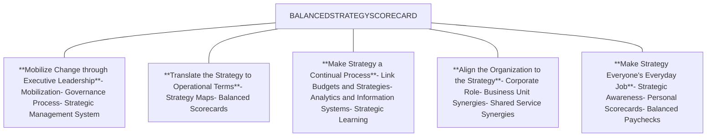

logo: KEMENTERIAN PENDIDIKAN TINGGI, SAINS DAN TEKNOLOGI REPUBLIK INDONESIA

logo: DIKTISAINTEK BERDAMPAK

KEMENTERIAN PENDIDIKAN TINGGI,

## 1.2. STRATEGY FOCUS

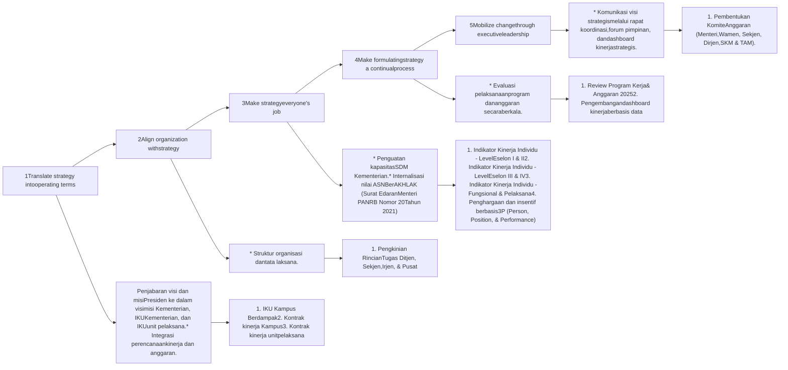

### RENCANA PELAKSANAAN (Column 1)
1. Nov 2025 - April 2026
2. April 2026
3. Februari 2026

### RENCANA PELAKSANAAN (Column 2)
1. Minggu II - Nov 2025

### RENCANA PELAKSANAAN (Column 3)
1. November 2025
2. Desember 2025
3. Januari 2026
4. 2026

### RENCANA PELAKSANAAN (Column 4)
1. Minggu IV - Nov 2025
2. 2026

### RENCANA PELAKSANAAN (Column 5)
1. Minggu IV - Nov 2025

**Keterangan:**
* [icon: green dot with check] Program/kebijakan yang **sudah** dilaksanakan
* [icon: red dot with cross] Program/kebijakan yang **belum** dilaksanakan.

KEMENTERIAN PENDIDIKAN TINGGI,

## 1.3. PETA STRATEGI DIKTISAINTEK BERDAMPAK

<table>
  <thead>
    <tr>
        <th>VISI</th>
        <th colspan="4">Pendidikan Tinggi, Sains, dan Teknologi yang Inklusif, Adaptif, dan Berdampak dalam Mewujudkan Transformasi Bangsa Mewujudkan Indonesia Emas 2045</th>
    </tr>
    <tr>
        <th rowspan="2">MISI</th>
        <th>Talenta</th>
        <th>Penelitian</th>
        <th>Masyarakat</th>
        <th>Tata Kelola</th>
    </tr>
    <tr>
        <th>Mengembangkan SDM Unggul masa depan yang berkontribusi dalam pembangunan nasional</th>
        <th>Mengembangkan riset pendidikan tinggi yang berdampak bagi pembangunan nasional</th>
        <th>Mewujudkan masyarakat yang maju dan berkelanjutan dalam pembangunan nasional</th>
        <th>Mewujudkan tata kelola pendidikan tinggi, sains, dan teknologi yang berintegritas dalam pembangunan nasional</th>
    </tr>
    <tr>
        <th> </th>
        <th>Tujuan Kementerian &#x26; Peta Strategi</th>
        <th>Ukuran</th>
        <th>Target</th>
        <th>Pengampu</th>
    </tr>
  </thead>
  <tbody>
    <tr>
        <td rowspan="3">Pemangku Kepentingan</td>
        <td rowspan="3">SS.3. Meningkatnya talenta berkualitas di bidang sains dan teknologi. SS.6. Meningkatnya kontribusi perguruan tinggi dalam mendukung tujuan pembangunan berkelanjutan.</td>
        <td>IKSS 3.1. Jumlah SDM Iptek (dosen, peneliti, perekayasa) per juta penduduk</td>
        <td>1.371 (2029)</td>
        <td>Direktorat Jenderal Pendidikan Tinggi</td>
    </tr>
    <tr>
        <td>IKSS 3.2. Jumlah SDM pendidikan tinggi yang mendapatkan rekognisi</td>
        <td>116 orang (2029)</td>
        <td>Direktorat Jenderal Riset dan Pengembangan; Direktorat Jenderal Pendidikan Tinggi</td>
    </tr>
    <tr>
        <td>IKSS 6.1. Jumlah perguruan tinggi yang masuk ke dalam peringkat THE Impact SDGs Ranking (a) Top 300 (b) Top 600 (c) Top 1000</td>
        <td>13 PT (2029)</td>
        <td>Direktorat Jenderal Pendidikan Tinggi; Direktorat Jenderal Sains dan Teknologi</td>
    </tr>
    <tr>
        <td rowspan="5">Proses Internal</td>
        <td rowspan="5">SS.1. Meningkatnya partisipasi pendidikan tinggi berkualitas. SS.2. Meningkatnya mutu dan relevansi pendidikan tinggi. SS.5. Meningkatnya kualitas kebijakan nasional bidang pendidikan tinggi, sains dan teknologi yang berbasis riset. SS.7. Meningkatnya tata kelola Kementerian yang partisipatif, transparan, dan akuntabel</td>
        <td>IKSS.1.1. Angka Partisipasi Kasar Pendidikan Tinggi (APK PT)</td>
        <td>38,04% (2029)</td>
        <td>Sekretariat Jenderal; Direktorat Jenderal Pendidikan Tinggi</td>
    </tr>
    <tr>
        <td>IKSS.2.1. % lulusan pendidikan tinggi yang langsung bekerja/melanjutkan jenjang pendidikan berikutnya dalam jangka waktu 1 tahun setelah kelulusan (a) total; (b) karyawan atau wirausaha</td>
        <td>(a) 65,37% (2029) (b) 86,31% (2029)</td>
        <td>Direktorat Jenderal Pendidikan Tinggi; Direktorat Jenderal Sains dan Teknologi</td>
    </tr>
    <tr>
        <td>IKSS.2.2. % lulusan pendidikan tinggi vokasi yang bekerja di bidang sesuai pendidikan dalam jangka waktu 1 tahun setelah kelulusan</td>
        <td>(a) 75,5% (2029) (b) 5,5% (2029)</td>
        <td>Direktorat Jenderal Pendidikan Tinggi; Direktorat Jenderal Sains dan Teknologi</td>
    </tr>
    <tr>
        <td>IKSS.5.1. Jumlah perumusan kebijakan nasional bidang pendidikan tinggi, sains, dan teknologi yang berbasis riset (%)</td>
        <td>100% (2029)</td>
        <td>Direktorat Jenderal Pendidikan Tinggi; Direktorat Jenderal Riset dan Pengembangan; Direktorat Jenderal Sains dan Teknologi</td>
    </tr>
    <tr>
        <td>IKSS.7.1. Indeks Reformasi Birokrasi</td>
        <td>90,1 (2029)</td>
        <td>Sekretariat Jenderal; Inspektorat Jenderal</td>
    </tr>
    <tr>
        <td rowspan="4">Pembelajaran &#x26; Pertumbuhan</td>
        <td rowspan="4">Keuangan SS.4. Meningkatnya produktivitas kelembagaan iptek dan inovasi</td>
        <td>IKSS.4.1. Jumlah institusi pengguna terkait fungsi intermediasi dan layanan pemanfaatan iptek dan inovasi di perguruan tinggi.</td>
        <td>166 institusi (2029)</td>
        <td>Direktorat Jenderal Riset dan Pengembangan; Direktorat Jenderal Sains dan Teknologi</td>
    </tr>
    <tr>
        <td>K.1. % pendapatan non SPP</td>
        <td>> 60% (2029)</td>
        <td>Direktorat Jenderal Pendidikan Tinggi</td>
    </tr>
    <tr>
        <td>K.2. Rasio dana abadi terhadap total aset perguruan tinggi.</td>
        <td>10% (2029)</td>
        <td>Direktorat Jenderal Pendidikan Tinggi</td>
    </tr>
    <tr>
        <td>K.3. Efektivitas Serapan Anggaran</td>
        <td>95% (2029)</td>
        <td>Sekretariat Jenderal</td>
    </tr>
  </tbody>
</table>

# BAB - II KERANGKA STRATEGIS PENDIDIKAN TINGGI INDONESIA

illustration: two people analyzing data charts and graphs

KEMENTERIAN PENDIDIKAN TINGGI,

## 2.1. KERANGKA STRATEGIS KEMDIKTISAINTEK DALAM PENCAPAIAN TALENTA UNGGUL DAN BERDAMPAK

### TALENTA UNGGUL DAN BERDAMPAK

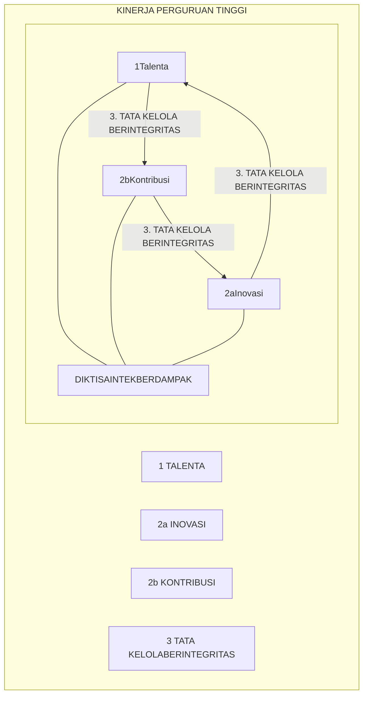

### TATA KELOLA DAN KEBERLANJUTAN PERGURUAN TINGGI

* icon: akuntabilitas **AKUNTABILITAS**

* icon: integritas **INTEGRITAS**

* icon: keberlanjutan **KEBERLANJUTAN**

**ENABLER**

### ANGGARAN KEMDIKTISAINTEK

icon: anggaran
icon: wallet

* Bantuan Operasional PT

* Dana Sarana & Prasarana PTN

* Dana Riset

* Tunjangan Guru Besar di PTS

* Gaji ASN

### DUKUNGAN KEBIJAKAN

icon: kebijakan

* Kebijakan Regulatif (Permendiktisaintek/Kepmen/PerDirjen)

* Kebijakan Insentif Berbasis Kinerja (Contoh: Insentif Akreditasi Unggul)

* Kebijakan Tata Kelola & Otonomi

## 2.2. KONTRAK KINERJA PERGURUAN TINGGI

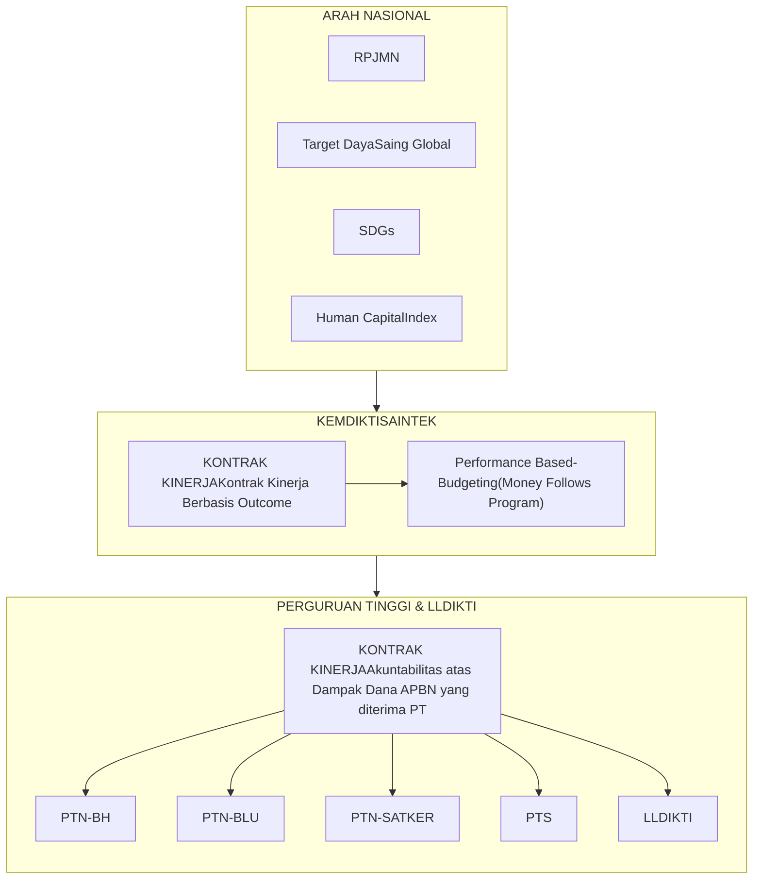

### Menetapkan Arah dan Dampak Nasional

* PP No. 17/2017 tentang Sinkronisasi Proses Perencanaan dan Penganggaran Pembangunan Nasional

* Permen PPN/Kepala Bappenas No. 5 Tahun 2023 tentang penyusunan RPJMN 2025-2029.

* Permen PPN/Kepala Bappenas No. 3 Tahun 2025 tentang RKP tahunan

* PermenPANRB No. 88 Tahun 2021 tentang Evaluasi SAKIP

* PermenPANRB No. 22 Tahun 2024 tentang Penilaian Kinerja Organisasi

### ANGGARAN KEMDIKTISAINTEK

* icon: Rp Bantuan Operasional PT

* Dana Riset

* Gaji ASN

* icon: building Dana Sarana & Prasarana PTN

* Tunjangan Guru Besar di PTS

### DUKUNGAN KEBIJAKAN

* icon: house Kebijakan Regulatif (Permendiktisaintek/Kepmen/PerDirjen)

* Kebijakan Tata Kelola & Otonomi

* Kebijakan Insentif Berbasis Kinerja (Contoh: Insentif Akreditasi Unggul)

### Ilustrasi:

<table>
  <thead>
    <tr>
        <th>Kategori</th>
        <th>Entitas</th>
        <th>Nilai Per Tahun</th>
        <th>Relasi</th>
        <th>Total Per Tahun</th>
    </tr>
    <tr>
        <th rowspan="2">Pagu Dana Equity WCU</th>
        <th>7 PTN-BH</th>
        <th>70 Miliar</th>
        <th>Setara</th>
        <th>1,4 Triliun</th>
    </tr>
    <tr>
        <th>16 PTN-BH</th>
        <th>12,5 Miliar</th>
        <th>Setara</th>
        <th>263,15 Miliar</th>
    </tr>
  </thead>
  <tbody>
    <tr>
        <th rowspan="2">Dana APBN</th>
        <th>Program Pembinaan PTS</th>
        <th>536,19 Juta</th>
        <th>Setara</th>
        <th>11,29 Miliar</th>
    </tr>
    <tr>
        <td>Fasilitasi Pembinaan Kelembagaan LLDIKTI</td>
        <td>5,8 Miliar</td>
        <td>Setara</td>
        <td>122,10 Miliar</td>
    </tr>
  </tbody>
</table>

**Asumsi:**
* Tarif BI Rate 4,75%

# BAB - III KINERJA DAN DAMPAK PENDIDIKAN TINGGI

illustration: isometric graphic showing a globe, telescope, map, and people studying

logo: KEMENTERIAN PENDIDIKAN TINGGI, SAINS DAN TEKNOLOGI REPUBLIK INDONESIA

logo: DIKTISAINTEK BERDAMPAK

## 3.1. KINERJA SAAT INI - 2025

## 2TAHUN MAHASISWA

* icon: total students **7,89%** Peningkatan Total Mahasiswa dari 2024-2025

* icon: undergraduate students **1,54%** Peningkatan Jumlah Mahasiswa Sarjana/Diploma dari Tahun 2024-2025

* icon: postgraduate students **5,67%** Peningkatan Jumlah Mahasiswa Pascasarjana dari Tahun 2024-2025

Sumber: Statistik PDDikti, 2024-2025

## 2TAHUN LULUSAN

* icon: total graduates **11,02%** Peningkatan total lulusan dari 2024-2025

* icon: undergraduate graduates **-3,82%** Penurunan jumlah lulusan undergraduated dari tahun 2024-2025

* icon: postgraduate graduates **2,8 x** Peningkatan lulusan post graduated dari tahun 2024-2025

Sumber: Statistik PDDikti, 2024-2025

## 5TAHUN RISET

* icon: publications **1,43%** Rata-rata peningkatan jumlah publikasi dari tahun 2020-2025

* icon: citations **4,7%** Rata-rata peningkatan jumlah sitasi dari tahun 2020-2025

* icon: top tier publications **1,83%** Rata-rata peningkatan jumlah publikasi top tier dari tahun 2020-2025

* icon: Q1 publications **25,20%** Rata-rata peningkatan jumlah publikasi Q1 dari tahun 2020-2025

Sumber: SciVal

### QS Global Ranking Top 7 PTN -BH
<table>
  <thead>
    <tr>
        <th>University</th>
        <th>UI</th>
        <th>UGM</th>
        <th>ITB</th>
        <th>UNAIR</th>
        <th>IPB</th>
        <th>ITS</th>
        <th>UNPAD</th>
    </tr>
  </thead>
  <tbody>
    <tr>
        <td>QS Global Ranking</td>
        <td>189</td>
        <td>224</td>
        <td>255</td>
        <td>287</td>
        <td>399</td>
        <td>509</td>
        <td>515</td>
    </tr>
    <tr>
        <td>QS Asia Ranking</td>
        <td>47</td>
        <td>55</td>
        <td>62</td>
        <td>54</td>
        <td>82</td>
        <td>97</td>
        <td>96</td>
    </tr>
  </tbody>
</table>

Dari 7 (tujuh) PTN-BH, saat ini ada 1 (satu) perguruan tinggi berada di ranking 100-200 yaitu UI. Sedangkan 3 (tiga) perguruan tinggi berada pada rangking 200-300 yaitu UGM, ITB,dan UNAIR. Untuk IPB berada di ranking 300-400, serta ITS dan UNPAD berada pada ranking 500-600.

Sumber: QS WUR, 2026

KEMENTERIAN PENDIDIKAN TINGGI,

Berdasarkan data RI2 (Research Integrity Risk Index) bahwa dari **10 perguruan tinggi** yang dipertanyakan integritasnya **5 (lima)** diantaranya adalah **perguruan tinggi di Indonesia** yaitu UNY, UNP, UM, UNS dan UPI.

<table>
  <thead>
    <tr>
        <th colspan="12">Showing 1 to 50 of 2,000 entries</th>
    </tr>
    <tr>
        <th> </th>
        <th>Institution Name</th>
        <th>Country</th>
        <th>Field</th>
        <th>Articles</th>
        <th>D</th>
        <th>R</th>
        <th>S</th>
        <th>Norm D</th>
        <th>Norm R</th>
        <th>Norm S</th>
        <th>RI² score</th>
    </tr>
  </thead>
  <tbody>
    <tr>
        <td>[icon: 1]</td>
        <td>Yogyakarta State University</td>
        <td>Indonesia</td>
        <td>Multidisciplinary</td>
        <td>1,448</td>
        <td>25.345</td>
        <td>54.558</td>
        <td>33.646</td>
        <td>1.000</td>
        <td>1.000</td>
        <td>1.000</td>
        <td>1.000</td>
    </tr>
    <tr>
        <td>[icon: 2]</td>
        <td>State University of Padang</td>
        <td>Indonesia</td>
        <td>Multidisciplinary</td>
        <td>1,341</td>
        <td>16.927</td>
        <td>49.217</td>
        <td>22.932</td>
        <td>1.000</td>
        <td>1.000</td>
        <td>1.000</td>
        <td>1.000</td>
    </tr>
    <tr>
        <td> </td>
        <td>Saveetha Institute of Medical and Technical Sciences (Deemed to be University)</td>
        <td>India</td>
        <td>Multidisciplinary</td>
        <td>11,831</td>
        <td>18.679</td>
        <td>12.932</td>
        <td>16.955</td>
        <td>1.000</td>
        <td>1.000</td>
        <td>0.955</td>
        <td>0.985</td>
    </tr>
    <tr>
        <td>[icon: 3]</td>
        <td>State University of Malang</td>
        <td>Indonesia</td>
        <td>Multidisciplinary</td>
        <td>1,678</td>
        <td>17.163</td>
        <td>18.474</td>
        <td>16.143</td>
        <td>1.000</td>
        <td>1.000</td>
        <td>0.894</td>
        <td>0.964</td>
    </tr>
    <tr>
        <td>[icon: 4]</td>
        <td>Universitas Sebelas Maret</td>
        <td>Indonesia</td>
        <td>Multidisciplinary</td>
        <td>2,777</td>
        <td>12.279</td>
        <td>13.323</td>
        <td>16.754</td>
        <td>0.859</td>
        <td>1.000</td>
        <td>0.940</td>
        <td>0.933</td>
    </tr>
    <tr>
        <td>[icon: 5]</td>
        <td>Indonesia University of Education</td>
        <td>Indonesia</td>
        <td>Multidisciplinary</td>
        <td>1,347</td>
        <td>14.847</td>
        <td>8.166</td>
        <td>13.357</td>
        <td>1.000</td>
        <td>1.000</td>
        <td>0.682</td>
        <td>0.894</td>
    </tr>
    <tr>
        <td> </td>
        <td>Jawaharlal Nehru Technological University Anantapur</td>
        <td>India</td>
        <td>STEM</td>
        <td>1,942</td>
        <td>12.924</td>
        <td>9.783</td>
        <td>14.540</td>
        <td>1.000</td>
        <td>1.000</td>
        <td>0.520</td>
        <td>0.840</td>
    </tr>
    <tr>
        <td> </td>
        <td>University of Calabar</td>
        <td>Nigeria</td>
        <td>Multidisciplinary</td>
        <td>1,328</td>
        <td>6.927</td>
        <td>13.554</td>
        <td>21.308</td>
        <td>0.474</td>
        <td>1.000</td>
        <td>1.000</td>
        <td>0.824</td>
    </tr>
    <tr>
        <td> </td>
        <td>Jazan University</td>
        <td>Saudi Arabia</td>
        <td>Multidisciplinary</td>
        <td>4,619</td>
        <td>14.267</td>
        <td>5.195</td>
        <td>10.749</td>
        <td>1.000</td>
        <td>0.950</td>
        <td>0.484</td>
        <td>0.811</td>
    </tr>
    <tr>
        <td> </td>
        <td>Guilan University of Medical Sciences</td>
        <td>Iran</td>
        <td>Medical &#x26; Health Sciences</td>
        <td>1,537</td>
        <td>6.506</td>
        <td>19.518</td>
        <td>12.394</td>
        <td>0.432</td>
        <td>1.000</td>
        <td>1.000</td>
        <td>0.810</td>
    </tr>
  </tbody>
</table>

**Skala**

**Red Flag**: extreme anomalies; systemic integrity risks

**High Risk**: significant deviation from global norms

**Watch List**: moderately elevated risk; emerging concerns

**Normal Variation**: within expected global variance

**Low Risk**: strong adherence to publishing integrity norms

Sumber: RI2, 2025

**Catatan:**

\* Articles = Articles and Reviews published during 2023-2024. Excludes articles with more than 100 co-authors.

\* D = Percentage of 2023-2024 articles and reviews that appeared in journals delisted by Scopus or Web of Science between January 2023 and the date RI² is published (November 4, 2025).

\* R = Retraction rate per 1,000: retractions among 2023-2024 articles and reviews, identified, as of October 31, 2025, via the Retraction Watch Database and supplemented with MEDLINE, Scopus, and Web of Science (see Methodology section).

\* S = Institutional self-citation share (%), as reported by InCites as of October 2025: percentage of citations to an institution's 2023-2024 articles and reviews that originate from the same institution.

\* Norm = Normalized by rate and field.

## 3.2. KINERJA UNIVERSITI MALAYA DAN UNIVERSITI TEKNOLOGI MALAYSIA

### UNIVERISTI MALAYA
=58

QS World University Rankings

<table>
    <tr>
        <td>Level</td>
        <td>Percentage</td>
        <td>Count</td>
    </tr>
    <tr>
        <td>Undergraduate</td>
        <td>70</td>
        <td>13.182</td>
    </tr>
    <tr>
        <td>Postgraduate</td>
        <td>30</td>
        <td>5.646</td>
    </tr>
</table>

icon: 2.370 Dosen

icon: 5.470 Publikasi Scival Tahun 2024

icon: arrow

icon: 1 Dosen ±2 Publikasi /Tahun

### UNIVERSITI TEKNOLOGI MALAYSIA
=153

QS World University Rankings

<table>
    <tr>
        <td>Level</td>
        <td>Percentage</td>
        <td>Count</td>
    </tr>
    <tr>
        <td>Undergraduate</td>
        <td>66</td>
        <td>11.134</td>
    </tr>
    <tr>
        <td>Postgraduate</td>
        <td>34</td>
        <td>5.736</td>
    </tr>
</table>

icon: 2.015 Dosen

icon: 4.472 Publikasi Scival Tahun 2024

icon: arrow

icon: 1 Dosen ±2 Publikasi /Tahun

KEMENTERIAN PENDIDIKAN TINGGI,

## 3.3. THE WUR (ASEAN TOP 20) INDICATORS

<table>
  <thead>
    <tr>
        <th>No</th>
        <th>Rank</th>
        <th>Country</th>
        <th>Name</th>
        <th>Overall</th>
        <th>Teaching</th>
        <th>Research Environment</th>
        <th>Research Quality</th>
        <th>Industry</th>
        <th>International Outlook</th>
    </tr>
  </thead>
  <tbody>
    <tr>
        <td>1</td>
        <td>17</td>
        <td>Singapore</td>
        <td>National University of Singapore</td>
        <td>89.7</td>
        <td>78.6</td>
        <td>93.1</td>
        <td>95.1</td>
        <td>99.9</td>
        <td>92.8</td>
    </tr>
    <tr>
        <td>2</td>
        <td>31</td>
        <td>Singapore</td>
        <td>Nanyang Technological University, Singapore</td>
        <td>81.6</td>
        <td>65.8</td>
        <td>78.1</td>
        <td>95.2</td>
        <td>100</td>
        <td>93.6</td>
    </tr>
    <tr>
        <td>3</td>
        <td>201–250</td>
        <td>Malaysia</td>
        <td>Universiti Teknologi Petronas</td>
        <td>56.4–58.6</td>
        <td>41.6</td>
        <td>40.3</td>
        <td>82.4</td>
        <td>94.5</td>
        <td>78.9</td>
    </tr>
    <tr>
        <td>4</td>
        <td>201–250</td>
        <td>Malaysia</td>
        <td>University of Malaya</td>
        <td>56.4–58.6</td>
        <td>47.8</td>
        <td>38.8</td>
        <td>72.8</td>
        <td>65.2</td>
        <td>91.4</td>
    </tr>
    <tr>
        <td>5</td>
        <td>301–350</td>
        <td>Malaysia</td>
        <td>Sunway University</td>
        <td>51.6–54.2</td>
        <td>27.2</td>
        <td>34.2</td>
        <td><mark>60.1</mark></td>
        <td>58.4</td>
        <td>89.3</td>
    </tr>
    <tr>
        <td>6</td>
        <td>301–350</td>
        <td>Malaysia</td>
        <td>Universiti Kebangsaan Malaysia</td>
        <td>51.6–54.2</td>
        <td>47.5</td>
        <td>32.4</td>
        <td>65.7</td>
        <td>61.8</td>
        <td>82.6</td>
    </tr>
    <tr>
        <td>7</td>
        <td>351-400</td>
        <td>Brunei</td>
        <td>Universiti Brunei Darussalam</td>
        <td>49.5-51.5</td>
        <td>33.1</td>
        <td>34.7</td>
        <td>80.5</td>
        <td>31.4</td>
        <td>72.1</td>
    </tr>
    <tr>
        <td>8</td>
        <td>401–500</td>
        <td>Malaysia</td>
        <td>Universiti Sains Malaysia</td>
        <td>46.2–49.8</td>
        <td>42.9</td>
        <td>30.3</td>
        <td>65.8</td>
        <td>64.5</td>
        <td>76.5</td>
    </tr>
    <tr>
        <td>9</td>
        <td>401–500</td>
        <td>Malaysia</td>
        <td>Universiti Teknologi Malaysia</td>
        <td>46.2–49.8</td>
        <td>44.5</td>
        <td>29.5</td>
        <td>62</td>
        <td>71.1</td>
        <td>70.7</td>
    </tr>
    <tr>
        <td>10</td>
        <td>401–500</td>
        <td>Malaysia</td>
        <td>Universiti Utara Malaysia</td>
        <td>46.2–49.8</td>
        <td>41.1</td>
        <td>30.2</td>
        <td>66.2</td>
        <td>30.1</td>
        <td>82.1</td>
    </tr>
    <tr>
        <td>11</td>
        <td>501–600</td>
        <td>Thailand</td>
        <td>Chulalongkorn University</td>
        <td>43.6–46.1</td>
        <td>39.5</td>
        <td>31.3</td>
        <td>56.1</td>
        <td>82</td>
        <td>46.8</td>
    </tr>
    <tr>
        <td>12</td>
        <td>501–600</td>
        <td>Vietnam</td>
        <td>UEH University</td>
        <td>43.6–46.1</td>
        <td>13</td>
        <td>21.8</td>
        <td><mark>62.1</mark></td>
        <td>50.1</td>
        <td>53.6</td>
    </tr>
    <tr>
        <td>13</td>
        <td>501–600</td>
        <td>Malaysia</td>
        <td>Universiti Putra Malaysia</td>
        <td>43.6–46.1</td>
        <td>40.7</td>
        <td>31.6</td>
        <td>51.7</td>
        <td>57.1</td>
        <td>82.5</td>
    </tr>
    <tr>
        <td>14</td>
        <td>601-800</td>
        <td>Brunei</td>
        <td>Universiti Teknologi Brunei</td>
        <td>39.0-43.5</td>
        <td>29.9</td>
        <td>14</td>
        <td>68.5</td>
        <td>33.5</td>
        <td>68.5</td>
    </tr>
    <tr>
        <td>15</td>
        <td>601–800</td>
        <td>Vietnam</td>
        <td>Duy Tan University</td>
        <td>39.0–43.5</td>
        <td>12.8</td>
        <td>17</td>
        <td><mark>61.6</mark></td>
        <td>27.9</td>
        <td>55.2</td>
    </tr>
    <tr>
        <td>16</td>
        <td>601–800</td>
        <td>Thailand</td>
        <td>Mahidol University</td>
        <td>39.0–43.5</td>
        <td>38.6</td>
        <td>28.4</td>
        <td>53.1</td>
        <td>88.1</td>
        <td>49.6</td>
    </tr>
    <tr>
        <td>17</td>
        <td>601–800</td>
        <td>Malaysia</td>
        <td>Management &#x26; Science University (MSU)</td>
        <td>39.0–43.5</td>
        <td>33.2</td>
        <td>15</td>
        <td>65.8</td>
        <td>33.4</td>
        <td>92.1</td>
    </tr>
    <tr>
        <td>18</td>
        <td>601–800</td>
        <td>Vietnam</td>
        <td>Ton Duc Thang University</td>
        <td>39.0–43.5</td>
        <td>15.8</td>
        <td>12.2</td>
        <td>85.9</td>
        <td>27.2</td>
        <td>63</td>
    </tr>
    <tr>
        <td>19</td>
        <td>601–800</td>
        <td>Malaysia</td>
        <td>Universiti Malaysia Pahang Al-Sultan Abdullah (UMPSA)</td>
        <td>39.0–43.5</td>
        <td>37.9</td>
        <td>23.9</td>
        <td>59</td>
        <td>52.8</td>
        <td>58.7</td>
    </tr>
    <tr>
        <td>20</td>
        <td>601–800</td>
        <td>Malaysia</td>
        <td>Universiti Pendidikan Sultan Idris</td>
        <td>39.0–43.5</td>
        <td>39.4</td>
        <td>27.6</td>
        <td>48.4</td>
        <td>56.2</td>
        <td>81.4</td>
    </tr>
    <tr>
        <td colspan="10">...</td>
    </tr>
    <tr>
        <td>25</td>
        <td>801–1000</td>
        <td>Indonesia</td>
        <td>University of Indonesia</td>
        <td>35.5–38.9</td>
        <td>45</td>
        <td>22</td>
        <td><mark>37.2</mark></td>
        <td>60.4</td>
        <td>63.9</td>
    </tr>
  </tbody>
</table>

KEMENTERIAN PENDIDIKAN TINGGI,

## 3.4. PUBLICATION THE WUR (ASEAN TOP 20) INDICATORS: 2020-2024

<table>
  <thead>
    <tr>
        <th rowspan="2">No</th>
        <th rowspan="2">Rank</th>
        <th rowspan="2">Country</th>
        <th rowspan="2">Name</th>
        <th rowspan="2">Top Tier Publication</th>
        <th rowspan="2">Top Tier Publication Share (%)</th>
        <th colspan="2">Q1</th>
    </tr>
    <tr>
        <th>Publication</th>
        <th>Publication Share (%)</th>
    </tr>
  </thead>
  <tbody>
    <tr>
        <td>1</td>
        <td>17</td>
        <td>Singapore</td>
        <td>National University of Singapore</td>
        <td>35,377</td>
        <td>50.0</td>
        <td>53,702</td>
        <td>75.8</td>
    </tr>
    <tr>
        <td>2</td>
        <td>31</td>
        <td>Singapore</td>
        <td>Nanyang Technological University, Singapore</td>
        <td>383</td>
        <td>22.5</td>
        <td>36,918</td>
        <td>78.0</td>
    </tr>
    <tr>
        <td>3</td>
        <td>201–250</td>
        <td>Malaysia</td>
        <td>Universiti Teknologi Petronas</td>
        <td>2,038</td>
        <td>24.1</td>
        <td>4,329</td>
        <td>51.2</td>
    </tr>
    <tr>
        <td>4</td>
        <td>201–250</td>
        <td>Malaysia</td>
        <td>University of Malaya</td>
        <td>6,385</td>
        <td>23.4</td>
        <td>14,042</td>
        <td>51.4</td>
    </tr>
    <tr>
        <td>5</td>
        <td>301–350</td>
        <td>Malaysia</td>
        <td>Sunway University</td>
        <td>1,976</td>
        <td><mark>29.6</mark></td>
        <td>3,976</td>
        <td>59.6</td>
    </tr>
    <tr>
        <td>6</td>
        <td>301–350</td>
        <td>Malaysia</td>
        <td>Universiti Kebangsaan Malaysia</td>
        <td>5,111</td>
        <td>20.0</td>
        <td>12,027</td>
        <td>46.6</td>
    </tr>
    <tr>
        <td>7</td>
        <td>351-400</td>
        <td>Brunei</td>
        <td>Universiti Brunei Darussalam</td>
        <td>759</td>
        <td>21.0</td>
        <td>1,888</td>
        <td>52.5</td>
    </tr>
    <tr>
        <td>8</td>
        <td>401–500</td>
        <td>Malaysia</td>
        <td>Universiti Sains Malaysia</td>
        <td>4,873</td>
        <td>17.0</td>
        <td>12,164</td>
        <td>41.4</td>
    </tr>
    <tr>
        <td>9</td>
        <td>401–500</td>
        <td>Malaysia</td>
        <td>Universiti Teknologi Malaysia</td>
        <td>3,904</td>
        <td>18.0</td>
        <td>8,767</td>
        <td>41.0</td>
    </tr>
    <tr>
        <td>10</td>
        <td>401–500</td>
        <td>Malaysia</td>
        <td>Universiti Utara Malaysia</td>
        <td>656</td>
        <td>14.0</td>
        <td>1,643</td>
        <td>35.0</td>
    </tr>
    <tr>
        <td>11</td>
        <td>501–600</td>
        <td>Thailand</td>
        <td>Chulalongkorn University</td>
        <td>6,984</td>
        <td>30.0</td>
        <td>14,157</td>
        <td>61.4</td>
    </tr>
    <tr>
        <td>12</td>
        <td>501–600</td>
        <td>Vietnam</td>
        <td>UEH University</td>
        <td>935</td>
        <td><mark>34.0</mark></td>
        <td>1,719</td>
        <td>63.2</td>
    </tr>
    <tr>
        <td>13</td>
        <td>501–600</td>
        <td>Malaysia</td>
        <td>Universiti Putra Malaysia</td>
        <td>3,895</td>
        <td>17.0</td>
        <td>10,005</td>
        <td>42.6</td>
    </tr>
    <tr>
        <td>14</td>
        <td>601-800</td>
        <td>Brunei</td>
        <td>Universiti Teknologi Brunei</td>
        <td>357</td>
        <td>25.0</td>
        <td>667</td>
        <td>45.7</td>
    </tr>
    <tr>
        <td>15</td>
        <td>601–800</td>
        <td>Vietnam</td>
        <td>Duy Tan University</td>
        <td>3,130</td>
        <td><mark>36.0</mark></td>
        <td>6,218</td>
        <td>72.0</td>
    </tr>
    <tr>
        <td>16</td>
        <td>601–800</td>
        <td>Thailand</td>
        <td>Mahidol University</td>
        <td>5,802</td>
        <td>24.0</td>
        <td>13,497</td>
        <td>55.2</td>
    </tr>
    <tr>
        <td>17</td>
        <td>601–800</td>
        <td>Malaysia</td>
        <td>Management &#x26; Science University (MSU)</td>
        <td>169</td>
        <td>10.8</td>
        <td>504</td>
        <td>32.1</td>
    </tr>
    <tr>
        <td>18</td>
        <td>601–800</td>
        <td>Vietnam</td>
        <td>Ton Duc Thang University</td>
        <td>2,532</td>
        <td>32.0</td>
        <td>5,134</td>
        <td>64.3</td>
    </tr>
    <tr>
        <td>19</td>
        <td>601–800</td>
        <td>Malaysia</td>
        <td>Universiti Malaysia Pahang Al-Sultan Abdullah (UMPSA)</td>
        <td>1,116</td>
        <td>13.0</td>
        <td>2,434</td>
        <td>29.1</td>
    </tr>
    <tr>
        <td>20</td>
        <td>601–800</td>
        <td>Malaysia</td>
        <td>Universiti Pendidikan Sultan Idris</td>
        <td>397</td>
        <td>11.9</td>
        <td>919</td>
        <td>27.5</td>
    </tr>
    <tr>
        <td colspan="8">...</td>
    </tr>
    <tr>
        <td>25</td>
        <td>801–1000</td>
        <td>Indonesia</td>
        <td>University of Indonesia</td>
        <td>1,987</td>
        <td><mark>10.0</mark></td>
        <td>5,339</td>
        <td>26.2</td>
    </tr>
  </tbody>
</table>

KEMENTERIAN PENDIDIKAN TINGGI,

## 3.5. RISET KOLABORASI

## UNIVERSITY OF ECONOMICS HO CHI MINH - VIETNAM

<table>
  <thead>
    <tr>
        <th>Metric</th>
        <th>Publication share</th>
        <th>Scholarly Output</th>
        <th>Citations</th>
    </tr>
  </thead>
  <tbody>
    <tr>
        <td>[icon: blue square] International collaboration</td>
        <td>52.5%</td>
        <td>1,540</td>
        <td>43,516</td>
    </tr>
    <tr>
        <td>[icon: dark blue square] Only national collaboration</td>
        <td>22.4%</td>
        <td>656</td>
        <td>5,052</td>
    </tr>
    <tr>
        <td>[icon: orange square] Only institutional collaboration</td>
        <td>17.0%</td>
        <td>497</td>
        <td>4,341</td>
    </tr>
    <tr>
        <td>[icon: light brown square] Single authorship (no collaboration)</td>
        <td>8.2%</td>
        <td>240</td>
        <td>3,320</td>
    </tr>
  </tbody>
</table>

**Lucey, Brian M.**
Trinity College Dublin, Dublin, Ireland • Scopus ID: 57201834706 • 0000-0002-4052-8235 ↗
Show all information

<table>
    <tr>
        <td>19,636</td>
        <td>300</td>
        <td>66</td>
    </tr>
    <tr>
        <td>Citations by 12,315 documents</td>
        <td>Documents</td>
        <td><u>h-index</u></td>
    </tr>
</table>

## SUNWAY UNIVERSITY - MALAYSIA

<table>
  <thead>
    <tr>
        <th>Metric</th>
        <th>Publication share</th>
        <th>Scholarly Output</th>
        <th>Citations</th>
    </tr>
  </thead>
  <tbody>
    <tr>
        <td>[icon: blue square] International collaboration</td>
        <td>75.7%</td>
        <td>5,625</td>
        <td>95,878</td>
    </tr>
    <tr>
        <td>[icon: dark blue square] Only national collaboration</td>
        <td>15.8%</td>
        <td>1,170</td>
        <td>11,699</td>
    </tr>
    <tr>
        <td>[icon: orange square] Only institutional collaboration</td>
        <td>6.2%</td>
        <td>459</td>
        <td>3,652</td>
    </tr>
    <tr>
        <td>[icon: light brown square] Single authorship (no collaboration)</td>
        <td>2.4%</td>
        <td>175</td>
        <td>2,497</td>
    </tr>
  </tbody>
</table>

**Bradley, David A.**
University of Surrey, Guildford, United Kingdom • Scopus ID: 7403122642 • 0000-0002-4007-5555 ↗
Show all information

<table>
    <tr>
        <td>12,664</td>
        <td>755</td>
        <td>50</td>
    </tr>
    <tr>
        <td>Citations by 7,680 documents</td>
        <td>Documents</td>
        <td><u>h-index</u></td>
    </tr>
</table>

## UNIVERSITAS INDONESIA

<table>
  <thead>
    <tr>
        <th>Metric</th>
        <th>Publication share</th>
        <th>Scholarly Output</th>
        <th>Citations</th>
    </tr>
  </thead>
  <tbody>
    <tr>
        <td>[icon: blue square] International collaboration</td>
        <td>24.6%</td>
        <td>5,789</td>
        <td>125,082</td>
    </tr>
    <tr>
        <td>[icon: dark blue square] Only national collaboration</td>
        <td>32.1%</td>
        <td>7,565</td>
        <td>30,499</td>
    </tr>
    <tr>
        <td>[icon: orange square] Only institutional collaboration</td>
        <td>40.7%</td>
        <td>9,603</td>
        <td>34,713</td>
    </tr>
    <tr>
        <td>[icon: light brown square] Single authorship (no collaboration)</td>
        <td>2.6%</td>
        <td>614</td>
        <td>1,594</td>
    </tr>
  </tbody>
</table>

KEMENTERIAN PENDIDIKAN TINGGI,

## 3.6. INDIKATOR INPUT OUTPUT – DIKTISAINTEK BERDAMPAK

```mermaid
graph TD
    Root["DIKTISAINTEKBERDAMPAK"] --> INPUT["INPUT"]
    Root --> OUTPUT["OUTPUT"]
    
    INPUT --> ENABLE["ENABLE"]
    INPUT --> ATTRACT["ATTRACT"]
    INPUT --> GROW["GROW"]
    INPUT --> RETAIN["RETAIN"]
    
    OUTPUT --> VTSKILLS["VT SKILLS"]
    OUTPUT --> GKSKILLS["GK SKILLS"]
    
    ENABLE --> IKU7["IKU 7. % Keterlibatan perguruan Tinggi dalam SDG 1 (Tanpa Kemiskinan) SDG 4 (Pendidikan Berkualitas), SDG 17 (Kemitraan), dan 2 (dua) SDGs lain sesuai keunggulan(*)"]
    ENABLE --- IKU10["KU 10. Jumlah Usulan Zona Integritas - WBK/WBBM PT"]
    ENABLE --- IKU11_1["IKU 11.1. Opini WTP atas Laporan Keuangan Perguruan Tinggi"]
    ENABLE --- IKU11_2["IKU 11.2 Predikat SAKIP Perguruan Tinggi"]
    ENABLE --- IKU11_3["KU 11.3. Jumlah Laporan Pelanggaran Integritas Akademik"]
    
    ATTRACT --> IKU5["IKU 5. Rasio Luaran hasil kerjasama antara PT dan start-up/industri/lembaga (*)"]
    ATTRACT --- IKU8["IKU 8. Jumlah SDM PT (dosen, peneliti) yang terlibat langsung dalam penyusunan kebijakan (nasional/daerah/industri)"]
    
    GROW --> IKU3["IKU 3. % Mahasiswa S1 dan D4/D3/D2/D1 berkegiatan/Meraih prestasi di luar program studi (*)"]
    
    RETAIN --> IKU1["IKU 1. Angka Efisiensi Edukas. PT (*)"]
    RETAIN --- IKU9["IKU 9. % Pendapatan Non Pendidikan/UKT (*)"]
    RETAIN --- IKU11_4["KU 11.4. Pencegahan dan Penanganan Anti Kekerasan, Anti Narkoba, dan Anti Korupsi"]
    
    VTSKILLS --> IKU2["IKU 2. % Lulusan pendidikan tinggi & vokasi yang langsung bekerja/melanjutkan jenjang pendidikan berikutnya dalam jangka waktu 1 tahun setelah kelulusan (*)"]
    
    GKSKILLS --> IKU4["IKU 4. Jumlah Dosen PT yang mendapatkan rekognisi internasional"]
    GKSKILLS --- IKU6["IKU 6. % Publikasi bereputasi internasional (Scopus/WoS) (**)\n"]
```

**Catatan:**
* VT skills = vocational technical skills
* GK skills = global knowledge skills

KEMENTERIAN PENDIDIKAN TINGGI,

## 3.7. KETERKAITAN IKU DIKTISAINTEK BERDAMPAK DENGAN IKU KEMENTERIAN

### INDIKATOR KINERJA DIKTISAINTEK BERDAMPAK PERGURUAN TINGGI

logo: Diktisaintek Berdampak

**IKU 4. Jumlah Dosen PT yang mendapatkan rekognisi internasional.**

logo: Tut Wuri Handayani

**IKSS 3.2. Jumlah SDM pendidikan tinggi yang mendapatkan rekognisi internasional**

* Ditjen Dikti

* Ditjen Risbang

**IKU 6. % publikasi bereputasi internasional (Scopus/WoS).(\*\*)**

**IKP 4.1.4. Sitasi internasional perguruan tinggi Indonesia: (a) rasio sitasi; (b) h-index.**

* Ditjen Risbang

**IKK 4.1.4.1 Indeks QS International Research Network Collaboration**

* Direktorat Penelitian dan Pengabdian Kepada Masyarakat

**IKU 8. Jumlah SDM PT (dosen, peneliti) yang terlibat langsung dalam penyusunan kebijakan (nasional/daerah/industri)**

**IKSS 3.1. Jumlah SDM Iptek (dosen, peneliti, perekayasa) per juta penduduk**

* Ditjen Dikti

**IKK 3.1.2.1. Jumlah SDM pendidikan tinggi yang difasilitasi peningkatan kualifikasinya.**

* Direktorat Sumber Daya

**IKU 10. Jumlah usulan Zona Integritas - WBK/WBBM**

**IKSS 6.1. Indeks Reformasi Birokrasi**

* Sekjen

* Itjen

* Ditjen Dikti

* Ditjen Risbang

* Ditjen Saintek

**IKP 6.1.18. Jumlah Satker di Lingkungan Kemdiktisaintek yang mendapatkan predikat ZI-WBK/WBBM**

* Inspektorat Jenderal

**IKU 11.1. Opini WTP atas Laporan Keuangan Perguruan Tinggi (Alt 1)**

**IKU 11.2. Predikat SAKIP Perguruan Tinggi (Alt 2)**

**IKU 11.3. Jumlah Laporan Pelanggaran Integritas Akademik (Alt 3)**

**IKU 11.4. Pencegahan dan Penanganan Anti Kekerasan, Anti Narkoba, dan Anti Korupsi (Alt 4)**

**IKP 6.1.4. Opini BPK RI atas laporan keuangan**

* Sekjen

**IKP 6.1.7 Predikat SAKIP Kementerian**

* Sekjen

**IKSS 6.1. Indeks Reformasi Birokrasi**

* Sekjen

* Itjen

* Ditjen Dikti

* Ditjen Risbang

* Ditjen Saintek

**IKK 6.1.15.1. Jumlah SDM pendidikan tinggi yang mendapatkan fasilitasi pencegahan korupsi dan kekerasan**

* Sekretariat Itjen

### INDIKATOR KINERJA INTERNAL KEMDIKTISAINTEK

**CATATAN:**

icon: orange circle IKU pilihan Diktisaintek Berdampak untuk Perguruan Tinggi

icon: blue circle IKSS, IKP, atau IKK Kemdiktisaintek yang termasuk dalam RPJMN 2024-2029.

icon: hollow circle IKSS, IKP, atau IKK Kemdiktisaintek yang tidak termasuk dalam RPJMN 2024-2029.

icon: dashed circle Pengampu atas indikator

KEMENTERIAN PENDIDIKAN TINGGI,

## 3.7. KETERKAITAN IKU DIKTISAINTEK BERDAMPAK DENGAN IKU KEMENTERIAN (2)

### INDIKATOR KINERJA DIKTISAINTEK BERDAMPAK PERGURUAN TINGGI

logo: Diktisaintek Berdampak logo: Tut Wuri Handayani

icon: check mark

IKU 1. Angka Efisiensi Edukasi PT (AEE) (*)

IKSS 1.1 . Angka Partisipasi Kasar Pendidikan Tinggi (APK PT)
* Sekretariat Jenderal
* Ditjen Dikti

Sekretariat Jenderal
Ditjen Dikti

icon: check mark

IKU 2. % lulusan pendidikan tinggi & vokasi yang langsung bekerja/melanjutkan jenjang pendidikan berikutnya dalam jangka waktu 1 tahun setelah kelulusan (*)

IKSS 2.1. Persentase lulusan pendidikan tinggi yang langsung bekerja dalam jangka waktu 1 tahun setelah kelulusan (a) total; (b) karyawan atau wirausaha
* Ditjen Dikti
* Ditjen Saintek

Ditjen Dikti
Ditjen Saintek

icon: check mark

IKU 3. Persentase mahasiswa S1/D4/D3/D2/D1 berkegiatan /meraih prestasi di luar program studi. (*)

Direktorat Pembelajaran dan Kemahasiswaan
IKK 2.1.3.2. % mahasiswa yang berkegiatan di luar program studi
IKK 3.2.2.1 Jumlah mahasiswa yang berprestasi di tingkat;
a. nasional
b. internasional

icon: check mark

IKU 5. Rasio luaran hasil kerja sama antara PT dan start-up/industri/Lembaga. (*)

IKK 4.1.4.2 Jumlah produk riset hasil kerja sama antara perguruan tinggi dengan badan usaha/ kementerian/lembaga/ pemerintah daerah/ lembaga riset/perguruan tinggi lainnya
Direktorat Hilirisasi & Kemitraan

icon: check mark

IKU 7. % keterlibatan Perguruan Tinggi dalam SDG 1 ((Tanpa Kemiskinan), SDG 4 (Pendidikan Berkualitas), SDG 17 (Kemitraan) dan 2 (dua) SDGs lain sesuai keunggulan (*).

IKSS 4.1. Jumlah perguruan tinggi yang masuk ke dalam peringkat THE Impact SDGs Ranking: (a) Top 300; (b) Top 600; (c) Top 1000.
* Ditjen Dikti
* Ditjen Risbang
* Ditjen Saintek

icon: check mark

IKU 9. % Pendapatan Non Pendidikan/UKT* (*).

IKSS 6.1. Indeks Reformasi Birokrasi
* Sekjen
* Itjen
* Ditjen Dikti
* Ditjen Risbang
* Ditjen Saintek

### INDIKATOR KINERJA INTERNAL KEMDIKTISAINTEK

CATATAN:

icon: blue check mark

IKU wajib Diktisaintek Berdampak untuk Perguruan Tinggi

icon: light blue circle

IKSS, IKP, atau IKK Kemdiktisaintek yang termasuk dalam RPJMN 2024-2029.

icon: white circle

IKSS, IKP, atau IKK Kemdiktisaintek yang tidak termasuk dalam RPJMN 2024-2029.

icon: dashed circle

Pengampu atas indikator

KEMENTERIAN PENDIDIKAN TINGGI,

## 3.7. KETERKAITAN IKU DIKTISAINTEK BERDAMPAK DENGAN IKU KEMENTERIAN (3)

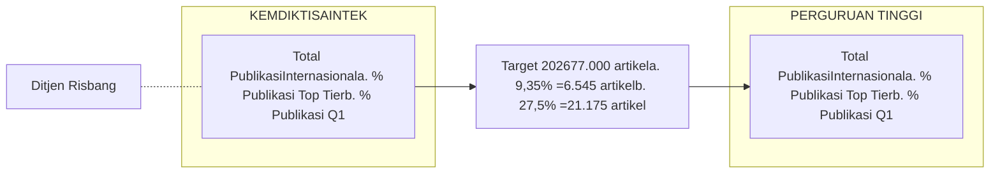

* Indikator total publikasi internasional menunjukkan keterkaitan langsung antara indikator internal Kemdiktisaintek dan IKU Perguruan Tinggi.

* Kemdiktisaintek menetapkan target nasional total publikasi internasional beserta proporsi mutu (publikasi Top Tier dan Q1).

* Target tersebut dicapai melalui akumulasi capaian publikasi masing-masing perguruan tinggi, yang diukur melalui indikator internal dan standar mutu yang sama.

KEMENTERIAN PENDIDIKAN TINGGI,

## 3.8. PROFIL DAN DAMPAK PT INDONESIA

4.614 PTN dan PTS

9.967.487 mahasiswa

303.067 dosen

249.375 tenaga administrasi

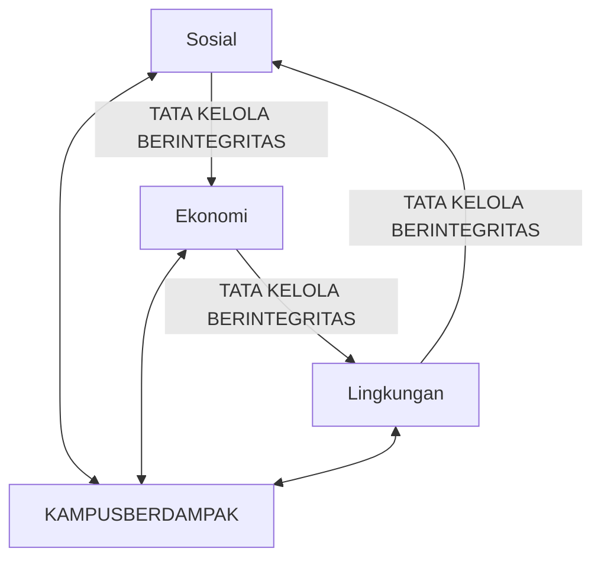

**Kontribusi ekonomi**

+Rp. 390 T\* (ex. riset dan pengmas)
SPP dan pengeluaran mahasiswa, gaji dosen dan tendik

Top 5 PTN-BH pengeluaran: +Rp. 12,7 T

UK: £1 oleh PT berdampak pada ekonomi £4,95

**Publikasi:**
* Publikasi Internasional (Scopus): 328.006 papers
* Sitasi: 1.456.448
* Citations per paper: 4,4
* 23,50% papers berkolaborasi dengan partner internasional

**THE IMPACT:**
* Top 100: UNAIR, UI, UGM
* Top 300: IPB, ITB, ITS, UNPAD
* Top 600: BINUS, UNDIP, UNS, UNHAS, Utel, UPH, UB

Dampak Indonesia | Dampak Internasional

\*Note: SPP per semester Rp. 4 juta, Gaji dosen Rp. 10 juta/bulan, Gaji Tendik Rp. 5 juta/bulan, Pengeluaran mahasiswa: Rp. 2 juta/bulan

Sumber: BPS dan sumber resmi lainnya

logo: KEMENTERIAN PENDIDIKAN TINGGI, SAINS DAN TEKNOLOGI REPUBLIK INDONESIA

logo: DIKTISAINTEK BERDAMPAK

# BAB - IV RASIONALISASI INDIKATOR KINERJA

illustration: people reading and sitting on giant books

## 4.1. MAHASISWA PASCASARJANA

Profil Jumlah Mahasiswa Postgraduate 2024

icon: Indonesia flag with data

**Total**
9.967.401 Mahasiswa
Sumber: PDDIKTI 2024

**Total**
1.251.95 Mahasiswa
Sumber: MOHE Malaysia 2024

**Target 2029**
20% S2
10% S3
30% = 2.990.220 Mahasiswa

**Masih Kekurangan**
2.990.220 - 467.258 =
2.522.962 Mahasiswa

* Dari total 9.967.401 mahasiswa PG, hanya **4,64% atau 467.258 mahasiswa PG.**

### % Perbandingan UG dan PG pada TOP 5 PT

icon: blue arrows

<table>
  <thead>
    <tr>
        <th>Category</th>
        <th>UNDERGRADUATE</th>
        <th>POSTGRADUATE</th>
    </tr>
  </thead>
  <tbody>
    <tr>
        <td>Indonesia</td>
        <td>69,46%</td>
        <td>30,54%</td>
    </tr>
    <tr>
        <td>Malaysia</td>
        <td>60,69%</td>
        <td>39,31%</td>
    </tr>
    <tr>
        <td>Singapore</td>
        <td>60,84%</td>
        <td>39,16%</td>
    </tr>
  </tbody>
</table>

Sumber: QS WUR 2026

* Target yang ingin dicapai adalah **30% mahasiswa PG**, atau, **2.990.220** sehingga diperlukan penambahan **2.522.962 mahasiswa PG** untuk memenuhi target.

* Indonesia secara nasional masih **sangat kekurangan** mahasiswa PG. Namun, Top 7 perguruan tinggi sudah menunjukkan pola yang mendekati standar internasional, menunjukkan potensi untuk **mengejar target nasional bila kapasitas diperluas ke seluruh PT.**

<table>
  <thead>
    <tr>
        <th>Keterangan</th>
        <th>Total</th>
        <th>Pascasarjana</th>
        <th>% Pascasarjana</th>
        <th>Kekurangan</th>
        <th>Target % Pascasarjana</th>
    </tr>
  </thead>
  <tbody>
    <tr>
        <td>TOP 7 PTNBH *</td>
        <td>352.119</td>
        <td>96.250</td>
        <td>27,33%</td>
        <td>9.386</td>
        <td>35%</td>
    </tr>
    <tr>
        <td>16 PTNBH **</td>
        <td>1.455.913</td>
        <td>162.849</td>
        <td>11,19%</td>
        <td>201.129</td>
        <td>25%</td>
    </tr>
    <tr>
        <td>PTN-BLU</td>
        <td>1.394.791</td>
        <td>144.549</td>
        <td>10,36%</td>
        <td>64.670</td>
        <td>15%</td>
    </tr>
    <tr>
        <td>PTN-SATKER</td>
        <td>53.989</td>
        <td>960</td>
        <td>1,78%</td>
        <td>4.439</td>
        <td>10%</td>
    </tr>
  </tbody>
</table>

Note:

\* UI, UGM, ITB, UNAIR, IPB, ITS, UNPAD

\** UNDIP, UB, UNHAS, UNS, USU, USK, UNY, UM, UNP, UNNES, UNAND, UNSRI, UPI, UNJ, UNESA, UT

## 4.1. MAHASISWA PASCASARJANA (2)

Saat ini belum ada indikator kinerja maupun program kerja yang mengukur jumlah mahasiswa Pascasarjana . Maka dari itu, perlu ditetapkan IKP pendukung yaitu “jumlah mahasiswa Pascasarjana atau persentase mahasiswa pascasarjana” dengan pengampu Ditjen Dikti.

icon: globe

### Program Dukungan

**Program Beasiswa Garuda Pascasarjana**

<table>
    <tr>
        <td>logo: lpdp lembaga pengelola dana pendidikan</td>
        <td>Kuota beasiswa</td>
        <td>5.000 mahasiswa / tahun</td>
    </tr>
    <tr>
        <td></td>
        <td>Akumulasi Kuota beasiswa</td>
        <td>25.000 mahasiswa / 5 tahun</td>
    </tr>
</table>

icon: university building **PT meningkatkan program Dual Degree/Fast Track dan program Pascasarjana Non- Regular**

**DAMPAK LANGSUNG** icon: chevron arrows

a. Peningkatan rasio publikasi ilmiah bereputasi

b. Peningkatan rekognisi dan kualitas dosen

c. Peningkatan jumlah kerja sama riset & hilirisasi inovasi

d. Peningkatan jumlah beasiswa, bantuan biaya pendidikan, dan hibah kompetitif S2/S3.

e. Peningkatan kegiatan fasilitasi program riset, laboratorium, dan pusat unggulan

f. Peningkatan angka kerja sama PT dengan industri/lembaga riset untuk mahasiswa postgraduate

**DAMPAK TIDAK LANGSUNG** icon: chevron arrows

a. Peningkatan Daya Saing Global Perguruan Tinggi

b. Peningkatan kontribusi terhadap inovasi dan ekonomi berbasis pengetahuan (knowledge economy)

c. Keterlibatan PT dalam agenda nasional & SDGs

d. Peningkatan kegiatan peningkatan kapasitas dosen

# 4.2. TERTIARY INBOUND MOBILITY

**Tertiary inbound mobility**
Indonesia (0,1%) berada di bawah Vietnam (0,3 %) dan Malaysia (9,6 %).

<table>
    <tr>
        <td>Year</td>
        <td>Value</td>
        <td>Ratio</td>
    </tr>
    <tr>
        <td>2025</td>
        <td>19.544</td>
        <td>0,20</td>
    </tr>
    <tr>
        <td>2026</td>
        <td>43.872</td>
        <td>0,44</td>
    </tr>
    <tr>
        <td>2027</td>
        <td>61.794</td>
        <td>0,62</td>
    </tr>
    <tr>
        <td>2028</td>
        <td>79.716</td>
        <td>0,80</td>
    </tr>
    <tr>
        <td>2029</td>
        <td>97.635</td>
        <td>0,98</td>
    </tr>
    <tr>
        <td>2030</td>
        <td>115.560</td>
        <td>1,16</td>
    </tr>
</table>

## Langkah Strategis

**Renstra Kemdiktisaintek 2025-2029** sudah memuat program kerja pendukung IKK 2.1.3.1 Rasio outbound per inbound mahasiswa. Namun, perlu penajaman program seperti Pusat Pengelolaan Mahasiswa Asing dan membuka peluang kerjasama untuk mendukung pendanaan program.

icon: clipboard
## Program Dukungan

icon: university
### Perguruan tinggi

Berbagai program *inbound* telah dilakukan secara mandiri oleh perguruan tinggi seperti UI-GLOBES, Summer Course UGM, Inbound ITB, ADS UNAIR, dan Research Mobility IPB. Program ini perlu disinergikan dalam kebijakan nasional untuk memperkuat daya tarik mahasiswa internasional seperti:

icon: immigration
**Fast-Track Visa Pelajar & Post-Study Visa**

logo: lpdp lembaga pengelola dana pendidikan
**LPDP - Pertukaran Pelajar / Exchange Scholarship**

logo: DIKTISAINTEK BERDAMPAK
**Kemendiktisaintek dapat meluncurkan program Pusat Pengelolaan Mahasiswa Asing**

<table>
  <thead>
    <tr>
        <th colspan="2">Tertiary Inbound Mobility</th>
        <th>%</th>
        <th>Rank</th>
    </tr>
  </thead>
  <tbody>
    <tr>
        <td>icon: Malaysia flag</td>
        <td>Malaysia</td>
        <td>9,6</td>
        <td>31</td>
    </tr>
    <tr>
        <td>icon: Viet Nam flag</td>
        <td>Viet Nam</td>
        <td>0,3</td>
        <td>108</td>
    </tr>
    <tr>
        <td>icon: Indonesia flag</td>
        <td>Indonesia</td>
        <td>0,1</td>
        <td>114</td>
    </tr>
  </tbody>
</table>

logo: Global Innovation Index 2025 Innovation at a Crossroads 18th Edition

Note: Data for tertiary inbound mobility are reported for observation year 2023, as compiled from the UNESCO Institute for Statistics (UIS) database and published in GII 2025.

## 4.3. PROYEKSI PERTUMBUHAN MAHASISWA ASING 2030

### Proyeksi Pertumbuhan Mahasiswa Asing secara Keseluruhan di UGM

<table>
  <thead>
    <tr>
        <th>Tahun</th>
        <th>Proyeksi pertumbuhan</th>
        <th>S1 (IUP)</th>
        <th>S2</th>
        <th>S3</th>
    </tr>
  </thead>
  <tbody>
    <tr>
        <td>2025</td>
        <td>2.234</td>
        <td>1.452</td>
        <td>587</td>
        <td>196</td>
    </tr>
    <tr>
        <td>2026</td>
        <td>3.599</td>
        <td>2500</td>
        <td>923</td>
        <td>176</td>
    </tr>
    <tr>
        <td>2027</td>
        <td>4.964</td>
        <td>3448</td>
        <td>1273</td>
        <td>243</td>
    </tr>
    <tr>
        <td>2028</td>
        <td>6.329</td>
        <td>4396</td>
        <td>1623</td>
        <td>310</td>
    </tr>
    <tr>
        <td>2029</td>
        <td>7.693</td>
        <td>5343</td>
        <td>1973</td>
        <td>377</td>
    </tr>
    <tr>
        <td>2030</td>
        <td>9.058</td>
        <td>6291</td>
        <td>2323</td>
        <td>444</td>
    </tr>
  </tbody>
</table>

### Proyeksi Pertumbuhan Mahasiswa asing di UGM per Program Studi

<table>
  <thead>
    <tr>
        <th>Tahun</th>
        <th>Proyeksi pertumbuhan</th>
        <th>S1 (IUP)</th>
        <th>S2</th>
        <th>S3</th>
    </tr>
  </thead>
  <tbody>
    <tr>
        <td>2025</td>
        <td>2.234</td>
        <td>47</td>
        <td>6</td>
        <td>4</td>
    </tr>
    <tr>
        <td>2026</td>
        <td>3.599</td>
        <td>81</td>
        <td>10</td>
        <td>4</td>
    </tr>
    <tr>
        <td>2027</td>
        <td>4.964</td>
        <td>112</td>
        <td>13</td>
        <td>5</td>
    </tr>
    <tr>
        <td>2028</td>
        <td>6.329</td>
        <td>142</td>
        <td>17</td>
        <td>6</td>
    </tr>
    <tr>
        <td>2029</td>
        <td>7.693</td>
        <td>173</td>
        <td>21</td>
        <td>8</td>
    </tr>
    <tr>
        <td>2030</td>
        <td>9.058</td>
        <td>203</td>
        <td>24</td>
        <td>9</td>
    </tr>
  </tbody>
</table>

icon: blue square

### SKEMA 2

Jumlah Total Mahasiswa UGM per Jenjang 2025

<table>
  <thead>
    <tr>
        <th>Prodi</th>
        <th>Jumlah Mahasiswa</th>
    </tr>
  </thead>
  <tbody>
    <tr>
        <td>S1</td>
        <td>41.943</td>
    </tr>
    <tr>
        <td>S2</td>
        <td>15.488</td>
    </tr>
    <tr>
        <td>S3</td>
        <td>2.957</td>
    </tr>
  </tbody>
</table>

logo: QS World University Rankings

### Mahasiswa Asing Indonesia

icon: student

**Tahun 2025** 

**19.544** 

Mahasiswa Asing 

icon: arrow right

**Target Tahun 2030** 

**115.560** 

Mahasiswa Asing 

Ilustrasi target mahasiswa asing UGM sebesar **15%** pada tahun 2030 per perguruan tinggi (berdasarkan target IKU)

icon: UGM logo

**Universitas Gadjah Mada**

icon: student

**Tahun 2025** 

**2.234** 

Mahasiswa Asing

Target IKU UGM **15%** icon: arrow right

**Target Tahun 2030** 

**9.058** 

Mahasiswa Asing 

**UGM memiliki 252 Prodi:**

icon: buildings
Prodi IUP = 31

icon: graduation cap
Prodi S1 = 71

icon: graduation cap
Prodi S3 = 52

icon: graduation cap
Prodi S2 = 98

**Strategi Rekomendasi:**

* Fokus pada Program Studi dengan daya tarik global (misal: Kedokteran umum, Kedokteran Gigi, Kedokteran hewan)

* Kolaborasi Global yang Lebih Terarah

* Pemasaran Internasional yang tersegmentasi dan konsisten

\*Source: Data diolah dari pddikti.kemdiktisaintek.go.id

## 4.4. PENINGKATAN DOSEN BERKUALIFIKASI DOKTOR

<table>
  <thead>
    <tr>
        <th>Realisasi 2024</th>
        <th>Target 2029</th>
        <th>Selisih</th>
    </tr>
  </thead>
  <tbody>
    <tr>
        <td>75.431 (24,89%)</td>
        <td>96.981 (32%)</td>
        <td>21.550</td>
    </tr>
  </tbody>
</table>

### Top 5 University
*Staff with PhD by QS AUR*

<table>
  <thead>
    <tr>
        <th>Indonesia</th>
        <th>Malaysia</th>
        <th>Thailand</th>
    </tr>
  </thead>
  <tbody>
    <tr>
        <td>63,70%</td>
        <td>94,50%</td>
        <td>88,64%</td>
    </tr>
  </tbody>
</table>

* Dari total 303.067 dosen, hanya **24,89%** atau sekitar **75.431 dosen** yang telah bergelar **S3 (doktor)**.

* Target yang ingin dicapai adalah **32% dosen S3**, atau sekitar **96.981 dosen**, sehingga diperlukan penambahan **±21.550 dosen** bergelar doktor untuk memenuhi target tersebut.

<table>
  <thead>
    <tr>
        <th>Keterangan</th>
        <th>Total Dosen</th>
        <th>Dosen S3</th>
        <th>% Dosen S3</th>
        <th>Kekurangan Dosen S3</th>
        <th>Target Dosen S3 2029</th>
    </tr>
  </thead>
  <tbody>
    <tr>
        <td>Top 7 PTN-BH*</td>
        <td>14.006</td>
        <td>9.039</td>
        <td>64,54%</td>
        <td>1.466</td>
        <td>75%</td>
    </tr>
    <tr>
        <td>16 PTN-BH**</td>
        <td>27.592</td>
        <td>12.461</td>
        <td>45,16%</td>
        <td>4.094</td>
        <td>60%</td>
    </tr>
    <tr>
        <td>PTN-BLU</td>
        <td>52.704</td>
        <td>14.674</td>
        <td>27,84%</td>
        <td>11.678</td>
        <td>50%</td>
    </tr>
    <tr>
        <td>PTN-Satker</td>
        <td>2.923</td>
        <td>451</td>
        <td>15,43%</td>
        <td>1.011</td>
        <td>50%</td>
    </tr>
    <tr>
        <td>Top 5 PTS***</td>
        <td>5.487</td>
        <td>1.919</td>
        <td>34,97%</td>
        <td>825</td>
        <td>50%</td>
    </tr>
  </tbody>
</table>

Note:

\* UI, UGM, ITB, UNAIR, IPB, ITS, UNPAD

\** UNDIP, UB, UNHAS, UNS, USU, USK, UNY, UM, UNP, UNNES, UNAND, UNSRI, UPI, UNJ, UNESA, UT

\*** BINUS, UMS, UKI Atma Jaya, UII, Telkom University

## 4.4. PENINGKATAN DOSEN BERKUALIFIKASI DOKTOR (2)

## Program Dukungan

**Selisih**

Dosen Lulusan S3

21.550

icon: blue arrows pointing right

### Ditjen Dikti

logo: DIKTISAINTEK BERDAMPAK

**Beasiswa Gelar Dosen 2026**: 1.238 orang

**Pagu Anggaran 2026**: 236,80 M

**Program Peningkatan Kualifikasi Dosen**

**Akumulasi Target 2029**: 10.284

**Akumulasi Pagu Anggaran 2029**: 2,24 T

logo: lpdp lembaga pengelola dana pendidikan

**Target 2029**: 5.333 orang

**Pagu Anggaran 2030**: 1,612 T

**Total Kemendiktisaintek + LPDP**: 16.855 orang

**Total Kekurangan**: 4.695 orang

## Langkah Strategis

### Perguruan Tinggi

**Diketahui**:
Rata-Rata Dana Masyarakat **Top 5 PTNBH = Rp 1,04 Triliun**
*Sumber: Laporan Keuangan 5 PTNBH 2024*

icon: university building

**Asumsi**:

* Apabila di alokasikan dana dari Dana Masyarakat untuk *Upgrading upskilling SDM 5%* = Rp 1,04 T x 5% = **Rp 52 Miliar**

* Apabila di alokasikan dana untuk dosen kuliah S3 dari dana *Upgrading upskilling SDM 40%* = **Rp 20,8 Miliar**

* Biaya kuliah level S3 rata-rata Rp 250 juta per orang (3 <u>Tahun). Sehingga</u> jumlah dosen yang dibiayai = Rp 20,8 M : 250 juta **83 orang**

* Sehingga rata-rata dosen yang dibiayai kuliah S3 per PT ± **16 orang**.

* Jika 23 PTN-BH, maka total 16 x 23 = 368 orang

**Masih Kekurangan** icon: red arrow pointing right **4.695 - 368 = 4.327 orang**

**Stakeholder Terkait** icon: network nodes **Program Kerjasama Beasiswa dan program pendukung lainnya**

## 4.5. PUBLIKASI

KEMENTERIAN PENDIDIKAN TINGGI,

### Grafik Pertumbuhan Publikasi

<table>
  <thead>
    <tr>
        <th>Negara</th>
        <th>% TOP TIER</th>
        <th>% Q1</th>
    </tr>
  </thead>
  <tbody>
    <tr>
        <td>Indonesia</td>
        <td>9,80%</td>
        <td>23,60%</td>
    </tr>
    <tr>
        <td>Malaysia</td>
        <td>19,60%</td>
        <td>41,60%</td>
    </tr>
    <tr>
        <td>Vietnam</td>
        <td>20,50%</td>
        <td>44,10%</td>
    </tr>
    <tr>
        <td>Thailand</td>
        <td>23,90%</td>
        <td>54,70%</td>
    </tr>
  </tbody>
</table>

Total Publikasi:
* Indonesia: 68.454
* Malaysia: 52.861
* Vietnam: 22.603
* Thailand: 31.331

Sumber: Scival 2024

<table>
  <thead>
    <tr>
        <th> </th>
        <th>Top Tier</th>
        <th>Q1</th>
    </tr>
  </thead>
  <tbody>
    <tr>
        <td>Realisasi 2024</td>
        <td>9,80% 6.708</td>
        <td>23,60% 16.155</td>
    </tr>
    <tr>
        <td>Target 2026</td>
        <td>15% 10.268</td>
        <td>45% 30.804</td>
    </tr>
    <tr>
        <td>Kekurangan Artikel</td>
        <td>3.560</td>
        <td>14.469</td>
    </tr>
  </tbody>
</table>

### Tabel Publikasi Top 5 PT Indonesia

<table>
  <thead>
    <tr>
        <th rowspan="2">Nama Universitas</th>
        <th rowspan="2">Total</th>
        <th colspan="4">Baseline Publikasi PTN 2024</th>
    </tr>
    <tr>
        <th>Top Tier</th>
        <th>% TT</th>
        <th>Q1</th>
        <th>% Q1</th>
    </tr>
  </thead>
  <tbody>
    <tr>
        <td>Universitas Indonesia</td>
        <td>4.202</td>
        <td>513</td>
        <td>12,20%</td>
        <td>1.340</td>
        <td>31,90%</td>
    </tr>
    <tr>
        <td>Universitas Gadjah Mada</td>
        <td>4.189</td>
        <td>423</td>
        <td>10,10%</td>
        <td>1.085</td>
        <td>25,90%</td>
    </tr>
    <tr>
        <td>Institut Teknologi Bandung</td>
        <td>2.995</td>
        <td>458</td>
        <td>15,30%</td>
        <td>1.051</td>
        <td>35,10%</td>
    </tr>
    <tr>
        <td>Universitas Airlangga</td>
        <td>3.445</td>
        <td>348</td>
        <td>10,10%</td>
        <td>1.065</td>
        <td>30,90%</td>
    </tr>
    <tr>
        <td>Institut Pertanian Bogor</td>
        <td>2.643</td>
        <td>209</td>
        <td>7,90%</td>
        <td>531</td>
        <td>20,10%</td>
    </tr>
  </tbody>
</table>

Sumber: Scival

### Langkah Strategis Apa yang Dibutuhkan?

a. Saat ini pada Renstra Kemdiktisaintek 2025-2029 sudah memuat program kerja pendukung **IKK 4.1.4.1**, namun target artkel perlu ditajamkan untuk artikel Top Tier dan Q1" dengan pengampu **Ditjen Risbang**.

b. Pada IKP 4.1.6 "Jumlah riset dan inovasi yang dimanfaatkan DUDI/Masyarakat", namun belum ada IKK, program kerja dan anggaran. Maka dari itu, dibutuhkan program kerja terkait IKP tersebut seperti "**1 DOKTOR 1 SCOPUS**" dan "**POSTDOCTORAL PROGRAM**".

c. Pencapaian IKK jumlah publikasi juga akan didukung sepenuhnya oleh penetapan IKU Perguruan Tinggi tahun 2026 yaitu IKU 6 "Persentase publikasi bereputasi internasional (Scopus/WoS)"

## 4.5. PUBLIKASI (2)

icon: clipboard

### Program Dukungan

d. Untuk mendukung pencapaian IKK Jumlah Publikasi diperlukan pengalokasian dana Ditjen Risbang untuk program kerja hibah penelitian sebesar **Rp 1.190.667.665.000,-**. (RO. 7737.QEI.002).

Asumsi: Dana hibah riset = Rp 100 juta per riset
Sehingga diperoleh penelitian sebanyak

= **Rp. 1,19 T : 100 juta** [icon: blue arrow] **11.900 Riset**

e. Pengalokasian Dana Masyarakat yang diterima sebesar 5% untuk riset.

**Contoh:**

Rata-Rata Dana Masyarakat Top 5 PTNBH = **Rp 1,04 T**
(sumber: Laporan Keuangan 5 PTNBH 2024)

Alokasi dana riset = 5% x Rp 1,04 T= **54 M**

**Asumsi:**

Dana hibah riset = **Rp 100 juta per riset**

Sehingga diperoleh penelitian sebanyak = **Rp. 54 M : Rp 100 JT** [icon: blue arrow] **540 riset**

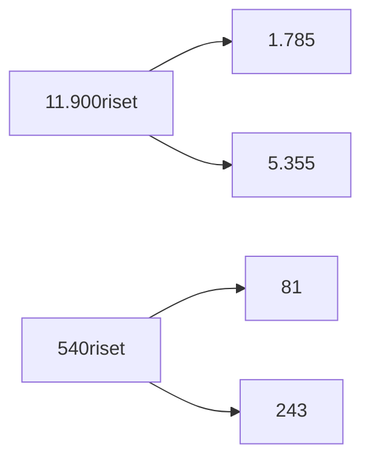

<table>
  <thead>
    <tr>
        <th>Keterangan</th>
        <th>Top Tier 15%</th>
        <th>Q1 45%</th>
    </tr>
  </thead>
  <tbody>
    <tr>
        <td>Kekurangan</td>
        <td>3.560</td>
        <td>14.649</td>
    </tr>
    <tr>
        <td>Target Publikasi</td>
        <td>15%</td>
        <td>45%</td>
    </tr>
    <tr>
        <td>Total Artikel Publikasi</td>
        <td>1.785</td>
        <td>5.355</td>
    </tr>
    <tr>
        <td>Target Publikasi</td>
        <td>15%</td>
        <td>45%</td>
    </tr>
    <tr>
        <td>Target Total Artikel Publikasi</td>
        <td>81</td>
        <td>243</td>
    </tr>
    <tr>
        <td>Total Artikel Publikasi (d + e)</td>
        <td>1.866</td>
        <td>5.598</td>
    </tr>
    <tr>
        <td>Kekurangan</td>
        <td>1.694</td>
        <td>9.051</td>
    </tr>
  </tbody>
</table>

**Program Kerja Lain yang Mendukung**

## 4.6. SITASI PUBLIKASI

logo: SciVal

**Jumlah Sitasi**

<table>
    <tr>
        <td>Year</td>
        <td>Indonesia</td>
        <td>Malaysia</td>
        <td>Vietnam</td>
    </tr>
    <tr>
        <td>2020</td>
        <td>448445</td>
        <td>829750</td>
        <td>507356</td>
    </tr>
    <tr>
        <td>2021</td>
        <td>389115</td>
        <td>780579</td>
        <td>365635</td>
    </tr>
    <tr>
        <td>2022</td>
        <td>313403</td>
        <td>631384</td>
        <td>239820</td>
    </tr>
    <tr>
        <td>2023</td>
        <td>241615</td>
        <td>418535</td>
        <td>171874</td>
    </tr>
    <tr>
        <td>2024</td>
        <td>142603</td>
        <td>238446</td>
        <td>94430</td>
    </tr>
</table>

<table>
  <thead>
    <tr>
        <th colspan="3"><u>Rata Rata Sitasi FWCI</u></th>
    </tr>
    <tr>
        <th>Negara</th>
        <th>Rata Rata Sitasi</th>
        <th>FWCI</th>
    </tr>
  </thead>
  <tbody>
    <tr>
        <td>[icon: Indonesia flag]</td>
        <td>5,5</td>
        <td>0,82</td>
    </tr>
    <tr>
        <td>[icon: Malaysia flag]</td>
        <td>12,9</td>
        <td>1,19</td>
    </tr>
    <tr>
        <td>[icon: Vietnam flag]</td>
        <td>14,4</td>
        <td>1,26</td>
    </tr>
  </tbody>
</table>

Sumber: Scival

logo: Global Innovation Index 2025 Innovation at a Crossroads 18th Edition

**Citable documents H-Index**

<!-- layout: region_id_1: pwdo. 1. Semantic table. 2. Single table. 3. Row sampling: Indonesia | 14,8 | 58. N=3. 4. Columns: 1. Negara (with icon), 2. Score/Value, 3. Rank. 5. No merges. 6. Header: Negara, Score/Value, Rank. 7. N=3. 8. Header TSV: Negara Score/Value Rank. 9. Verification: Correct. -->
<table>
  <thead>
    <tr>
        <th>Negara</th>
        <th>Score/Value</th>
        <th>Rank</th>
    </tr>
  </thead>
  <tbody>
    <tr>
        <td>[icon: Indonesia flag] <strong>Indonesia</strong></td>
        <td><strong>14,8</strong></td>
        <td><strong>58</strong></td>
    </tr>
    <tr>
        <td>[icon: Malaysia flag] <strong>Malaysia</strong></td>
        <td><strong>25,4</strong></td>
        <td><strong>38</strong></td>
    </tr>
    <tr>
        <td>[icon: Vietnam flag] <strong>Viet Nam</strong></td>
        <td><strong>14,9</strong></td>
        <td><strong>57</strong></td>
    </tr>
  </tbody>
</table>

Sumber: Global Innovation Indeks 2025

### Saat Ini

Kebutuhan peningkatan sitasi berada di bawah **Ditjen Risbang**

<!-- layout: region_id_1: lbbz nfcn. 1. Semantic table. 2. Single table. 3. Row sampling: IKSS 4.1 | Jumlah perguruan tinggi... N=2. 4. Columns: 1. Code, 2. Description. 5. No merges. 6. Header: None visible, using first row as data. 7. N=2. 8. Header TSV: None. 9. Verification: Correct. -->
<table>
    <tr>
        <td>IKSS 4.1</td>
        <td>Jumlah perguruan tinggi yang masuk ke dalam peringkat THE Impact SDGs Ranking: Top 300; Top 600; Top 1000.</td>
    </tr>
    <tr>
        <td>IKP 4.1.4</td>
        <td>Sitasi internasional perguruan tinggi Indonesia: rasio sitasi; h-index.</td>
    </tr>
    <tr>
        <td>IKK 4.1.4.1</td>
        <td>Indeks QS International Research Network Collaboration</td>
    </tr>
</table>

### Dukungan Program

logo: DIKTISAINTEK BERDAMPAK

**7737.PDB.002** Artikel Ilmiah dan Kekayaan Intelektual Perguruan Tinggi Vokasi yang difasilitasi untuk Publikasi dan didaftarkan (BOPTN Penelitian Vokasi)

> **Target 2026**      **1.400 produk = Rp 23,75 M**

**Program Hibah Riset Berbasis Sitasi & Dampak**

icon: UNIVERSITY

a. Hibah **"Citation-Oriented Research Grant"** untuk bidang-bidang dengan potensi sitasi tinggi (AI, kesehatan masyarakat, energi, lingkungan, biotek, pendidikan, ekonomi digital).

b. Wajib membuat ***research impact plan*** (kolaborator internasional, target jurnal Q1 spesifik, strategi diseminasi).

c. Insentif tambahan jika artikel mencapai sitasi di atas benchmark tertentu dalam 2-3 tahun.

KEMENTERIAN PENDIDIKAN TINGGI,

## 4.7. POSTDOCTORALPROGRAM

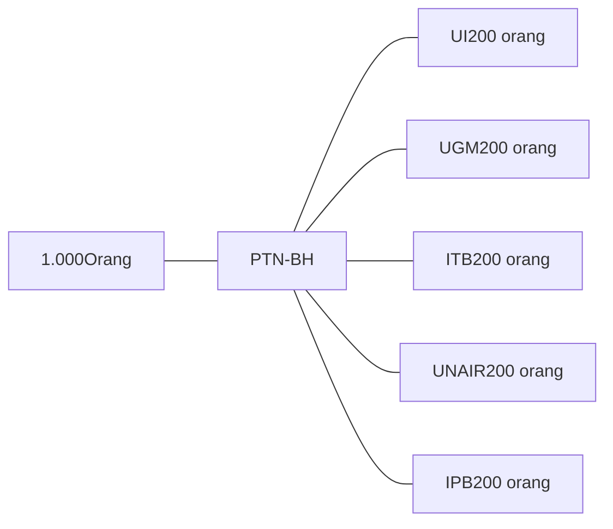

<table>
  <thead>
    <tr>
        <th>Tahun</th>
        <th>Akumulasi Target Luaran Artikel</th>
    </tr>
  </thead>
  <tbody>
    <tr>
        <td>2026</td>
        <td>2000 Q1 Publish</td>
    </tr>
    <tr>
        <td>2027</td>
        <td>1000 Top Tier I Submit</td>
    </tr>
    <tr>
        <td>2028</td>
        <td>1000 Top Tier I Publish &#x26; 1000 Top Tier II Submit</td>
    </tr>
    <tr>
        <td>2029</td>
        <td>1000 Top Tier II Publish</td>
    </tr>
  </tbody>
</table>

Total Output = 2.000 Q1 + 2.000 Top Tier Publish

logo: Scopus

logo: Clarivate Web of Science

icon: strategic steps

### Langkah Strategis

* Saat ini pada Renstra Kemdiktisaintek 2025-2029 **belum ada** Indikator Kinerja Program yang secara spesifik mengukur kontribusi percepatan publikasi ilmiah internasional bereputasi melalui *skema postdoctoral*.

* Kebutuhan tersebut didasarkan pada **IKSS 3.1** mengenai **Jumlah SDM Iptek (dosen, peneliti, perekayasa) per juta penduduk**. Oleh karena itu, perlu penajaman IKP menjadi **"Program Postdoctoral Nasional untuk meningkatkan luarannya dalam bentuk jumlah publikasi pada jurnal Q1 dan Top Tier"** dengan penanggung jawab **Ditjen Risbang**.

icon: funding simulation

### Simulasi Pendanaan

**Tunjangan postdoctoral:**

Rp10.000.000/bulan
(Rp120.000.000/tahun)

**Dana riset:**

Rp150.000.000/tahun

**Total investasi per orang:**
**Rp270.000.000/tahun**

**Investasi per-artikel**

**Q1** : 135 juta
**Top Tier** : 270 juta

icon: arrow

**Pendanaan**

**54 M/**tahun untuk 1 PTN-BH
**270 M/**Tahun untuk 5 PTN-BH
**810 M/**3 Tahun untuk 5 PTN-BH

## 4.7. POSTDOCTORALPROGRAM (2)

icon: Indonesian flag circle

### DAMPAK PROGRAM POSTDOCTORAL 2029

TERHADAP KINERJA PUBLIKASI 5 PTN-BH

<table>
  <thead>
    <tr>
<th colspan="2">PTN-BH</th>
<th>Baseline 2024</th>
<th colspan="12">Proyeksi Pemenuhan target Publikasi 2026-202G (Postdoctoral Program)</th>
    </tr>
    <tr>
<th>Target Q1 2026 (45%)</th>
<th>%Q1 Postdoc 2026</th>
<th>Target Top Tier 2028 (17%)</th>
<th>%Top Tier Postdoc 2028</th>
<th>Target Top Tier 202G (20%)</th>
<th>%Top Tier Postdoc 202G</th>
    <th colspan="9"></th></tr>
  </thead>
  <tbody>
    <tr>
<td>[icon: UI logo]</td>
<td>UI</td>
<td>4.202</td>
<td>2.080</td>
<td>19,23%</td>
<td>G57</td>
<td>20,89%</td>
<td>1.21G</td>
<td>16,41%</td>
<td colspan="6"></td>
    </tr>
    <tr>
<td>[icon: UGM logo]</td>
<td>UGM</td>
<td>4.189</td>
<td>2.074</td>
<td>19,29%</td>
<td>954</td>
<td>20,96%</td>
<td>1.215</td>
<td>16,46%</td>
<td colspan="6"></td>
    </tr>
    <tr>
<td>[icon: ITB logo]</td>
<td>ITB</td>
<td>2.995</td>
<td>1.483</td>
<td>26,98%</td>
<td>682</td>
<td>29,31%</td>
<td>869</td>
<td>23,03%</td>
<td colspan="6"></td>
    </tr>
    <tr>
<td>[icon: UNAIR logo]</td>
<td>UNAIR</td>
<td>3.445</td>
<td>1.705</td>
<td>23,46%</td>
<td>785</td>
<td>25,49%</td>
<td>999</td>
<td>20,02%</td>
<td colspan="6"></td>
    </tr>
    <tr>
<td>[icon: IPB logo]</td>
<td>IPB</td>
<td>2.643</td>
<td>1.308</td>
<td>30,57%</td>
<td>602</td>
<td>33,22%</td>
<td>766</td>
<td>26,09%</td>
<td colspan="6"></td>
    </tr>
  </tbody>
</table>

* Program *postdoctoral* memperbesar output publikasi bereputasi sehingga mendekatkan PTN-BH pada target nasional 2026-2029.

* Gap menuju target 15-20 % **Top Tier** dan 45-50 % **Q1** mengalami penurunan, dengan kontribusi tambahan terhadap **Top Tier** sebesar 16,41-32,22 % dan terhadap **Q1** sebesar 19,23-30,57 % melalui peningkatan output riset dari skema *postdoctoral*.

* Kinerja publikasi yang meningkat memperkuat posisi global kampus dalam indikator kualitas riset pada QS dan THE.

**Target Publikasi 2029**

**Top Tier**
**20%**

**Q1**
**50%**

logo: THE IMPACT RANKINGS

logo: QS WORLD UNIVERSITY RANKINGS

<footer>

35
</footer>

## 4.8. QS WORLD UNIVERSITY RANKING

icon: close button

Universitas Indonesia VS Universiti Malaya (UM) VS Chulalongkorn University VS National University of Singapore

<table>
  <thead>
    <tr>
        <th>Top Univ per Negara</th>
        <th>Universitas Indonesia</th>
        <th>Universiti Malaya (UM)</th>
        <th>Chulalongkorn University</th>
        <th>National University of Singapore</th>
    </tr>
  </thead>
  <tbody>
    <tr>
        <td>Ranking</td>
        <td>189</td>
        <td>58</td>
        <td>221</td>
        <td>8</td>
    </tr>
  </tbody>
</table>

Target Ranking QS WUR 2030
# TOP 100

### Program Dukungan

#### EQUITY WCU

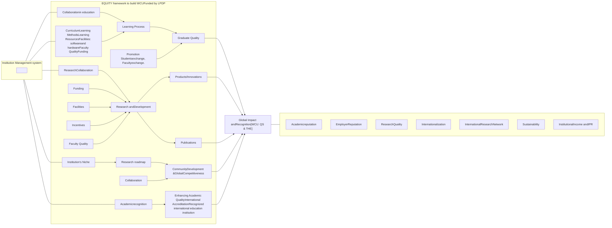

<table>
  <thead>
    <tr>
        <th colspan="7">QS World University Ranking: Ranked Indonesian Universities</th>
    </tr>
    <tr>
        <th>Perguruan Tinggi</th>
        <th>QS WUR 2025 (dipublikasikan 2024)</th>
        <th>QS WUR 2026 (dipublikasikan 2025)</th>
        <th>QS WUR 2027 (dipublikasikan 2026)</th>
        <th>QS WUR 2028 (dipublikasikan 2027)</th>
        <th>QS WUR 2029 (dipublikasikan 2028)</th>
        <th>QS WUR 2030 (dipublikasikan 2029)</th>
    </tr>
  </thead>
  <tbody>
    <tr>
        <td>Universitas Indonesia</td>
        <td>206</td>
        <td>189</td>
        <td>160</td>
        <td>140</td>
        <td>120</td>
        <td>100</td>
    </tr>
    <tr>
        <td>Universitas Gadjah Mada</td>
        <td>239</td>
        <td>224</td>
        <td>210</td>
        <td>195</td>
        <td>180</td>
        <td>170</td>
    </tr>
    <tr>
        <td>Institut Teknologi Bandung</td>
        <td>256</td>
        <td>255</td>
        <td>240</td>
        <td>220</td>
        <td>210</td>
        <td>200</td>
    </tr>
    <tr>
        <td>Universitas Airlangga</td>
        <td>308</td>
        <td>287</td>
        <td>270</td>
        <td>250</td>
        <td>230</td>
        <td>210</td>
    </tr>
    <tr>
        <td>Institut Pertanian Bogor</td>
        <td>426</td>
        <td>399</td>
        <td>370</td>
        <td>350</td>
        <td>330</td>
        <td>310</td>
    </tr>
    <tr>
        <td>Institut Teknologi Sepuluh Nopember</td>
        <td>585</td>
        <td>509</td>
        <td>490</td>
        <td>460</td>
        <td>430</td>
        <td>400</td>
    </tr>
    <tr>
        <td>Universitas Padjadjaran</td>
        <td>596</td>
        <td>515</td>
        <td>500</td>
        <td>470</td>
        <td>440</td>
        <td>410</td>
    </tr>
    <tr>
        <td>Universitas Diponegoro</td>
        <td>721-730</td>
        <td>624</td>
        <td>600</td>
        <td>570</td>
        <td>540</td>
        <td>500</td>
    </tr>
    <tr>
        <td>Universitas Brawijaya</td>
        <td>801-850</td>
        <td>680</td>
        <td>650</td>
        <td>620</td>
        <td>600</td>
        <td>580</td>
    </tr>
  </tbody>
</table>

## 4.9. HILIRISASI RISET

icon: document

### Latar Belakang

1

#### Proporsi Pendapatan Non SPP dan Non Negara

<table>
  <thead>
    <tr>
        <th>Universitas</th>
        <th>2019</th>
        <th>2020</th>
        <th>2021</th>
        <th>2022</th>
        <th>2023</th>
        <th>2024</th>
    </tr>
  </thead>
  <tbody>
    <tr>
        <td>UI</td>
        <td>40.68%</td>
        <td>37.08%</td>
        <td>39.92%</td>
        <td>34.92%</td>
        <td>39.95%</td>
        <td>45.77%</td>
    </tr>
    <tr>
        <td>UGM</td>
        <td>42.49%</td>
        <td>33.87%</td>
        <td>47.91%</td>
        <td>37.80%</td>
        <td>36.38%</td>
        <td>40.92%</td>
    </tr>
    <tr>
        <td>ITB</td>
        <td>39.70%</td>
        <td>37.40%</td>
        <td>37.88%</td>
        <td>44.12%</td>
        <td>46.43%</td>
        <td>53.18%</td>
    </tr>
    <tr>
        <td>UNAIR</td>
        <td>25.36%</td>
        <td>27.19%</td>
        <td>23.52%</td>
        <td>28.40%</td>
        <td>29.49%</td>
        <td>30.47%</td>
    </tr>
    <tr>
        <td>IPB</td>
        <td>39.59%</td>
        <td>40.33%</td>
        <td>39.74%</td>
        <td>40.54%</td>
        <td>34.52%</td>
        <td>37.08%</td>
    </tr>
  </tbody>
</table>

**Analisis (untuk Laporan Keuangan Tahun Terakhir)**

* Ketergantungan PT dari SPP : 28-42%;

* Ketergantungan PT dari Anggaran Negara: 12-28%;

* Pendapatan non-SPP dan non-Negara: 29-53%, dan skor Industry Income THE WUR: 27.9-59

* Rasio pendapatan terhadap total aset berkisar 47-81%;

* Dana Abadi berkisar Rp. 14-432 M

2

illustration: People asking "LAPANGAN PEKERJAAN 19 JUTA ORANG MANAA?!"

icon: arrow

**Target 2030**
**19 Juta**

### Langkah Strategis

#### Cascading Target Penciptaan Pekerjaan Formal Baru

**Target 2030**
**19 Juta**

icon: arrow

**Asumsi:**

1 Perusahaan = 250 karyawan

icon: arrow

**Perusahaan**
**76.000**

icon: arrow

**1% Technopreneur**
**760 perusahaan**

icon: arrow down

logo: DIKTISAINTEK BERDAMPAK
**Ditjen Risbang**

icon: arrow

icon: money bag

**Target 2026**
**1,242 T**

icon: arrow

**Hilirisasi Riset ke Industri**

**Tabel Data Industri Income dan Paten 10 PTN - 2025**

<table>
  <thead>
    <tr>
        <th>No.</th>
        <th>Ranking</th>
        <th>Perguruan Tinggi</th>
        <th>Industry (%)</th>
    </tr>
  </thead>
  <tbody>
    <tr>
        <td>1</td>
        <td>-</td>
        <td>ITB</td>
        <td>68,9</td>
    </tr>
    <tr>
        <td>2</td>
        <td>801-1000</td>
        <td>UI</td>
        <td>60,4</td>
    </tr>
    <tr>
        <td>3</td>
        <td>-</td>
        <td>UGM</td>
        <td>57,2</td>
    </tr>
    <tr>
        <td>4</td>
        <td>-</td>
        <td>IPB</td>
        <td>51,1</td>
    </tr>
    <tr>
        <td>5</td>
        <td>1001-1200</td>
        <td>UNS</td>
        <td>51</td>
    </tr>
    <tr>
        <td>6</td>
        <td>1501</td>
        <td>UNDIP</td>
        <td>45,4</td>
    </tr>
    <tr>
        <td>7</td>
        <td>-</td>
        <td>ITS</td>
        <td>42</td>
    </tr>
    <tr>
        <td>8</td>
        <td>-</td>
        <td>UNHAS</td>
        <td>31,3</td>
    </tr>
    <tr>
        <td>9</td>
        <td>-</td>
        <td>UNPAD</td>
        <td>27,9</td>
    </tr>
    <tr>
        <td>10</td>
        <td>-</td>
        <td>UNAIR</td>
        <td>24,8</td>
    </tr>
  </tbody>
</table>

icon: arrow
**2030**

**Industry Income & Paten PT**

icon: arrow up

Sumber: THE WUR Methodology

## 4.10. DIVERSIFIKASI PENDAPATAN PERGURUAN TINGGI

### Proyeksi Penurunan Proporsi Dosen ASN di PTN 2024-2035

Dari 65% ASN (2024) Menjadi 50% ASN (2035)

Proyeksi Jumlah Dosen di PTN 2024-2035 (Ribu Orang)

<table>
  <thead>
    <tr>
        <th>Tahun</th>
        <th>Dosen ASN (Ribu)</th>
        <th>Dosen Non-ASN (Ribu)</th>
        <th>Proporsi ASN (%)</th>
    </tr>
  </thead>
  <tbody>
    <tr>
        <td>2024</td>
        <td>198</td>
        <td>105</td>
        <td>65%</td>
    </tr>
    <tr>
        <td>2026</td>
        <td>175</td>
        <td>126</td>
        <td>58%</td>
    </tr>
    <tr>
        <td>2028</td>
        <td>175</td>
        <td>126</td>
        <td>55%</td>
    </tr>
    <tr>
        <td>2030</td>
        <td>126</td>
        <td>124</td>
        <td>55%</td>
    </tr>
    <tr>
        <td>2032</td>
        <td>174</td>
        <td>155</td>
        <td>46%</td>
    </tr>
    <tr>
        <td>2035</td>
        <td>178</td>
        <td>178</td>
        <td>50%</td>
    </tr>
  </tbody>
</table>

**Konsekuensi Bagi PTN**
* icon: coins Kenaikan UKT
* icon: students Peningkatan Daya Tampung Mahasiswa
* icon: teacher and student Rasio Dosen-Mahasiswa Lebih Tinggi

**Kebijakan Kemdiktisaintek**
* icon: clipboard Perluasan Skema PPPK Dosen Non-ASN
* icon: shield check Standarisasi Hak dan Perlindungan Dosen
* icon: hand holding campus Diversifikasi Pendapatan Kampus

PTN perlu menyesuaikan UKT dan daya tampung secara terbatas dan proporsional, karena PTN merupakan institusi layanan publik yang **tidak berorientasi profit**.

## 4.11. DANA ABADI

KEMENTERIAN PENDIDIKAN TINGGI,

icon: document

### Latar Belakang

## Dana Abadi Top 7 PTN-BH 2024

(Dalam Miliar Rp)

<table>
  <thead>
    <tr>
        <th rowspan="2">PERGURUAN TINGGI</th>
        <th>DANA ABADI 2024 (A)</th>
        <th>BEBAN OPERASIONAL (B)</th>
        <th rowspan="2">% (A/B)</th>
        <th>TOTAL ASET (C)</th>
        <th rowspan="2">% (A/C)</th>
    </tr>
    <tr>
        <th>2024 (A)</th>
        <th>(B)</th>
        <th>(C)</th>
    </tr>
  </thead>
  <tbody>
    <tr>
        <td>Universitas Indonesia</td>
        <td>136</td>
        <td>3.100</td>
        <td>4,39%</td>
        <td>6.502</td>
        <td>2,09%</td>
    </tr>
    <tr>
        <td>Universitas Gadjah Mada</td>
        <td>432</td>
        <td>2.818</td>
        <td>15,31%</td>
        <td>5.133</td>
        <td>8,41%</td>
    </tr>
    <tr>
        <td>Institut Teknologi Bandung</td>
        <td>250</td>
        <td>2.281</td>
        <td>10,96%</td>
        <td>2.928</td>
        <td>8,54%</td>
    </tr>
    <tr>
        <td>Universitas Airlangga</td>
        <td>350</td>
        <td>2.047</td>
        <td>17,10%</td>
        <td>4.060</td>
        <td>8,62%</td>
    </tr>
    <tr>
        <td>Institut Pertanian Bogor</td>
        <td>379</td>
        <td>1.750</td>
        <td>21,63%</td>
        <td>3.525</td>
        <td>10,74%</td>
    </tr>
    <tr>
        <td>Institut Teknologi Sepuluh Nopember</td>
        <td>104</td>
        <td>1.381</td>
        <td>7,52%</td>
        <td>2.300</td>
        <td>4,51%</td>
    </tr>
    <tr>
        <td>Universitas Padjadjaran</td>
        <td>72</td>
        <td>1.626</td>
        <td>4,42%</td>
        <td>1.663</td>
        <td>4,32%</td>
    </tr>
  </tbody>
</table>

Sumber: Laporan Keuangan Audited 7 PTN-BH, 2024

### Analisis

### Skenario 1

(Dalam Miliar Rp)

<table>
  <thead>
    <tr>
        <th>PERGURUAN TINGGI</th>
        <th>DANA ABADI 2024 (A)</th>
        <th>PERKIRAAN BAGI HASIL (B)</th>
        <th>BAGI HASIL YANG DIBUTUHKAN (C)</th>
        <th>DANA ABADI YANG DIBUTUHKAN (D)</th>
        <th>KEKURANGAN DANA ABADI (D-A)</th>
    </tr>
  </thead>
  <tbody>
    <tr>
        <td>Universitas Indonesia</td>
        <td>136</td>
        <td>6</td>
        <td>155</td>
        <td>3.263</td>
        <td>3.127</td>
    </tr>
    <tr>
        <td>Universitas Gadjah Mada</td>
        <td>432</td>
        <td>20</td>
        <td>141</td>
        <td>2.966</td>
        <td>2.535</td>
    </tr>
    <tr>
        <td>Institut Teknologi Bandung</td>
        <td>250</td>
        <td>1</td>
        <td>114</td>
        <td>2.401</td>
        <td>2.151</td>
    </tr>
    <tr>
        <td>Universitas Airlangga</td>
        <td>350</td>
        <td>17</td>
        <td>102</td>
        <td>2.155</td>
        <td>1.805</td>
    </tr>
    <tr>
        <td>Institut Pertanian Bogor</td>
        <td>379</td>
        <td>18</td>
        <td>88</td>
        <td>1.842</td>
        <td>1.464</td>
    </tr>
    <tr>
        <td>Institut Teknologi Sepuluh Nopember</td>
        <td>104</td>
        <td>5</td>
        <td>69</td>
        <td>1.454</td>
        <td>1.350</td>
    </tr>
    <tr>
        <td>Universitas Padjadjaran</td>
        <td>72</td>
        <td>3</td>
        <td>81</td>
        <td>1.712</td>
        <td>1.640</td>
    </tr>
  </tbody>
</table>

**Catatan:**

* Perkiraan bagi hasil diasumsikan menggunakan BI Rate Bulan November 2025 sebesar 4,75%

* Bagi hasil yang dibutuhkan diasumsikan 5% dari biaya operasional

### Analisis (Lanjutan)

icon: analysis

### Skenario 2

(Dalam Miliar Rp)

<table>
  <thead>
    <tr>
        <th>PERGURUAN TINGGI</th>
        <th>DANA ABADI 2024 (A)</th>
        <th>TOTAL ASET (B)</th>
        <th>% (C=A/B)</th>
        <th>DANA ABADI DIBUTUHKAN D</th>
        <th>KEKURANGAN DANA ABADI (E = D - A)</th>
    </tr>
  </thead>
  <tbody>
    <tr>
        <td>Universitas Indonesia</td>
        <td>136</td>
        <td>6.502</td>
        <td>2,09%</td>
        <td>975</td>
        <td>839</td>
    </tr>
    <tr>
        <td>Universitas Gadjah Mada</td>
        <td>432</td>
        <td>5.133</td>
        <td>8,41%</td>
        <td>770</td>
        <td>338</td>
    </tr>
    <tr>
        <td>Institut Teknologi Bandung</td>
        <td>250</td>
        <td>2.928</td>
        <td>8,54%</td>
        <td>439</td>
        <td>189</td>
    </tr>
    <tr>
        <td>Universitas Airlangga</td>
        <td>350</td>
        <td>4.060</td>
        <td>8,62%</td>
        <td>609</td>
        <td>259</td>
    </tr>
    <tr>
        <td>Institut Pertanian Bogor</td>
        <td>379</td>
        <td>3.525</td>
        <td>10,74%</td>
        <td>529</td>
        <td>150</td>
    </tr>
    <tr>
        <td>Institut Teknologi Sepuluh Nopember</td>
        <td>104</td>
        <td>2.300</td>
        <td>4,51%</td>
        <td>345</td>
        <td>241</td>
    </tr>
    <tr>
        <td>Universitas Padjadjaran</td>
        <td>72</td>
        <td>1.663</td>
        <td>4,32%</td>
        <td>249</td>
        <td>178</td>
    </tr>
  </tbody>
</table>

**Catatan:**

* Bagi hasil dibutuhkan diasumsikan 15% dari total aset

### Hasil Perbandingan 2 Skenario

<table>
  <thead>
    <tr>
        <th rowspan="2">PERGURUAN TINGGI</th>
        <th colspan="2">KEKURANGAN DANA ABADI</th>
    </tr>
    <tr>
        <th>SKENARIO 1</th>
        <th>SKENARIO 2</th>
    </tr>
  </thead>
  <tbody>
    <tr>
        <td>Universitas Indonesia</td>
        <td>3.127</td>
        <td>839</td>
    </tr>
    <tr>
        <td>Universitas Gadjah Mada</td>
        <td>2.535</td>
        <td>338</td>
    </tr>
    <tr>
        <td>Institut Teknologi Bandung</td>
        <td>2.151</td>
        <td>189</td>
    </tr>
    <tr>
        <td>Universitas Airlangga</td>
        <td>1.805</td>
        <td>259</td>
    </tr>
    <tr>
        <td>Institut Pertanian Bogor</td>
        <td>1.464</td>
        <td>150</td>
    </tr>
    <tr>
        <td>Institut Teknologi Sepuluh Nopember</td>
        <td>1.350</td>
        <td>241</td>
    </tr>
    <tr>
        <td>Universitas Padjadjaran</td>
        <td>1.640</td>
        <td>178</td>
    </tr>
  </tbody>
</table>

Analisis dua skenario menunjukkan perbedaan kebutuhan dana abadi yang kontras.

* Pada Skenario 1 (bagi hasil 5% biaya operasional, BI Rate 4,75%), kekurangan dana abadi masih sangat besar, misalnya UGM Rp2,535 triliun, Unair Rp1,805 triliun, dan ITS Rp1,350 triliun, sehingga mencerminkan target ideal jangka panjang.

icon: checkmark

* Pada Skenario 2 (proporsi dana abadi terhadap total aset), kebutuhan tambahan lebih moderat dan realistis, yaitu sekitar UGM Rp338 miliar, Unair Rp259 miliar, dan ITS Rp241 miliar, sehingga lebih layak sebagai tahapan awal penguatan dana abadi.

## 4.12. ALOKASI PENDAPATAN DANA MASYARAKAT

icon: blue square with arrow

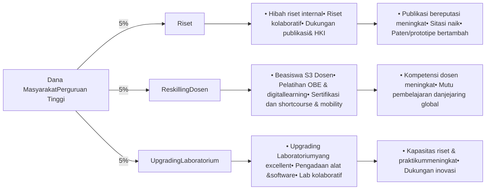

> **Contoh:**
> Rata-Rata Dana Masyarakat Top 5 PTNBH = Rp 1,04 T
> (sumber: Laporan Keuangan 5 PTNBH 2024)
> Alokasi dana riset = 5% x Rp 1,04 T = 54 M
> Asumsi:
> Dana hibah riset = Rp 100 jt/riset
> Sehingga diperoleh penelitian sebanyak = Rp. 54 M : Rp 100 JT
> **540 RISET**

> **Contoh:**
> Rata-Rata Dana Masyarakat Top 5 PTNBH = Rp 1,04 T
> (sumber: Laporan Keuangan 5 PTNBH 2024)
> Alokasi upskilling = 5% x Rp 1,04 T = 54 M
> Asumsi:
> Dana untuk dosen kuliah S3 dari dana upskilling SDM 40% = 20,8 M
> Biaya kuliah S3 rata-rata Rp 250 jt/orang (3 Tahun) = Rp 20,8 M : 250 juta
> **83 DOSEN**

> **Contoh:**
> Rata-Rata Dana Masyarakat Top 5 PTNBH = Rp 1,04 T
> (sumber: Laporan Keuangan 5 PTNBH 2024)
> Alokasi dana riset = 5% x Rp 1,04 T
> **54 M**

## BAB - V INDIKATOR KINERJA UTAMA DIKTISAINTEK BERDAMPAK

illustration: computer monitor, books, globe, and academic icons

## 5.1. RUANG LINGKUP DAMPAK SOSIAL, EKONOMI, DAN LINGKUNGAN PERGURUAN TINGGI

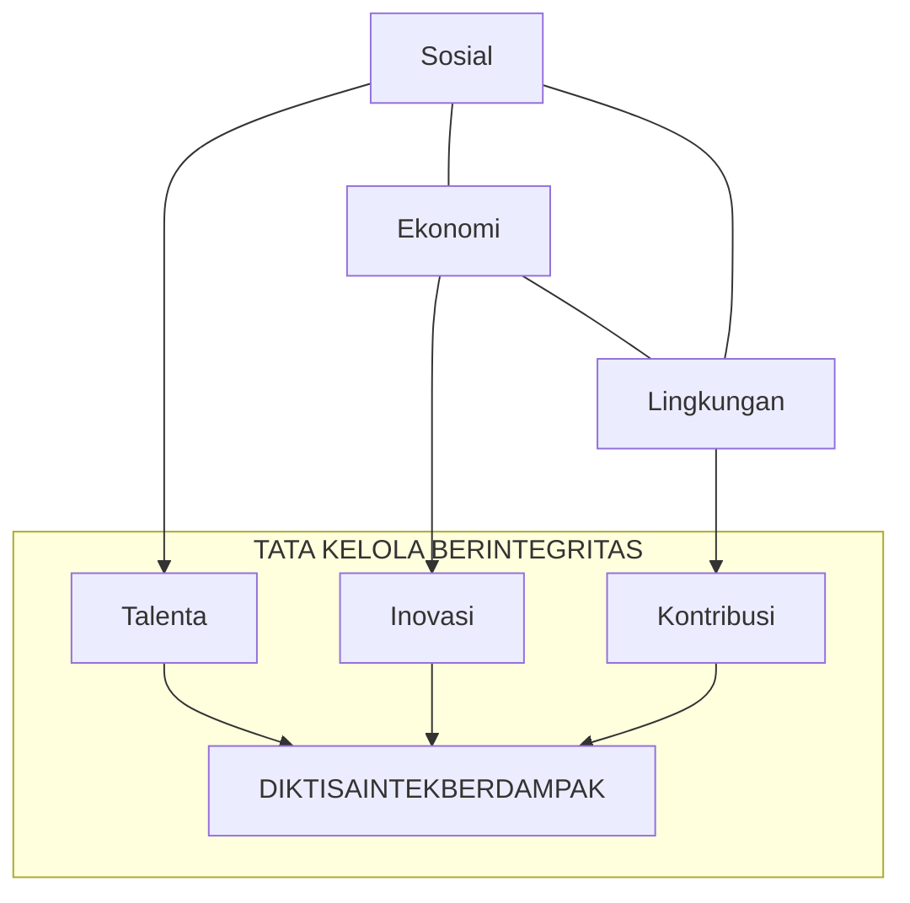

**Sosial**
1. Pendidikan Inklusif
2. Penelitian dan Inovasi
3. Pengabdian dan Pengembangan Masyarakat
4. Kebijakan Publik

**Ekonomi**
1. Pengajaran dan Pembelajaran
2. Penelitian dan Pertukaran Pengetahuan
3. Ekosistem Kewirausahaan
4. Kunjungan Akademik dan Pengeluaran Pengunjung
5. Pengeluaran Institusi

**Lingkungan**
1. Energi
2. Konsumsi bertanggung jawab
3. Transportasi
4. Keanekaragaman Hayati
5. Pendidikan dan Penelitian

## 5.2. RUANG LINGKUP INDIKATOR KINERJA UTAMA DIKTISAINTEK BERDAMPAK

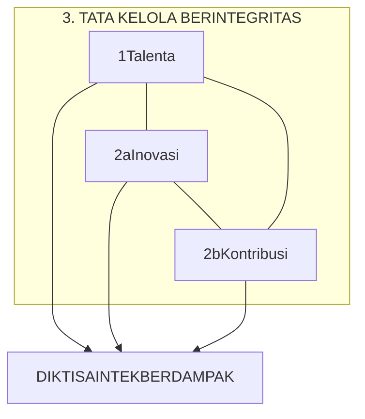

**1. Talenta**
*   **1** Angka Efisiensi Edukasi PT \*
*   **2** % Lulusan pendidikan tinggi & vokasi yang langsung bekerja/melanjutkan jenjang pendidikan berikutnya dalam jangka waktu 1 tahun setelah kelulusan \*
*   **3** % Mahasiswa S1 dan D4/D3/D2/D1 berkegiatan/Meraih prestasi di luar program studi \*
*   **4** Persentase Dosen PT yang mendapatkan rekognisi internasional

**2a. Inovasi**
*   **5** Rasio Luaran hasil kerjasama antara PT dan start-up/industri/lembaga \*
*   **6** % Publikasi bereputasi internasional (Scopus/WoS)\*

**2b. Kontribusi**
*   **8** % SDM PT (dosen, peneliti) yang terlibat langsung dalam penyusunan kebijakan (nasional/daerah/industri)
*   **7** % Keterlibatan Perguruan Tinggi dalam SDG 1 (Tanpa Kemiskinan) SDG 4 (Pendidikan Berkualitas), SDG 17 (Kemitraan), dan 2 (dua) SDGs lain sesuai keunggulan\*

**3. Tata Kelola Berintegritas**
*   **12** Ketersediaan perencanaan strategis peningkatan kesejahteraan dosen(\*)
*   **11**
    *   a. Opini WTP atas Laporan Keuangan Perguruan Tinggi (Alt 1)
    *   b. Predikit SAKiP Perguruan Tinggi (Alt 2),
    *   c. Jumlah Laporan Pelanggaran Integritas Akademik (Alt 3)
    *   d. Pencegahan dan Penanganan Anti Kekerasan, Anti Narkoba, dan Anti Korupsi
*   **10** Jumlah Usulan Zona Integritas - WBK/WBBM PT
*   **9** % Pendapatan Non Pendidikan/UKT \*

**Penjelasan Warna:**

*   **Biru Toska**: 

 Menggambarkan talenta yang bertumbuh, melakukan pembaruan, dan menciptakan perubahan
*   **Oranye**: Menggambarkan energi, kreativitas, dan semangat perubahan untuk terus berinovasi
*   **Kuning**: 

 Melambangkan optimisme & harapan, mencerminkan semangat perguruan tinggi dalam membawa energi positif bagi
*   **Abu-abu**: Melambangkan profesionalisme dan netralitas, mencerminkan tata kelola perguruan tinggi yang objektif dan
*   **Biru Tua**: 

 Melambangkan kepercayaan dan integritas, mencerminkan dampak kampus melalui talenta, riset, pengabdian, dan tata kelola

## 5.3. INDIKATOR KINERJA UTAMA (IKU) DIKTISAINTEK BERDAMPAK

<table>
  <thead>
    <tr>
        <th>No.</th>
        <th>Sasaran</th>
        <th>Indikator Kinerja Utama</th>
        <th>Wajib</th>
        <th>Pilihan</th>
    </tr>
  </thead>
  <tbody>
    <tr>
        <td rowspan="3">1.</td>
        <td rowspan="3">Talenta</td>
        <td>1. **Angka Efisiensi Edukasi Perguruan Tinggi. (*)**</td>
        <td>[yes]</td>
        <td> </td>
    </tr>
    <tr>
        <td>2. **Persentase lulusan pendidikan tinggi &#x26; vokasi yang langsung bekerja/melanjutkan jenjang pendidikan berikutnya dalam jangka waktu 1 tahun setelah kelulusan. (*)**</td>
        <td>[yes]</td>
        <td> </td>
    </tr>
    <tr>
        <td>3. **Persentase mahasiswa S1/D4/D3/D2/D1 berkegiatan /meraih prestasi di luar program studi. (*)**</td>
        <td>[yes]</td>
        <td> </td>
    </tr>
    <tr>
        <td> </td>
        <td> </td>
        <td>4. Persentase Dosen PT yang mendapatkan rekognisi internasional.</td>
        <td> </td>
        <td>[icon: black dot]</td>
    </tr>
    <tr>
        <td rowspan="2">2a.</td>
        <td rowspan="2">Inovasi</td>
        <td>5. **Rasio luaran hasil kerja sama antara PT dan start-up/industri/Lembaga. (*)**</td>
        <td>[yes]</td>
        <td> </td>
    </tr>
    <tr>
        <td>6. Persentase publikasi bereputasi internasional (Scopus/WoS).(**)</td>
        <td> </td>
        <td>[icon: black dot]</td>
    </tr>
    <tr>
        <td rowspan="2">2b.</td>
        <td rowspan="2">Kontribusi Pada Masyarakat</td>
        <td>7. <strong>Persentase keterlibatan Perguruan Tinggi dalam SDG 1 ((Tanpa Kemiskinan), SDG 4 (Pendidikan Berkualitas), SDG 17 (Kemitraan) dan 2 (dua) SDGs lain sesuai keunggulan.</strong>*</td>
        <td>[yes]</td>
        <td> </td>
    </tr>
    <tr>
        <td>8. Jumlah SDM PT (dosen, peneliti) yang terlibat langsung dalam penyusunan kebijakan (nasional/daerah/industri)</td>
        <td> </td>
        <td>[icon: black dot]</td>
    </tr>
    <tr>
        <td rowspan="4">3.</td>
        <td rowspan="4">Tata Kelola Berintegritas</td>
        <td>9. <strong>Persentase Pendapatan Non Pendidikan/UKT</strong>*</td>
        <td>[yes]</td>
        <td> </td>
    </tr>
    <tr>
        <td>10. Jumlah usulan Zona Integritas – WBK/WBBM</td>
        <td> </td>
        <td>[icon: black dot]</td>
    </tr>
    <tr>
        <td>11.1. Opini WTP atas Laporan Keuangan Perguruan Tinggi (Alt 1) 11.2. Predikat SAKIP Perguruan Tinggi (Alt 2) 11.3. Jumlah Laporan Pelanggaran Integritas Akademik (Alt 3) 11.4. Pencegahan dan Penanganan Anti Kekerasan, Anti Narkoba, dan Anti Korupsi (Alt 4)</td>
        <td> </td>
        <td>[icon: black dot]</td>
    </tr>
    <tr>
        <td>12. **Ketersediaan perencanaan strategis peningkatan kesejahteraan dosen(*)**</td>
        <td>[yes]</td>
        <td> </td>
    </tr>
  </tbody>
</table>

\* (*) IKU wajib bagi seluruh perguruan tinggi sebanyak 6 (enam).

\* (**) IKU Wajib bagi PTN-BH.

\* IKU pilihan sebanyak 5 (lima), PT dapat memilih 2 (dua) IKU dari 5 (lima) IKU pilihan.

\* Perguruan tinggi harus mengusulkan 1 (satu) IKU partisipatif. Contoh: Persentase alumni yang berkontribusi kembali (donasi, mentoring, kolaborasi penelitian, dsb.) pada kegiatan pengembangan kampus.

logo: KEMENTERIAN PENDIDIKAN TINGGI SAINS DAN TEKNOLOGI REPUBLIK INDONESIA logo: DIKTISAINTEK BERDAMPAK

## 5.3.1. Indikator Kinerja Utama (IKU) Wajib

1 **IKU 1: Angka Efisiensi Edukasi Perguruan Tinggi (*)**

<table>
  <thead>
    <tr>
        <th> </th>
        <th colspan="2">DEFINISI, KRITERIA, KETENTUAN, DAN FORMULA</th>
    </tr>
  </thead>
  <tbody>
    <tr>
        <td colspan="3">**IKU 1**</td>
    </tr>
    <tr>
        <td>**Definisi**</td>
        <td>Merupakan indikator yang mengukur tingkat keberhasilan mahasiswa menyelesaikan studi tepat waktu sesuai masa studi standar, dibandingkan dengan total mahasiswa yang masuk pada periode tertentu. Indikator AEE perguruan tinggi dihitung berdasarkan nilai rata-rata dari tingkat pencapaian AEE dari setiap program pendidikan dalam perguruan tinggi.  Sifat: IKU WAJIB</td>
        <td></td>
    </tr>
    <tr>
        <td>**Kriteria**</td>
        <td>a. Mahasiswa lulus tepat waktu sesuai masa tempuh kurikulum standar. b. Program pendidikan Diploma Satu (D1), Diploma Dua (D2), Diploma Tiga (D3), Diploma Empat (D4)/Sarjana Terapan, Sarjana, Magister, Magister Terapan, Doktor, Doktor Terapan, Profesi, Spesialis, dan Subspesialis. Program pendidikan ini dapat disesuaikan dengan jenjang pendidikan yang ada pada masing-masing perguruan tinggi.</td>
        <td></td>
    </tr>
    <tr>
        <td>**Ketentuan**</td>
        <td>a. Jumlah mahasiswa tahun akademik yang lulus sesuai dengan masa tempuh kurikulum, yaitu: &#x26;nbsp;&#x26;nbsp;&#x26;nbsp;1) Diploma Satu=2 semester; &#x26;nbsp;&#x26;nbsp;&#x26;nbsp;2) Diploma Dua= 4 semester; &#x26;nbsp;&#x26;nbsp;&#x26;nbsp;3) Diploma Tiga=6 semester; &#x26;nbsp;&#x26;nbsp;&#x26;nbsp;4) Diploma Empat/Sarjana Terapan atau Sarjana= 8 semester; &#x26;nbsp;&#x26;nbsp;&#x26;nbsp;5) Magister atau Magister Terapan=paling sedikit 3 semester; &#x26;nbsp;&#x26;nbsp;&#x26;nbsp;6) Doktor atau Doktor Terapan= 6 semester; dan &#x26;nbsp;&#x26;nbsp;&#x26;nbsp;7) Profesi/Spesialis/Subspesialis ditetapkan oleh perguruan tinggi bersama organisasi profesi; b. Jumlah mahasiswa tahun akademik yang masuk adalah jumlah seluruh mahasiswa yang terdaftar pada tahun akademik tersebut; c. Tidak dimasukkan dalam perhitungan IKU ini adalah jumlah mahasiswa pindah, jumlah mahasiswa DO (drop out), jumlah mahasiswa yang cuti lebih dari ketentuan.</td>
        <td>d. AEE Ideal: &#x26;nbsp;&#x26;nbsp;&#x26;nbsp;1) Diploma Satu : 100% &#x26;nbsp;&#x26;nbsp;&#x26;nbsp;2) Diploma Dua : 50% &#x26;nbsp;&#x26;nbsp;&#x26;nbsp;3) Diploma Tiga : 33% &#x26;nbsp;&#x26;nbsp;&#x26;nbsp;4) Sarjana/Sarjana Terapan : 25% &#x26;nbsp;&#x26;nbsp;&#x26;nbsp;5) Magister/Magister Terapan : 50% &#x26;nbsp;&#x26;nbsp;&#x26;nbsp;6) Doktor/Doktor Terapan : 33% &#x26;nbsp;&#x26;nbsp;&#x26;nbsp;7) Profesi/Spesialis/Subspesialis : Mengikuti masa tempuh kurikulum  Contoh: Profesi Akuntan masa studi = 1 tahun Maka AEE ideal profesi Akuntan = 1/1 x 100% = 100%</td>
    </tr>
  </tbody>
</table>

icon: 1

# IKU 1: Angka Efisiensi Edukasi Perguruan Tinggi (*) (2)

<table>
  <thead>
    <tr>
        <th>IKU 1</th>
        <th colspan="2">DEFINISI, KRITERIA, KETENTUAN, DAN FORMULA</th>
    </tr>
  </thead>
  <tbody>
    <tr>
        <td>Formula</td>
        <td>a. AEE = $\frac{Jumlah\ mahasiswa\ tahun\ akademik\ yang\ lulus\ sesuai\ masa\ tempuh\ kurikulum}{Total\ mahasiwa\ tahun\ akademik\ tersebut}$ x 100%  b. Tingkat Pencapaian AEE = $\frac{AEE\ Realisasi}{AEE\ Ideal}$ x 100%  c. AEE PT = $\sum_{i=1}^{n} \frac{Tingkat\ Pencapaian\ i}{n}$  Dimana: $i$ = program pendidikan (misalnya D3, D4, S1, S2, S3, dan seterusnya) $n$ = jumlah program pendidikan yang dihitung Tingkat Pencapaian AEE $i$ = hasil perbandingan antara AEE realisasi dan AEE ideal pada program pendidikan ( $i$ )  Contoh Perhitungan Capaian AEE dengan Basis Normalisasi Diketahui: a. AEE ideal D3 = 33%, AEE D3 realisasi = 30% b. AEE ideal D4 = 25%, AEE D4 realisasi = 20% c. AEE ideal S1 = 25%, AEE S1 realisasi = 20% d. AEE ideal S2 = 50%, AEE S2 realisasi = 45% e. AEE ideal S3 = 33%, AEE S3 realisasi = 30%</td>
        <td>a. Tingkat pencapaian AEE D3 = $\frac{30\%}{33\%}$ = 90,91% b. Tingkat pencapaian AEE D4 = $\frac{20\%}{25\%}$ = 80,00 c. Tingkat pencapaian AEE S1 = $\frac{20\%}{25\%}$ = 80,00% d. Tingkat pencapaian AEE S2 = $\frac{45\%}{50\%}$ = 90% e. Tingkat pencapaian AEE S3 = $\frac{30\%}{33\%}$ = 90,91%  AEE PT = $\frac{90,91\%+80\%+80\%+90\%+90,91\%}{5}$ = 86,36%</td>
    </tr>
    <tr>
        <td>Satuan</td>
        <td colspan="2">% (Persentase) Hasil Perhitungan Normalisasi</td>
    </tr>
  </tbody>
</table>

KEMENTERIAN PENDIDIKAN TINGGI,

icon: 2

IKU 2: Persentase Lulusan Pendidikan Tinggi dan Vokasi yang Langsung Bekerja/Melanjutkan Jenjang Pendidikan Berikutnya/ Berwirausaha dalam Jangka Waktu 1 Tahun Setelah Kelulusan. (*)

<table>
  <thead>
    <tr>
        <th>IKU 2</th>
        <th colspan="18">DEFINISI, KRITERIA, KETENTUAN, DAN FORMULA</th>
    </tr>
  </thead>
  <tbody>
    <tr>
        <td rowspan="2">Definisi</td>
        <td colspan="2">Merupakan indikator yang mengukur proporsi lulusan yang: a. setelah lulus kuliah langsung bekerja, berwirausaha, atau melanjutkan jenjang pendidikan yang lebih tinggi; atau b. telah bekerja atau berwirausaha sebelum lulus kuliah dan tetap menjalankan pekerjaan atau usahanya tersebut pada saat lulus.</td>
        <td colspan="16"></td>
    </tr>
    <tr>
        <td colspan="18">Indikator ini dihitung sebagai persentase jumlah lulusan yang memenuhi kriteria pada huruf a dan/atau huruf b dibandingkan dengan jumlah seluruh lulusan yang ditelusuri pada periode pengukuran.</td>
    </tr>
    <tr>
        <th>Kriteria</th>
        <th>Sifat: IKU WAJIB a. Cakupan lulusan yang diukur adalah lulusan yang status bekerja, berwirausaha, atau melanjutkan studi diketahui dalam jangka waktu paling lama 1 (satu) tahun setelah kelulusan, termasuk lulusan yang telah bekerja atau berwirausaha sebelum lulus. b. Kriteria bagi lulusan yang setelah lulus kuliah bekerja: 1) masa tunggu, upah minimum provinsi (UMP), dan bobot penilaian: 1) masa tunggu &#x3C; 6 bulan dan gaji > 1.2x UMP (Bobot = 1); a) masa tunggu &#x3C; 1 tahun dan gaji > 1.2x UMP (Bobot = 0,8); dan b) masa tunggu &#x3C; 1 tahun dan gaji &#x3C; 1.2x UMP (Bobot = 0,6). 2) tempat bekerja sebagaimana dimaksud pada huruf b meliputi: a) perusahaan swasta (termasuk perusahaan nasional, multinasional, startup, UMKM, dst.); b) lembaga/organisasi nirlaba; c) institusi/organisasi multilateral (misal: PBB, UNICEF, dsb); atau d) instansi Pemerintah, BUMN, atau BUMD.</th>
        <th>c. Kriteria bagi lulusan yang setelah lulus kuliah berwirausaha:  Posisi</th>
        <th colspan="4">Kriteria dan Bobot </th>
        <th>&#x3C;6 bulan dan >1,2 UMP</th>
        <th>>6 bulan dan >1,2 UMP</th>
        <th>&#x3C;6 bulan dan &#x3C;1,2 UMP</th>
        <th>>6 bulan dan &#x3C;1,2 UMP Founder/ Co-Founder</th>
        <th>1,2</th>
        <th>1</th>
        <th>0,8</th>
        <th>0,6 Freelancer</th>
        <th>0,5</th>
        <th>0,4</th>
        <th>0,3</th>
        <th>0,2  1) mulai berwirausaha sebagai pendiri (<em>founder</em>) atau ikut mendirikan (<em>co-founder</em>) perusahaan; atau 2) mulai bekerja sebagai pekerja lepas (<em>freelancer</em>). d. Kriteria bagi lulusan yang setelah lulus kuliah melanjutkan studi: 1) mendapatkan surat penerimaan untuk melanjutkan studi dari perguruan tinggi dalam negeri atau luar negeri dalam jangka waktu &#x3C;12 bulan (kurang dari dua belas bulan) setelah lulus (setara dengan kriteria pada huruf b butir 1 (c), bobot = 0,6).</th>
    </tr>
  </tbody>
</table>

KEMENTERIAN PENDIDIKAN TINGGI,

## 2 IKU 2: Persentase Lulusan Pendidikan Tinggi dan Vokasi yang Langsung Bekerja/Melanjutkan Jenjang Pendidikan Berikutnya/ Berwirausaha dalam Jangka Waktu 1 Tahun Setelah Kelulusan. (*) (2)

<table>
  <thead>
    <tr>
        <th>IKU 2</th>
        <th colspan="2">DEFINISI, KRITERIA, KETENTUAN, DAN FORMULA</th>
    </tr>
  </thead>
  <tbody>
    <tr>
        <td><strong>Kriteria</strong></td>
        <td>e. Kriteria lulusan yang mendapatkan pekerjaan sebelum lulus kuliah: 1) mahasiswa yang belum lulus namun sudah memperoleh pekerjaan dan berpenghasilan >1,2 x UMP sebelum lulus bekerja di perusahaan (setara dengan kriteria pada huruf b, yaitu bobot = 1); 2) tempat bekerja sebagaimana dimaksud pada huruf b meliputi: a) perusahaan swasta (termasuk nasional, multinasional, startup, UMKM, dst.); b) lembaga/organisasi nirlaba; c) institusi/organisasi multilateral (misal: PBB, UNICEF, dsb); atau d) instansi Pemerintah, BUMN, atau BUMD.</td>
        <td>f. Kriteria lulusan yang sudah berwirausaha sebelum lulus: 1) memiliki penghasilan >1,2 x UMP sebagai pendiri (founder) atau ikut mendirikan (co-founder) perusahaan atau sebagai pekerja lepas (setara dengan kriteria pada huruf b butir 1 (a), bobot = 1). 2) memiliki penghasilan &#x3C;1,2 x UMP sebagai pendiri (founder) atau ikut mendirikan (co-founder) perusahaan atau sebagai pekerja lepas (setara dengan kriteria pada huruf b butir 1 (c), bobot = 0,6).</td>
    </tr>
    <tr>
        <td><strong>Ketentuan</strong></td>
        <td colspan="2">Data diperoleh melalui hasil tracer study yang dilakukan 1 (satu) tahun setelah kelulusan, dengan batas minimum responden menggunakan rumus Slovin dengan galat 2,3%.</td>
    </tr>
    <tr>
        <td><strong>Formula</strong></td>
        <td>$$\frac{\sum_1^i n_i k_i}{t} \times 100\%$$  n = responden yang merupakan lulusan D1, D2, D3, D4/Sarjana Terapan, dan/atau Sarjana yang berhasil mendapat pekerjaan, melanjutkan studi, atau menjadi wiraswasta. t = total responden lulusan D1, D2, D3, D4/Sarjana Terapan, dan/atau Sarjana yang berhasil dikumpulkan (terdapat batas minimum persentase responden yang dikumpulkan sesuai dengan ketentuan diatas). k = konstanta bobot dengan mengacu pada kriteria poin (b), (c), (d), (e), dan (f).</td>
        <td>Formula Responden Minimum  $$n = \frac{N}{Nd^2 + 1} \times 100\%$$  n = jumlah responden minimum. N = jumlah lulusan. d = Galat (2,3%).</td>
    </tr>
    <tr>
        <td><strong>Satuan</strong></td>
        <td colspan="2">% (Persentase)</td>
    </tr>
  </tbody>
</table>

KEMENTERIAN PENDIDIKAN TINGGI,

## 3 IKU 3: Persentase Mahasiswa S1 dan D4/D3/D2/D1 Berkegiatan/Meraih Prestasi di Luar Program Studi (*)

<table>
  <thead>
    <tr>
        <th>IKU 3</th>
        <th>DEFINISI, KRITERIA, KETENTUAN, DAN FORMULA</th>
    </tr>
  </thead>
  <tbody>
    <tr>
        <td rowspan="2"><strong>Definisi</strong></td>
        <td>Merupakan indikator yang mengukur proporsi mahasiswa Program Diploma dan Sarjana yang memperoleh pengalaman pembelajaran atau prestasi di luar program studinya, yang diakui secara resmi oleh perguruan tinggi.</td>
    </tr>
    <tr>
        <td><strong>Sifat: IKU WAJIB</strong></td>
    </tr>
    <tr>
        <td><strong>Kriteria</strong></td>
        <td>a. Kriteria kegiatan di luar program studi: 1) dilaksanakan dengan pendampingan oleh dosen pembimbing; 2) memperoleh pengakuan satuan kredit semester; dan 3) meliputi kegiatan sebagai berikut: a) magang atau praktik kerja, yang dilaksanakan pada: • perusahaan swasta (termasuk perusahaan nasional, multinasional, startup, UMKM, dst.); • lembaga/organisasi nirlaba; • institusi/organisasi multilateral (misal: PBB, UNICEF, dsb); atau • instansi Pemerintah, BUMN, atau BUMD; b) program mahasiswa Berdampak, berupa program sosial/pengabdian kepada masyarakat untuk pemberdayaan masyarakat di daerah bencana, pedesaan atau daerah terpencil dalam membangun ekonomi rakyat, infrastruktur, dan lainnya; b) pertukaran mahasiswa, berupa mengambil kelas atau semester di perguruan tinggi luar negeri maupun dalam negeri, berdasarkan perjanjian kerja sama yang sudah diadakan antar perguruan tinggi atau pemerintah, dan mendapatkan rekognisi serta pengakuan dalam sistem kredit semester; dan/atau c) penelitian atau riset, berupa kegiatan penelitian ilmiah, baik sains maupun sosial humaniora, yang dilakukan di bawah pengawasan dosen atau peneliti. b. Kriteria prestasi di luar program studi: 1) berupa kompetisi atau lomba; 2) pada tingkat provinsi, nasional, dan/atau internasional; dan 3) keikutsertaannya dibuktikan dengan sertifikat penghargaan, paling rendah sebagai finalis yang divalidasi oleh dosen pembimbing atau kepala program studi.</td>
    </tr>
    <tr>
        <td><strong>Ketentuan</strong></td>
        <td>a. Kegiatan di luar program studi sebagaimana dimaksud di atas dapat dikombinasikan dan dihitung kumulatif. b. Pelaksanaan kegiatan magang atau praktik kerja tidak dapat diperhitungkan bagi program studi pada pendidikan vokasi yang telah memiliki program magang atau praktik kerja wajib. c. Pelaksanaan kegiatan pertukaran mahasiswa dapat dilaksanakan dengan mitra perguruan tinggi luar negeri dan/atau dalam negeri dengan tidak dibatasi ranking atau peringkat akreditasi.</td>
    </tr>
  </tbody>
</table>

icon: 3

KEMENTERIAN PENDIDIKAN TINGGI,

## IKU 3: Persentase Mahasiswa S1 dan D4/D3/D2/D1 Berkegiatan/Meraih Prestasi di Luar Program Studi (*) (2)

<table>
  <thead>
    <tr>
        <th>IKU 3</th>
        <th colspan="2">DEFINISI, KRITERIA, KETENTUAN, DAN FORMULA</th>
    </tr>
  </thead>
  <tbody>
    <tr>
        <td rowspan="2">Ketentuan</td>
        <td>d. Pelaksanaan kegiatan penelitian atau riset oleh mahasiswa dapat dilakukan bersama dengan: 1) dosen tetap dari perguruan tinggi asal; 2) dosen tetap dari perguruan tinggi lain; 3) lembaga riset yang bereputasi; 4) perusahaan multinasional (didampingi dosen pembimbing); dan/atau 5) Pemerintah/BUMN/BUMD (didampingi dosen pembimbing).</td>
        <td></td>
    </tr>
    <tr>
        <td colspan="2">e. Pelaksanaan kegiatan program mahasiswa berdampak dilakukan dengan ketentuan topik dan format proyek bebas, namun dosen menilai mutu dari aspek penetapan topik, perencanaan, pelaksanaan, dan hasil. Sebagai contoh, bentuk proyek bisa mencakup: 1) tim lomba internasional (misal formula race, lomba robot, mobil hemat energi, cansat, dsb.); 2) proyek untuk mewujudkan rancangan engineering, teknologi, maupun sosial; atau 3) capstone design project (standar ABET).</td>
    </tr>
    <tr>
        <td rowspan="2">Formula</td>
        <td colspan="2">$$ \frac{\sum_{1}^{i} n_{i} k_{i}}{t} \times 100\% $$</td>
    </tr>
    <tr>
        <td>n = jumlah mahasiswa program Sarjana dan Diploma yang mendapatkan pengalaman dan pengakuan satuan kredit semester di luar kampus dan meraih prestasi minimal tingkat provinsi t = total mahasiswa. k = konstanta bobot  Ketentuan Bobot Prestasi: 1. Tingkat internasional a. Juara 1, bobot = 1 b. Juara 2, 3, atau favorit, bobot = 0,5 c. Juara harapan, bobot = 0,3 d. Finalis, bobot = 0,2</td>
        <td>2. Tingkat nasional a. Juara 1, bobot = 0,6 b. Juara 2, 3, atau favorit, bobot = 0,3 c. Juara harapan, bobot = 0,20 d. Finalis, bobot = 0,10 3. Tingkat provinsi a. Juara 1, bobot = 0,4 b. Juara 2, 3, atau favorit, bobot = 0,2 c. Juara harapan, bobot = 0,10 d. Finalis, bobot = 0,05  Ketentuan Bobot Pembelajaran di Luar Kampus: 1. Pembelajaran ≤ 5 SKS, bobot = 0,4 2. Pembelajaran 6 - 10 SKS, bobot = 0,6 3. Pembelajaran ≥ 10 SKS, bobot = 1</td>
    </tr>
    <tr>
        <td>Satuan</td>
        <td>% (Persentase)</td>
        <td> </td>
    </tr>
  </tbody>
</table>

## 4 IKU 5 : Rasio Luaran Hasil Kerjasama Antara Perguruan Tinggi dan Start-Up/Industri/Lembaga (*)

<table>
  <thead>
    <tr>
        <th>IKU 5</th>
        <th colspan="2">DEFINISI, KRITERIA, KETENTUAN, DAN FORMULA</th>
    </tr>
  </thead>
  <tbody>
    <tr>
        <td><strong>Definisi</strong></td>
        <td colspan="2">Merupakan indikator yang mengukur proporsi luaran yang dihasilkan dari kerja sama dan hilirisasi antara perguruan tinggi dengan industri dan/atau lembaga mitra dalam periode tertentu. Sifat: IKU WAJIB</td>
    </tr>
    <tr>
        <td><strong>Kriteria</strong></td>
        <td><strong>Kriteria Luaran Kerja Sama</strong> a. Karya tulis ilmiah, dapat berupa: 1) jurnal ilmiah, buku akademik, dan chapter dalam buku akademik hasil karya kolaborasi memenuhi kriteria: a) adanya keterlibatan aktif pihak mitra (startup/pemerintah/lembaga) sebagai penulis, kontributor data, atau penyandang dana riset; b) terbit di jurnal bereputasi nasional/internasional (terindeks Sinta, Scopus, WoS, atau sejenis). c) karya berfokus pada isu strategis atau kebutuhan praktis mitra, dengan kontribusi teoritis dan aplikatif; d) memperoleh sitasi, penghargaan, atau menjadi rujukan dalam kebijakan atau inovasi mitra; dan/ atau e) Ada dokumen pendukung seperti MoU/MoA, surat tugas, atau acknowledgment yang menunjukkan kolaborasi resmi. 2) karya rujukan hasil kolaborasi berupa handbook, guidelines, manual, textbook, monograf, ensiklopedia, kamus yang memenuhi kriteria: a) mitra terlibat dalam penyusunan konten, validasi substansi, atau penggunaan hasil karya sebagai acuan operasional; b) karya digunakan atau diimplementasikan dalam kebijakan, program, atau kegiatan mitra (dibuktikan dengan surat penerapan/penggunaan); c) mengandung analisis berbasis riset dan metodologi ilmiah yang dapat dipertanggungjawabkan; d) telah dipublikasikan melalui penerbit resmi, memiliki ISBN/ISSN, dan tersedia untuk publik/mitra; dan/ atau e) menjadi referensi dalam pelatihan, pedoman kerja, atau kebijakan teknis di institusi mitra.</td>
        <td>3) studi kasus kolaborasi memenuhi kriteria: a) studi kasus menggambarkan isu nyata yang dihadapi mitra, serta kontribusi solusi dari perguruan tinggi; b) disusun dengan pendekatan ilmiah (deskriptif, analitik, atau evaluatif) dan menggunakan data empiris hasil kerja sama; c) ada bukti partisipasi mitra dalam perumusan masalah, pengumpulan data, dan validasi hasil; d) hasil studi kasus menghasilkan perubahan kebijakan atau peningkatan kinerja, atau model praktik baik; dan/ atau e) studi kasus dipublikasikan dalam prosiding, repositori institusi, atau laporan kerja sama resmi yang dapat diakses publik. b. Karya terapan, dapat berupa: 1) produk fisik, digital, dan algoritme (termasuk prototipe) hasil kolaborasi memenuhi kriteria: a) adanya MoU/MoA aktif dengan startup, pemerintah, atau lembaga; b) mitra berkontribusi dalam pendanaan, uji coba, atau penyempurnaan desain; c) produk memiliki potensi atau telah didaftarkan HKI (paten, desain industri, hak cipta software); d) didaftarkan atas nama perguruan tinggi dan mitra kolaborator; e) produk menjawab permasalahan aktual mitra / masyarakat; f) ada potensi ekonomi, sosial, atau lingkungan yang terukur; dan g) luaran mendapat pengakuan nasional/internasional (misal penghargaan inovasi, paten granted, pilot resmi); dan/atau</td>
    </tr>
  </tbody>
</table>

icon: 4

## IKU 5 : Rasio Luaran Hasil Kerjasama Antara Perguruan Tinggi dan Start-Up/Industri/Lembaga (*) (2)

<table>
  <thead>
    <tr>
        <th>IKU 5</th>
        <th colspan="2">DEFINISI, KRITERIA, KETENTUAN, DAN FORMULA</th>
    </tr>
  </thead>
  <tbody>
    <tr>
        <td>Kriteria</td>
        <td>2) pengembangan invensi dengan mitra memenuhi kriteria: a) adanya kegiatan penelitian dan pengembangan (<em>research and development</em>/R&#x26;D) bersama (<em>joint research, co-creation</em>); b) mitra berperan dalam pengujian, pembiayaan, atau pengembangan; c) ada peta jalan pengembangan menuju produk siap pasar; d) invensi telah diajukan atau didaftarkan HKI bersama; e) ada perjanjian kepemilikan hasil riset bersama mitra; f) invensi menunjukkan kebaruan (<em>novelty</em>) dan relevansi dengan kebutuhan mitra; g) ada potensi penerapan lintas sektor; dan/ atau h) luaran mendapat pengakuan nasional/internasional (misal penghargaan inovasi, paten granted, pilot resmi). c. Karya Seni Karya seni hasil kolaborasi dapat berupa: 1) visual, audio; 2) audio-visual; atau 3) pertunjukan (<em>performance</em>) yang memenuhi kriteria: a) adanya MoU/MoA atau surat perjanjian kerja sama yang memuat kolaborasi seni;mitra berperan dalam pembiayaan, kurasi, penyelenggaraan, atau diseminasi karya; b) karya dapat berupa seni rupa, musik, teater, tari, film, desain, kriya, atau media baru; c) dihasilkan dari proses kreatif bersama antara perguruan tinggi dan mitra; d) karya menunjukkan keunikan artistik dan unsur kebaruan dalam tema, bentuk, atau media; e) terdapat elemen riset artistik (<em>art-based research</em>) atau inovasi media digital; f) karya memberi dampak sosial, budaya, atau edukatif bagi masyarakat; g) terkait dengan isu lokal, kearifan budaya, atau pembangunan karakter bangsa;</td>
        <td>h) mendapat pengakuan nasional/internasional dalam bentuk penghargaan, seleksi pameran, kurasi, atau publikasi; dan i) terdaftar di lembaga seni/budaya atau sistem indeks karya kreatif (misal ISI, PDDikti, SINTA Karya Seni).  <strong>Kriteria Luaran Hilirisasi (Pemanfaatan/Penerapan):</strong> a. karya tulis ilmiah, dapat berupa: 1) jurnal ilmiah, buku akademik, dan chapter dalam buku akademik hasil karya kolaborasi, berupa: a) artikel hasil riset bersama; atau b) buku akademik kolaboratif; 2) karya rujukan kolaborasi berupa handbook, guidelines, manual, textbook, monograf, ensiklopedia, kamus yang dipakai oleh pemerintah, perusahaan, atau organisasi luar dan diterapkan dalam sebuah proyek atau kegiatan; dan/atau 3) studi kasus kolaborasi berupa <em>Case study</em> berbasis implementasi hasil kerja sama; dan/atau  b. karya terapan, dapat berupa: 1) produk fisik, digital, dan algoritme (termasuk prototipe) hasil kolaborasi memenuhi kriteria: a) produk diterapkan, diuji, atau dikomersialisasikan melalui mitra; b) ada rencana keberlanjutan (<em>maintenance</em>, lisensi, scaling); c) hasil TTG (Teknologi Tepat Guna) sudah dimanfaatkan masyarakat; dan/ atau d) pengembangan sistem model yang bisa dimanfaatkan oleh start-up/pemerintah/Lembaga; dan/atau 2) pengembangan invensi dengan mitra memenuhi kriteria: a) ada bentuk nyata penerapan hasil invensi (pilot project, kebijakan baru, produk komersial); dan/ atau b) meningkatkan kapasitas mitra atau menghasilkan nilai tambah ekonomi/sosial.</td>
    </tr>
  </tbody>
</table>

icon: 4

IKU 5 : Rasio Luaran Hasil Kerjasama Antara Perguruan Tinggi dan Start-Up/Industri/Lembaga (*) (3)

<table>
  <thead>
    <tr>
        <th>IKU 5</th>
        <th>DEFINISI, KRITERIA, KETENTUAN, DAN FORMULA</th>
    </tr>
  </thead>
  <tbody>
    <tr>
        <td rowspan="2">Kriteria</td>
        <td>c. Karya seni Karya seni hasil kolaborasi dapat berupa: 1) visual, audio; 2) audio-visual; atau 3) pertunjukan (<em>performance</em>) yang memenuhi kriteria: a) karya seni yang di-expose dan memiliki pemanfaatan nyata di masyarakat, baik melalui pameran, festival, pertunjukan, publikasi, platform digital, lisensi, atau bentuk komersialisasi lainnya; dan b) ada rencana keberlanjutan (produksi lanjutan, replikasi, atau pengembangan pasar).</td>
    </tr>
    <tr>
        <td>a. Indikator ini mengukur hasil kerja sama perguruan tinggi dengan mitra eksternal yang telah dimanfaatkan atau diterapkan oleh mitra. b. Hasil kerja sama merupakan capaian kolaborasi aktif antara perguruan tinggi dan mitra, yang dibuktikan dengan dokumen kerja sama resmi. c. Capaian dapat berbentuk karya tulis ilmiah, karya terapan, dan/atau karya seni.</td>
    </tr>
    <tr>
        <td>Ketentuan</td>
        <td>d. Capaian dinilai apabila telah dimanfaatkan, diterapkan, atau dihilirisasi melalui penggunaan dalam kebijakan, program, proses bisnis, pembelajaran, layanan, atau kegiatan komersial mitra. e. Pemenuhan indikator dibuktikan dengan dokumen pemanfaatan, antara lain surat penerapan, laporan implementasi, bukti komersialisasi, lisensi, atau bentuk pengakuan lain yang sah.</td>
    </tr>
    <tr>
        <td>Formula</td>
        <td>$$\frac{\text{Jumlah luaran hasil kerjasama PT dan start - up/industri/lembaga}}{\text{Total Kerjasama Perguruan Tinggi}} \times 100\%$$  Keterangan: Jumlah luaran hasil kerja nsama perguruan tinggi dan start-up/industri/lembaga adalah jumlah judul atau jumlah karya, bukan jumlah dosen yang terlibat.</td>
    </tr>
    <tr>
        <td>Satuan</td>
        <td>% (Persentase)</td>
    </tr>
  </tbody>
</table>

icon: 5

## IKU 7 : Persentase Keterlibatan Perguruan Tinggi dalam SDG 1 (Tanpa Kemiskinan), SDG4 Pendidikan Berkualitas), SDG17 (Kemitraan), dan 2 (dua) SDGs Lain Sesuai Keunggulan (*)

<table>
  <thead>
    <tr>
        <th>IKU 7</th>
        <th colspan="2">DEFINISI, KRITERIA, KETENTUAN, DAN FORMULA</th>
    </tr>
  </thead>
  <tbody>
    <tr>
        <td><strong>Definisi</strong></td>
        <td colspan="2">Merupakan indikator yang mengukur proporsi program, kegiatan, penelitian, pengabdian kepada masyarakat, kerja sama, atau inisiatif lain yang dilaksanakan perguruan tinggi dan secara langsung berkontribusi pada pencapaian <em>Sustainable Development Goals</em> (SDGs). Dengan ketentuan bahwa keterlibatan pada SDG 1 (<em>No Poverty</em>), SDG 4 (<em>Quality Education</em>), dan SDG 17 (<em>Partnership for the Goals</em>), serta ditambah dengan 2 (dua) SDGs lain yang dipilih sesuai keunggulan, spesialisasi, atau konteks strategis masing-masing perguruan tinggi.  Sifat: IKU WAJIB</td>
    </tr>
    <tr>
        <td><strong>Kriteria</strong></td>
        <td>Luaran kegiatan yang dapat diakui sebagai kontribusi perguruan tinggi terhadap SDGs mencakup bidang: a. pendidikan, berupa antara lain: kurikulum, mata kuliah, modul, atau program literasi yang terintegrasi dengan SDGs; b. penelitian, berupa antara lain: proyek riset, publikasi, atau produk inovasi yang secara langsung mendukung target SDGs; c. pengabdian kepada masyarakat, berupa antara lain: program pemberdayaan masyarakat, KKN tematik, pelatihan, atau layanan yang berkontribusi pada SDGs; d. kerja sama dan kemitraan, berupa antara lain: kolaborasi dengan pemerintah, industri, lembaga internasional, atau komunitas yang mendukung pencapaian SDGs; dan e. inisiatif institusional, berupa antara lain: kebijakan internal perguruan tinggi yang berorientasi pada SDGs.</td>
        <td>Penerapan kriteria kegiatan sebagaimana dimaksud dalam huruf a sampai dengan huruf e dilaksanakan, antara lain, dalam konteks tujuan SDGs wajib sebagai berikut: a. SDG 1 – Tanpa Kemiskinan, misalnya program pemberdayaan masyarakat prasejahtera atau kelompok rentan, pendampingan UMKM atau komunitas berbasis desa/kawasan miskin, penerapan teknologi tepat guna atau inovasi sosial, serta kegiatan KKN tematik, pelatihan, atau layanan ekonomi yang mendukung pengentasan kemiskinan; b. SDG 4 – Pendidikan Berkualitas, misalnya pengembangan dan penerapan kurikulum, mata kuliah, modul atau bahan ajar, pelatihan dan peningkatan kapasitas pendidik, tenaga kependidikan, dan masyarakat, serta penelitian dan inovasi pendidikan yang dimanfaatkan oleh satuan pendidikan atau masyarakat; dan c. SDG 17 – Kemitraan untuk Mencapai Tujuan, misalnya pelaksanaan pendidikan, penelitian, dan pengabdian kepada masyarakat melalui kerja sama dengan pemerintah, industri, organisasi masyarakat, dan/itra internasional, termasuk riset kolaboratif, berbagi pengetahuan, penguatan jejaring, dan alih teknologi.</td>
    </tr>
  </tbody>
</table>

## 5 IKU 7 : Persentase Keterlibatan Perguruan Tinggi dalam SDG 1 (Tanpa Kemiskinan), SDG4 Pendidikan Berkualitas), SDG17 (Kemitraan), dan 2(dua)SDGs Lain Sesuai Keunggulan (*) (2)

<table>
  <thead>
    <tr>
        <th>IKU 7</th>
        <th>DEFINISI, KRITERIA, KETENTUAN, DAN FORMULA</th>
    </tr>
  </thead>
  <tbody>
    <tr>
        <td><strong>Kriteria</strong></td>
        <td>Keterlibatan perguruan tinggi dalam SDGs bersifat wajib dan pilihan: a. tema wajib: 1) SDG 1 (<em>No Poverty</em> / Tanpa Kemiskinan). 2) SDG 4 (<em>Quality Education</em> / Pendidikan Berkualitas); 3) SDG 17 (<em>Partnerships for the Goals</em> / Kemitraan); dan b. tema pilihan: a) perguruan tinggi wajib memilih 2 (dua) tujuan SDGs lain di luar SDG 1, SDG 4, dan SDG 17, yang ditetapkan berdasarkan keunggulan institusi, bidang spesialisasi, atau konteks lokal masing-masing perguruan tinggi; dan b) penetapan SDGs pilihan harus dituangkan dalam dokumen resmi (Renstra perguruan tinggi atau laporan kinerja tahunan).</td>
    </tr>
    <tr>
        <td><strong>Formula</strong></td>
        <td>$$\frac{Jumlah\ program\ atau\ kegiatan\ PT\ yang\ berkontribusi\ pada\ SDGs\ 1,\ 4,\ 17\ dan\ 2\ dua\ SDGs\ lainnya}{Total\ program\ SDG's\ PT} \times 100\%$$</td>
    </tr>
    <tr>
        <td><strong>Satuan</strong></td>
        <td>% (Persentase)</td>
    </tr>
  </tbody>
</table>

icon: 6

## IKU 9 : Persentase Pendapatan Non Pendidikan/UKT (*)

<table>
  <thead>
    <tr>
        <th>IKU 9</th>
        <th colspan="2">DEFINISI, KRITERIA, KETENTUAN, DAN FORMULA</th>
    </tr>
  </thead>
  <tbody>
    <tr>
        <td><strong>Definisi</strong></td>
        <td colspan="2">Merupakan indikator yang mengukur proporsi pendapatan perguruan tinggi yang berasal dari sumber selain biaya pendidikan mahasiswa (SPP/UKT atau sejenisnya), meliputi pendapatan dari riset dan inovasi, kerja sama dan layanan, serta usaha dan unit bisnis perguruan tinggi, dibandingkan dengan total pendapatan perguruan tinggi pada periode tertentu.  Sifat: IKU WAJIB</td>
    </tr>
    <tr>
        <td><strong>Kriteria</strong></td>
        <td>a. Kriteria pendapatan nonmahasiswa yang diakui: 1) pendapatan dari riset dan inovasi, yang meliputi hibah kompetitif riset nasional/internasional, kontrak riset dengan industri, royalti dari paten/hak cipta/teknologi tepat guna, hasil komersialisasi inovasi, pendapatan dari inkubasi bisnis/startup berbasis riset; 2) pendapatan dari kerja sama dan layanan, yang meliputi jasa konsultasi, pelatihan/sertifikasi profesi, kerja sama internasional (joint program, double degree), layanan profesional (laboratorium, rumah sakit pendidikan, klinik, dll.); 3) pendapatan dari usaha dan unit bisnis perguruan tinggi, yang meliputi hasil pengelolaan aset produktif (gedung, tanah, sarana olahraga), usaha komersial (koperasi, kantin, hotel, penerbitan, wisata edukasi), dan unit bisnis lain yang sah menurut regulasi; dan/atau</td>
        <td>4) sumbangan/filantropi yang masuk dalam laporan keuangan resmi perguruan tinggi. 5) hasil pengembangan dana abadi/<em>endowment fund</em> (misalnya bunga, dividen, atau hasil investasi yang digunakan untuk kegiatan PT).  b. Tidak termasuk: 1) SPP/UKT/biaya kuliah mahasiswa; 2) iuran pengembangan institusi; 3) subsidi langsung dari pemerintah seperti belanja pegawai, belanja operasional, BOPTN, BPPTNBH, dan sejenisnya; 4) sumbangan/filantropi yang tidak masuk laporan keuangan resmi perguruan tinggi; dan 5) dana pokok dana abadi/<em>endownment fund</em> (yang disimpan permanen dan tidak dibelanjakan).</td>
    </tr>
    <tr>
        <td><strong>Ketentuan</strong></td>
        <td colspan="2">a. Syarat validasi pemenuhan IKU: 1) tercatat dalam laporan keuangan perguruan tinggi yang telah diaudit (Badan Pemeriksa Keuangan untuk PTN atau auditor independen untuk PTS); dan 2) dikategorikan jelas berdasarkan pos pendapatan nonmahasiswa. b. Periode pengukuran tahunan dalam 1 (satu) tahun anggaran.</td>
    </tr>
    <tr>
        <td><strong>Formula</strong></td>
        <td colspan="2">$$ \frac{\text{Jumlah pendapatan non mahasiswa}}{\text{Total pendapatan PT dalam satu periode}} \times 100\% $$</td>
    </tr>
    <tr>
        <td><strong>Satuan</strong></td>
        <td colspan="2">% (Persentase)</td>
    </tr>
  </tbody>
</table>

icon: 7

## IKU 12 : Ketersediaan perencanaan strategis peningkatan kesejahteraan dosen (*)

<table>
  <thead>
    <tr>
        <th>IKU 12</th>
        <th>DEFINISI, KRITERIA, KETENTUAN, DAN FORMULA</th>
    </tr>
  </thead>
  <tbody>
    <tr>
        <td>Definisi</td>
        <td>Merupakan indikator yang mengukur ketersediaan dokumen perencanaan strategis perguruan tinggi yang secara eksplisit memuat kebijakan, program, target, dan pendanaan untuk peningkatan kesejahteraan dosen, baik kesejahteraan finansial maupun non-finansial, dalam kerangka tata kelola perguruan tinggi yang berkelanjutan, sesuai dengan ketentuan Peraturan Menteri Pendidikan, Sains, dan Teknologi Nomor 52 Tahun 2025.  Sifat: IKU WAJIB bagi Perguruan Tinggi</td>
    </tr>
    <tr>
        <td>Kriteria</td>
        <td>a. Terdapat dokumen perencanaan resmi (Renstra, Rencana Induk SDM, atau dokumen setara) yang ditetapkan oleh pimpinan perguruan tinggi. b. Dokumen tersebut secara eksplisit memuat arah kebijakan dan program peningkatan kesejahteraan dosen, paling sedikit meliputi: 1) kesejahteraan finansial (penghasilan, insentif kinerja, tunjangan) dan/atau kesejahteraan non-finansial (pengembangan karier, beban kerja, kesehatan, perlindungan profesi, dan lingkungan kerja); dan 2) Penghasilan memenuhi standar berbasis jenjang jabatan akademik, sebagai berikut: a) Asisten Ahli minimal ≥ 1,5 kali UMP; b) Lektor minimal ≥ 3 kali UMP; c) Lektor Kepala minimal ≥ 4 kali UMP; dan d) Profesor minimal ≥ 6 kali UMP. 3) Perencanaan disertai indikator kinerja, target, dan horizon waktu yang jelas.</td>
    </tr>
    <tr>
        <td>Ketentuan</td>
        <td>a. Periode Penilaian dilakukan tahunan, berdasarkan dokumen perencanaan yang berlaku dan digunakan pada tahun pelaporan. b. Syarat validasi Pemenuhan IKU meliputi: 1) dokumen perencanaan telah ditetapkan secara resmi oleh pimpinan perguruan tinggi; dan 2) dokumen tersebut tersedia dan dapat diverifikasi. c. Perencanaan kesejahteraan dosen terintegrasi dengan dokumen perencanaan institusi (Renstra, RKAT/RKA, atau dokumen sejenis).</td>
    </tr>
    <tr>
        <td>Formula</td>
        <td><em>Dokumen Perencanaan Peningkatan Kesejahteraan Dosen</em></td>
    </tr>
    <tr>
        <td>Satuan</td>
        <td>Dokumen</td>
    </tr>
  </tbody>
</table>

## 5.3.2. Indikator Kinerja Utama (IKU) Pilihan

icon: 1

### IKU 4: Persentase Dosen Perguruan Tinggi yang Mendapatkan Rekognisi Internasional

<table>
  <thead>
    <tr>
        <th>IKU 4</th>
        <th>DEFINISI, KRITERIA, KETENTUAN, DAN FORMULA</th>
    </tr>
  </thead>
  <tbody>
    <tr>
        <td>Definisi</td>
        <td>Merupakan indikator yang mengukur jumlah dosen perguruan tinggi yang memperoleh pengakuan (rekognisi) di tingkat internasional atas kinerja akademik, profesional, riset, inovasi, atau karya seni dan budaya yang dihasilkannya. Sifat: IKU PILIHAN</td>
    </tr>
    <tr>
        <td>Kriteria</td>
        <td><strong>Kriteria rekognisi internasional dalam bidang Penelitian:</strong> a. Karya tulis ilmiah berupa: 1) jurnal ilmiah, buku akademik, dan chapter dalam buku akademik yang: a) terindeks oleh lembaga global yang bereputasi (urutan penulis tidak dibedakan bobotnya, untuk mendorong kolaborasi internasional); b) karya ilmiah/buah pemikiran didiseminasikan di konferensi atau seminar internasional; c) karya ilmiah/buah pemikiran didiseminasikan dalam bentuk artikel ilmiah populer yang diterbitkan di media dengan pembaca internasional; dan/atau d) penelitian di sitasi oleh peneliti lain dari berbagai negara dalam kurun waktu 1 (satu) tahun terakhir. 2) karya rujukan berupa handbook, guidelines, manual, textbook, monograf, ensiklopedia, kamus yang: a) dipublikasikan oleh penerbit internasional; b) dipakai di komunitas akademik atau profesional skala internasional; c) disusun bersama penulis dengan latar belakang internasional; dan/atau d) terlibat dalam penyusunan handbook berisi pemikiran mutakhir dan orisinal dari peer akademisi internasional yang mempunyai spesialisasi di bidangnya. 3) studi kasus yang digunakan sebagai bagian pembelajaran atau penelitian di perguruan tinggi luar negeri; dan/atau 4) laporan penelitian untuk mitra yang memenuhi semua kriteria kesuksesan penerapan di masyarakat, pada skala multilateral atau internasional. b. Karya terapan berupa: 1) produk fisik, digital, dan algoritme (termasuk prototipe): a) mendapat penghargaan internasional; b) dipakai oleh perusahaan atau organisasi pemerintah/nonpemerintah berskala internasional; dan/atau c) terdapat kemitraan antara inventor dengan perusahaan/organisasi pemerintah-non pemerintah berskala internasional; dan/atau 2) pengembangan invensi dengan mitra internasional atau multinasional. c. Karya seni berupa: 1) koleksi karya asli dari karya seni visual, audio, audio-visual, pertunjukan (performance) yang: a) mendapatkan sponsorship/pendanaan dari organisasi non-pemerintah internasional;tercantum pada katalog pameran terbitan internasional baik akademik maupun komersil; b) ditampilkan di festival, pameran, dan pertunjukkan berskala internasional dengan proses seleksi yang ketat (e.g. panel juri, tema, etc.); dan/atau c) mendapat penghargaan berskala internasional;</td>
    </tr>
  </tbody>
</table>

icon: 1

## IKU 4: Persentase Dosen Perguruan Tinggi yang Mendapatkan Rekognisi Internasional (2)

<table>
  <thead>
    <tr>
        <th>IKU 4</th>
        <th colspan="2">DEFINISI, KRITERIA, KETENTUAN, DAN FORMULA</th>
    </tr>
  </thead>
  <tbody>
    <tr>
        <td>Kriteria</td>
        <td>2) desain konsep desain produk, desain komunikasi visual, desain arsitektur, desain kriya yang: a) tercantum pada katalog pameran terbitan internasional baik akademik maupun komersil; b) ditampilkan di festival, pameran, dan pertunjukkan berskala internasional; dan/atau c) mendapat penghargaan berskala internasional. 3) karya tulis Novel, sajak, puisi, notasi musik yang: a) mendapat penghargaan (award, shortlisting, prizes) berskala internasional; b) ditampilkan di festival atau acara pertunjukkan berskala nasional; dan/atau c) ditinjau/di-review secara substansial oleh kalangan akademisi/praktisi internasional. 4) karya preservasi (misalnya: modernisasi seni tari daerah) yang: a) mendapatkan sponsorship/pendanaan dari organisasi non-pemerintah internasional; b) tercantum pada katalog pameran terbitan internasional baik akademik maupun komersil; c) ditampilkan di festival, pameran, dan pertunjukkan berskala internasional dengan proses seleksi yang ketat (misal panel juri, tema, dsb.); dan/atau d) mendapat penghargaan berskala internasional. <strong>Kriteria rekognisi internasional dalam bidang pengabdian kepada masyarakat:</strong> a. Diseminasi hasil pengabdian kepada masyarakat dalam bentuk karya tulis ilmiah berupa: 1) jurnal ilmiah, buku akademik, dan chapter dalam buku akademik:</td>
        <td>a) adopsi ide di dalam jurnal, buku, atau chapters dipakai oleh pemerintah, perusahaan, atau organisasi luar negeri dan diterapkan dalam sebuah proyek atau kegiatan lintas negara; b) adopsi luaran dipakai sebagai bahan mengajar oleh dosen lain; dan/atau rujukan oleh institusi pendidikan luar negeri; c) buku berhasil dipublikasikan oleh media atau platform dengan pembaca internasional; 2) studi Kasus yang digunakan sebagai bahan pembelajaran case method dalam mata kuliah perguruan tinggi luar negeri atau program pendidikan yang diselenggarakan secara lintas negara; dan/atau 3) adopsi hasil pengabdian pada masyarakat bersama dengan mitra yang diterapkan atau diadopsi oleh mitra lain berskala internasional, meliputi lembaga pemerintah luar negeri, perusahaan multinasional, organisasi nirlaba internasional, atau organisasi multilateral; b. Karya terapan berupa: 1) produk fisik, digital, dan algoritme (termasuk prototipe): a) memperoleh paten internasional atau paten nasional yang digunakan, dilisensikan, atau diakui oleh mitra internasional; b) pengakuan dari asosiasi profesi atau lembaga berskala internasional; c) dipakai atau diimplementasikan oleh industri, perusahaan, atau lembaga pemerintah/non pemerintah berskala internasional; dan/atau d) terdapat kemitraan antara inventor dengan perusahaan atau organisasi pemerintah/non pemerintah berskala internasional atau multinasional; 2) pengembangan invensi dengan mitra yang dikembangkan bersama, didanai, dan/atau digunakan oleh industri di lebih dari satu negara.</td>
    </tr>
  </tbody>
</table>

icon: 1

## IKU 4: Persentase Dosen Perguruan Tinggi yang Mendapatkan Rekognisi Internasional (3)

<table>
  <thead>
    <tr>
        <th>IKU 4</th>
        <th>DEFINISI, KRITERIA, KETENTUAN, DAN FORMULA</th>
    </tr>
  </thead>
  <tbody>
    <tr>
        <td><strong>Ketentuan</strong></td>
        <td>a. Kegiatan yang diperhitungkan dalam IKU ini harus memiliki rekognisi berskala internasional, yang ditunjukkan melalui keterlibatan, pengakuan, penggunaan, atau dampak yang melibatkan institusi, organisasi, industri, asosiasi profesi, atau forum internasional. b. Rekognisi sebagaimana dimaksud pada angka 1 wajib dapat diverifikasi dengan bukti pendukung yang sah dan dapat ditelusuri, antara lain publikasi, surat penerimaan, kontrak kerja sama, sertifikat, laporan penggunaan, katalog, atau dokumen resmi lainnya. c. Kegiatan tersebut harus dihasilkan oleh dosen tetap perguruan tinggi, baik secara individu maupun kolaboratif, sesuai dengan ketentuan peraturan perundang-undangan. d. Kegiatan yang dihitung harus relevan dengan pelaksanaan tridarma perguruan tinggi, meliputi bidang pendidikan, penelitian, pengabdian kepada masyarakat, atau karya terapan dan karya seni. e. Kegiatan yang dinilai harus dihasilkan dalam periode penilaian IKU sesuai dengan tahun evaluasi yang ditetapkan dan bukan merupakan perhitungan kumulatif lintas tahun. f. Kegiatan yang tidak memenuhi ketentuan sebagaimana dimaksud pada angka 1 sampai dengan angka 5 tidak dapat diperhitungkan dalam pencapaian IKU ini.</td>
    </tr>
    <tr>
        <td><strong>Formula</strong></td>
        <td>$$\frac{Jumlah\ dosen\ dengan\ NUPTK\ yang\ mendapat\ rekognisi\ internasional}{Total\ dosen\ Perguruan\ Tinggi\ dalam\ satu\ tahun\ terakhir} \times 100\%$$</td>
    </tr>
    <tr>
        <td><strong>Satuan</strong></td>
        <td>% (Persentase)</td>
    </tr>
  </tbody>
</table>

➢ **IKU 6** memiliki sifat indikator yang berbeda tergantung pada jenis perguruan tinggi. Indikator ini bersifat **IKU Wajib** bagi Perguruan Tinggi Negeri Badan Hukum (PTN-BH).

icon: 2

### IKU 6: Persentase Publikasi Bereputasi Internasional (Scopus/WoS)

<table>
  <thead>
    <tr>
        <th>IKU 6</th>
        <th colspan="2">DEFINISI, KRITERIA, KETENTUAN, DAN FORMULA</th>
    </tr>
  </thead>
  <tbody>
    <tr>
        <td><strong>Definisi</strong></td>
        <td colspan="2">Indikator ini mengukur proporsi publikasi hasil riset perguruan tinggi yang terindeks pada basis data internasional bereputasi (<em>Scopus</em> dan/atau <em>Web of Science</em>) dibandingkan dengan total publikasi yang dihasilkan perguruan tinggi dalam periode tertentu.  Sifat: IKU WAJIB bagi PTN-BH IKU PILIHAN bagi PTN selain PTN-BH dan PTS</td>
    </tr>
    <tr>
        <td><strong>Kriteria</strong></td>
        <td><strong>Publikasi yang diperhitungkan meliputi:</strong> a. publikasi pada jurnal internasional bereputasi yang terindeks Scopus atau <em>Web of Science (WoS)</em> diberi bobot sesuai dengan kuartil sebagai berikut: 1) Jurnal Top Tier : bobot 1,2 2) Jurnal Q1 : bobot 1,00 3) Jurnal Q2 : bobot 0,75 4) Jurnal Q3 : bobot 0,50 5) Jurnal Q4 : bobot 0,25 b. publikasi pada prosiding internasional yang terindeks Scopus atau WoS bobot sebesar 0,25;</td>
        <td>c. publikasi yang dihasilkan melalui kolaborasi internasional dengan penulis dari perguruan tinggi/lembaga luar negeri memperoleh tambahan bobot sebesar 0,25 dari bobot dasar publikasi; d. artikel ilmiah dalam bidang humaniora, seni atau budaya yang terindeks Scopus/WoS; e. artikel pada jurnal internasional bereputasi yang berfokus pada ilmu terapan (<em>applied science journals</em>); f. publikasi karya seni atau budaya yang terdokumentasi dan diakui secara internasional (misalnya: katalog pameran, dokumentasi festival, atau publikasi seni di pangkalan data bereputasi internasional); dan/atau g. karya seni atau budaya yang mendapatkan pengakuan lembaga Internasional (misalnya: UNESCO atau Asosiasi Seni Global).</td>
    </tr>
    <tr>
        <td><strong>Ketentuan</strong></td>
        <td>a. Yang diperhitungkan mencakup publikasi ilmiah serta publikasi atas karya seni dan budaya yang memperoleh pengakuan internasional. b. Publikasi ilmiah meliputi artikel pada jurnal atau prosiding internasional yang terindeks Scopus atau <em>Web of Science (WoS)</em>, dengan pembobotan mengikuti kuartil jurnal dan ketentuan yang berlaku. c. Publikasi yang dihasilkan melalui kolaborasi internasional dengan penulis dari perguruan tinggi atau lembaga luar negeri diberikan tambahan bobot sesuai ketentuan. d. Publikasi atas karya seni dan budaya meliputi karya yang terdokumentasi, dipublikasikan, dan diakui secara internasional, antara lain melalui katalog pameran, dokumentasi festival, basis data bereputasi internasional, atau pengakuan lembaga internasional.</td>
        <td>e. Perhitungan disesuaikan dengan karakteristik bentuk perguruan tinggi, dengan penekanan pada jurnal internasional bereputasi untuk Universitas, Institut, dan Sekolah Tinggi, serta pada publikasi terapan dan kerja sama industri untuk Politeknik, Akademi, dan Akademi Komunitas. f. Publikasi pada jurnal yang diterbitkan oleh: <em>major publishers</em> dan/atau <em>academic associations</em>, termasuk Elsevier, SAGE Publications, Oxford University Press, Nature Portfolio, Springer, Taylor &#x26; Francis, Cambridge University Press, Wiley, Wolters Kluwer, Blackwell Publishing, Academy of Management, American Psychological Association (APA), American Society for Public Administration (ASPA), serta Emerald Publishing, namun tidak termasuk penerbit seperti MDPI, Frontiers, dan Hindawi Publisher.</td>
    </tr>
  </tbody>
</table>

<footer>

Indikator Kinerja Utama (IKU) Diktisaintek Berdampak 61 |
</footer>

icon: 2

## IKU 6: Persentase Publikasi Bereputasi Internasional (Scopus/WoS) (2)

<table>
  <thead>
    <tr>
        <th>IKU 6</th>
        <th>DEFINISI, KRITERIA, KETENTUAN, DAN FORMULA</th>
    </tr>
  </thead>
  <tbody>
    <tr>
        <td colspan="2"></td>
    </tr>
    <tr>
        <td><strong>Formula</strong></td>
        <td>$$\frac{\sum_{1}^{i} n_{i} k_{i}}{t} \times 100\%$$ n = jumlah publikasi dari masing-masing kuartil t = total publikasi Perguruan Tinggi k = konstanta bobot masing-masing publikasi</td>
    </tr>
    <tr>
        <td colspan="2"></td>
    </tr>
    <tr>
        <td><strong>Satuan</strong></td>
        <td>% (Persentase)</td>
    </tr>
  </tbody>
</table>

icon: 3

## IKU 8: Persentase SDM Perguruan Tinggi (Dosen/Peneliti) yang Terlibat Langsung dalam Penyusunan Kebijakan (Nasional/Daerah/Industri)

<table>
  <thead>
    <tr>
        <th>IKU 8</th>
        <th>DEFINISI, KRITERIA, KETENTUAN, DAN FORMULA</th>
    </tr>
  </thead>
  <tbody>
    <tr>
        <td><strong>Definisi</strong></td>
        <td>Merupakan indikator yang mengukur jumlah dosen, peneliti, dan/atau perekayasa dari perguruan tinggi yang secara resmi ditugaskan atau diakui sebagai anggota tim, narasumber, ahli, atau kontributor dalam proses penyusunan kebijakan publik di tingkat nasional, daerah, maupun sektor industri, pada periode tertentu.  Sifat: IKU PILIHAN</td>
    </tr>
    <tr>
        <td><strong>Kriteria</strong></td>
        <td>a. Kriteria sumber daya manusia: &#x26;nbsp;&#x26;nbsp;&#x26;nbsp;&#x26;nbsp;1) dosen tetap perguruan tinggi; dan &#x26;nbsp;&#x26;nbsp;&#x26;nbsp;&#x26;nbsp;2) peneliti atau perekayasa yang berafiliasi dengan perguruan tinggi. b. Bentuk keterlibatan yang diakui: &#x26;nbsp;&#x26;nbsp;&#x26;nbsp;&#x26;nbsp;1) anggota tim penyusun kebijakan nasional/daerah/industri; &#x26;nbsp;&#x26;nbsp;&#x26;nbsp;&#x26;nbsp;2) narasumber resmi atau ahli yang diminta memberikan masukan tertulis dalam proses penyusunan kebijakan; dan/atau &#x26;nbsp;&#x26;nbsp;&#x26;nbsp;&#x26;nbsp;3) kontributor yang hasil kajian/risetnya dimasukkan dalam dokumen kebijakan resmi. c. Jenis kebijakan yang dimaksud: &#x26;nbsp;&#x26;nbsp;&#x26;nbsp;&#x26;nbsp;1) kebijakan publik di tingkat nasional (misalnya undang-undang, peraturan pemerintah, kebijakan kementerian); &#x26;nbsp;&#x26;nbsp;&#x26;nbsp;&#x26;nbsp;2) kebijakan publik di tingkat daerah (perda, peraturan kepala daerah, kebijakan strategis daerah); dan/atau &#x26;nbsp;&#x26;nbsp;&#x26;nbsp;&#x26;nbsp;3) kebijakan atau regulasi di tingkat industri/sektor (standar industri, pedoman sektor, regulasi teknis).</td>
    </tr>
    <tr>
        <td><strong>Ketentuan</strong></td>
        <td>Syarat validasi pemenuhan IKU: a. dibuktikan dengan dokumen resmi (SK penugasan, undangan resmi, laporan FGD, notulen, atau dokumen kebijakan yang mencantumkan nama SDM PT); dan b. keterlibatan harus terjadi dalam periode pengukuran (misalnya tahun akademik atau tahun kalender berjalan).</td>
    </tr>
    <tr>
        <td><strong>Formula</strong></td>
        <td>$$\frac{Jumlah\ SDM\ yang\ terlibat\ dalam\ penyusunan\ kebijakan\ (nasional\ atau\ daerah\ atau\ industri)}{Total\ SDM\ PT\ dalam\ satu\ periode} \times 100\%$$</td>
    </tr>
    <tr>
        <td><strong>Satuan</strong></td>
        <td>% (Persentase)</td>
    </tr>
  </tbody>
</table>

## 4 IKU 10: Jumlah Usulan Zona Integritas – WBK/WBBM

<table>
  <thead>
    <tr>
        <th>IKU 10</th>
        <th>DEFINISI, KRITERIA, KETENTUAN, DAN FORMULA</th>
    </tr>
  </thead>
  <tbody>
    <tr>
        <td>Definisi</td>
        <td>Merupakan indikator yang mengukur jumlah unit kerja atau unit pengelola program studi/institusi di lingkungan perguruan tinggi yang secara resmi mengajukan usulan pembangunan Zona Integritas menuju predikat Wilayah Bebas dari Korupsi (WBK) dan/atau Wilayah Birokrasi Bersih Melayani (WBBM) kepada Kementerian yang berwenang dalam periode tertentu.</td>
    </tr>
    <tr>
        <td>Kriteria</td>
        <td>Sifat: IKU PILIHAN bagi PTN a. Kriteria unit dalam perguruan tinggi yang diakui dalam pengajuan usulan pembangunan Zona Integritas: 1) tingkat fakultas/departemen/sekolah pada universitas/institut, unit pengelola program studi pada sekolah tinggi/akademi/akademi komunitas, jurusan pada politeknik/akademi/akademi komunitas, sekolah, pascasarjana, lembaga, biro, atau unit kerja setara di lingkungan perguruan tinggi; ata 2) tingkat institusi pada universitas/institut/sekolah tinggi/politeknik/akademi/ akademi komunitas secara keseluruhan dapat dihitung apabila mengajukan usulan. b. Syarat usulan yang diakui: 1) memenuhi dokumen persyaratan pembangunan Zona Integritas sesuai ketentuan KemenPAN-RB; 2) disertai bukti pengajuan resmi (surat usulan, dokumen pembangunan Zona Integritas, berita acara); dan 3) usulan dilakukan dalam tahun akademik atau tahun kalender berjalan. c. Kualifikasi usulan yang diakui: 1) WBK (Wilayah Bebas dari Korupsi): unit kerja yang berkomitmen mewujudkan lingkungan bebas korupsi; 2) WBBM (Wilayah Birokrasi Bersih Melayani): unit kerja dengan kualitas pelayanan publik prima dan berintegritas; dan 3) kedua kategori dihitung sebagai usulan sah.</td>
    </tr>
    <tr>
        <td>Ketentuan</td>
        <td>Syarat validasi pemenuhan IKU: a. usulan tercatat di sistem monitoring Zona Integritas Kementerian atau memiliki tanda terima resmi dari KemenPAN-RB; b. bukan sekadar rencana internal, tetapi sudah diajukan ke tingkat kementerian/otoritas terkait; dan c. usulan Zona Integritas harus memenuhi komponen pengungkit utama, dilengkapi dokumen dan eviden pelaksanaan, telah diverifikasi oleh Tim Penilai Internal, serta diajukan secara resmi melalui sistem KemenPANRB.</td>
    </tr>
    <tr>
        <td>Formula</td>
        <td>Jumlah Unit Kerja yang Pengajuan Zona Integritas PT dalam satu periode</td>
    </tr>
    <tr>
        <td>Satuan</td>
        <td>Unit kerja</td>
    </tr>
  </tbody>
</table>

icon: 5a

## IKU 11.1 : Hasil audit atas Laporan Keuangan Perguruan Tinggi

<table>
  <thead>
    <tr>
        <th>IKU 11.1</th>
        <th>DEFINISI, KRITERIA, KETENTUAN, DAN FORMULA</th>
    </tr>
  </thead>
  <tbody>
    <tr>
        <td><strong>Definisi</strong></td>
        <td>Merupakan indikator yang mengukur hasil audit atas laporan keuangan perguruan tinggi oleh Badan Pemeriksa Keuangan (BPK) atau auditor independen yang berwenang, yang menunjukkan bahwa laporan keuangan tersebut telah disajikan secara wajar sesuai dengan standar akuntansi pemerintahan atau standar akuntansi keuangan yang berlaku.  Sifat: IKU PILIHAN</td>
    </tr>
    <tr>
        <td><strong>Kriteria</strong></td>
        <td>a. Auditor yang diakui: 1) untuk perguruan tinggi negeri (PTN) adalah BPK, auditor independen terdaftar, atau lembaga berwenang lainnya, misalnya Inspektorat Jenderal Kementerian Pendidikan Tinggi, Sains dan Teknologi. 2) untuk perguruan tinggi swasta (PTS) adalah auditor independen terdaftar. b. Hasil audit yang diakui: 1) Wajar Tanpa Pengecualian (WTP) atau sebutan lain yang setara; atau 2) Wajar Dengan Pengecualian (WDP) atau sebutan lain yang setara.</td>
    </tr>
    <tr>
        <td><strong>Ketentuan</strong></td>
        <td>a. Periode penilaian yaitu 1 (satu) tahun kalender atau tahun anggaran sesuai siklus pelaporan keuangan perguruan tinggi. b. Syarat validasi pemenuhan IKU: 1) adanya laporan audit resmi dari BPK, auditor independen, atau Inspektorat Jenderal Kementerian Pendidikan, Sains, dan Teknologi; dan 2) opini yang digunakan adalah opini terakhir pada periode pelaporan. c. Hasil audit WTP atau WDP.</td>
    </tr>
    <tr>
        <td><strong>Formula</strong></td>
        <td><em>Opini atas laporan Keuangan Perguruan Tinggi</em></td>
    </tr>
    <tr>
        <td><strong>Satuan</strong></td>
        <td>Opini</td>
    </tr>
  </tbody>
</table>

icon: 5b

## IKU 11.2 : Predikat Sistem Akuntabilitas Kinerja Instansi Pemerintah (SAKIP) Perguruan Tinggi

<table>
  <thead>
    <tr>
        <th>IKU 11.2</th>
        <th>DEFINISI, KRITERIA, KETENTUAN, DAN FORMULA</th>
    </tr>
  </thead>
  <tbody>
    <tr>
        <td><strong>Definisi</strong></td>
        <td>Merupakan indikator ini mengukur tingkat efektivitas dan akuntabilitas kinerja perguruan tinggi melalui hasil evaluasi pelaksanaan Sistem Akuntabilitas Kinerja Instansi Pemerintah (SAKIP) oleh Kementerian PANRB atau Inspektorat Jenderal. Penilaian mencakup perencanaan, pelaksanaan, pengukuran, pelaporan, dan evaluasi kinerja perguruan tinggi yang berorientasi hasil (<em>outcome</em>).  Sifat: IKU PILIHAN bagi PTN</td>
    </tr>
    <tr>
        <td><strong>Kriteria</strong></td>
        <td>Skala dan Predikat Penilaian;  <strong>Nilai Akhir</strong> | <strong>Predikat SAKIP</strong> | <strong>Makna</strong> 90 – 100 | AA (memuaskan) | Sistem kinerja terintegrasi dan berdampak signifikan 80 – 89 | A (sangat baik) | Efektif dan efisien, menghasilkan kinerja di atas target 70 – 79 | BB (baik) | Sistem kinerja efektif, masih terdapat ruang perbaikan 60 – 69 | B (cukup baik) | Dasar sistem kinerja ada, namun belum konsisten  &#x3C;60 | CC-C (kurang) | Sistem kinerja belum berjalan sesuai prinsip SAKIP</td>
    </tr>
    <tr>
        <td><strong>Ketentuan</strong></td>
        <td>Periode penilaian adalah 1 (satu) tahun anggaran, mengacu pada hasil evaluasi SAKIP terbaru yang berlaku pada periode pelaporan kinerja.  Syarat Validasi pemenuhan IKU: a. Penilaian menggunakan pedoman evaluasi SAKIP dari Kementerian PANRB; b. Hasil dinyatakan sah apabila telah diverifikasi oleh Inspektorat Jenderal atau evaluator eksternal yang ditetapkan Kemdiktisaintek; dan c. Perguruan tinggi wajib menyampaikan dokumen perencanaan, perjanjian kinerja, dan laporan kinerja sesuai ketentuan.</td>
    </tr>
    <tr>
        <td><strong>Formula</strong></td>
        <td><em>Nilai rata-rata predikat SAKIP perguruan tinggi yang dinilai pada tahun berjalan</em></td>
    </tr>
    <tr>
        <td><strong>Satuan</strong></td>
        <td>Predikat</td>
    </tr>
  </tbody>
</table>

icon: 5c

IKU 11.3 : Pencegahan dan Penanganan Pelanggaran Integritas Akademik

<table>
  <thead>
    <tr>
        <th>IKU 11.3</th>
        <th>DEFINISI, KRITERIA, KETENTUAN, DAN FORMULA</th>
    </tr>
  </thead>
  <tbody>
    <tr>
        <td>Definisi</td>
        <td>Merupakan indikator yang mengukur kinerja perguruan tinggi dalam pencegahan dan penanganan pelanggaran integritas akademik, yang tercermin dari laporan dugaan pelanggaran integritas akademik yang diterima, diverifikasi, dan ditangani secara resmi melalui mekanisme institusional perguruan tinggi dalam periode tertentu.  Sifat: IKU PILIHAN</td>
    </tr>
    <tr>
        <td>Kriteria</td>
        <td>a. Kriteria kegiatan yang dilakukan oleh perguruan tinggi dalam pencegahan dan penanganan pelanggaran integritas akademik yang diakui dalam penilaian: 1) tersedianya mekanisme pencegahan dan penanganan pelanggaran integritas akademik di internal perguruan tinggi; 2) kepatuhan sivitas akademika terhadap integritas akademik (tidak adanya kasus pelanggaran integritas akademik); dan/atau 3) perbandingan jumlah laporan pelanggaran integritas akademik dengan jumlah laporan yang ditindaklanjuti. b. Jenis pelanggaran integritas akademik meliputi fabrikasi, falsifikasi, plagiat, kepengarangan yang tidak sah, konflik kepentingan, dan pengajuan jamak.</td>
    </tr>
    <tr>
        <td>Ketentuan</td>
        <td>Syarat validasi pemenuhan IKU: a. tersedianya pencegahan dan penanganan pelanggaran integritas akademik (dalam bentuk peraturan pemimpin perguruan tinggi, dan pembentukan majelis integritas akademik); dan b. jumlah laporan pelanggaran integritas akademik dan jumlah laporan yang ditindaklanjuti dalam 1 (satu) periode tertentu.  Arah Penilaian Indikator: Semakin rendah semakin baik, dimana nilai nol (0) dapat mencerminkan kinerja yang baik, sepanjang perguruan tinggi memiliki dan menjalankan mekanisme pencegahan, pelaporan, verifikasi, dan penanganan pelanggaran integritas akademik secara institusional.</td>
    </tr>
    <tr>
        <td>Formula</td>
        <td>Jumlah Laporan Pelanggaran Integritas Akademik pada 1 (satu) periode</td>
    </tr>
    <tr>
        <td>Satuan</td>
        <td>Laporan</td>
    </tr>
  </tbody>
</table>

icon: 5d

**IKU 11.4 : Pencegahan dan Penanganan: (1) Anti Kekerasan; (2) Anti Narkotika, Psikotropika dan Bahan Adiktif berbahaya lainnya (narkoba); dan (3) Anti Korupsi**

<table>
  <thead>
    <tr>
        <th>IKU 11.4</th>
        <th colspan="2">DEFINISI, KRITERIA, KETENTUAN, DAN FORMULA</th>
    </tr>
  </thead>
  <tbody>
    <tr>
        <td rowspan="2">Definisi</td>
        <td>Merupakan indikator yang mengukur komitmen, kapasitas, dan efektivitas perguruan tinggi dalam mencegah dan menangani tiga bentuk pelanggaran integritas utama kekerasan, penyalahgunaan Narkotika, Psikotropika dan Bahan Adiktif berbahaya lainnya (narkoba), dan tindak korupsi melalui sistem tata kelola, kebijakan, dan mekanisme penanganan yang terukur dan terdokumentasi.</td>
        <td></td>
    </tr>
    <tr>
        <td colspan="2">Sifat: IKU PILIHAN</td>
    </tr>
    <tr>
        <td>Kriteria</td>
        <td>a. Kriteria kebijakan anti kekerasan di lingkungan perguruan tinggi yang diakui dan dinilai berdasarkan Permendikbudristek No. 55 Tahun 2024 tentang Pencegahan dan Penanganan Kekerasan di Lingkungan Perguruan Tinggi, meliputi: 1) Mahasiswa untuk mengikuti modul pembelajaran tentang kekerasan, intoleransi, dan perundungan yang ditetapkan oleh Kemdiktisaintek misal melalui platform Learning Management System, atau opsi pengajaran lainnya, dan 2) Membuat paling sedikit 1 (satu) bentuk kebijakan anti kekerasan berupa: a) memasukkan materi tentang moderasi beragama/kebhinekaan pada mata kuliah wajib kurikulum agama atau program yang diikuti oleh seluruh mahasiswa; b) memiliki satuan tugas Pencegahan dan Penanganan Kekerasan di Perguruan Tinggi (PPKPT) sesuai dengan Permendikbudristek No. 55 Tahun 2024 tentang Pencegahan dan Penanganan Kekerasan di Lingkungan Perguruan Tinggi (Permendikbudristek PPKPT); c) melakukan sosialisasi terkait PPKPT; d) memiliki regulasi yang mengatur pencegahan dan penanganan kekerasan di lingkungan kampus secara menyeluruh; e) memiliki program pencegahan kekerasan di lingkungan kampus yang ditujukan ke seluruh warga kampus; dan/ atau f) memiliki Peraturan spesifik yang melarang adanya perpeloncoan dalam kegiatan mahasiswa yang ada di perguruan tinggi.</td>
        <td>b. Kriteria kebijakan anti narkoba di lingkungan Perguruan Tinggi yang diakui dan dinilai meliputi: 1) memasukkan materi tentang anti narkoba pada program atau mata kuliah yang diikuti oleh seluruh mahasiswa; dan/atau 2) melakukan sosialisasi anti narkoba. c. Kriteria kebijakan anti korupsi di lingkungan perguruan tinggi yang diakui dan dinilai meliputi: 1) menyelenggarakan mata kuliah pendidikan anti korupsi; 2) memiliki mekanisme pengendalian gratifikasi; 3) memiliki mekanisme penanganan pengadual masyarakat; 4) mengimplementasikan Whistle Blowing System; dan/atau 5) memiliki mekanisme penanganan benturan kepentingan (conflict of interest). d. Kriteria implementasi kebijakan pencegahan dan penanganan meliputi pelaksanaan tindak lanjut terhadap kasus kekerasan, narkoba, dan/atau korupsi oleh Perguruan Tinggi dalam periode penilaian.</td>
    </tr>
  </tbody>
</table>

icon: 5d

**IKU 11.4 : Pencegahan dan Penanganan: (1) Anti Kekerasan; (2) Anti Narkotika, Psikotropika dan Bahan Adiktif berbahaya lainnya (narkoba); dan (3) Anti Korupsi (2)**

<table>
  <thead>
    <tr>
        <th>IKU 11.4</th>
        <th>DEFINISI, KRITERIA, KETENTUAN, DAN FORMULA</th>
    </tr>
  </thead>
  <tbody>
    <tr>
        <td>Ketentuan</td>
        <td>a. Periode penilaian adalah 1 (satu) tahun kalender atau tahun akademik, sesuai dengan siklus pelaporan kinerja perguruan tinggi. b. Syarat validasi Pemenuhan IKU 1) Pemenuhan IKU dinyatakan sah apabila perguruan tinggi memenuhi seluruh ketentuan berikut: 2) memiliki kebijakan, regulasi, atau mekanisme resmi pencegahan dan penanganan kekerasan yang ditetapkan oleh pimpinan perguruan tinggi; 3) kebijakan dan mekanisme tersebut sesuai dan/atau mengacu pada Permendikbudristek Nomor 55 Tahun 2024 tentang Pencegahan dan Penanganan Kekerasan di Lingkungan Perguruan Tinggi; dan 4) tersedia bukti implementasi berupa dokumen, laporan kegiatan, atau eviden sosialisasi dan edukasi pencegahan kekerasan.</td>
    </tr>
    <tr>
        <td>Formula</td>
        <td>$$\frac{Jumlah\ kegiatan\ pencegahan\ dan\ penanganan\ yang\ terlaksana}{Total\ kegiatan\ yang\ direncanakan} \times 100\%$$</td>
    </tr>
    <tr>
        <td>Satuan</td>
        <td>% (Persentase)</td>
    </tr>
  </tbody>
</table>

## 5.4. Sub Indikator Kinerja Utama (IKU)

### 5.4.1. Sub Indikator (IKU 1): Angka Efisiensi Edukasi Perguruan Tinggi (*)

### a. Persentase Mahasiswa Pascasarjana terhadap Total Mahasiswa

<table>
  <thead>
    <tr>
        <th colspan="2">DEFINISI, KRITERIA, KETENTUAN, DAN FORMULA</th>
    </tr>
  </thead>
  <tbody>
    <tr>
        <td><strong>Definisi</strong></td>
        <td>Indikator ini mengukur persentase jumlah mahasiswa aktif pada jenjang pascasarjana, yang mencakup program Magister (S2) dan program Doktor (S3), yang tercatat dalam Pangkalan Data Pendidikan Tinggi (PDDikti) pada tahun berjalan, dibandingkan dengan total keseluruhan mahasiswa aktif.</td>
    </tr>
    <tr>
        <td><strong>Kriteria dan Ketentuan</strong></td>
        <td><strong>Latar belakang</strong> Perguruan tinggi dengan proporsi pascasarjana yang tinggi akan mengarahkan perguruan tingginya lebih riset—intensif dan lebih dekat dengan standar <em>research university</em> internasional. Selain itu, Indonesia memiliki kekurangan tenaga ahli, peneliti, dan akademisi dengan pendidikan tinggi. Peningkatan mahasiswa pascasarjana juga meningkatkan difersifikasi sumber pendapatan.  <strong>Kriteria dan Ketentuan</strong> 1. Terdaftar sebagai Mahasiswa Program Magister (S2) dan Program Doktor (S3) 2. Memiliki status aktif dalam PDDikti pada semester berjalan. 3. Berada pada program studi berjenjang Magister dan Doktor yang terakreditasi. 4. Mahasiswa harus memiliki Nomor Induk Mahasiswa (NIM) atau nomor registrasi resmi PT. dan Status akademik aktif dalam kegiatan akademik (registrasi mata kuliah/kegiatan akademik lainnya). 5. Mahasiswa tercatat dalam sistem akademik perguruan tinggi, PDDikti (status aktif), dan memenuhi persyaratan akademik program magister.</td>
    </tr>
    <tr>
        <td><strong>Formula</strong></td>
        <td>$$\frac{Jumlah\ Mahasiswa\ Aktif\ S2 + Jumlah\ Mahasiswa\ Aktif\ S3}{Total\ Mahasiswa\ Aktif} \times 100\%$$</td>
    </tr>
    <tr>
        <td><strong>Satuan</strong></td>
        <td>% (Persentase) Hasil Perhitungan</td>
    </tr>
  </tbody>
</table>

## b. Persentase Mahasiswa Magister

<table>
  <thead>
    <tr>
        <th colspan="2">DEFINISI, KRITERIA, KETENTUAN, DAN FORMULA</th>
    </tr>
  </thead>
  <tbody>
    <tr>
        <td><strong>Definisi</strong></td>
        <td>Indikator ini mengukur persentase jumlah mahasiswa yang terdaftar pada program pendidikan Magister (S2) dan berstatus mahasiswa aktif pada perguruan tinggi di Indonesia, dalam suatu program studi atau kegiatan akademik terstruktur, dengan status registrasi resmi dan tercatat dalam Pangkalan Data Pendidikan Tinggi (PDDikti) pada tahun berjalan, dibandingkan dengan total mahasiswa aktif di perguruan tinggi tersebut.</td>
    </tr>
    <tr>
        <td><strong>Kriteria dan Ketentuan</strong></td>
        <td><strong>Latar belakang</strong> Perguruan tinggi dengan proporsi pascasarjana yang tinggi akan mengarahkan perguruan tingginya lebih riset–intensif dan lebih dekat dengan standar <em>research university</em> internasional. Selain itu, Indonesia memiliki kekurangan tenaga ahli, peneliti, dan akademisi dengan pendidikan tinggi. Peningkatan mahasiswa pascasarjana juga meningkatkan difersifikasi sumber pendapatan.  <strong>Kriteria dan Ketentuan</strong> 1. Terdaftar sebagai Mahasiswa Program Magister (S2) dan Program Doktor (S3) 2. Memiliki status aktif dalam PDDikti pada semester berjalan. 3. Berada pada program studi berjenjang Magister dan Doktor yang terakreditasi. 4. Mahasiswa harus memiliki Nomor Induk Mahasiswa (NIM) atau nomor registrasi resmi PT. dan Status akademik <em>aktif</em> dalam kegiatan akademik (registrasi mata kuliah/kegiatan akademik lainnya) 5. Mahasiswa tercatat dalam sistem akademik perguruan tinggi, PDDikti (status aktif), dan memenuhi persyaratan akademik program magister.</td>
    </tr>
    <tr>
        <td><strong>Formula</strong></td>
        <td>$$\frac{\text{Jumlah Mahasiswa Master (S2)}}{\text{Total Mahasiswa Aktif}} \times 100\%$$</td>
    </tr>
    <tr>
        <td><strong>Satuan</strong></td>
        <td>% (Persentase) Hasil Perhitungan</td>
    </tr>
  </tbody>
</table>

## c. Persentase Mahasiswa Internasional

<table>
  <thead>
    <tr>
        <th colspan="2">DEFINISI, KRITERIA, KETENTUAN, DAN FORMULA</th>
    </tr>
  </thead>
  <tbody>
    <tr>
        <td>Definisi</td>
        <td>Indikator ini mengukur persentase jumlah mahasiswa warga negara asing (non-WNI) yang terdaftar sebagai mahasiswa aktif pada perguruan tinggi Indonesia dalam program pendidikan akademik atau vokasi, dengan status registrasi resmi dan tercatat dalam Pangkalan Data Pendidikan Tinggi (PDDikti) pada tahun berjalan dibandingkan dengan total seluruh mahasiswa aktif di perguruan tinggi tersebut pada periode yang sama.</td>
    </tr>
    <tr>
        <td>Kriteria dan Ketentuan</td>
        <td>a. Warga Negara Asing (Non-WNI) 1) Pemegang paspor asing b. Terdaftar secara resmi sebagai mahasiswa di Perguruan Tinggi Indonesia dan Pangkalan Data Pendidikan Tinggi (PDDikti) Harus melalui salah satu jalur resmi penerimaan mahasiswa internasional, seperti: 1) Kantor Urusan Internasional (International Office) PT, 2) Program kerja sama internasional, 3) Beasiswa internasional (Kemdiktisaintek, LPDP, dll.), 4) Program pertukaran pelajar dengan MoU/MoA yang sah. Status akademik yang diakui: - Aktif penuh (<em>degree seeker</em>) → S3/S2/S1/D4/D3/D2/D1 - <em>Non-degree student (mobility)</em> → exchange, credit transfer, joint course, research internship, summer school, short program a. Memiliki Nomor Induk Mahasiswa (NIM) atau nomor registrasi resmi PT b. Tercatat dalam Memiliki izin tinggal pendidikan yang sah (administratif imigrasi)</td>
    </tr>
    <tr>
        <td>Formula</td>
        <td>$$\frac{\text{Jumlah Mahasiswa Internasional yang Terdaftar}}{\text{Total Mahasiswa Aktif}} \times 100\%$$</td>
    </tr>
    <tr>
        <td>Satuan</td>
        <td>% (Persentase) Hasil Perhitungan</td>
    </tr>
  </tbody>
</table>

## 5.4.2 Sub Indikator (IKU 4): Jumlah Dosen Perguruan Tinggi yang Mendapatkan Rekognisi Internasional

### a. Persentase Dosen Berpendidikan S3

<table>
  <thead>
    <tr>
        <th colspan="2">DEFINISI, KRITERIA, KETENTUAN, DAN FORMULA</th>
    </tr>
  </thead>
  <tbody>
    <tr>
        <td>Definisi</td>
        <td>Indikator ini mengukur persentase jumlah dosen tetap yang memiliki kualifikasi akademik Doktor (S3) dan tercatat aktif dalam Pangkalan Data Pendidikan Tinggi (PDDikti) pada tahun berjalan dibandingkan dengan total keseluruhan dosen tetap aktif pada perguruan tinggi tersebut pada periode yang sama.</td>
    </tr>
    <tr>
        <td>Kriteria dan Ketentuan</td>
        <td><strong>Latar belakang</strong> Dosen dengan kualifikasi S3 memiliki kapasitas akademik lebih kuat dalam metodologi, riset, dan pengembangan ilmu, sehingga meningkatkan mutu kurikulum dan proses pembelajaran. Dosen S3 merupakan motor utama dalam menghasilkan publikasi, paten, kolaborasi riset, dan inovasi yang diperlukan untuk penguatan reputasi perguruan tinggi. <strong>Kriteria dan Ketentuan</strong> 1) Status Dosen Tetap: a) Terdaftar sebagai dosen tetap dalam PDDikti. b) Memiliki NIDN atau NIDK sesuai regulasi yang berlaku. 2) Jenjang Pendidikan Terakhir: a) Memiliki kualifikasi Magister (S2) sebagai pendidikan terakhir. b) Bidang studi S3 yang diambil relevan dengan bidang ilmu, prodi, atau kelompok keilmuan tempat dosen mengajar. 3) Masa Kerja Minimal: Telah mengabdi sebagai dosen tetap minimal 2 tahun (atau sesuai ketentuan perguruan tinggi). 4) Komitmen Penugasan Setelah Lulus: Bersedia menjalankan kewajiban kembali mengajar/meneliti di perguruan tinggi pengirim sesuai masa kontrak atau peraturan.</td>
    </tr>
    <tr>
        <td>Formula</td>
        <td>$$\frac{Jumlah\ Dosen\ Berpendidikan\ S3}{Total\ Dosen\ Tetap\ PT} \times 100\%$$</td>
    </tr>
    <tr>
        <td>Satuan</td>
        <td>% (Persentase) Hasil Perhitungan</td>
    </tr>
  </tbody>
</table>

## 5.4.3. Sub Indikator (IKU 6): Persentase Publikasi Bereputasi Internasional (Scopus/WoS)

### a. Total Publikasi Internasional

<table>
  <thead>
    <tr>
        <th colspan="2">DEFINISI, KRITERIA, KETENTUAN, DAN FORMULA</th>
    </tr>
  </thead>
  <tbody>
    <tr>
        <td>Definisi</td>
        <td>Indikator yang mengukur jumlah keseluruhan publikasi ilmiah perguruan tinggi yang diterbitkan dalam jurnal internasional terindeks bereputasi (Scopus atau Web of Science) dalam satu tahun pelaporan.</td>
    </tr>
    <tr>
        <td>Kriteria dan Ketentuan</td>
        <td>1. Ruang Lingkup Publikasi yang Diakui: a. Artikel ilmiah yang terbit pada jurnal internasional yang terindeks Scopus atau Web of Science (WoS) . b. Artikel dengan afiliasi institusi perguruan tinggi yang tercantum secara resmi pada publikasi. c. Artikel hasil penelitian dosen dan peneliti tetap perguruan tinggi. d. Publikasi internasional hasil kerja sama internasional sepanjang afiliasi perguruan tinggi tercantum. e. Publikasi pada jurnal Q1 atau Top Tier yang diterbitkan oleh major publishers dan academic associations, termasuk Elsevier, SAGE Publications, Oxford University Press, Nature Portfolio, Springer, Taylor &#x26; Francis, Cambridge University Press, Wiley, Wolters Kluwer, Blackwell Publishing, Academy of Management, American Psychological Association (APA), American Society for Public Administration (ASPA), serta Emerald Publishing 2. Tidak Termasuk: a. Prosiding konferensi tanpa status jurnal. b. Artikel pada jurnal predator atau jurnal yang telah dikeluarkan dari indeks Scopus/WoS pada saat pelaporan. c. Publikasi dengan afiliasi yang tidak mencantumkan perguruan tinggi. d. Karya ilmiah popular, opini, atau artikel non-riset. e. Ketentuan publikasi Q1/top tier harus sesuai dengan major publisher, namun tidak termasuk penerbit seperti MDPI, Frontiers. dan Hindawi Publisher. 3. Periode Pengukuran: Tahunan (1 tahun kalender). 4. Syarat Validasi: a. Terverifikasi melalui database resmi Scopus atau i (WoS). b. Tercantum dalam sistem pelaporan riset perguruan tinggi. c. Memiliki DOI. d. Data diverifikasi oleh unit pengelola riset.</td>
    </tr>
    <tr>
        <td>Satuan</td>
        <td>Jumlah Publikasi Internasional</td>
    </tr>
  </tbody>
</table>

## b. Persentase Publikasi Bereputasi Top Tier

<table>
  <thead>
    <tr>
        <th colspan="2">DEFINISI, KRITERIA, KETENTUAN, DAN FORMULA</th>
    </tr>
  </thead>
  <tbody>
    <tr>
        <td>Definisi</td>
        <td>Indikator yang mengukur proporsi publikasi ilmiah perguruan tinggi yang diterbitkan pada jurnal internasional bereputasi yang ditetapkan berdasarkan standar dengan posisi pada persentil teratas (Top 10%) dalam bidang ilmunya, dibandingkan dengan total publikasi perguruan tinggi pada periode tertentu. Indikator Top Tier dihitung berdasarkan nilai proporsi publikasi Top Tier terhadap total publikasi internasional perguruan tinggi dalam satu tahun pelaporan.</td>
    </tr>
    <tr>
        <td>Kriteria dan Ketentuan</td>
        <td>1. Ruang Lingkup Publikasi Top Tier yang Diakui: a. Publikasi yang diterbitkan pada jurnal internasional dengan Sub Subject di Scopus dengan Percentile ≥ 90 (Top 10%) dalam bidang keilmuannya berdasarkan Scopus atau Web of Science (WoS) pada tahun pelaporan. b. Publikasi pada jurnal dengan peringkat tertinggi dalam klaster subjeknya. c. Publikasi di jurnal Q1/Top Tier yang diterbitkan oleh major Publisher and Academic Associations termasuk Elsevier, Sage, Oxford University Press, Nature Portofolio, Springer, Taylor and Francis, Cambridge University Press, Wiley, Wolters Kluwer, Blackwell Publishing, Academy of Management, American Psychological Association, American Society for Public Administration (ASPA), dan Emerald Publishing. 2. Tidak Termasuk: a. Publikasi Q1 yang berada di bawah persentil 90. b. Jurnal yang hanya berstatus Q1 tanpa memenuhi ambang Top 10%. c. Publikasi di jurnal yang tidak menyediakan data persentil cite rank. d. Ketentuan publikasi Q1/top tier harus sesuai dengan major publisher, namun tidak termasuk penerbit seperti MDPI, Frontiers, dan Hindawi Publisher. 3. Periode Pengukuran: a. Tahunan (1 tahun kalender). 4. Syarat Validasi: a. Status percentile diverifikasi melalui Scopus atau Web of Science (WoS). b. Nilai CiteScore Percentile sesuai tahun artikel terbit. c. Afiliasi perguruan tinggi tercantum.</td>
    </tr>
    <tr>
        <td>Formula</td>
        <td>$$\frac{\text{Jumlah Artikel Top Tier Publikasi Internasional}}{\text{Total Artikel Publikasi Internasional}} \times 100\%$$</td>
    </tr>
  </tbody>
</table>

## c. Persentase Publikasi Bereputasi Quartile 1

<table>
  <thead>
    <tr>
        <th colspan="2">DEFINISI, KRITERIA, KETENTUAN, DAN FORMULA</th>
    </tr>
  </thead>
  <tbody>
    <tr>
        <td><strong>Definisi</strong></td>
        <td>Indikator yang mengukur proporsi publikasi ilmiah perguruan tinggi yang diterbitkan pada jurnal internasional bereputasi Q1 dibandingkan dengan total publikasi internasional perguruan tinggi pada periode tertentu. Indikator Q1 dihitung berdasarkan nilai proporsi publikasi Q1 terhadap total publikasi internasional perguruan tinggi dalam satu tahun pelaporan.</td>
    </tr>
    <tr>
        <td><strong>Kriteria dan Ketentuan</strong></td>
        <td>1. Ruang Lingkup Publikasi Q1 yang Diakui: a. Publikasi yang diterbitkan pada jurnal internasional dengan Sub Subject di Scopus dengan Percentile ≥ 75 dan &#x3C; 90 berdasarkan Scopus atau Web of Science (WoS) pada tahun penerbitan artikel. b. Publikasi di jurnal Q1/Top Tier yang diterbitkan oleh major Publisher and Academic Associations termasuk Elsevier, Sage, Oxford University Press, Nature Portofolio, Springer, Taylor and Francis, Cambridge University Press, Wiley, Wolters Kluwer, Blackwell Publishing, Academy of Management, American Psychological Association, American Society for Public Administration (ASPA), dan Emerald Publishing 2. Tidak Termasuk: a. Artikel pada jurnal Q2, Q3, atau Q4. b. Jurnal yang status Q1-nya tidak berlaku pada tahun terbit artikel. c. Publikasi pada jurnal yang hanya Q1 secara historis tetapi tidak pada tahun berjalan. d. Ketentuan publikasi Q1/top tier harus sesuai dengan major publisher, namun <strong>tidak termasuk</strong> penerbit seperti MDPI, Frontiers, dan Hindawi Publisher. 3. Periode Pengukuran: Tahunan (1 tahun kalender). 4. Syarat Validasi: a. Status Q1 diverifikasi melalui Scopus atau Web of Science (WoS) Sources List. b. Nilai CiteScore Percentile mengacu pada tahun terbit artikel. c. Afiliasi perguruan tinggi tercantum.</td>
    </tr>
    <tr>
        <td><strong>Formula</strong></td>
        <td>$$\frac{\text{Jumlah Artikel Q1 Publikasi Internasional}}{\text{Total Artikel Publikasi Internasional}} \times 100\%$$</td>
    </tr>
  </tbody>
</table>

## d. Persentase Penelitian Berkolaborasi Internasional

<table>
  <thead>
    <tr>
        <th colspan="4">DEFINISI, KRITERIA, KETENTUAN, DAN FORMULA</th>
    </tr>
  </thead>
  <tbody>
    <tr>
        <td><strong>Definisi</strong></td>
        <td colspan="3">Kolaborasi Riset Internasional adalah kegiatan penelitian yang melibatkan kerja sama formal antara peneliti atau dosen dari perguruan tinggi di Indonesia dengan mitra lembaga luar negeri, yang dibuktikan dengan adanya <em>joint activities</em> seperti perumusan proposal, pelaksanaan riset, analisis data, publikasi bersama, atau luaran riset lain yang diakui secara akademik.</td>
    </tr>
    <tr>
        <th rowspan="2"><strong>Kategori Luaran Penelitian</strong></th>
        <th> </th>
        <th>Kriteria Inti</th>
        <th>Kriteria Kualitas Mitra Internasional</th>
    </tr>
    <tr>
        <td><strong>Karya Tulis Ilmiah</strong> Artikel jurnal Top Tier, Q1–Q4 (Scopus/ WoS), proceeding internasional bereputasi, atau book chapter internasional</td>
        <td>i. Dilaksanakan di Indonesia Seluruh atau sebagian besar aktivitas riset berlangsung secara fisik di Indonesia, meliputi: 1) pengambilan atau pengolahan data, 2) eksperimen di laboratorium Indonesia, 3) workshop riset, 4) penulisan dan finalisasi luaran riset. ii. Keterlibatan aktif peneliti luar negeri 1) Peneliti asing berperan dalam desain riset, metodologi, 2) analisis data, atau penulisan luaran. 3) Keterlibatan dibuktikan melalui: grant agreement, MoU/MoA, LoI, kontrak riset, atau dokumen kerja sama formal.</td>
        <td>i. Melibatkan institusi atau peneliti dari luar negeri Institusi mitra merupakan perguruan tinggi Top 100 dunia (QS World University Rankings, Times Higher Education (THE) World University Rankings) ii. Peneliti mitra memenuhi standar minimum reputasi ilmiah 1) Bidang STEM: H-index ≥ 30 2) Bidang non-STEM: H-index ≥ 15</td>
    </tr>
    <tr>
        <td><strong>Formula</strong></td>
        <td colspan="3">$\frac{\text{Jumlah Publikasi yang memenuhi kriteria kolaborasi internasional}}{\text{Total Publikasi PT pada tahun berjalan}} \times 100\%$</td>
    </tr>
  </tbody>
</table>

## 5.4.4. Sub Indikator (IKU 7): Persentase Keterlibatan Perguruan Tinggi dalam SDG 1 (Tanpa Kemiskinan), SDG4 (Pendidikan Berkualitas), SDG17 (Kemitraan), dan 2 (dua) SDGs Lain Sesuai Keunggulan.(*)

### a. Peringkat Perguruan Tinggi pada QS World University Ranking

<table>
  <thead>
    <tr>
        <th colspan="2">DEFINISI, KRITERIA, KETENTUAN, DAN FORMULA</th>
    </tr>
  </thead>
  <tbody>
    <tr>
        <td><strong>Definisi</strong></td>
        <td>Indikator QS WUR diukur untuk menilai daya saing global perguruan tinggi Indonesia berdasarkan standar internasional, serta menjadi dasar perumusan kebijakan peningkatan mutu akademik, riset, dan internasionalisasi yang berdampak. Komponen pengukuran berdasarkan reputasi akademik, reputasi lulusan di mata pemberi kerja, kualitas sumber daya manusia, dampak riset, dan tingkat internasionalisasi institusi.  Pengukuran dilakukan secara periodik oleh lembaga pemeringkat Quacquarelli Symonds (QS) dengan menggunakan kombinasi survei global, data bibliometrik, dan data institusional yang dilaporkan oleh perguruan tinggi.</td>
    </tr>
    <tr>
        <td><strong>Kriteria dan Ketentuan</strong></td>
        <td>Kriteria: 1) Academic Reputation (AR) = 30% 2) Employer Reputation (ER) = 15% 3) Faculty/Student Ratio (FSR) = 10% 4) Citations per Faculty (CPF) = 20% 5) International Faculty Ratio (IFR) = 5% 6) International Student Ratio (ISR) = 5% 7) International Research Network (IRN) = 5% 8) Employment Outcomes (EO) = 5%  Ketentuan Umum: 1) Peringkat yang digunakan adalah peringkat QS WUR edisi terbaru yang diterbitkan QS setiap tahun. 2) Jika universitas tidak masuk dalam peringkat global, maka indikator menggunakan peringkat regional atau peringkat by subject sebagai alternatif. 3) Data yang digunakan harus merujuk pada release resmi QS yang tersedia pada situs QS atau laporan resmi QS.</td>
    </tr>
    <tr>
        <td><strong>Formula</strong></td>
        <td>QS Score = 0.30 AR + 0.15 ER + 0.10 FSR + 0.20 CPF + 0.05 IFR + 0.05 ISR + 0.05 IRN + 0.05 EO</td>
    </tr>
  </tbody>
</table>

## b. Peringkat Perguruan Tinggi pada THE Impact

<table>
  <thead>
    <tr>
        <th colspan="2">DEFINISI, KRITERIA, KETENTUAN, DAN FORMULA</th>
    </tr>
  </thead>
  <tbody>
    <tr>
        <td><strong>Definisi</strong></td>
        <td>Peringkat Perguruan Tinggi pada THE Impact Rankings adalah posisi atau capaian perguruan tinggi dalam pemeringkatan global yang mengukur kontribusi nyata institusi terhadap pencapaian Tujuan Pembangunan Berkelanjutan (SDGs), yang ditetapkan oleh Times Higher Education berdasarkan kinerja kebijakan, tata kelola, pengajaran, riset, dan pengabdian kepada masyarakat yang berdampak.</td>
    </tr>
    <tr>
        <td><strong>Kriteria dan Ketentuan</strong></td>
        <td><strong>Kriteria:</strong> 1. Terdaftar dan dinilai resmi dalam THE Impact Rankings pada tahun berjalan; dan 2. Memiliki: &#x26;nbsp;&#x26;nbsp;&#x26;nbsp;&#x26;nbsp;a. Peringkat overall, dan/atau &#x26;nbsp;&#x26;nbsp;&#x26;nbsp;&#x26;nbsp;b. Peringkat pada minimal 1 SDG utama (misalnya SDG 4, SDG 9, SDG 17). <strong>Ketentuan:</strong> 1. Data bersumber dari hasil resmi THE Impact Rankings. 2. Peringkat yang diakui berupa: &#x26;nbsp;&#x26;nbsp;&#x26;nbsp;&#x26;nbsp;Peringkat numerik (mis. Top 100, Top 400, Top 1000), atau &#x26;nbsp;&#x26;nbsp;&#x26;nbsp;&#x26;nbsp;a. Kelompok peringkat (band) yang ditetapkan THE. &#x26;nbsp;&#x26;nbsp;&#x26;nbsp;&#x26;nbsp;b. Pengukuran dilakukan tahunan. &#x26;nbsp;&#x26;nbsp;&#x26;nbsp;&#x26;nbsp;c. Perguruan tinggi yang tidak berpartisipasi atau tidak lolos penilaian dicatat sebagai tidak memenuhi.</td>
    </tr>
    <tr>
        <td><strong>Formula</strong></td>
        <td>Peringkat PT pada THE Impact</td>
    </tr>
  </tbody>
</table>

## 5.4.5. Sub Indikator (IKU 9): Persentase Pendapatan Non Pendidikan/UKT (*)

### 1. Persentase Pendapatan terhadap Total Aset Perguruan Tinggi

**DEFINISI, KRITERIA, KETENTUAN, DAN FORMULA**

**Definisi**: Indikator ini mengukur tingkat produktivitas aset perguruan tinggi dalam menghasilkan pendapatan tahunan. Rasio ini menunjukkan seberapa efektif aset yang dimiliki baik aset tanah, bangunan, laboratorium, sarana prasarana, maupun aset non-fisik bernilai ekonomi digunakan untuk menghasilkan pendapatan operasional dan non-operasional.

Semakin tinggi rasio, semakin produktif penggunaan aset perguruan tinggi dalam mendukung kemandirian keuangan dan keberlanjutan institusi.

**Kriteria dan Ketentuan**:
* **Ruang Lingkup**:
    1. Pendapatan yang digunakan adalah pendapatan yang dibukukan secara resmi dalam satu tahun anggaran.
    2. Aset yang dihitung adalah aset perguruan tinggi yang tercatat dalam laporan keuangan audited, termasuk aset yang dikelola BLU/BH/PTS.
    3. Aset hibah barang boleh dihitung jika telah dinilai dan tercatat dalam laporan keuangan.
    4. Jika PT memiliki satker/unit usaha, seluruh pendapatannya digabungkan dalam total pendapatan institusi.
* **Tidak termasuk**:
    1. Pendapatan tidak dibukukan, hibah barang tanpa nilai, dana lewat kampus tanpa pelaporan resmi.
* **Periode Pengukuran**:
    1. Tahunan (1 tahun anggaran).
* **Syarat Validasi**:
    1. Tercatat dalam laporan keuangan perguruan tinggi yang telah diaudit BPK atau auditor independen untuk PTN, serta auditor independen untuk PTS.

**Formula**:
$$ \frac{Total\ Pendapatan\ Tahunan}{Total\ Aset} \times 100\% $$

## a) Persentase DIPA/APBN Pemerintah terhadap Total Pendapatan Perguruan Tinggi

<table>
  <thead>
    <tr>
        <th colspan="2">DEFINISI, KRITERIA, KETENTUAN, DAN FORMULA</th>
    </tr>
  </thead>
  <tbody>
    <tr>
        <td><strong>Definisi</strong></td>
        <td>Jumlah DIPA/APBN merupakan total pendanaan yang diterima PTN-BH dari pemerintah pusat pada tahun anggaran berjalan sebagaimana tercantum dalam Dokumen Pelaksanaan Anggaran (DIPA), yang mencerminkan dukungan negara terhadap penyelenggaraan tri dharma dan pengembangan institusi. Nilai ini digunakan PTN-BH sebagai dasar perencanaan program, pengelolaan anggaran, serta penetapan target kinerja yang terkait dengan efektivitas, efisiensi, dan capaian prioritas institusi.</td>
    </tr>
    <tr>
        <td><strong>Kriteria dan Ketentuan</strong></td>
        <td><strong>Ruang Lingkup Total Pendapatan yang Diakui:</strong> Ruang lingkup indikator ini dari sisi universitas mencakup seluruh penerimaan anggaran APBN yang diterima melalui DiPA pada tahun berjalan, termasuk pagu awal, revisi, serta alokasi untuk kegiatan akademik, riset, layanan kemahasiswaan, operasional kelembagaan, dan pengembangan sarana prasarana. Selain itu, ruang lingkup ini mencakup perencanaan internal universitas dalam memanfaatkan alokasi DiPA untuk mendukung program prioritas, pengelolaan anggaran sesuai ketentuan, serta penyesuaian kapasitas institusi terhadap besaran dana yang diberikan oleh pemerintah.  <strong>Periode Pengukuran:</strong> Tahunan (1 tahun anggaran).  <strong>Syarat Validasi:</strong> Tercatat dalam laporan keuangan perguruan tinggi yang telah diaudit (BPK dan auditor independen untuk PTN, serta auditor independen untuk PTS)</td>
    </tr>
    <tr>
        <td><strong>Formula</strong></td>
        <td>$$\frac{Total\ Pendapatan\ DIPA/APBN}{Total\ Pendapatan\ PT\ pada\ Periode\ Tersebut} \times 100\%$$</td>
    </tr>
  </tbody>
</table>

## b) Persentase Pendapatan Industri dari Total Pendapatan Perguruan Tinggi

### DEFINISI, KRITERIA, KETENTUAN, DAN FORMULA

<table>
  <thead>
    <tr>
        <th colspan="2">DEFINISI, KRITERIA, KETENTUAN, DAN FORMULA</th>
    </tr>
  </thead>
  <tbody>
    <tr>
        <td><strong>Definisi</strong></td>
        <td>Indikator ini mengukur pendapatan perguruan tinggi yang bersumber dari kerja sama dengan dunia industri, termasuk kontrak riset dan pengembangan teknologi, komersialisasi kekayaan intelektual, jasa konsultansi profesional, pendanaan bersama riset, program pelatihan berbasis industri, serta dukungan industri dalam inkubasi bisnis dan pengembangan <em>startup</em>.</td>
    </tr>
    <tr>
        <td rowspan="3"><strong>Kriteria dan Ketentuan</strong></td>
        <td><strong>Ruang Lingkup Penerimaan Industri yang Diakui:</strong> 1. Penerimaan dari kontrak riset dan pengembangan (R&#x26;D) dengan perusahaan, termasuk penelitian terapan, uji coba produk, dan pengembangan teknologi. 2. Penerimaan dari lisensi dan komersialisasi kekayaan intelektual kepada industri, mencakup paten, desain industri, hak cipta, dan teknologi tepat guna. 3. Penerimaan dari jasa konsultansi profesional kepada perusahaan, termasuk kajian bisnis, kajian teknologi, kajian kebijakan, dan audit teknis. 4. Penerimaan dari pendanaan bersama riset (<em>joint research, co-funded project</em>) dengan mitra industri. 5. Penerimaan dari program pendidikan berbasis industri yang bersifat kontraktual, seperti <em>customized training, corporate university partnership</em>, dan sertifikasi industri. 6. Penerimaan dari keterlibatan industri dalam inkubasi bisnis dan pengembangan <em>startup</em> berbasis teknologi universitas.</td>
    </tr>
    <tr>
        <td><strong>Tidak Termasuk:</strong> 1. Dana sumbangan industri yang bersifat sosial dan tidak berbasis kontrak kerja sama komersial atau riset. 2. Transfer dana antar unit internal universitas tanpa transaksi eksternal dengan mitra industri.  <strong>Periode Pengukuran:</strong> Tahunan (1 tahun anggaran).</td>
    </tr>
    <tr>
        <td><strong>Syarat Validasi:</strong> 1. Tercatat dalam laporan keuangan perguruan tinggi yang telah diaudit secara formal (BPK dan auditor independen untuk PTN, dan auditor independen untuk PTS), serta diklasifikasikan sebagai penerimaan kerja sama dan penelitian atau pendapatan lain yang bersumber dari kontrak industri. 2. Didukung dokumen perjanjian kerja sama atau kontrak resmi dengan mitra industri.</td>
    </tr>
    <tr>
        <td><strong>Formula</strong></td>
        <td>$$\frac{\text{Total Pendapatan dari Industri}}{\text{Total Pendapatan Perguruan Tinggi dalam satu Periode}} \times 100\%$$</td>
    </tr>
  </tbody>
</table>

## c) Persentase Dana Abadi Terhadap Total Aset Perguruan Tinggi

<table>
  <thead>
    <tr>
        <th colspan="2">DEFINISI, KRITERIA, KETENTUAN, DAN FORMULA</th>
    </tr>
  </thead>
  <tbody>
    <tr>
        <td><strong>Definisi</strong></td>
        <td>Indikator yang mengukur proporsi atau pertumbuhan dana abadi perguruan tinggi yang dikelola dan diinvestasikan secara berkelanjutan untuk mendukung pembiayaan pendidikan, riset, beasiswa, dan penguatan kelembagaan, dibandingkan dengan total aset perguruan tinggi pada periode tertentu</td>
    </tr>
    <tr>
        <td><strong>Kriteria dan Ketentuan</strong></td>
        <td>a. Ruang Lingkup Dana Abadi yang Diakui: 1) Dana pokok <em>endowment</em> yang dihimpun dari filantropi, hibah jangka panjang, wakaf pendidikan, dana perwalian, dan sumber legal lain yang ditetapkan sebagai dana permanen. 2) Hasil investasi dana abadi berupa bunga, dividen, dan <em>capital gain</em> yang direalisasikan. 3) Cadangan reinvestasi yang berasal dari hasil pengelolaan dana abadi sesuai kebijakan universitas. 4) Dana abadi tematik yang dialokasikan untuk tujuan khusus seperti beasiswa, riset strategis, pengembangan dosen, dan penguatan infrastruktur akademik. b. Aset yang dihitung dalam indikator kinerja adalah seluruh aset perguruan tinggi yang sah, tercatat dalam laporan keuangan audited, memiliki nilai buku yang jelas, legalitas lengkap, kondisi layak pakai, serta dapat dimanfaatkan untuk mendukung pendidikan, riset, layanan, dan pendapatan institusi. c. Tidak Termasuk: 1) Dana operasional tahunan yang tidak ditetapkan sebagai <em>endowment</em>. 2) Hibah jangka pendek yang tidak memiliki mandat pengelolaan jangka panjang. 3) <em>Block grant</em>, dan subsidi pemerintah rutin. 4) Dana filantropi yang langsung dibelanjakan tanpa melalui mekanisme dana abadi. 5) Aset non-buku, hibah tanpa penilaian, aset sengketa, dan aset idle tidak dimasukkan. d. Periode Pengukuran: 1) Tahunan (1 tahun anggaran) untuk nilai akumulasi dana abadi, tingkat pertumbuhan, dan hasil investasi. e. Syarat Validasi: 1) Tercatat dalam laporan keuangan perguruan tinggi yang telah diaudit. 2) Didukung kebijakan resmi tata kelola dana abadi (<em>investment policy statement</em>). 3) Memiliki laporan kinerja investasi yang terpisah dari dana operasional. 4) Dipantau oleh unit pengelola dana abadi yang ditetapkan secara struktural.</td>
    </tr>
    <tr>
        <td><strong>Formula</strong></td>
        <td>$$\frac{\text{Total Dana Abadi}}{\text{Total Aset Perguruan Tinggi}} \times 100\%$$</td>
    </tr>
  </tbody>
</table>

## 2. Alokasi Pendapatan Dana Masyarakat untuk Penguatan Riset, Kemampuan dan Kompetensi Dosen, dan Laboratorium

<table>
  <thead>
    <tr>
        <th colspan="2">DEFINISI, KRITERIA, KETENTUAN, DAN FORMULA</th>
    </tr>
  </thead>
  <tbody>
    <tr>
        <td rowspan="5">Definisi</td>
        <td>Indikator ini mengukur komitmen dan kapasitas pendanaan perguruan tinggi dalam meningkatkan kualitas riset, peningkatan kompetensi dosen, dan penguatan laboratorium melalui alokasi pendapatan yang berasal dari dana masyarakat (non-APBN).  Dana masyarakat yang dimaksud meliputi penerimaan non-pemerintah (misal: industri, alumni, filantropi, masyarakat umum), yang dialokasikan secara nyata untuk:</td>
    </tr>
    <tr>
        <td>Penguatan Riset; Pendanaan penelitian, hibah internal, kolaborasi industri, penyiapan prototipe, paten, publikasi.</td>
    </tr>
    <tr>
        <td>Peningkatan Kompetensi Dosen; Pelatihan, sertifikasi, micro-credential, magang industri, konferensi, fellowship, pengembangan profesional.</td>
    </tr>
    <tr>
        <td>Penguatan Laboratorium; Pengadaan/peremajaan alat laboratorium, perawatan fasilitas sains/teknologi, digital lab, teaching factory.</td>
    </tr>
    <tr>
        <td>Indikator ini menilai persentase dari total pendapatan masyarakat yang benar-benar dialokasikan untuk tiga area strategis tersebut.</td>
    </tr>
    <tr>
        <td rowspan="4">Kriteria</td>
        <td>Penggunaan dana;</td>
    </tr>
    <tr>
        <td>a. Untuk Penguatan Riset sebesar 5%; mendanai penelitian internal/kolaborasi, mendukung publikasi ilmiah, mendukung paten &#x26; HKI, mendukung prototipe, inkubasi, dan pengembangan teknologi.</td>
    </tr>
    <tr>
        <td>b. Untuk Penguatan Kompetensi Dosen sebesar 5%; <em>short course</em>, <em>workshop</em>, pelatihan, <em>micro-credential</em>, magang industri, <em>fellowship</em>, Sertifikasi profesional &#x26; kompetensi.</td>
    </tr>
    <tr>
        <td>c. Untuk Penguatan Laboratorium sebesar 5%; Upgrade alat lab, fabrikasi alat, software akademik, Perawatan fasilitas lab, <em>teaching factory/teaching industry</em>.</td>
    </tr>
    <tr>
        <td rowspan="4">Ketentuan</td>
        <td>a. pemerintah: industri (<em>contract research</em>, <em>training</em>, kerja sama), masyarakat umum, filantropi, alumni, <em>endowment return</em> (jika berasal dari donasi masyarakat), lembaga donor swasta, CSR Perusahaan. Tidak termasuk: APBN, APBD, PNBP yang berasal dari layanan pendidikan/UKT.</td>
    </tr>
    <tr>
        <td>b. Alokasi yang dihitung harus tercatat dalam RKA/PT atau laporan keuangan resmi, dibuktikan melalui output kegiatan (misalnya: riset, workshop dosen alat laboratorium), memiliki bukti penggunaan dana (invoice, kontrak, SPJ).</td>
    </tr>
    <tr>
        <td>c. Periode pengukuran: tahunan</td>
    </tr>
    <tr>
        <td>d. Jika dana digunakan untuk lebih dari satu tujuan, pemisahan dilakukan berdasarkan nilai anggaran yang disahkan.</td>
    </tr>
    <tr>
        <td>Formula</td>
        <td>$$\frac{\text{Total Alokasi Pendapatan dana Masyarakat untuk riset + kompetensi dosen + laboratorium}}{\text{Total Aset Perguruan Tinggi}} \times 100\%$$</td>
    </tr>
  </tbody>
</table>

## a) Alokasi Dana Penguatan Riset

<table>
  <thead>
    <tr>
        <th colspan="2">DEFINISI, KRITERIA, KETENTUAN, DAN FORMULA</th>
    </tr>
  </thead>
  <tbody>
    <tr>
        <td><strong>Definisi</strong></td>
        <td>Indikator yang mengukur pembiayaan kegiatan penelitian dan pengembangan yang dibiayai dari dana masyarakat sebesar 5%, meliputi penelitian internal, penelitian kolaboratif dengan industri, dukungan publikasi, pengajuan/pengelolaan HKI, prototipe, dan kegiatan hilirisasi riset.</td>
    </tr>
    <tr>
        <td><strong>Kriteria dan ketentuan</strong></td>
        <td><strong>Ketentuan Pendanaan</strong> 1. Pendanaan digunakan untuk kegiatan yang secara langsung menunjang: penelitian dasar, terapan, dan pengembangan, penelitian kolaboratif (nasional maupun internasional), hibah riset internal kompetitif, dukungan penulisan artikel ilmiah, <em>conference fee</em>, atau publikasi, hibah percepatan tesis/disertasi terkait riset institusi, penguatan pusat riset, <em>core lab</em>, atau <em>research group</em>. 2. Dana yang dicatat adalah realisasi keuangan (dana benar-benar dikeluarkan), bukan sekadar rencana, pengajuan, atau DPA/RBA. 3. Dana wajib berasal dari: pendapatan masyarakat (SPP/UKT, non-SPP, penugasan fakultas, layanan masyarakat, dsb.). Bukan dana APBN, BOPTN, atau hibah eksternal.  <strong>Bukti &#x26; Validasi</strong> 1. Proposal riset, kontrak/MoU, laporan kegiatan, jurnal/paten yang dihasilkan, invoice &#x26; bukti pembayaran, laporan keuangan program. Validasi via unit LP3 (Lembaga Penelitian dan Pengabdian) atau unit keuangan PT.</td>
    </tr>
    <tr>
        <td><strong>Formula</strong></td>
        <td>Alokasi Dana Penguatan Riset = Total Pendapatan Dana Masyarakat x 5%</td>
    </tr>
  </tbody>
</table>

## b) Alokasi Dana Upskilling dan Upgrading Dosen

<table>
  <thead>
    <tr>
        <th colspan="2">DEFINISI, KRITERIA, KETENTUAN, DAN FORMULA</th>
    </tr>
  </thead>
  <tbody>
    <tr>
        <td><strong>Definisi</strong></td>
        <td>Indikator untuk mengukur pembiayaan kegiatan yang memperkuat kapasitas dosen (kompetensi pedagogik, riset, profesional, sertifikasi, fellowship, micro- credential, short course, magang industri) dibiayai dari dana masyarakat.</td>
    </tr>
    <tr>
        <td><strong>Kriteria dan ketentuan</strong></td>
        <td><strong>Ruang Lingkup Penggunaan yang Diakui</strong> 1. Pembiayaan pelatihan dan pendidikan peningkatan kompetensi. 2. Pembiayaan sertifikasi keahlian dan kompetensi. 3. Pengembangan profesional dosen dan tenaga kependidikan. 4. Kegiatan peningkatan kapasitas yang relevan dengan tugas dan fungsi. <strong>Tidak Termasuk</strong> 1. Kegiatan non-pengembangan kompetensi. 2. Pembiayaan perjalanan dinas tanpa unsur pelatihan. 3. Kegiatan yang tidak berkaitan dengan peningkatan kualifikasi atau keterampilan. <strong>Periode Pengukuran</strong> 1. Tahunan (1 tahun anggaran). <strong>Syarat Validasi</strong> 1. Tercatat dalam laporan keuangan perguruan tinggi yang telah diaudit. 2. Dialokasikan dalam pos anggaran khusus peningkatan kompetensi. 3. Didukung dokumen realisasi belanja.</td>
    </tr>
    <tr>
        <td><strong>Formula</strong></td>
        <td>Alokasi Dana <em>Upskilling</em> dan Upgrading Dosen = Total Dana Masyarakat x 5%</td>
    </tr>
  </tbody>
</table>

## c) Alokasi Dana Updating Laboratorium

<table>
  <thead>
    <tr>
        <th colspan="2">DEFINISI, KRITERIA, KETENTUAN, DAN FORMULA</th>
    </tr>
  </thead>
  <tbody>
    <tr>
        <td><strong>Definisi</strong></td>
        <td>Indikator yang mengukur persentase alokasi Dana Masyarakat (DAMAS) yang digunakan untuk peningkatan sarana dan prasarana laboratorium perguruan tinggi, termasuk pengadaan peralatan, perbaikan fasilitas, dan pemeliharaan laboratorium yang mendukung kegiatan pendidikan dan penelitian, dibandingkan dengan total penerimaan DAMAS pada periode tertentu.</td>
    </tr>
    <tr>
        <td><strong>Kriteria dan ketentuan</strong></td>
        <td><strong>Ruang Lingkup Penggunaan yang Diakui</strong> 1. Pengadaan peralatan laboratorium. 2. Perbaikan dan penataan fasilitas laboratorium. 3. Pemeliharaan peralatan dan fasilitas laboratorium. 4. Peningkatan kelayakan sarana laboratorium untuk pembelajaran dan penelitian.  <strong>Tidak Termasuk</strong> 1. Pembiayaan kegiatan administratif. 2. Pengeluaran yang tidak berkaitan langsung dengan fungsi laboratorium. 3. Biaya operasional umum di luar kegiatan laboratorium.  <strong>Periode Pengukuran</strong> 1. Tahunan (1 tahun anggaran).  <strong>Syarat Validasi</strong> 1. Tercatat dalam laporan keuangan perguruan tinggi yang telah diaudit. 2. Dialokasikan dalam pos anggaran khusus peningkatan laboratorium. 3. Didukung dokumen realisasi belanja</td>
    </tr>
    <tr>
        <td><strong>Formula</strong></td>
        <td>Alokasi Dana Updating Laboratorium = Total Dana Masyarakat x 5%</td>
    </tr>
  </tbody>
</table>

# TERIMA KASIH

BAB V

## KONTAK PERSON

logo: blue 3D cubes

### Layanan Kontak Whatsapp Tim Teknis IKU (082297801973)

* Layanan **khusus untuk chat (tidak menerima panggilan telepon).**

* Setiap perguruan tinggi **wajib** menggunakan **1 (satu) PIC** agar tidak terjadi pertanyaan berulang dan respon dapat lebih cepat.

* Pertanyaan yang belum terjawab akan ditindaklanjuti pada hari kerja (Senin-Jumat) sesuai urutan pesan yang masuk.

logo: blue 3D cube

logo: blue 3D cube